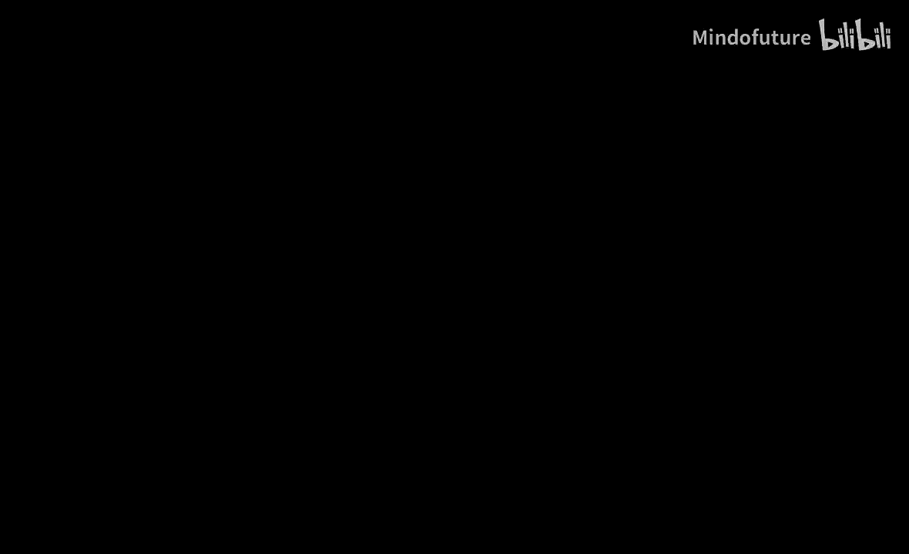
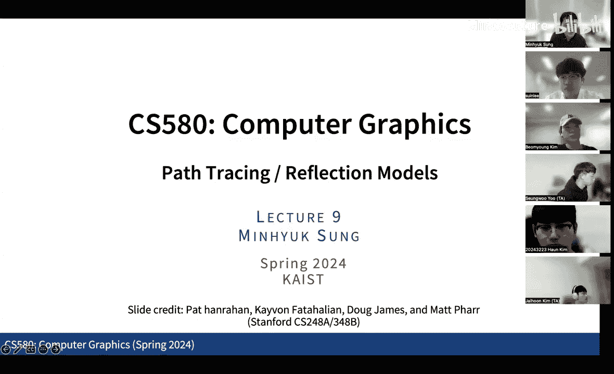
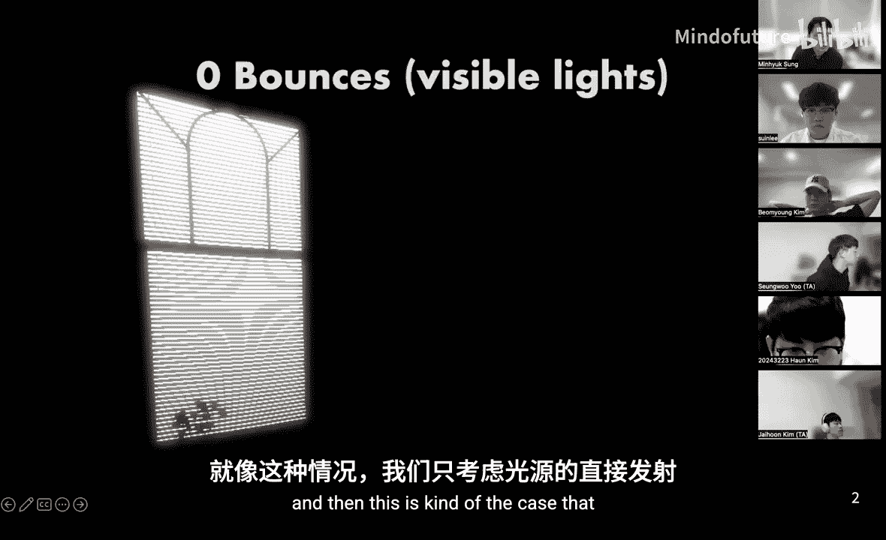
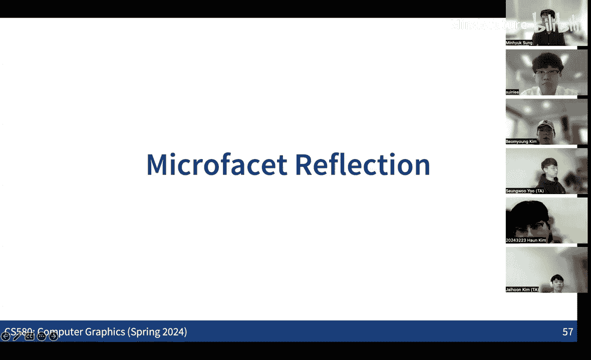

# 008：路径追踪与反射模型

在本节课中，我们将学习全局光照的核心算法——路径追踪，并深入探讨用于描述光线与表面交互的反射模型。我们将从回顾路径追踪的基本思想开始，然后介绍如何高效地处理长路径，最后详细讲解几种关键的反射模型及其物理特性。

---

## 全局光照与路径追踪回顾

上一节我们介绍了如何通过蒙特卡洛积分来估计渲染方程。本节中，我们来看看如何将这一思想扩展到全局光照，即计算直接光照和间接光照。

路径追踪的核心思想是：通过随机采样场景中的光线路径，并累加这些路径对像素亮度的贡献，来近似求解复杂的渲染方程。我们之前看到的渲染方程可以重写为**光传输方程**：

$$
L_o(p, \omega_o) = L_e(p, \omega_o) + \int_{S^2} f_r(p, \omega_o, \omega_i) L_i(p, \omega_i) |\cos \theta_i| d\omega_i
$$

为了计算全局光照，我们需要考虑所有可能的光线路径。一条长度为 `k` 的路径 `P_k` 可以表示为一系列表面点的序列：`P_k = x0, x1, ..., xk`，其中 `x0` 是相机，`xk` 是光源。最终到达像素的辐射亮度是所有可能路径贡献的期望值：

$$
I = \sum_{k=1}^{\infty} \int_{P_k} \text{贡献}(P_k) dP_k
$$

其中，每条路径的贡献是路径上各点BRDF、几何项和光源发射率的乘积。由于这是一个无限维积分，我们使用蒙特卡洛方法进行估计。对于每个像素，我们随机生成 `N` 条路径，计算其贡献并取平均：

$$
\hat{I} = \frac{1}{N} \sum_{i=1}^{N} \frac{\text{贡献}(P_i)}{pdf(P_i)}
$$

这里 `pdf(P_i)` 是生成该路径的概率密度函数。

随着路径长度（即光线反弹次数）的增加，我们能够捕捉到更真实的间接光照效果，例如颜色溢出和柔和的阴影。然而，更长的路径也意味着更高的计算成本。

---

## 俄罗斯轮盘赌：高效路径终止

上一节我们提到，长路径计算成本高但贡献度低。本节中，我们来看看如何通过一种称为“俄罗斯轮盘赌”的技术，在保持估计无偏性的同时提前终止长路径。

直接限制路径的最大长度（例如，只计算长度≤3的路径）会引入偏差，因为完全忽略了更长路径的贡献。俄罗斯轮盘赌提供了一种无偏的提前终止方法。

其基本思想如下：我们设定一个继续概率 `q` (0 < q < 1) 和一个缩放常数 `C`。对于一条待评估的长路径（例如长度≥4），我们首先生成一个在 [0, 1] 区间均匀分布的随机数 `ξ`。
*   如果 `ξ < q`，我们继续计算这条路径的贡献，但将其结果除以 `q` 进行缩放。
*   如果 `ξ ≥ q`，我们则终止这条路径的计算，并返回一个常数值 `C`（通常设为0）。

新的估计量 `F’` 定义为：

$$
F' = \begin{cases}
\frac{F}{q}, & \text{if } \xi < q \\
C, & \text{otherwise}
\end{cases}
$$

可以证明，这个新估计量的期望值与原估计量 `F` 的期望值相同：`E[F'] = E[F]`。这意味着，虽然我们以概率 `(1-q)` 丢弃了耗时的计算，但通过缩放剩余样本的贡献，我们仍然得到了一个无偏估计。

在实际应用中，通常设置 `C=0`。这意味着我们以概率 `q` 继续追踪路径，并以概率 `1-q` 提前终止（贡献为0）。这种方法显著减少了计算量，但代价是会增加估计的方差（噪声）。需要根据场景和计算资源权衡选择 `q` 值。

---

## 反射模型与BRDF属性

路径追踪需要知道光线在表面如何反射，这由**双向反射分布函数** 描述。在深入具体模型前，我们先了解一个物理正确的BRDF应满足的基本属性。

BRDF `f_r(p, ω_o, ω_i)` 定义了从入射方向 `ω_i` 到出射方向 `ω_o` 的辐射亮度比例。它需要满足以下关键属性：
1.  **非负性**：`f_r(p, ω_o, ω_i) ≥ 0`。反射的光量不能为负。
2.  **互易性（亥姆霍兹互易律）**：`f_r(p, ω_o, ω_i) = f_r(p, ω_i, ω_o)`。交换入射和出射方向，函数值不变。
3.  **能量守恒**：对于任何入射方向 `ω_i`，反射到所有出射方向的总能量不能超过入射能量。即：
    $$
    \forall \omega_i, \int_{H^2} f_r(p, \omega_o, \omega_i) |\cos \theta_o| d\omega_o \leq 1
    $$
    当积分结果小于1时，表示部分光能被表面吸收。

此外，根据材质特性，BRDF还可能是各向同性或各向异性的：
*   **各向同性BRDF**：当表面绕法线旋转时，反射分布不变。它只依赖于入射和出射方向的**天顶角**以及它们的**方位角之差**，因此是一个三参数函数：`f_r(θ_i, θ_o, |φ_i - φ_o|)`。大多数常见材质（如哑光漆、纸张）是各向同性的。
*   **各向异性BRDF**：反射分布随表面旋转而变化。这需要四个参数完整描述：`f_r(θ_i, φ_i, θ_o, φ_o)`。例如，拉丝金属、头发、某些织物表现出各向异性。

---

## 经典局部光照模型

在全局光照成为主流之前，图形学长期使用基于经验组合的局部光照模型。本节中，我们回顾这些经典模型，它们可以看作是对特定BRDF的近似。

一个典型的局部光照模型（如Phong模型）将出射辐射度表示为几项之和：

`L_o = L_ambient + L_diffuse + L_specular`

以下是各项对应的理想化BRDF描述：

**1. 理想镜面反射**
光线严格按照反射定律出射。其BRDF包含狄拉克δ函数：
$$
f_r(p, \omega_o, \omega_i) = \frac{\rho_s}{|\cos \theta_i|} \delta(\omega_o - R(\omega_i, n))
$$
其中 `R(ω_i, n)` 是 `ω_i` 关于法线 `n` 的反射方向，`ρ_s` 是反射率。在路径追踪中，这意味着一旦击中表面，下一个方向是确定性的，而非随机采样。这可能导致需要非常长的路径才能命中光源。

**2. 理想漫反射（朗伯反射）**
光线均匀地散射到所有方向。其BRDF是一个常数：
$$
f_r(p, \omega_o, \omega_i) = \frac{\rho_d}{\pi}
$$
其中 `ρ_d` 是漫反射率（`0 ≤ ρ_d ≤ 1`）。将其代入渲染方程，可得到熟悉的 `L_o = ρ_d * E`，其中 `E` 是入射辐照度。常数 `1/π` 的引入是为了满足能量守恒定律。

**3. 光泽反射（Phong模型）**
这是一种对非理想镜面反射的经验近似。它认为高光强度与反射方向 `R` 和观察方向 `V` 之间夹角的余弦值的某次幂成正比：
$$
L_specular = k_s (R \cdot V)^{\alpha}
$$
其中 `k_s` 是高光系数，`α` 是光泽度（反光度），控制高光区域的集中程度。这并非基于物理的BRDF，但计算简单，曾广泛应用。

这些经典模型在光栅化渲染管线（如OpenGL固定管线）中组合使用，模拟了基本的光照效果，但无法处理复杂的全局光照现象。

---

## 折射与透射模型

现实世界中，光线不仅会被反射，还会穿透物体，即发生折射。本节中，我们来看看如何将透射现象纳入路径追踪框架。

描述透射的函数称为**双向透射分布函数** 。将BRDF和BTDF结合，可统称为**双向散射分布函数** 。

**折射方向计算**
折射方向由**斯涅尔定律**决定：
$$
\eta_i \sin \theta_i = \eta_t \sin \theta_t
$$
其中 `η_i` 和 `η_t` 分别是入射侧和透射侧介质的折射率，`θ_i` 和 `θ_t` 是入射角和折射角。当光线从光疏介质进入光密介质（`η_t > η_i`）时，折射角小于入射角，光线弯向法线；反之则远离法线。

**全内反射**
当光线从光密介质射向光疏介质，且入射角大于临界角 `θ_c = arcsin(η_t / η_i)` 时，会发生全内反射，没有透射光。这是水下看到“光学视窗”现象的原因。

**菲涅尔方程**
在界面处，入射光能量会部分反射、部分透射。反射的比例 `R_F` 由**菲涅尔方程**给出，它取决于入射角、偏振光和两侧介质的折射率。对于非偏振光，常用以下近似：
$$
R_F = \frac{1}{2} \left( \frac{\eta_t \cos \theta_i - \eta_i \cos \theta_t}{\eta_t \cos \theta_i + \eta_i \cos \theta_t} \right)^2 + \frac{1}{2} \left( \frac{\eta_i \cos \theta_i - \eta_t \cos \theta_t}{\eta_i \cos \theta_i + \eta_t \cos \theta_t} \right)^2
$$
透射比例 `T_F = 1 - R_F`。菲涅尔效应意味着，即使在同一种材质上，掠射角（grazing angle）下的反射率也远高于正入射时。

**在路径追踪中处理反射与折射**
在具有透射能力的表面（如玻璃）交点处，路径会分叉：一条路径反射，一条路径折射。简单追踪所有路径会导致计算量指数增长（2^k）。更高效的方法是使用**俄罗斯轮盘赌**的思想进行随机选择：
1.  计算当前入射角下的菲涅尔反射率 `R_F`。
2.  生成一个随机数 `ξ ~ Uniform(0,1)`。
3.  如果 `ξ < R_F`，则选择反射方向作为下一个路径顶点。
4.  否则，选择折射方向作为下一个路径顶点。
这样，每次相交只追踪一条路径，仍然能得到无偏估计，同时避免了计算爆炸。

**薄板近似**
对于像玻璃窗这样的薄板，光线会在两个界面间发生多次内反射。所有透射光的总和是一个几何级数。可以推导出一个等效的“总”反射率 `R'_F` 和透射率 `T'_F`：
$$
R'_F = R_F + \frac{T_F^2 R_F}{1 - R_F^2}, \quad T'_F = 1 - R'_F
$$
其中 `R_F` 和 `T_F` 是单界面的菲涅尔系数。使用这个等效系数进行采样，可以更准确地渲染薄透射物体。

---

## 总结与展望

本节课中我们一起学习了路径追踪算法的核心思想以及关键的反射与透射模型。

我们首先回顾了如何通过蒙特卡洛积分和路径采样来解决全局光照问题。接着，介绍了**俄罗斯轮盘赌**这一重要技术，它允许我们无偏地终止对贡献度低的长路径的追踪，从而提升计算效率。

然后，我们系统探讨了**BRDF**的物理属性（非负性、互易性、能量守恒）和分类（各向同性/各向异性），并回顾了**理想漫反射**、**理想镜面反射**和**Phong光泽模型**这些经典局部光照模型背后的BRDF形式。

最后，我们将模型扩展到透射现象，学习了**斯涅尔定律**计算折射方向，**菲涅尔方程**决定反射/透射能量比例，以及如何在路径追踪中通过随机采样高效地同时处理反射和折射路径。

这些反射和透射模型是构建逼真渲染器的基石。在接下来的课程中，我们将探讨更复杂的材质现象，如**微表面模型**（用于模拟金属、粗糙表面）和**次表面散射**（用于模拟皮肤、蜡、大理石等材质中光在内部传播的效果），并进一步介绍**参与介质**（如雾、烟、水）中的渲染技术。这些高级主题也与近年兴起的**神经渲染**技术密切相关。