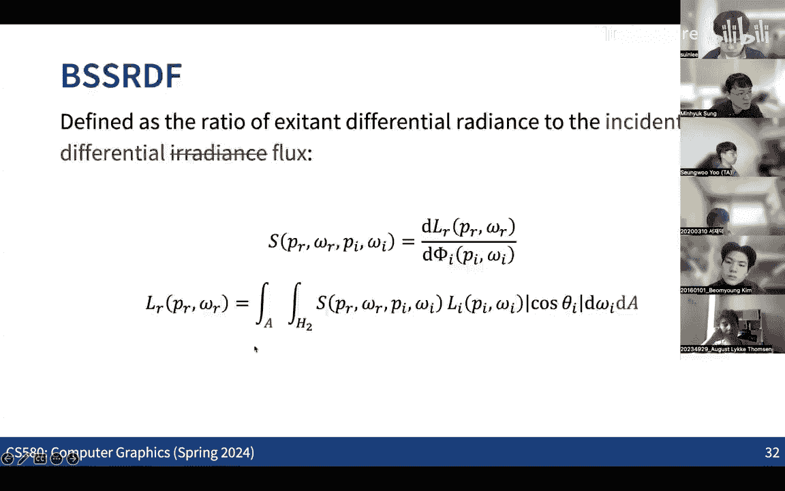
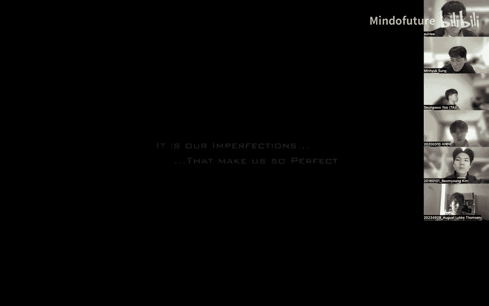
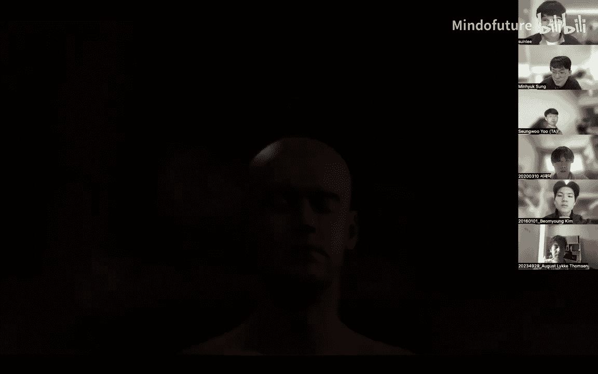
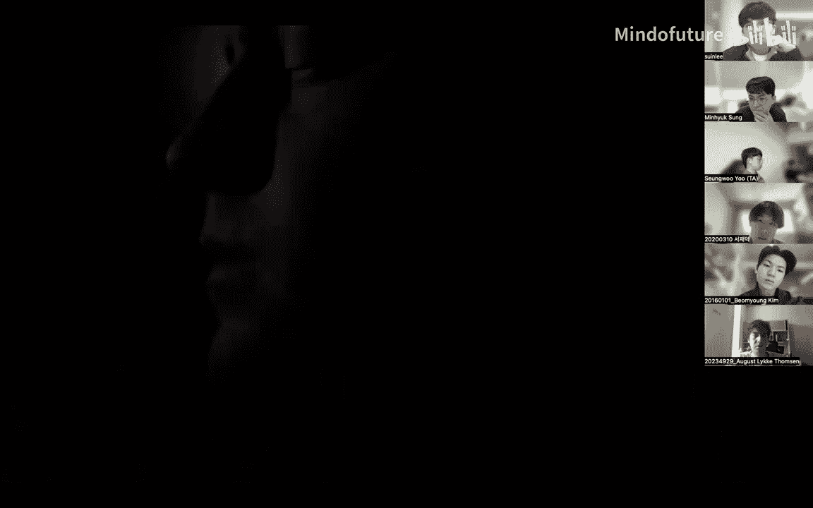
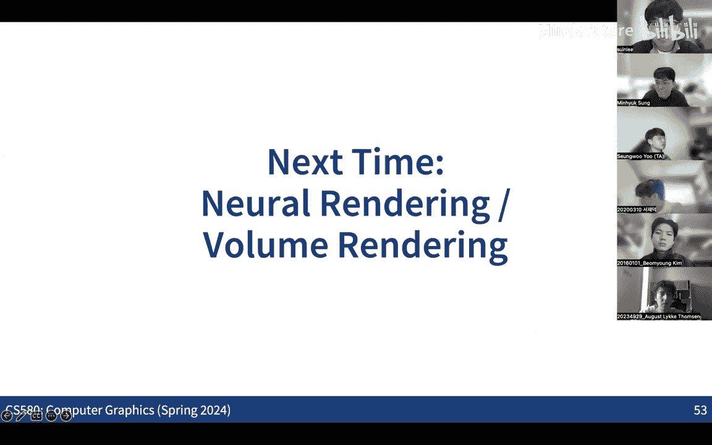

# 009：反射模型与颜色

在本节课中，我们将完成对反射模型的讨论，重点介绍微表面模型，并探讨渲染流程中的另一个关键组成部分：相机测量与颜色。

上一节我们介绍了菲涅尔方程和薄板模型，本节中我们来看看如何通过微表面模型来更精细地描述材料的表面特性。

## 微表面模型

微表面模型的基本假设是，宏观表面由无数微小的、理想光滑的镜面小平面（微表面）构成。这些微小表面的朝向分布决定了材料整体的反射和透射特性。

以下是微表面模型的核心概念：

*   **微表面分布函数 D**：该函数描述了表面法线方向为 **ω_m** 的微表面所占的相对面积比例。对于一个完全光滑的表面，其分布函数是一个狄拉克δ函数：**D(ω_m) = δ(ω_m - n)**，其中 **n** 是宏观表面法线。
*   **归一化约束**：所有微表面在宏观表面法线方向上的投影面积之和必须等于宏观表面的面积。这给出了分布函数 **D** 必须满足的积分约束条件。

## 遮蔽与阴影函数

由于微表面之间存在相互遮挡，我们需要引入遮蔽函数 **G1** 来描述从某个观察方向 **ω** 可见的微表面比例。

史密斯近似是一个常用的方法，它假设微表面的高度和法线在统计上是独立的。基于此，我们可以从分布函数 **D** 推导出遮蔽函数 **G1**。

以下是需要考虑的遮挡效应：

*   **遮蔽**：从出射方向看，一些微表面被其他微表面挡住。
*   **阴影**：从入射方向看，一些微表面处于其他微表面的阴影中。
*   **联合遮蔽阴影项 G**：通常假设遮蔽和阴影是独立事件，因此联合项可近似为 **G(ω_i, ω_o) = G1(ω_i) * G1(ω_o)**。

## Cook-Torrance BRDF 模型

基于微表面模型，我们可以推导出 Cook-Torrance BRDF。其核心思想是：只有那些法线方向 **m** 恰好等于入射方向 **ω_i** 和出射方向 **ω_o** 的半角向量 **h** 的微表面，才会将光从 **ω_i** 反射到 **ω_o**。

最终的 Cook-Torrance BRDF 公式如下：
**f_r(ω_i, ω_o) = (D(h) * G(ω_i, ω_o) * F(ω_i, h)) / (4 * (n·ω_i) * (n·ω_o))**
其中：
*   **D(h)** 是微表面分布函数。
*   **G(ω_i, ω_o)** 是联合遮蔽阴影项。
*   **F(ω_i, h)** 是菲涅尔项，表示反射比例。
*   **n** 是宏观表面法线。

这意味着，只要定义了微表面分布函数 **D**，就可以计算出相应的 **G** 和 **F**，进而得到完整的 BRDF。

## 双向散射表面反射分布函数

对于某些材料（如皮肤、蜡、大理石），光会进入表面下方，经过多次散射后从另一点射出。这种现象称为次表面散射，需要用双向散射表面反射分布函数（BSSRDF）来描述。

BSSRDF 不仅依赖于入射和出射方向，还依赖于表面上的入射点和出射点位置。它比 BRDF 更复杂，但能产生非常逼真的效果，尤其在渲染皮肤等材质时至关重要。

## 颜色与光谱渲染

在光线追踪系统中，我们最终需要为每个像素计算颜色。然而，所有辐射度量（如辐射率）本质上是波长的函数。

以下是两种处理颜色的方法：

*   **RGB 渲染**：最简单的方法是为红、绿、蓝三个通道分别计算辐射量。这假设光在这三个波段是独立的。
*   **光谱渲染**：更准确的方法是沿路径对多个波长进行采样，计算每个波长样本的辐射量，得到光谱分布 **S(λ)**。最终颜色通过颜色匹配函数积分得到：**C = ∫ S(λ) * \bar{c}(λ) dλ**，其中 **\bar{c}(λ)** 是颜色匹配函数。

光谱渲染能更精确地处理色散、荧光等与波长密切相关的现象。

## 颜色空间

颜色空间是定义颜色数值表示的系统。最常见的颜色空间是 RGB，但还有许多其他空间（如 XYZ, sRGB, CIELAB）。

*   **XYZ 颜色空间**：由 CIE 在1931年定义，基于人类视觉的颜色匹配实验。它是许多其他颜色空间的基础。
*   **颜色空间转换**：不同颜色空间之间可以通过一个 3x3 的线性变换矩阵进行转换。这是因为光谱分布可以近似为基函数的线性组合。

本节课中我们一起学习了微表面模型的原理及其如何用于推导 Cook-Torrance BRDF，了解了次表面散射的基本概念及其重要性，并探讨了在渲染中处理颜色的两种方法（RGB 与光谱渲染）以及颜色空间的基础知识。这些内容是构建现代物理渲染器的核心组成部分。