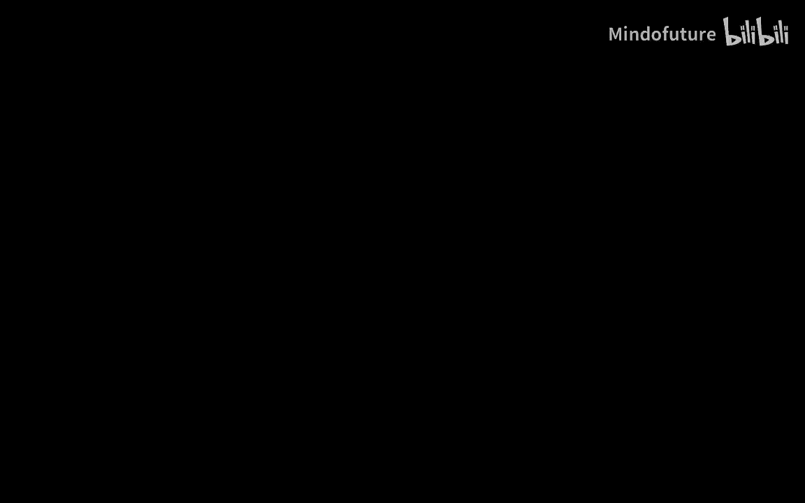
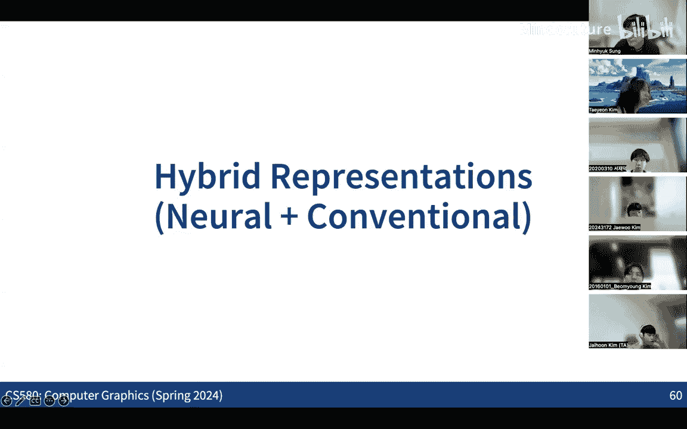

# 010：神经渲染与体渲染



在本节课中，我们将学习神经渲染的基本概念，特别是如何利用体渲染方程从2D图像集合中合成新的3D视角图像。我们将从传统的3D到2D渲染出发，探讨其逆向问题——从2D观测重建3D，并重点介绍神经辐射场（NeRF）这一里程碑式的工作，它通过结合神经网络的表示能力和经典的体渲染方程，实现了高质量的新视角合成。

---

## 从3D到2D与从2D到3D

在传统的计算机图形学中，我们通常关注如何从虚拟的3D场景生成2D图像。这个过程涉及定义虚拟物体、光照和材质属性，并通过物理模拟（如光线追踪）将3D信息投影到2D平面上。

然而，从计算机视觉的角度看，一个核心问题是：如何从真实场景拍摄的一组2D图像中重建出3D结构？这可以看作是图形学渲染过程的逆向问题。本节课将更多地从视觉视角出发，探讨如何从2D图像进行3D重建，并展示这一过程如何与渲染管线相互交织。

## 新视角合成的目标

神经渲染的一个核心目标是**新视角合成**。假设我们拥有从多个已知视角拍摄的一组2D图像，我们的目标是合成一个从未见过的新相机视角下的图像。这不仅仅是3D重建，更是为了生成逼真的新视图。

一个典型的例子是，给定离散的2D图像样本，我们可以生成相机平滑移动的连续视频。这构成了神经渲染的原始驱动力。

这里的关键假设是，我们**只有2D图像作为训练数据**，没有任何关于3D场景的直接监督信息（如深度图、3D模型）。挑战在于，如何仅凭2D图像就能合成新视角的图像？

## 神经渲染的基本思想

在机器学习框架下，一个朴素的想法是构建一个“黑盒”神经网络。该网络以相机位姿（如相机矩阵）作为输入，直接输出对应的2D图像。我们可以用已知图像-位姿对来训练这个网络，使用L2损失等函数比较输出图像与真实图像。

然而，直接训练这样一个网络来精确预测新视角图像是极具挑战性的。神经渲染的关键洞见在于：我们不希望网络是一个不可解释的黑盒解码器，而是希望它通过一个**可解释的、基于3D表示的渲染过程**来生成图像。

换句话说，神经渲染的目标是构建一个图像解码器，它**从3D表示出发，利用渲染方程来生成2D图像**。这使得系统更具可解释性，并且当结合图形学中成熟的渲染方程时，通常能获得比纯黑盒网络更好的效果。

## 早期3D重建方法的局限

为了实现上述目标，我们需要从2D图像中获取或生成3D表示。早期尝试包括直接从2D图像预测3D网格。

例如，“像素到网格”类的工作从一个模板网格（如人体）开始，通过神经网络迭代变形网格，使其投影与输入图像的轮廓对齐。这类方法存在多种局限：
*   **拓扑限制**：难以改变网格的基本拓扑结构（如从球体变成环状）。
*   **未见区域**：对于被遮挡的区域，难以生成合理的几何。
*   **细节缺失**：通过变形来表现薄结构或复杂细节较为困难。
*   **收敛缓慢**：在优化过程中，每个像素通常只更新网格上的一个交点，导致学习效率低下。

## 隐式表示的兴起

人们发现，使用**隐式函数**来表示3D形状更具优势。隐式函数（如符号距离函数SDF）为空间中的任意点输出一个值（如该点到最近表面的有符号距离，或一个表示内部/外部的占用值）。

隐式表示的好处包括：
*   **灵活性**：可以表示任意拓扑的形状。
*   **细节丰富**：能够捕捉复杂的几何细节。
*   **分辨率无关**：表示是连续的，不依赖于像体素那样的离散分辨率。

然而，问题随之而来：**如何渲染这种隐式表示？** 我们需要将隐式函数转换为2D图像以便与输入图像比较，从而进行训练。

## 球体追踪及其挑战

渲染隐式函数（如SDF）的一种经典方法是**球体追踪**。其基本思想是：从射线起点出发，查询该点的SDF值（即到最近表面的距离）。由于这个距离内保证没有表面，我们可以安全地沿射线前进该距离。在新点重复此过程，直到到达表面或满足停止条件。

虽然有效，但球体追踪在神经渲染框架中存在挑战：
*   **不可微性**：追踪过程中的决策步骤（如判断是否击中）通常不可微，不利于基于梯度的神经网络训练。
*   **计算量大**：对于接近射线方向的表面或射线未击中的情况，可能需要很多次迭代，计算开销大。

## 体渲染：打破物理假设的解决方案

有趣的是，解决方案来自于打破“物体是实心固体”的物理假设。与其将物体视为具有明确表面的实体，不如将其视为一种**体积**（或“云雾”）。我们假设光线可以穿透这个体积，并与其中的粒子发生交互。

这样，我们就可以利用计算机图形学中研究了数十年的**体渲染**方程。体渲染不寻找第一个交点，而是考虑光线穿过整个体积时，沿途所有点对最终颜色的累积贡献。这带来了两个关键优势：
1.  **计算高效**：避免了迭代式的球体追踪。
2.  **梯度友好**：整个过程可以设计为完全可微的，便于神经网络训练。
3.  **全局更新**：一次优化可以更新3D空间中沿整条射线的许多点，而不仅仅是第一个交点。

神经渲染的最新进展表明，即使目标是重建固体物体，使用体积表示也能获得更优的结果。

## DeepVoxels：混合编码与渲染

在深入NeRF之前，我们先看一个早期工作**DeepVoxels**。它采用了混合策略：
*   **编码阶段**：将输入2D图像通过CNN提取特征，然后通过光线投射，将这些2D特征“涂抹”到3D体素网格中。
*   **解码阶段**：对于新视角，从3D体素网格中沿着新相机光线聚合特征，再通过解码器网络生成图像。
*   **遮挡处理**：使用一个额外的神经网络来预测每个体素沿某条光线的可见性概率，用于加权聚合特征。

DeepVoxels展示了结合神经网络与经典图形学操作（3D投影）的潜力，并能合成合理的新视图。但它也有局限：
*   **内存消耗大**：3D体素网格存储高维特征，内存开销高。
*   **物理不一致**：其可见性预测网络不保证物理正确性（例如，远处体素的可见性可能被错误地预测得比近处遮挡物还高）。

## NeRF：神经辐射场

**神经辐射场（NeRF）** 针对DeepVoxels的局限进行了关键改进，成为神经渲染的里程碑。

NeRF的核心是用一个多层感知机（MLP）神经网络来表示一个连续的3D场景。这个网络学习两个隐式函数：
1.  **体积密度 σ(x)**：输入一个3D坐标点 **x**，输出一个标量密度。密度表示该点处无限小粒子存在的概率，决定了光线在此处被终止（即“碰撞”）的可能性。
2.  **视角相关颜色 c(x, d)**：输入一个3D坐标点 **x** 和观察方向 **d**（单位向量），输出该点从方向 **d** 看过去的RGB颜色。这模拟了如镜面高光等视角相关的外观。

### 体渲染方程

给定一条从相机出发穿过像素的光线 **r(t) = o + t d**（**o**为原点，**d**为方向），其最终颜色 **C(r)** 通过体渲染方程计算：

```
C(r) = ∫ T(t) σ(r(t)) c(r(t), d) dt
```

其中：
*   **σ(r(t))** 是光线在 **t** 处的密度。
*   **c(r(t), d)** 是该点处的颜色。
*   **T(t)** 是**透射率**，表示光线从起点传播到 **t** 而未被终止的概率。它由密度沿路径的积分决定：

```
T(t) = exp( -∫ σ(r(s)) ds )   [积分从 0 到 t]
```

**物理意义**：方程 `T(t) σ(r(t))` 给出了光线恰好终止在 **t** 处微小区间的概率。因此，整个积分计算的是**沿光线所有点颜色的期望值**。透射率 `T(t)` 是一个单调非增函数，这自然地保证了遮挡的物理正确性：如果一个点被遮挡，其透射率必然很低，它后面的点对颜色的贡献也会被大幅衰减。

### 离散化与分层采样

为了计算积分，NeRF在光线近远边界 `[tn, tf]` 内进行离散采样。它将积分区间划分为N段，采用一种更精确的离散化方式（而非简单的蒙特卡洛求和）。最终像素颜色的近似公式为：

```
Ĉ(r) = Σ Ti (1 - exp(-σi δi)) ci
```
其中：
*   `i` 是样本索引。
*   `Ti = exp( -Σ σj δj )` [j 从 1 到 i-1] 是到达第 `i` 个样本前的透射率。
*   `σi` 和 `ci` 是第 `i` 个样本处的密度和颜色。
*   `δi` 是相邻样本间的距离。
*   `(1 - exp(-σi δi))` 可理解为光线在第 `i` 个区间内被终止的概率。

为了高效采样，NeRF使用了**分层采样**策略：先用一个“粗”网络在光线上均匀采样，预测一组密度；然后根据这些密度分布（重要性采样），在可能包含物体的区域进行更密集的“细”采样。最终颜色由“细”网络的采样结果计算。

### NeRF的优势
*   **连续表示**：MLP提供无限分辨率，内存效率远高于体素网格。
*   **物理正确的渲染**：体渲染方程保证了遮挡和颜色累积的物理合理性。
*   **高质量细节**：能够重建出非常精细的几何和外观细节。

## 总结

本节课我们一起学习了神经渲染的核心思想与发展脉络。我们从图形学（3D→2D）与视觉（2D→3D）的双重视角出发，探讨了新视角合成问题。早期基于网格和体素的方法存在各种限制。而**神经辐射场（NeRF）** 通过将场景表示为神经隐式函数（密度场和辐射场），并利用**可微的体渲染方程**进行图像合成，实现了重大突破。它结合了神经网络的表示能力和经典图形学渲染模型的物理正确性，生成了高质量的新视角图像，为后续的3D重建与生成研究奠定了基础。



NeRF之后，研究朝着更高效的混合表示（如点云、高斯泼溅）等方向发展，我们将在后续课程中探讨。