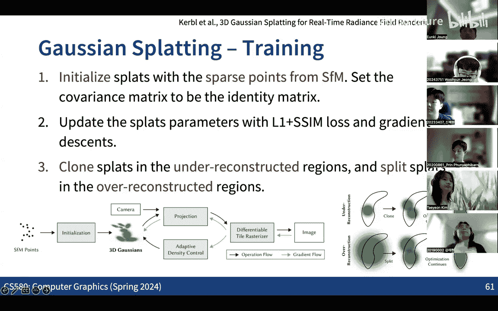

# 011：高斯泼溅 (Gaussian Splatting) 🎯


在本节课中，我们将学习一种名为“高斯泼溅”的3D场景表示与渲染技术。这是一种结合了显式与隐式表示的混合方法，旨在实现高质量、高速度的实时神经渲染。

---

上一节我们讨论了神经辐射场等隐式表示方法。本节中，我们来看看一种更高效的显式表示方法——高斯泼溅。

## 核心概念与动机

高斯泼溅的基本思想是使用**3D高斯椭球体**作为基本图元来表示场景，而非传统的点、三角形或体素。每个高斯椭球体具有位置、协方差（控制形状和大小）、不透明度以及颜色（或视角相关的辐射率）等属性。

以下是高斯泼溅希望解决的核心问题：
*   **高质量渲染**：渲染结果需与真实图像高度匹配。
*   **实时渲染速度**：目标达到甚至超过每秒60帧。
*   **内存高效**：模型应足够轻量，以便在移动设备等平台上运行。
*   **易于集成**：能够方便地集成到现有的图形管线（如Unity、虚幻引擎）中。

高斯泼溅的灵感来源于20多年前的**基于点的渲染**技术。当时，由于GPU能高速处理海量点数据，且高精度3D扫描仪产生了密集的点云，研究者开始探索直接渲染点云而非网格。每个点被扩展为具有法线和半径的“盘状”图元，称为表面泼溅。

神经渲染的成功表明，**体渲染**比表面渲染更适合表示复杂的3D场景。因此，高斯泼溅将“表面泼溅”升级为“体泼溅”，即使用3D高斯椭球体作为体渲染的基本单元。

## 高斯泼溅的优势

以下是采用这种泼溅表示法的主要优势：
1.  **渲染管线兼容性**：由于使用显式图元，可以直接利用现有的光栅化管线进行渲染，无需沿射线进行密集采样和积分，极大降低了计算量。
2.  **初始化便利性**：可以从运动恢复结构等传统算法输出的**稀疏点云**直接初始化高斯椭球体，为后续的神经优化提供了一个良好的起点，加速了重建过程。

---

接下来，我们将深入探讨如何定义这些高斯泼溅，并利用体渲染方程进行渲染。

## 体泼溅的定义与渲染方程

### 1. 高斯椭球体的定义

每个体泼溅（高斯椭球体） `i` 在物体坐标系（世界坐标系）中定义，包含以下参数：
*   **中心位置**：`p_i`
*   **协方差矩阵**：`Σ_i` (一个3x3的对称半正定矩阵，控制椭球的形状和方向)
*   **不透明度**：`α_i`
*   **颜色**：`c_i` (可以是常数，也可以是视角相关的函数 `c_i(d)`)

该椭球体在空间中定义一个3D高斯核函数，用于衡量空间任意一点 `x` 受该泼溅影响的程度（权重）：
```
权重_i(x) = exp(-0.5 * (x - p_i)^T Σ_i^{-1} (x - p_i))
```

### 2. 坐标变换

渲染时，需要将高斯泼溅从物体坐标系变换到射线坐标系（一种特殊的2D图像平面坐标系）。这涉及两次变换：
1.  **模型变换 (Model Transformation)**：从物体坐标系到相机坐标系。这是一个仿射变换，包含线性部分 `W` 和平移部分 `T`。
    ```
    x' = W * x + T
    ```
    在此变换下，高斯参数变换为：
    ```
    p'_i = W * p_i + T
    Σ'_i = W * Σ_i * W^T
    ```
2.  **投影变换 (Projection Transformation)**：从相机坐标系到射线坐标系。标准的透视投影不是仿射变换。为了保持高斯形式，论文在**每个高斯泼溅的中心点 `p'_i` 处对投影变换进行一阶泰勒展开**，将其近似为一个仿射变换（雅可比矩阵 `J_i`）。
    ```
    x'' ≈ J_i * (x' - p'_i) + 投影(p'_i)
    ```
    最终，在射线坐标系下的近似高斯参数为：
    ```
    p''_i = 投影(p'_i)
    Σ''_i = J_i * W * Σ_i * W^T * J_i^T
    ```

### 3. 离散体渲染方程

在射线坐标系下，对于像素 `(x, y)`，我们沿其深度 `z` 方向进行积分。原始的体渲染方程离散化后为：
```
C = Σ_{i=1}^{N} (c_i * α_i * T_i)
其中，T_i = Π_{j=1}^{i-1} (1 - α_j)
```
这里 `T_i` 是累积透射率，表示光线到达第 `i` 个样本前未被阻挡的概率。

在高斯泼溅中，我们将不透明度 `α` 替换为与高斯权重相关的项。经过一系列推导和近似（包括局部支撑假设、一阶指数展开等），最终得到用于渲染的简化公式：
```
C = Σ_{i∈N} c_i * α_i * Π_{j=1}^{i-1} (1 - α_j)
```
其中，`α_i` 现在与变换到射线坐标系下的2D高斯权重 `权重_i(x'', y'')` 成正比，`N` 是按深度排序后对该像素有贡献的高斯泼溅集合。

**渲染流程简述**：
1.  给定相机姿态，将所有高斯泼溅变换到射线坐标系。
2.  对于每个像素，快速收集并深度排序所有投影到该像素范围内的2D高斯泼溅。
3.  按照上述简化公式，从前到后进行Alpha混合，计算像素最终颜色。

### 4. 训练与优化

高斯泼溅模型的训练也是一个可微分的优化过程：
1.  **初始化**：从运动恢复结构得到的稀疏点云初始化高斯泼溅的中心位置 `p_i`。协方差矩阵初始化为各向同性。
2.  **优化**：通过比较渲染图像与真实图像，计算损失（如L1、SSIM损失），并通过反向传播同时优化所有高斯泼溅的参数（位置、协方差、颜色、不透明度）。
3.  **自适应控制**：在训练过程中，会动态地**克隆**（用于欠重建区域）或**分裂**（用于过重建区域）高斯泼溅，以更好地捕捉场景的几何细节。

---

## 总结

本节课中，我们一起学习了**高斯泼溅**这一先进的3D场景表示与渲染技术。我们从其源于“基于点的渲染”的历史讲起，探讨了它如何通过使用**3D高斯椭球体**作为显式图元，结合**体渲染**原理，实现了高质量、实时的神经渲染。

我们详细剖析了其核心渲染方程，了解了如何通过坐标变换（特别是投影变换的雅可比近似）将3D高斯投影到2D图像平面，并利用简化的Alpha混合公式进行高效渲染。最后，我们概述了其通过可微分优化进行模型训练和自适应细化的过程。



高斯泼溅因其在速度、质量和实用性方面的卓越平衡，已成为当前神经渲染领域的重要基石，并被广泛集成到各种图形应用和引擎中。