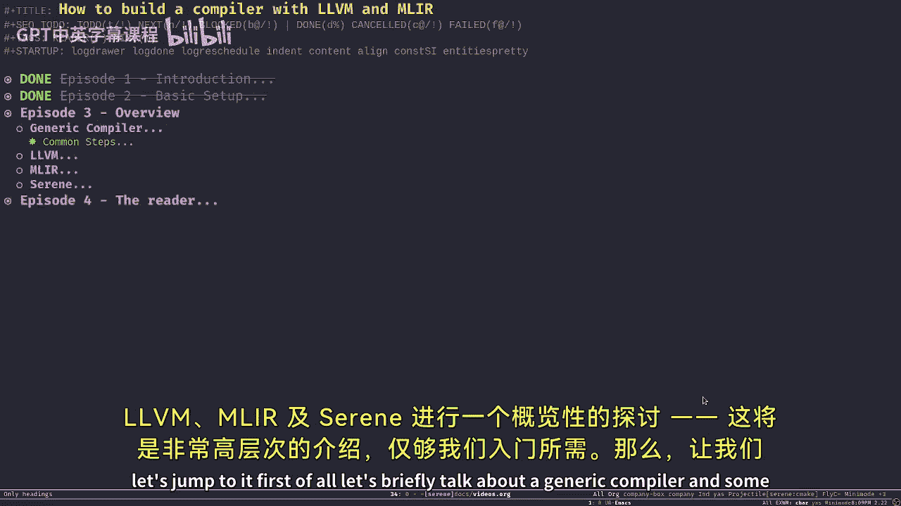
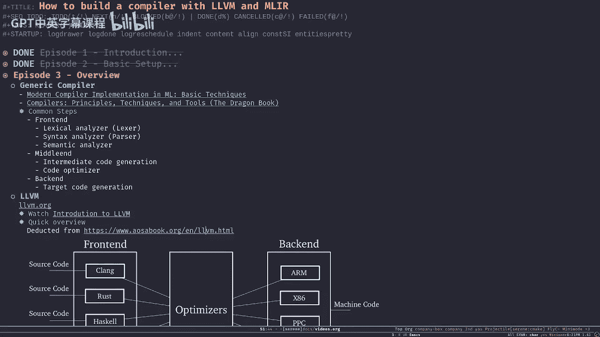
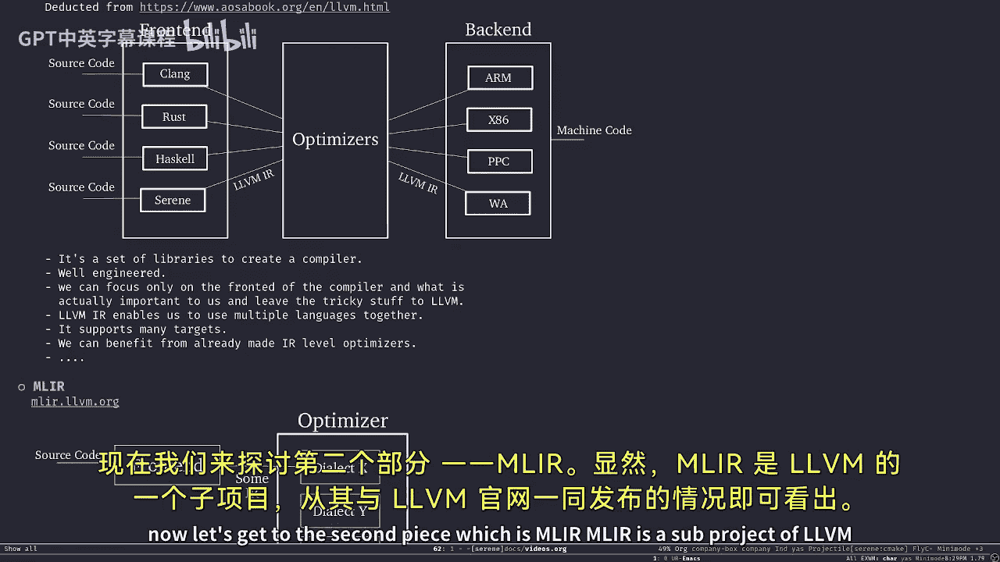
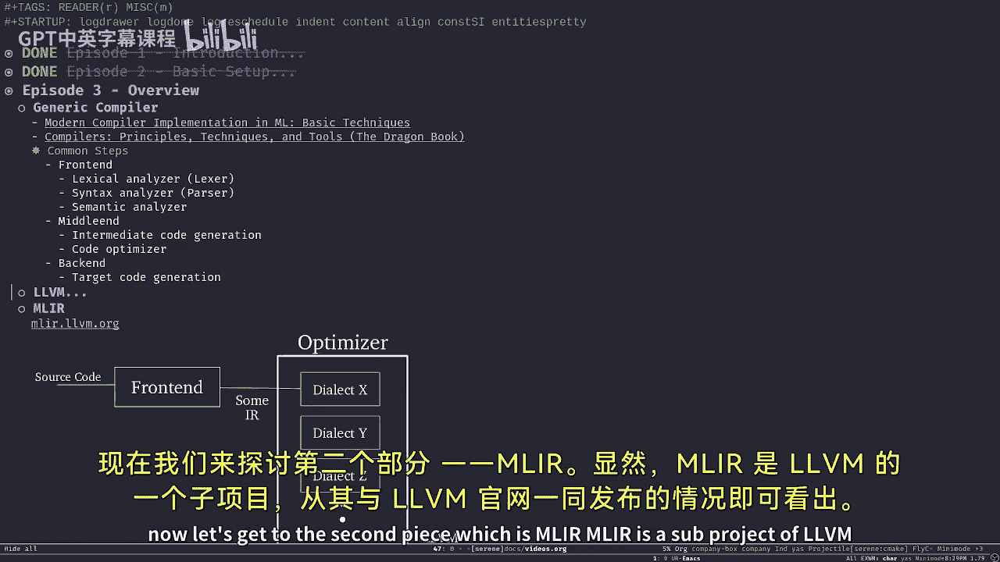
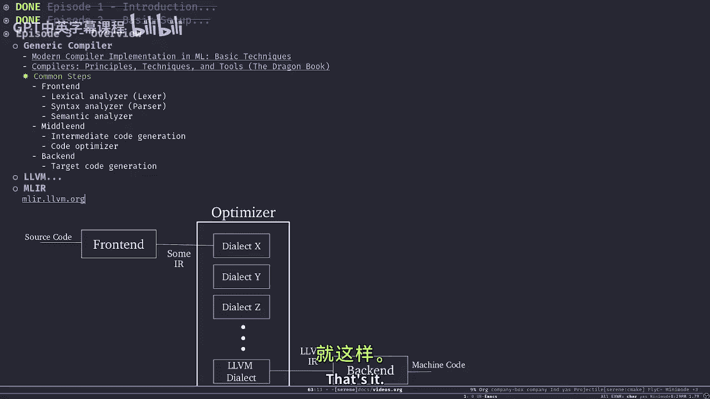
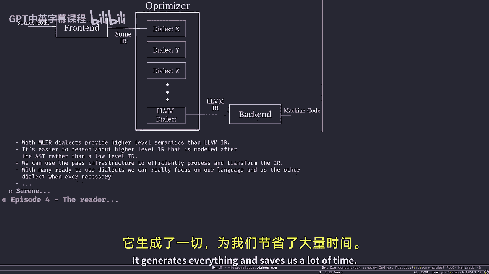
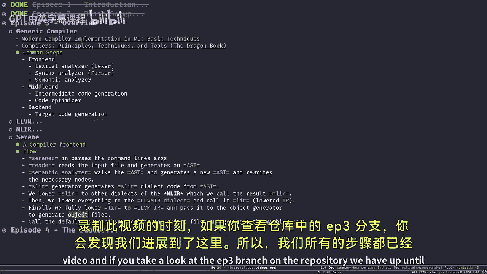
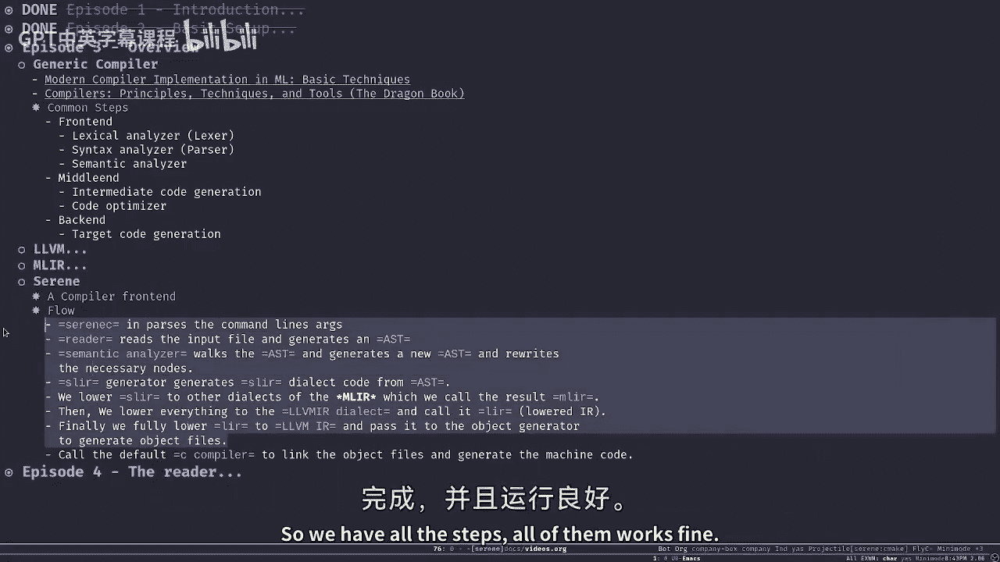
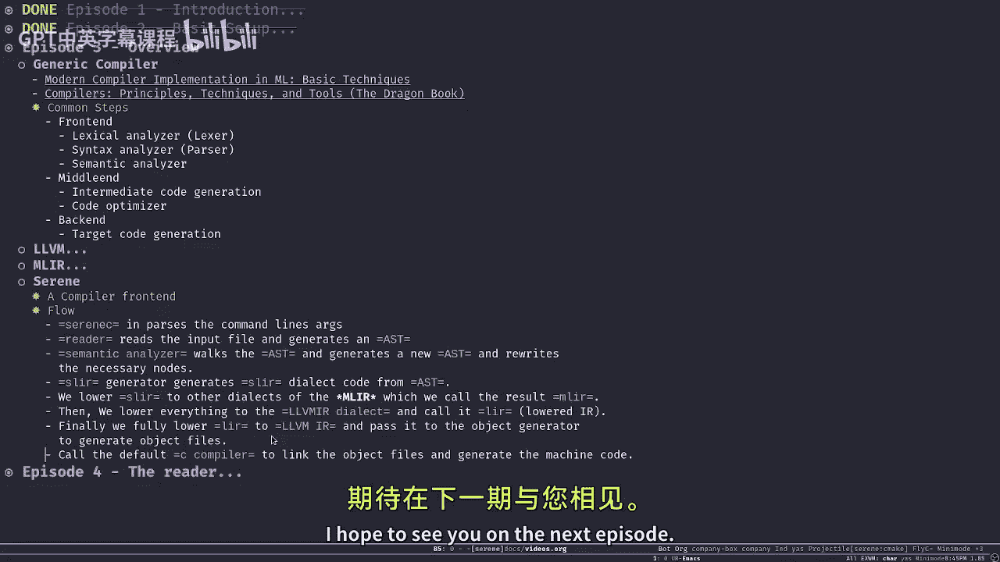

# 003：概述

在本节课中，我们将对LLVM、MLIR以及Serene编译器项目进行一个高层次的概述。这将帮助我们理解整个项目的架构和各个组件的基本工作原理。

## 通用编译器简介

首先，让我们简要回顾一下通用编译器的基本结构。理解这一点对于后续学习LLVM和MLIR至关重要。

以下是两本推荐的编译器书籍：
*   **《Modern Compiler Implementation in ML》**：这本书相对精炼（约500页），提供了ML、C和Java三种语言的实现。其中ML版本的实现非常优雅，易于理解，非常适合初学者入门。
*   **《Compilers: Principles, Techniques, and Tools》（龙书）**：这是编译器的经典参考书，内容非常详尽（超过1000页）。建议在有一定基础后作为深入学习资料。

本系列视频假设你已经具备编译器的基础知识。大多数编译器在处理源代码并生成目标代码时，会经历一系列阶段。我们通常将这些阶段分为三大类。

### 编译器前端

前端负责读取源代码，进行分析，并构建出相应的数据结构。它通常包含以下三个最常见的步骤：

以下是前端的主要组成部分：
1.  **词法分析器**：将源代码字符流分解为一系列有意义的**标记**。
2.  **语法分析器**：根据词法分析器产生的标记流，检查源代码的语法结构，并构建**抽象语法树**。
3.  **语义分析器**：对AST进行语义分析，并根据语言的语义规则将其重写为另一个更精确的AST。例如，在Lisp中，一个列表可能被识别为函数调用，语义分析器会将其AST节点重写为函数调用节点。

### 编译器中端与后端

上一节我们介绍了编译器前端，本节中我们来看看中端和后端。

中端负责将语义正确的AST转换为某种**中间表示**，并在此之上进行一系列优化，为后端生成目标代码做好准备。不同的编译器有不同的中间表示形式。

后端则负责将优化后的中间表示转换为最终的**目标代码**。目标代码的形式取决于编译器的设计，可以是机器码、JavaScript或WebAssembly等。

## LLVM 简介

现在，让我们将目光转向LLVM。LLVM本身就是一个编译器基础设施项目，其设计完美体现了上述的编译器架构。

LLVM主要分为三个部分：
*   **前端**：读取源代码（如C、C++、Rust），并生成**LLVM中间表示**。LLVM IR是一种类似于汇编的、独立于源语言和目标平台的中间语言。
*   **优化器**：接收LLVM IR，通过一系列称为**Pass**的优化模块对其进行处理和优化，输出优化后的LLVM IR。你可以将优化器视为一个处理LLVM IR的流水线。
*   **后端**：接收LLVM IR，并针对不同的目标平台（如x86、ARM、PowerPC、WebAssembly）生成相应的机器码或目标代码。

使用LLVM构建编译器（如Clang、Rust）意味着我们只需实现一个**前端**，将我们的源代码转换为LLVM IR。之后，我们可以直接利用LLVM提供的、经过充分测试的优化器和多平台后端，从而获得以下优势：
*   **支持多平台**：借助LLVM的后端，我们的编译器可以轻松支持多种硬件架构。
*   **丰富的优化**：直接使用LLVM社区提供的海量优化Pass，无需从头实现复杂的优化算法。
*   **调试支持**：通过正确生成LLVM IR，可以天然获得LLVM提供的调试信息生成能力。

## MLIR 简介

了解了LLVM之后，我们来看看MLIR。MLIR是LLVM的一个子项目，它主要工作在“中端”层面，为解决LLVM IR在某些场景下的局限性而生。

许多基于LLVM的语言（如Swift、Julia）发现，直接在LLVM IR上进行高层语义分析和优化并不方便。因此，它们会在LLVM IR之上再构建一层更贴近源语言语义的中间表示。

MLIR正是为了规范化和支持这种需求而诞生的。它提供了一个框架，允许编译器开发者创建自定义的**方言**。每个方言可以定义自己的类型、操作和语义，从而能够更精确地表达源语言的特性和进行高级优化。

MLIR的工作流程如下：
1.  编译器前端生成某种**高层IR**（不是LLVM IR）。
2.  该高层IR被转换为一个或多个MLIR**方言**。
3.  利用MLIR提供的** lowering **（降级）基础设施，将这些方言逐步转换为更低级的方言，最终转换为**LLVM方言**（这是MLIR内置的、与LLVM IR对应的方言）。
4.  LLVM方言可以直接转换为标准的LLVM IR，从而接入LLVM的后端流程。

此外，MLIR和LLVM都提供了一个强大的工具：**TableGen**。它允许我们使用一种声明式语言来描述IR的结构（如操作、类型），然后自动生成大量的C++样板代码，这极大地提升了开发效率。

## Serene 编译器流程

最后，我们概述一下Serene编译器自身的架构。Serene是一个将Serene语言编译到LLVM IR和MLIR的编译器。

其工作流程如下图所示，我们将对每个步骤进行简要说明：

以下是Serene编译器的核心步骤：
1.  **入口点**：`serene.c` 负责解析命令行参数，设置上下文。
2.  **读取器**：读取源文件，生成初始的**抽象语法树**。
3.  **语义分析器**：遍历AST，根据Serene语言的语义规则重写AST节点（例如，识别列表是函数调用还是定义）。
4.  **生成SLIR**：将语义正确的AST转换为 **Serene语言中间表示**。SLIR是MLIR的一个自定义方言，其设计旨在与AST节点尽可能直接映射。
5.  **Lowering 到 MLIR 方言**：将SLIR降级到MLIR内置的一些方言，我们称此结果为**MLIR**。
6.  **Lowering 到 LLVM 方言**：对MLIR进行分析和优化，然后进一步降级到**LLVM方言**。
7.  **生成 LLVM IR**：将LLVM方言转换为标准的**LLVM IR**，并生成目标文件。
8.  **链接**：调用系统C编译器（如Clang或GCC）将生成的目标文件链接成最终的可执行文件。

目前，Serene仍在开发中，仅支持整数类型等最基本的功能。我们将逐步实现更多的语言特性。

## 总结

本节课我们一起学习了编译器的基础结构，了解了LLVM作为编译器基础设施的组成部分及其优势，认识了MLIR作为构建高层中间表示的强大框架，并概览了Serene编译器的整体工作流程。在接下来的课程中，我们将深入Serene的代码，从读取器开始，详细探讨每个模块的实现。