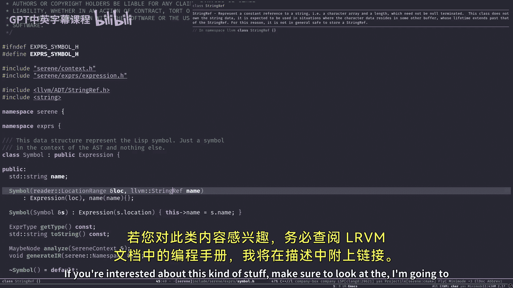
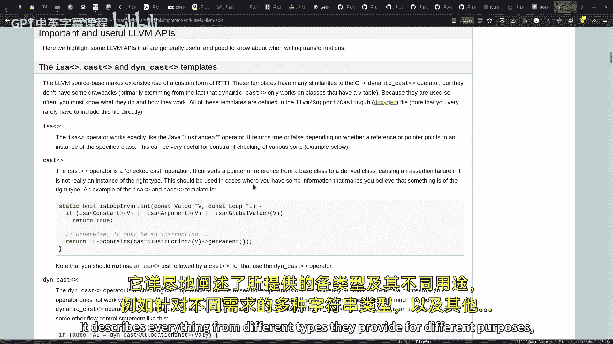
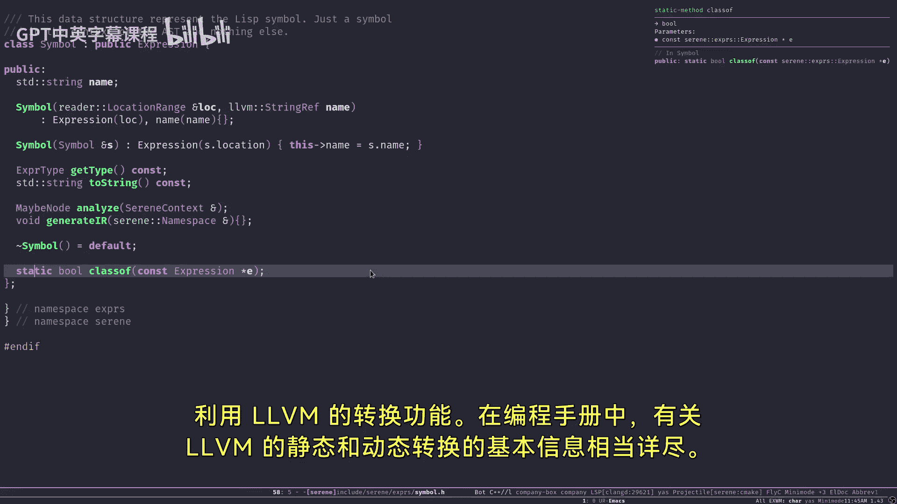
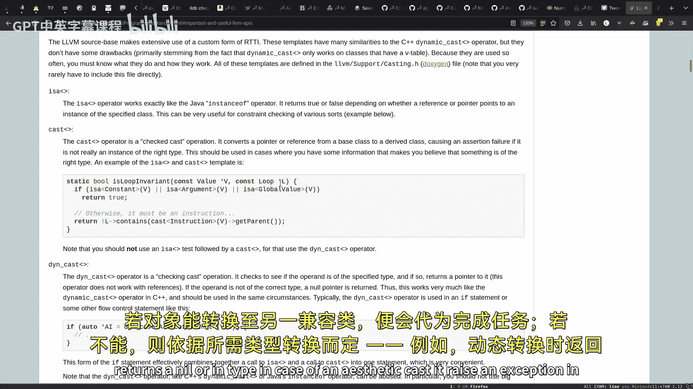
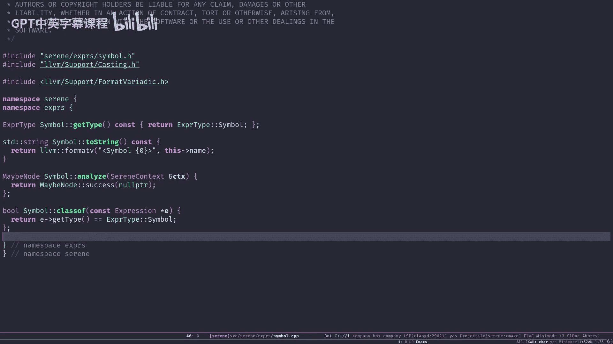
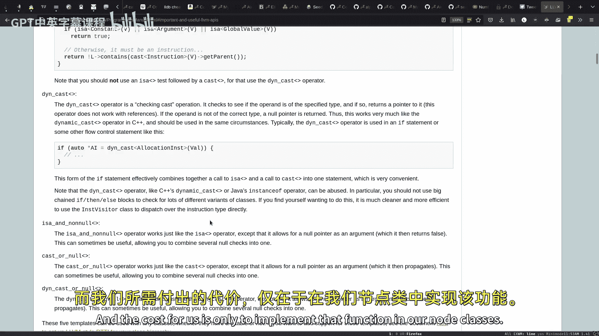
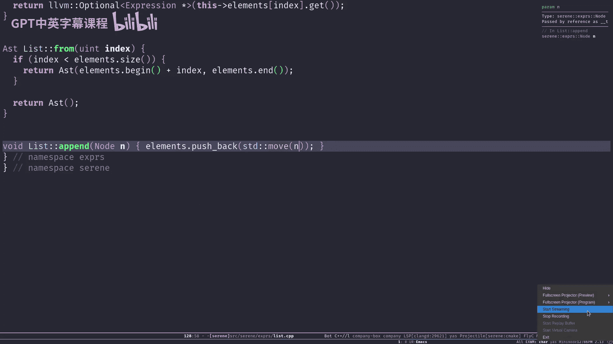

# 005：抽象语法树

在本节课中，我们将要学习编译过程中的一个核心数据结构——抽象语法树。我们将了解它的定义、结构，并深入探讨其具体实现，特别是如何用C++类来表示AST中的各种节点。

## 概述

在上一节中，我们介绍了词法分析器和语法分析器如何将源代码字符串转换为一种数据结构。本节中，我们来看看这种数据结构——抽象语法树。AST是源代码抽象语法结构的树状表示，是后续语义分析和代码生成的基础。

## 什么是抽象语法树？

抽象语法树是由节点组成的树形结构，每个节点代表了源代码中的一个语法片段。与具体的语法树不同，AST省略了一些语法细节（如括号、分号），更专注于程序的结构。

以下是一段伪代码示例：
```
(def main (fn () 4))
(prn (main))
```

如果我们将这段源代码传递给分析器，它会生成对应的AST。下图展示了这段代码可能对应的AST结构（为清晰起见，两行代码被表示为两个独立的子树）：
*   左边的树对应第一行 `(def main (fn () 4))`。其根节点是一个列表，包含三个子节点：符号`def`、符号`main`以及另一个列表。这个内层列表又包含三个子节点：符号`fn`、一个空列表和数字`4`。
*   右边的树对应第二行 `(prn (main))`。其根节点也是一个列表，包含两个子节点：符号`prn`以及另一个列表。这个内层列表包含一个子节点：符号`main`。

目前，这个树只包含语法结构信息，没有语义信息。例如，我们不知道`main`是一个函数，也不知道`4`是一个数字。语法分析器能捕获像括号不匹配这样的语法错误，但无法识别“用数字`2`作为函数调用”这类语义错误。语义检查将在后续的语义分析阶段完成。

## 表达式基类

为了开始实现AST，我们首先需要定义一个所有AST节点的基类，称为`Expression`（表达式）。

在Lisp系语言中，有一个核心理念：**一切都是表达式**。表达式与语句不同：**表达式总会求值出一个结果**（例如 `a + 3`），而**语句只是执行一个操作，不产生值**（例如 `a = 3`）。在Serene（我们构建的编译器）中，所有代码结构都被建模为表达式。

以下是`Expression`基类的核心定义（位于 `include/Serene/Expr/Expression.h`）：

```cpp
namespace serene { namespace expr {
    // 表达式类型枚举
    enum class ExpressionType {
        Symbol,
        List,
        Number,
        Def,
        Error,
        Fn,
        Call
    };

    // 表达式基类
    class Expression {
    protected:
        LocationRange location; // 源代码中的位置信息
    public:
        Expression(LocationRange &loc);
        virtual ~Expression() = default;

        // 返回此节点的具体类型（如Symbol, List）
        virtual ExpressionType getType() const = 0;
        // 返回节点的字符串表示（用于调试）
        virtual llvm::StringRef toString() const = 0;
        // 语义分析函数（下节介绍）
        virtual MaybeNode analyze() = 0;
        // 生成中间代码函数（后续介绍）
        virtual void generateIR() = 0;

        LocationRange &getLocation() { return location; }
    };
} }
```

此外，文件中还定义了一些在项目中广泛使用的类型别名，以简化代码：

```cpp
// Node 是指向任意表达式节点的智能指针
using Node = std::shared_ptr<Expression>;

// MaybeNode 表示一个可能成功（包含Node）也可能失败（包含错误树）的操作结果
using MaybeNode = llvm::Expected<Node>;

// AST 本身就是一个Node的向量
using AST = std::vector<Node>;
using MaybeAST = llvm::Expected<AST>;
```

为了统一创建节点，我们提供了辅助函数：

```cpp
// 创建节点，返回基类指针 (Node)
template <typename T, typename... Args>
static Node make(Args &&...args) {
    return std::make_shared<T>(std::forward<Args>(args)...);
}

// 创建节点，并直接转换为具体类型的指针
template <typename T, typename... Args>
static std::shared_ptr<T> make_and_cast(Args &&...args) {
    return std::make_shared<T>(std::forward<Args>(args)...);
}
```

## 具体节点类型实现

现在，让我们看看如何实现具体的表达式节点。所有节点类都必须继承自`Expression`基类，并实现其纯虚函数。





### 符号节点

符号（例如变量名、函数名）是最简单的节点之一。以下是`Symbol`类的核心部分：



```cpp
class Symbol : public Expression {
public:
    llvm::StringRef name; // 符号的名称

    Symbol(LocationRange &loc, llvm::StringRef name)
        : Expression(loc), name(name) {}

    ExpressionType getType() const override {
        return ExpressionType::Symbol;
    }

    llvm::StringRef toString() const override {
        // 返回符号的字符串表示，如 "symbol:main"
        return llvm::formatv("symbol:{0}", name);
    }

    // 用于LLVM风格的类型转换
    static bool classof(const Expression *e) {
        return e->getType() == ExpressionType::Symbol;
    }

    // ... 其他函数（analyze, generateIR）暂不展开
};
```



`classof`函数是配合LLVM自定义的类型转换系统使用的。它允许我们高效、安全地进行类型向下转换（例如，将一个`Expression*`转换为`Symbol*`），而无需使用C++的RTTI机制。

### 数字节点

数字节点用于表示整数字面量。在初始实现中，我们将其值存储为字符串，在需要时再转换为`int64_t`。





```cpp
class Number : public Expression {
    std::string number; // 数字字符串
    bool isNegative;
    bool isFloat;       // 当前未使用，为未来扩展预留

public:
    Number(LocationRange &loc, llvm::StringRef num)
        : Expression(loc), number(num.str()) {
        isNegative = num.startswith("-");
        isFloat = num.contains('.');
    }

    ExpressionType getType() const override {
        return ExpressionType::Number;
    }

    int64_t toInt64() const {
        // 将字符串转换为整数
        int64_t val;
        llvm::StringRef(number).getAsInteger(10, val);
        return val;
    }

    llvm::StringRef toString() const override {
        return llvm::formatv("number:{0}", number);
    }

    static bool classof(const Expression *e) {
        return e->getType() == ExpressionType::Number;
    }
    // ...
};
```

### 列表节点

列表是Lisp语言的核心，也是AST中最重要的复合节点。一个列表包含多个子表达式（节点）。

```cpp
class List : public Expression {
    AST elements; // 子节点列表

public:
    // 构造空列表
    List(LocationRange &loc) : Expression(loc) {}
    // 构造包含单个节点的列表
    List(LocationRange &loc, Node n) : Expression(loc) {
        elements.push_back(std::move(n));
    }
    // 构造包含多个节点的列表
    List(LocationRange &loc, AST els) : Expression(loc), elements(std::move(els)) {}

    ExpressionType getType() const override {
        return ExpressionType::List;
    }

    // 获取列表中指定索引处的节点（可能不存在）
    llvm::Optional<Node> at(size_t index) {
        if (index >= elements.size()) {
            return llvm::None; // 索引越界，返回空
        }
        return elements[index]; // 返回节点
    }

    // 获取从指定索引开始的子列表
    AST from(size_t index) {
        if (index >= elements.size()) {
            return {}; // 返回空AST
        }
        return AST(elements.begin() + index, elements.end());
    }

    // 向列表追加一个节点
    void append(Node n) {
        elements.push_back(std::move(n));
    }

    llvm::StringRef toString() const override {
        if (elements.empty()) {
            return "()";
        }
        std::string str = "(";
        for (const auto &elem : elements) {
            str += elem->toString().str() + " ";
        }
        str.back() = ')'; // 替换最后一个空格
        return str;
    }

    static bool classof(const Expression *e) {
        return e->getType() == ExpressionType::List;
    }
    // ...
};
```

列表的`elements`成员是一个`AST`（即`std::vector<Node>`），这使得列表可以嵌套，从而形成树形结构，这正是“抽象语法树”中“树”的体现。

## 总结



本节课中，我们一起学习了抽象语法树的核心概念。我们了解到AST是源代码语法结构的树形表示，其节点对应程序中的各种语法元素。我们深入探讨了如何用C++类层次结构来实现AST，定义了所有节点的基类`Expression`，并具体实现了`Symbol`、`Number`和`List`这几个基础节点类型。列表节点能够包含其他节点，从而构成了树形嵌套关系。我们还介绍了LLVM工具库中一些有用的组件，如`StringRef`、`Expected`和`Optional`，以及LLVM风格的类型转换机制。这些基础数据结构为后续的语义分析和代码生成阶段打下了坚实的基础。