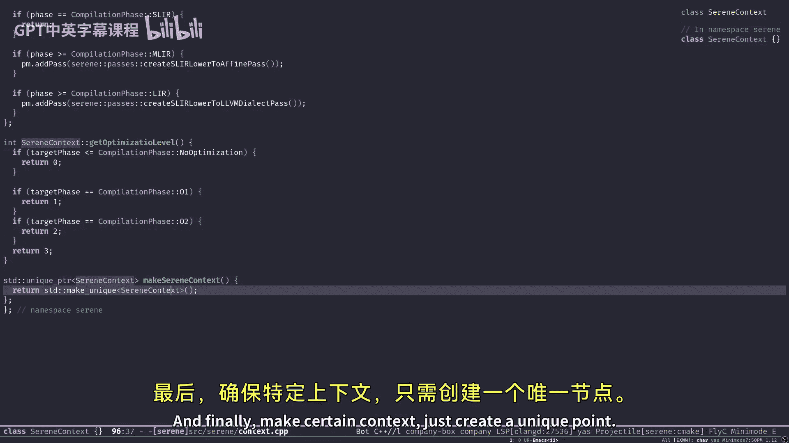
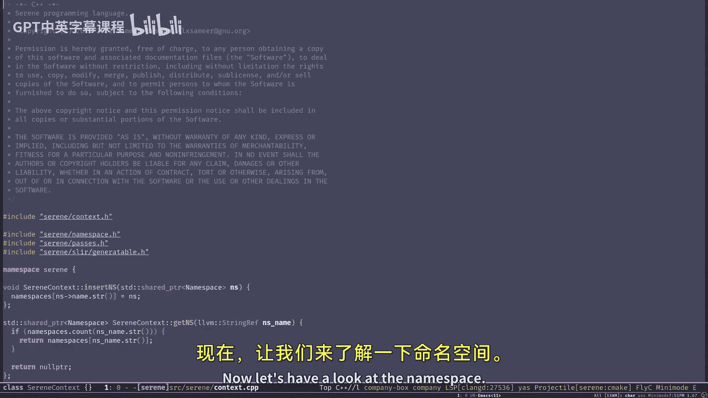
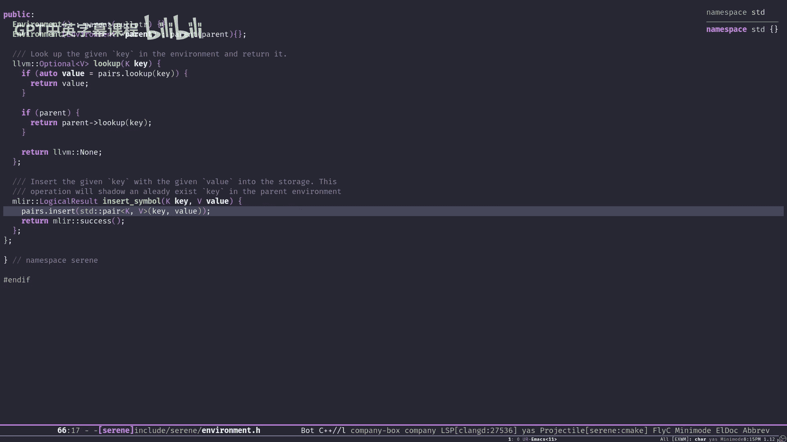

# 007：上下文与命名空间

在本节课中，我们将学习Serene编译器的两个核心概念：**上下文** 和 **命名空间**。它们是编译器全局状态管理和代码组织的基础单元。理解它们对于后续学习LLVM和MLIR的集成至关重要。

上一节我们介绍了编译器的不同子系统，如读取器、解析器和语义分析器。本节中，我们来看看支撑这些组件的核心基础设施。

## 命名空间：编译的基本单元

命名空间是Serene语言中最重要的概念之一，因为它是**编译的基本单元**。它的主要作用是：
*   **组织代码**：将不同的名称归类到不同的“桶”中，以避免名称冲突。
*   **定义编译范围**：编译器以命名空间为单位进行编译。

与Python等语言中的“模块”不同，在Serene中，命名空间直接对应编译过程。当我们要求编译器编译程序时，实际上是要求它编译特定的命名空间。

**工作原理示例**：
假设我们要求编译器编译命名空间 `foo`。编译器会：
1.  在文件系统中查找名为 `foo.srn` 的文件。
2.  读取文件并生成抽象语法树。
3.  对AST运行语义分析器。
4.  最终为目标架构生成代码（例如一个对象文件）。

通常一个程序会包含多个命名空间，编译器会分别编译它们，然后在链接阶段将这些对象文件链接成最终的可执行文件。

**重要特性**：
*   命名空间通常映射到文件系统中的一个文件，但并非总是如此（例如在REPL交互环境中可以动态创建）。
*   命名空间维护着自身的状态，包括作用域和环境。

## 上下文：编译器的全局状态

这里有一个容易混淆的地方：源代码中存在三个不同的“上下文”：
1.  **Serene上下文**：编译器整体的全局状态持有者。
2.  **LLVM上下文**：用于生成LLVM IR。
3.  **MLIR上下文**：用于生成MLIR代码。

这三个概念本质相同，但服务于不同层级。**Serene上下文**是最高级的，它拥有并管理着另外两个上下文。

**Serene上下文的核心职责**：
*   持有命名空间表（作为缓存）。
*   管理当前的编译阶段和目标架构。
*   未来可能持有原始类型等全局信息。

## 源码解析：Serene上下文

让我们开始查看 `SereneContext` 类的源码。首先，我们定义了一个枚举来表示编译器的当前阶段：

```cpp
enum class CompilationPhase {
  AST,
  SemanticAnalysis,
  SLIR,
  LIR,
  MLIR,
  LLVMIR,
  Object,
  NoOptimization
};
```

这个枚举允许我们设置编译器的工作模式，例如仅转储AST，或运行到生成MLIR为止。

以下是 `SereneContext` 类的简化结构：





```cpp
class SereneContext {
private:
  std::unique_ptr<llvm::LLVMContext> llvmContext;
  std::unique_ptr<mlir::MLIRContext> mlirContext;
  std::unique_ptr<mlir::PassManager> passManager;

  std::string targetTriple;
  llvm::StringMap<std::shared_ptr<NameSpace>> namespaces;
  std::string currentNS;

  CompilationPhase phase = CompilationPhase::NoOptimization;

public:
  // 构造函数：初始化上下文和Pass管理器
  SereneContext();
  // 注册新命名空间
  bool insertNS(std::shared_ptr<NameSpace> ns);
  // 设置当前正在处理的命名空间
  bool setCurrentNS(const llvm::StringRef &nsName);
  // 获取当前命名空间
  std::shared_ptr<NameSpace> getCurrentNS();
  // 根据名称获取命名空间
  std::shared_ptr<NameSpace> getNS(const llvm::StringRef &nsName);
  // 设置编译阶段（可能触发Pass的添加）
  void setOperationPhase(CompilationPhase newPhase);
};
```

**关键成员解析**：
*   `namespaces`：一个将命名空间名称映射到其共享指针的缓存表。这避免了重复加载和处理相同的命名空间。
*   `currentNS`：存储当前正在处理的命名空间名称。在多线程设计中，每个线程可能有自己当前的命名空间。
*   `setOperationPhase`：此函数根据编译阶段，可能需要向Pass管理器添加不同的优化或 lowering pass。例如，在生成MLIR后，需要添加 lowering 到LLVM IR的pass。

创建上下文的官方方式是使用工厂函数：
```cpp
std::unique_ptr<SereneContext> makeSereneContext();
```

## 源码解析：命名空间

接下来，我们查看 `NameSpace` 类的结构。它代表了一个可编译的代码单元。

首先定义两个重要的结果类型：
```cpp
using MaybeModule = Result<std::unique_ptr<llvm::Module>, bool>;
using MaybeModuleOp = Result<mlir::ModuleOp, bool>;
```
`Result` 类型用于表示可能成功（返回模块）或失败（目前用布尔值占位，未来会改为错误类型）的操作。

`NameSpace` 类的简化结构如下：

```cpp
class NameSpace {
private:
  SereneContext &ctx;
  std::atomic<uint64_t> fnCounter; // 用于生成匿名函数唯一名称
  std::unique_ptr<Expression> tree; // 该命名空间的AST
  bool initialized = false;

  std::string name;
  llvm::Optional<std::string> filename;

  Environment<std::string, NodePtr> semaEnv;  // 语义分析环境
  Environment<llvm::StringRef, mlir::Value> symTable; // 符号表（用于JIT等）

public:
  NameSpace(SereneContext &ctx, llvm::StringRef name,
            llvm::Optional<llvm::StringRef> filename = llvm::None);

  // 获取和设置AST
  Expression &getTree();
  void setTree(std::unique_ptr<Expression> t);

  // 生成IR（可能是SLIR, MLIR, LIR）
  MaybeModuleOp generate();
  // 编译到LLVM IR
  MaybeModule compileToLLVM();

  // 运行Pass管理器
  void runPasses(mlir::ModuleOp module);
};
```

**关键成员解析**：
*   `fnCounter`：一个原子计数器，用于为匿名函数生成唯一名称（例如 `serene.fn.3`）。
*   `semaEnv`：**语义分析环境**。它是一个从字符串（符号名）到AST节点（`NodePtr`）的映射。在语义分析阶段，当我们定义一个新绑定时（如 `(def x 5)`），会将符号 `"x"` 和其分析后的值存入此环境。在后续遇到该符号时（如在函数调用中），从此环境查找其定义。
*   `symTable`：**符号表**。它是一个从字符串引用到MLIR值（`mlir::Value`）的映射，用于编译的后期阶段（如JIT编译）。
*   `generate()` 和 `compileToLLVM()`：这两个核心函数负责将命名空间的AST转换为不同层级的IR，我们将在后续课程详细讨论。

创建命名空间的官方方式：
```cpp
std::shared_ptr<NameSpace> makeNameSpace(SereneContext &ctx,
                                         llvm::StringRef name,
                                         llvm::Optional<llvm::StringRef> filename = llvm::None,
                                         bool setCurrent = false);
```

## 源码解析：环境

`Environment` 类是一个通用模板类，用于实现具有层级结构的作用域。它在语义分析和符号管理中起着关键作用。

以下是其简化实现：

```cpp
template <typename K, typename V>
class Environment {
private:
  Environment *parent;
  llvm::DenseMap<K, V> pairs; // 存储键值对

public:
  Environment(Environment *p = nullptr) : parent(p) {}

  // 查找键值：先在当前环境找，找不到则向父环境查找
  llvm::Optional<V> lookup(const K &key) {
    auto it = pairs.find(key);
    if (it != pairs.end()) {
      return it->second;
    }
    if (parent != nullptr) {
      return parent->lookup(key);
    }
    return llvm::None; // 未找到
  }

  // 插入键值对：插入当前环境，可能遮蔽父环境中的同名键
  bool insertSymbol(const K &key, const V &value) {
    pairs[key] = value;
    return true; // 目前总是成功
  }
};
```

**环境层级与遮蔽**：
环境支持父子关系，形成层级链。查找时，会从当前环境向根环境递归查找。插入时，如果当前环境已存在该键，则覆盖；如果父环境存在同名键，则当前环境的插入操作会“遮蔽”父环境中的绑定。例如：
*   父环境中 `foo -> 4`
*   在当前环境中插入 `foo -> 5`
*   那么，在当前环境中查找 `foo` 会得到 `5`，父环境的 `4` 被遮蔽。

## 总结

本节课中我们一起学习了Serene编译器的两个核心基础设施：

1.  **命名空间**：作为编译的基本单元，它组织代码、管理自身AST、并维护语义环境和符号表。一个命名空间通常对应一个源文件，并最终可编译为一个LLVM模块。
2.  **Serene上下文**：作为编译器的全局状态管理器，它持有所有命名空间的缓存、管理当前编译阶段和目标架构，并拥有LLVM和MLIR的上下文。

我们还了解了**环境**这个通用组件，它通过层级结构实现了作用域的概念，是语义分析和符号管理的基石。



现在，您应该能够阅读并理解语义分析阶段的大部分代码了。从下一节课开始，我们将深入探讨LLVM和MLIR的集成，学习如何将AST逐步转换为可执行的机器代码。