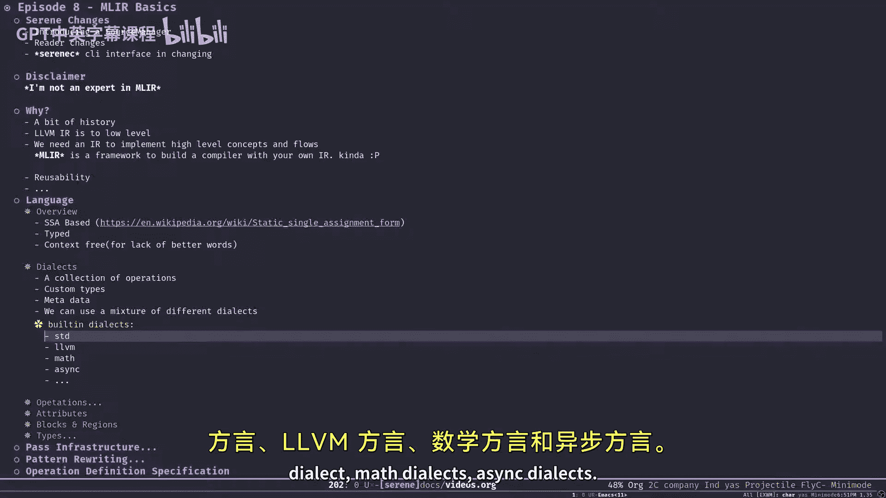
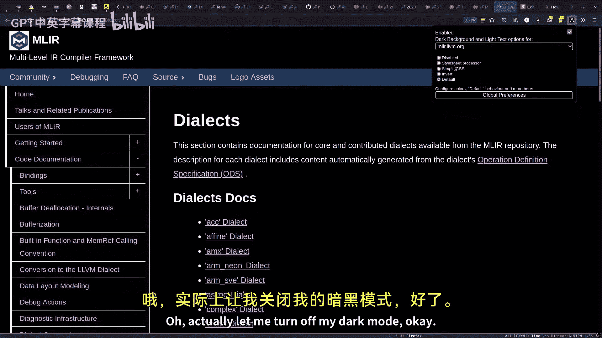
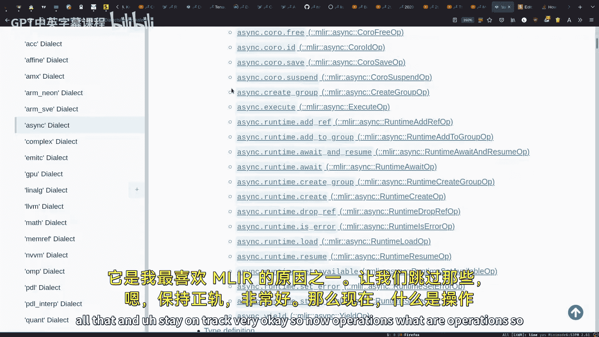
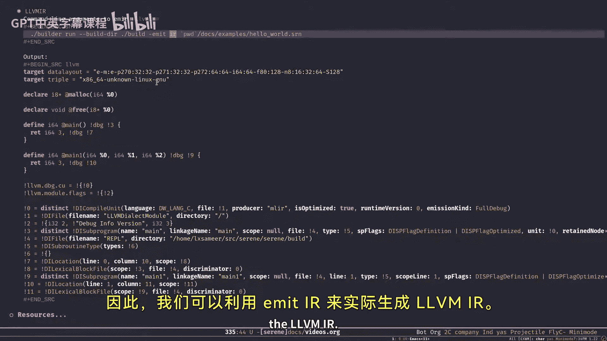
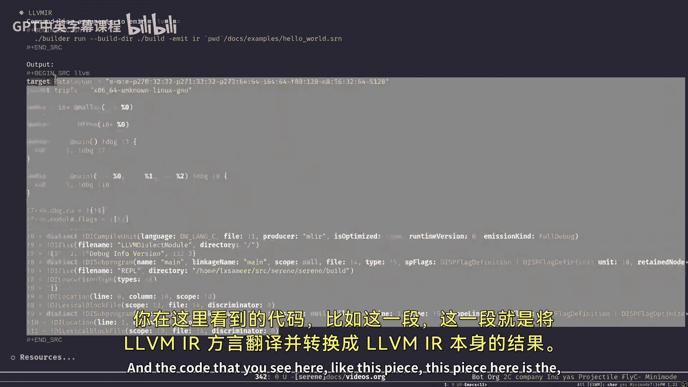
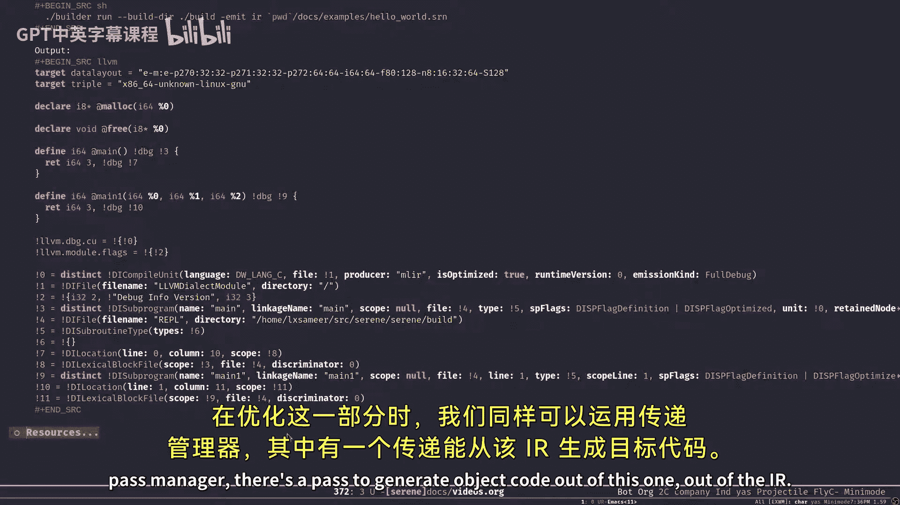
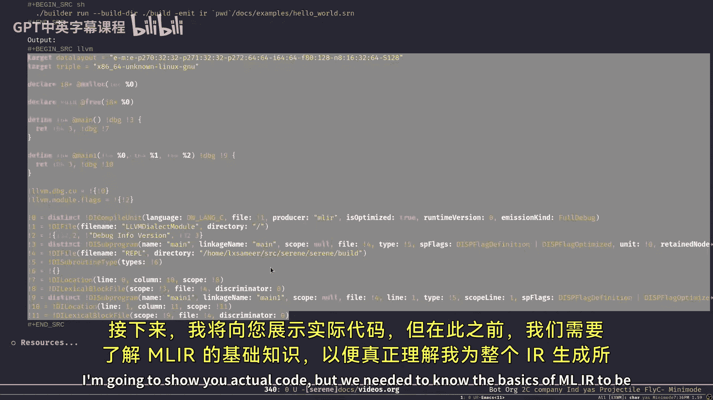
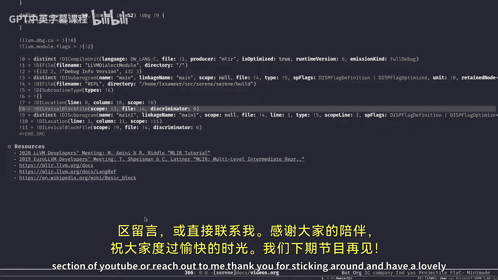

# 008：MLIR基础

在本节课中，我们将要学习MLIR的基础知识。我们将了解什么是MLIR、为什么它对于编译器构建如此重要，以及它的核心概念，如方言、操作、属性和区域。这些知识将为我们后续在Serene编译器中实际使用MLIR打下基础。

上一节我们介绍了编译器前端的工作流程。本节中我们来看看一个强大的中间表示框架——MLIR。

## 为什么选择MLIR？

在为我的新语言寻找合适的平台时，我尝试了JVM、Go等不同平台，最终得出结论：LLVM是构建编译器的最佳选择。它是一个用于创建语言和编译器的库集合。

然而，LLVM IR的抽象层级过低，类似于汇编指令，将高级语言概念映射到LLVM IR上非常困难。我需要在其之上创建抽象层来分解问题。

MLIR的出现解决了这个问题。简单来说，MLIR是一个用于构建具有自定义IR的编译器的框架。它帮助我在LLVM IR之上创建所需的抽象层，从而将复杂问题分解为更小、更易管理的部分。

MLIR的名字可能代表多层中间表示。它允许我们在不同层级创建抽象，层层递进，直到问题简化到我们可以推理和解决的程度。

## MLIR语言概述

MLIR本身围绕一种语言工作，这种语言用于描述不同的方言。

*   **基于SSA形式**：MLIR语言基于静态单赋值形式。这意味着IR中的变量必须先定义后初始化，且只能赋值一次，之后不能重新赋值。在MLIR中，我们可以将SSA值视为绑定到值的名称。
*   **类型系统**：MLIR语言是强类型的。与LLVM IR不同，MLIR的类型不是硬编码的。我们可以基于MLIR提供的API创建自己的类型和类型系统。
*   **上下文无关**：MLIR语言本身只是一堆文本。只要语法有效，MLIR就可以处理它。MLIR并不一定理解你写的代码具体做什么，但可以验证语法。当你创建自己的方言时，MLIR不一定知道其语义。

## 核心概念：方言

MLIR中的抽象层被称为方言。





每个方言是操作、自定义类型和一些元数据的集合。我们可以将不同的方言组合使用来解决问题。

MLIR的一个主要优势在于，它试图在统一的API和规则下，整合不同编译器项目各自创建的IR。例如，Flang编译器就使用了MLIR。这意味着我可以在自己的Serene编译器中利用他人已经实现的功能。



MLIR本身提供了一些基础方言，例如：
*   `builtin`：内置方言，提供基础功能。
*   `func`：用于函数调用等操作。
*   `scf`：提供结构化控制流操作，如循环和条件分支。
*   `async`：用于构建异步基础设施。

使用这些现成的方言，我可以专注于与我的语言和编译器相关的核心问题，而无需重复实现通用功能。

## 核心概念：操作与属性

方言是操作的集合。操作是MLIR中的基本抽象单元。

*   **操作**：它不是一条指令，而是一个抽象概念。操作通常以SSA值的形式返回结果。我们可以完全用C++编写操作，也可以使用TableGen来定义，后者会为我们生成包括C++实现在内的大部分代码。
*   **属性**：这是MLIR中一个特有的概念。属性是编译时常量，是静态的。与操作的输入参数（运行时值）不同，属性值在编译时就必须确定。

操作可以拥有自定义的验证器和打印机。默认情况下，MLIR会使用通用版本，但我们可以提供自定义的验证器来确保操作结构的正确性，以及自定义的打印机来将操作序列化为文本格式。

## 核心概念：块与区域

块和区域是组织代码结构的重要概念。

*   **块**：块是一系列没有分支的直线指令序列。进入一个块后，将顺序执行其中的所有指令，直到退出。这在编译器领域是一个基本概念。
*   **区域**：区域是块的有序列表。每个区域可以包含一个或多个块。块和区域可以相互嵌套。你可以将区域类比为Java或C++等语言中的代码块。

LLVM IR只有块的概念，而MLIR引入了区域，使得对高级语言结构（如带有then和else分支的if语句）的建模变得更加直观和容易。

## 通行基础设施

LLVM和MLIR都提供了通行基础设施。

其工作方式是：我们生成IR（LLVM IR或MLIR），然后运行一系列称为“通行”的处理器。每个通行会对IR进行特定的转换或分析，例如常量折叠、死代码消除等。通行管理提供了相关的API。

在MLIR中，通行管理器是多线程的，这是一个很大的优势。

在Serene编译器中，我计划将大部分语义分析逻辑转移到通行基础设施中。首先，将AST节点一对一地映射到SLIR操作，然后使用不同的通行对其进行类型检查和分析，再通过模式重写将其“降级”到其他方言。

我们可以使用TableGen来编写这些模式和重写规则，这比直接编写C++代码要简单得多。

## 操作定义规范

ODS是使用TableGen定义操作的方式。

以下是来自MLIR官方教程中Toy方言的一个示例：
```tablegen
// 包含基础定义
include "mlir/IR/OpBase.td"

// 定义Toy方言
def Toy_Dialect : Dialect {
  let name = "toy";
  let cppNamespace = "toy";
}

// 定义Toy操作的基础类
class Toy_Op<string mnemonic, list<Trait> traits = []> :
    Op<Toy_Dialect, mnemonic, traits>;

// 定义一个具体的常量操作
def ConstantOp : Toy_Op<"constant"> {
  let summary = "constant operation";
  let arguments = (ins F64Attr:$value);
  let results = (outs F64Tensor);
  let assemblyFormat = "$value attr-dict `:` type(results)";
}
```
如你所见，用这种格式编写操作比直接编写C++代码要简单得多。在构建时，MLIR和TableGen工具会根据这些定义生成所需的C++代码。

## MLIR语法示例

让我们看一个MLIR代码的一般语法示例：
```
%result = some_dialect.blah(%x#3) 
         {some.attribute = true, another.attribute = 3} 
         : (!some_dialect.example_type) -> (!some_dialect.typeS, !some_dialect.typeC) 
         loc("main":10:8)
```
*   `%result`：定义一个本地SSA值，此处该操作返回两个值。
*   `some_dialect.blah`：调用`some_dialect`方言中的`blah`操作。
*   `%x#3`：使用SSA值`%x`的第三个值作为输入参数。
*   `{...}`：内是属性映射。
*   `: (...)`：指定输入参数的类型。
*   `-> (...)`：指定操作返回结果的类型。
*   `loc(...)`：指定该操作在源代码中的位置信息。

## 块与区域示例

以下是如何在MLIR中定义函数、区域和块的示例：
```
// 定义一个函数
func @example(%arg0: i64, %arg1: i1) -> i64 {
  // 这是一个区域（函数体）
  ^bb0:
    // 这是一个块
    %c = constant 42 : i64
    br ^bb3(%c : i64) // 跳转到块bb3，并传递%c作为参数

  ^bb3(%input: i64):
    // 块bb3，接收一个参数%input
    %result = addi %input, %input : i64
    return %result : i64
}
```
通过区域和块的嵌套，我们可以方便地建模高级语言结构。

## Serene编译器中的实际应用





在Serene编译器中，我们首先将源代码转换为自定义的SLIR方言。例如，一个简单的Serene函数：
```
// Serene 代码
(fn main [] 3)
(fn main-one [a b c] 3)
```
会被转换为SLIR：
```
// SLIR 表示
serene.fn @main() -> i64 {
  %0 = serene.value {value = 0} : () -> i64
  serene.return %0 : i64
}
serene.fn @main_one(%arg0: i64, %arg1: i64, %arg2: i64) -> i64 {
  %0 = serene.value {value = 0} : () -> i64
  serene.return %0 : i64
}
```
然后，我们使用MLIR的通行管理器，将SLIR降级到`std`和`builtin`等标准方言：
```
// 降级后的 MLIR (std 方言)
module {
  func @main() -> i64 {
    %c0 = constant 0 : i64
    return %c0 : i64
  }
  func @main_one(%arg0: i64, %arg1: i64, %arg2: i64) -> i64 {
    %c0 = constant 0 : i64
    return %c0 : i64
  }
}
```
接着，进一步降级到LLVM方言，最终生成标准的LLVM IR：
```
// 生成的 LLVM IR
define i64 @main() {
  ret i64 0
}
define i64 @main_one(i64 %0, i64 %1, i64 %2) {
  ret i64 0
}
```
至此，我们就可以利用LLVM的后端来生成目标代码和最终的可执行文件了。

## 推荐资源





以下是我强烈推荐的学习资源：
1.  MLIR工程师的演讲视频（在课程视频的资源部分有链接），它们非常精彩但篇幅较短。
2.  MLIR官方语言参考手册，它详细描述了MLIR语言的所有细节，应作为主要参考资料。
3.  关于编译器中块概念的资料，如果需要可以查阅。
4.  在系列课程第1集中提到的两本编译器设计书籍（“龙书”和“虎书”），特别是“虎书”较为简短，“龙书”则是编译器设计的经典著作。



本节课中我们一起学习了MLIR的基础知识，包括其动机、核心概念（方言、操作、属性、块、区域）以及通行基础设施。我们还看到了MLIR语法示例和它在Serene编译器中的实际应用流程。理解这些基础对于后续实际进行IR生成和转换至关重要。