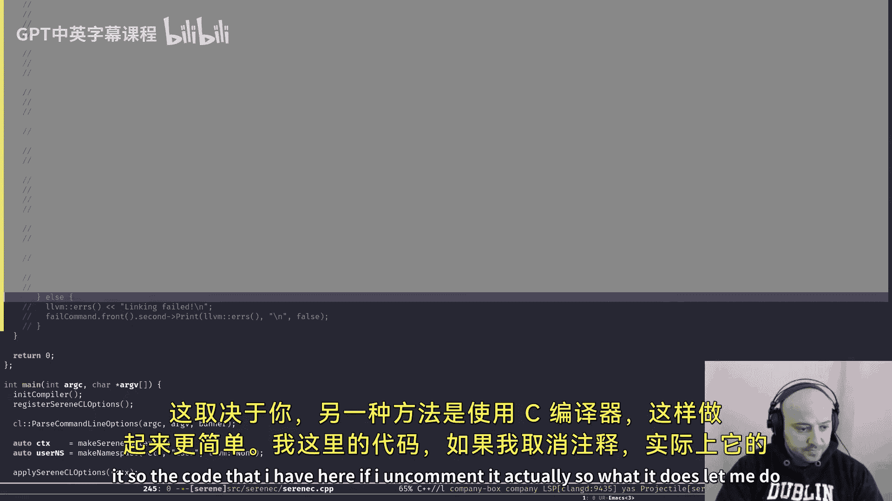
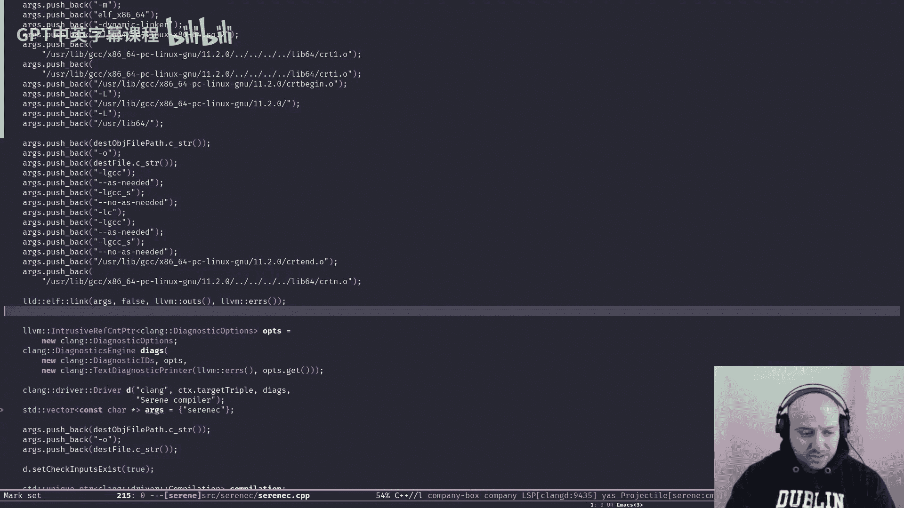
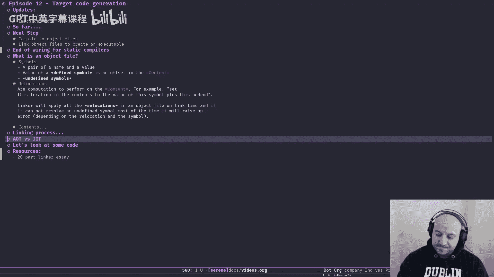

# 012：目标代码生成 🎯

在本节课中，我们将学习编译器流程的最后一步：目标代码生成。我们将了解如何将LLVM IR转换为机器码，并最终链接成可执行文件。

## 概述

到目前为止，我们已经构建了一个基于LLVM的编译器前端。它读取源代码，解析为AST，进行语义检查，生成我们自定义的MLIR方言（SLIR），并将其降级为LLVM IR。然而，一个完整的编译器需要生成最终的可执行文件，而不仅仅是中间表示。本节将介绍如何完成这一过程。

## 目标代码生成基础

上一节我们介绍了如何将SLIR降级为LLVM IR。本节中，我们来看看如何将LLVM IR进一步编译成目标平台的原生代码。

在真实场景中，用户期望从编译器获得一个可以直接运行的可执行文件，而不是需要手动处理的中间文件。常见的做法是将代码编译成**目标文件**，然后使用**链接器**将它们链接在一起，形成最终的可执行文件。

### 目标文件剖析

目标文件是二进制文件，主要包含三种实体：**符号**、**重定位**和**内容**。

以下是目标文件的核心组成部分：

*   **符号**：代表程序中的全局实体（如函数、全局变量）。每个符号有一个名称和一个值（通常是其在内容中的偏移量）。已定义的符号在源代码中有具体实现，未定义的符号则引用外部定义。
*   **重定位**：在链接阶段对内容进行的计算和修改操作。例如，将某个内存地址设置为某个符号的值加上一个偏移量。其公式可以表示为：`目标地址 = 符号地址 + 偏移量`。
*   **内容**：编译生成的机器码块，代表进程加载到内存后的数据布局。主要包含：
    *   **代码段**：存放生成的机器指令。
    *   **数据段**：存放已初始化的全局和静态变量。
    *   **只读数据段**：存放字符串字面量、跳转表等。
    *   **BSS段**：存放未初始化的全局和静态变量（通常默认初始化为0）。

### 链接过程

链接器的主要工作是解析所有符号，并将多个目标文件合并成一个可执行文件。其基本流程如下：

1.  读取所有输入的目标文件。
2.  构建一个全局符号表，尝试解析所有未定义的符号（找到其定义）。
3.  将所有目标文件的内容按类型排序并拼接起来。
4.  对所有内容应用重定位操作，修正符号引用地址。
5.  将最终结果写入一个可执行文件（如Linux下的ELF格式）。

## 代码实现：从LLVM IR到目标文件

了解了理论基础后，我们来看看如何在代码中实现目标文件生成。请注意，以下代码仅为演示，在实际项目中（尤其是对于像Serene这样的Lisp语言）可能会被更复杂的即时编译方案取代。

核心函数是 `dump_as_object`，它负责将一个命名空间（包含AST）编译成目标文件。

```cpp
// 伪代码示例：将LLVM模块编译为目标文件
void dump_as_object(Namespace& ns, const std::string& output_path) {
  // 1. 将命名空间编译为LLVM IR模块
  auto maybe_module = ns.compileToLLVM();
  if (!maybe_module) { /* 处理错误 */ return; }
  auto module = std::move(maybe_module.get());

  // 2. 设置目标三元组（例如 "x86_64-pc-linux-gnu"）
  module->setTargetTriple("x86_64-pc-linux-gnu");

  // 3. 根据三元组创建目标机器
  std::string error;
  auto target = llvm::TargetRegistry::lookupTarget(module->getTargetTriple(), error);
  // ... 错误检查
  llvm::TargetMachine* target_machine = target->createTargetMachine(...);

  // 4. 设置数据布局
  module->setDataLayout(target_machine->createDataLayout());

  // 5. 创建输出文件流
  std::error_code ec;
  llvm::raw_fd_ostream dest(output_path, ec);

  // 6. 配置PassManager以生成目标文件
  llvm::legacy::PassManager pass;
  if (target_machine->addPassesToEmitFile(pass, dest, nullptr, llvm::CGFT_ObjectFile)) {
    // ... 处理错误
  }

  // 7. 运行Pass，生成目标文件
  pass.run(*module);
  dest.flush();
}
```

## 链接目标文件

生成目标文件后，下一步是将其链接为可执行文件。主要有两种方法：

以下是两种常见的链接方式：

1.  **直接使用链接器（推荐）**：例如，将LLD作为库链接到你的编译器中。这种方式控制力强，依赖少。
    ```cpp
    // 伪代码：使用LLD库进行链接
    std::vector<const char*> args = {"ld.lld", "-o", "output_exe", "input.o", "-lc"};
    bool success = lld::elf::link(args, llvm::outs(), llvm::errs(), false, false);
    ```
2.  **调用外部C编译器驱动**：例如，通过Clang驱动来调用链接器。这种方式实现简单，但会引入对另一个编译器的依赖。
    ```cpp
    // 伪代码：使用Clang驱动进行链接
    clang::driver::Driver driver;
    std::vector<const char*> args = {"clang", "input.o", "-o", "output_exe"};
    std::unique_ptr<clang::driver::Compilation> comp(driver.BuildCompilation(args));
    // ... 执行编译作业
    ```

对于追求独立性和效率的编译器，**将LLD作为库直接使用是更优的选择**。尽管需要处理平台特定的路径和库依赖，但它避免了额外的外部依赖。

## AOT与JIT编译

本节讨论的生成可执行文件的过程属于**提前编译**。然而，对于Serene这样的Lisp语言，其宏系统需要在编译时执行代码，这就引入了**即时编译**的需求。

*   **AOT**：在程序运行前完成全部编译。
*   **JIT**：在程序运行时动态编译代码。




两者并不互斥。我们可以在编译时使用JIT来执行宏展开，然后将最终结果进行AOT编译，生成可执行文件。这也是Serene编译器后续的发展方向。

## 总结



本节课中我们一起学习了编译器后端的关键步骤——目标代码生成与链接。我们了解了目标文件的组成（符号、重定位、内容），链接器的工作原理，并查看了将LLVM IR生成目标文件以及链接成可执行文件的示例代码。虽然示例代码是临时的，但它清晰地展示了从高级IR到原生二进制文件的完整通路。对于静态语言编译器，至此核心框架已搭建完成。接下来，我们将转向更复杂的主题，探索如何为Serene这样的语言实现即时编译功能。




---
**延伸阅读**：如果你对链接器和目标文件格式的细节感兴趣，强烈推荐阅读系列文章《Linker Essay》（作者是Gold链接器的开发者），它对此有极为深入和精彩的讲解。链接已附在课程资源中。