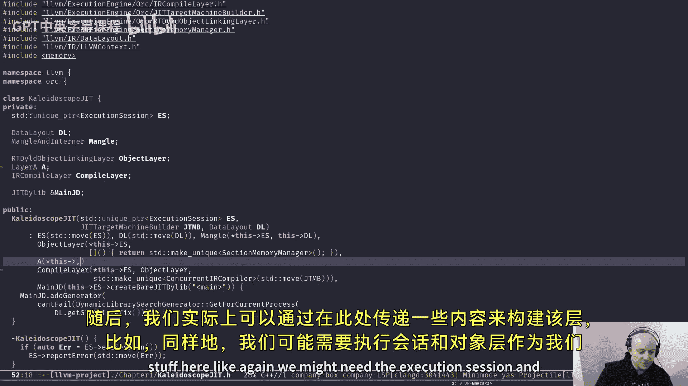
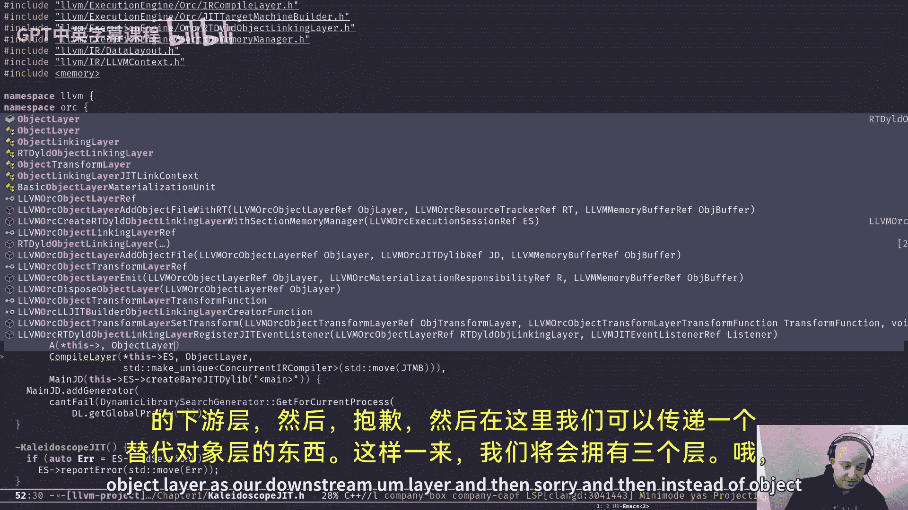
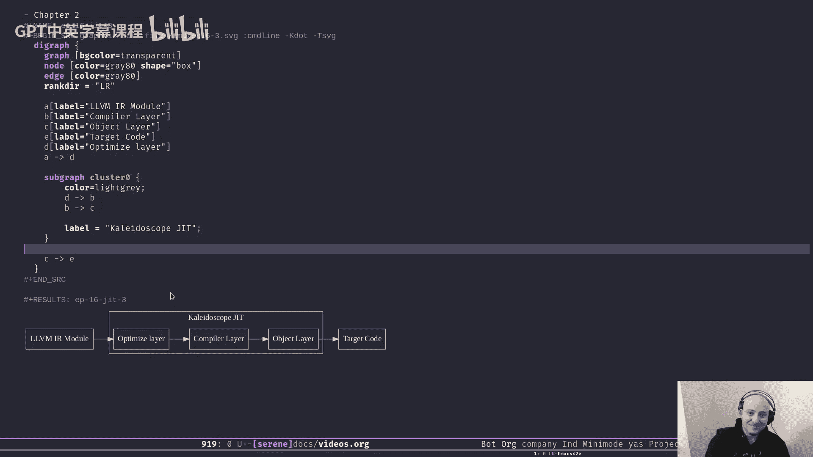

# 016：ORC分层架构详解 🏗️

在本节课中，我们将深入学习LLVM ORC JIT编译器的核心设计概念——分层架构。我们将探讨什么是分层、它们如何协同工作，并通过具体示例理解如何构建一个简单的JIT引擎。

在上一节中，我们介绍了LLVM提供的两种JIT引擎：LLJIT和Lazy JIT。为了更深入地理解和使用它们，我们需要剖析构成这些引擎的基本组件。本节我们将聚焦于分层架构，这是ORC设计的基石。

## 什么是分层？🧱

在ORC设计中，分层是构建JIT引擎的基本模块。我们可以将多个分层连接起来，形成一个数据处理管道，从而创建一个JIT引擎。

可以将分层视为一个数据管道。每个分层接收特定格式的输入（例如AST、LLVM IR或编译结果），并将其转换为另一种形式。

分层是可组合的，但组合顺序至关重要。每个分层都有其特定的要求和接口，下游分层的输入必须与上游分层的输出格式兼容。

在ORC设计中，每个分层都持有对下一个分层（下游分层）的引用。这形成了一个有向的层次结构。

分层架构可以用下图表示：

```
        JIT 引擎
           |
    +------+------+
    |             |
输入类型A      输入类型B
    |             |
  分层A         分层B
    |             |
    +------+------+
           |
        分层C
           |
        分层D
           |
        分层E (生成目标代码)
```

例如，一个JIT引擎可能支持两种输入类型：AST和对象文件。分层A负责处理AST输入，将其转换为分层C期望的格式。分层B负责处理对象文件输入，执行相同的转换。最终，分层C接收统一格式的输入，进行进一步处理，并依次传递给分层D和E。分层E最终将代码编译为目标代码，使其可供查找和调用。

分层本身是一个抽象概念。我们可以根据不同的目标定义具有不同功能的分层。

为了在实践中理解分层，我们将分析LLVM示例中的Kaleidoscope JIT。

## 示例一：基础Kaleidoscope JIT 🔧

在上一节我们讨论了LLJIT和Lazy JIT。但在Kaleidoscope示例中，我们创建了自己的引擎，其功能与LLJIT类似。理解这个简单的引擎有助于我们更好地理解JIT。

以下是创建 `KaleidoscopeJIT` 类的核心步骤：

1.  **创建执行会话**：`ExecutionSession` 代表一个正在运行的JIT会话。
2.  **设置数据布局和符号管理器**：`DataLayout` 定义目标平台的数据布局。`MangleAndInterner` 管理内存中符号的名称。
3.  **定义分层**：我们使用两个LLVM提供的分层：`IRCompileLayer` (编译层) 和 `ObjectLinkingLayer` (对象链接层)。

以下是关键代码结构：

```cpp
class KaleidoscopeJIT {
private:
  std::unique_ptr<ExecutionSession> ES;
  DataLayout DL;
  MangleAndInterner Mangle;
  std::unique_ptr<RTDyldObjectLinkingLayer> ObjectLayer;
  std::unique_ptr<IRCompileLayer> CompileLayer;
  JITDylib &MainJD;
  // ...
};
```



在构造函数中，我们按顺序创建并链接这些分层：



```cpp
// 1. 创建最底层的对象链接层
ObjectLayer = std::make_unique<RTDyldObjectLinkingLayer>(
    *ES, []() { return std::make_unique<SectionMemoryManager>(); });

// 2. 创建编译层，并指定其下游分层是对象链接层
CompileLayer = std::make_unique<IRCompileLayer>(
    *ES, *ObjectLayer, std::make_unique<ConcurrentIRCompiler>());

// 3. 获取主JIT动态库并添加生成器
MainJD = ES->createBareJITDylib("<main>");
MainJD.addGenerator(...);
```

**对象链接层** 是我们管道中的最后一层，负责链接目标代码。它需要一个内存管理器，这里使用了简单的 `SectionMemoryManager`。

**编译层** 是我们的第一层。它接收LLVM IR模块，将其编译为目标代码，然后将结果传递给其下游分层（即对象链接层）。编译层不需要知道下游分层的具体类型，只需知道有一个分层可以接收其输出。

`addModule` 成员函数展示了如何向引擎添加模块：

```cpp
Error addModule(ThreadSafeModule TSM, ResourceTrackerSP RT = nullptr) {
  if (!RT)
    RT = MainJD.getDefaultResourceTracker();
  return CompileLayer->add(RT, std::move(TSM));
}
```

它调用编译层的 `add` 函数，传入资源追踪器和一个线程安全的LLVM模块。资源追踪器用于跟踪分配的资源，以便后续释放。

`lookup` 函数用于查找已编译的符号：

```cpp
Expected<JITEvaluatedSymbol> lookup(StringRef Name) {
  return ES->lookup({&MainJD}, Mangle(Name.str()));
}
```

总结这个示例的架构：

```
输入: LLVM IR模块
      |
  IR编译层 (CompileLayer)
      | (编译为目标代码)
对象链接层 (ObjectLayer)
      | (链接)
  可用目标代码
```

编译层将LLVM IR编译为目标代码，然后传递给对象链接层进行链接，最终生成可执行的目标代码。

## 示例二：添加优化分层 ⚡

大多数代码与第一个示例相同，但我们添加了一个新的分层：`IRTransformLayer` (IR转换层)。这个分层也是LLVM提供的。

在构造函数中，我们调整了分层顺序：

```cpp
// 1. 对象链接层 (最后)
ObjectLayer = ...;
// 2. 编译层 (中间)
CompileLayer = ...;
// 3. 优化层 (最前)，其下游是编译层
OptimizeLayer = std::make_unique<IRTransformLayer>(
    *ES, *CompileLayer, optimizeModule);
```

现在，优化层是我们管道的起点。在 `addModule` 函数中，我们调用优化层而不是编译层：

```cpp
Error addModule(ThreadSafeModule TSM, ResourceTrackerSP RT = nullptr) {
  if (!RT)
    RT = MainJD.getDefaultResourceTracker();
  // 传递给优化层
  return OptimizeLayer->add(RT, std::move(TSM));
}
```

我们传递给优化层一个函数 `optimizeModule`，该函数负责对LLVM模块应用优化遍：

```cpp
Expected<ThreadSafeModule> optimizeModule(ThreadSafeModule TSM,
                                          const MaterializationResponsibility &R) {
  TSM.withModuleDo([](Module &M) {
    // 创建Pass管理器
    PassManager PM;
    // 添加一些优化Pass
    PM.addPass(Pass1);
    PM.addPass(Pass2);
    // 运行Pass管理器
    PM.run(M);
  });
  return std::move(TSM); // 返回优化后的模块
}
```

`withModuleDo` 方法允许我们以线程安全的方式访问内部的LLVM `Module` 对象。我们在其中创建Pass管理器，添加优化Pass，并运行它们。

在Kaleidoscope的使用场景中，处理顶层表达式时：

1.  将表达式编译为LLVM IR模块。
2.  调用 `addModule` 将该模块添加到JIT引擎。此时，模块会依次经过优化层、编译层和对象链接层的处理。
3.  使用 `lookup` 查找编译后的函数符号。
4.  将符号地址转换为函数指针并调用。
5.  **关键步骤**：调用 `ResourceTracker->remove()`。这指示JIT引擎移除与该资源追踪器关联的模块定义。因为Kaleidoscope中所有顶层匿名表达式都使用相同的函数名，如果不移除旧的定义，就无法重新定义同名符号。

总结第二个示例的三层架构：

```
输入: LLVM IR模块
      |
  IR优化层 (OptimizeLayer) - 应用优化Pass
      | (优化后的LLVM IR模块)
  IR编译层 (CompileLayer) - 编译为目标代码
      | (目标代码)
对象链接层 (ObjectLayer) - 链接
      |
  可用目标代码
```

## 总结 📝

本节课我们一起深入探讨了LLVM ORC JIT的分层架构。

*   **分层是ORC JIT的构建块**：它们像管道一样连接，每个分层负责一项特定的转换任务。
*   **分层是可组合和可扩展的**：我们可以通过添加、移除或重新排列分层来定制JIT引擎的功能。例如，我们可以轻松地添加支持AST的输入层，或插入分析、插桩等中间层。
*   **设计优雅且强大**：分层设计使得JIT引擎的架构清晰、易于理解和扩展。它分离了关注点，例如将优化、编译和链接逻辑放在不同的分层中。



在未来的课程中，我们将学习如何定义自己的自定义分层，以进一步扩展JIT引擎的能力，满足特定的编译需求。