# 019：JIT引擎（第二部分）🚀

在本节课中，我们将继续探讨JIT引擎，特别是它在Serene语言编译器中的角色和实现。我们将了解Serene作为动态语言与静态语言编译器的区别，并深入分析JIT引擎如何在编译时和运行时工作，以及如何包装函数以便统一调用。

---

## 概述

在上一节中，我们介绍了Serene的JIT引擎基础实现。本节我们将着眼于更宏观的图景，探讨JIT引擎在Serene编译器架构中的位置，并解释为何需要包装函数。我们还将查看MLIR JIT引擎中的相关代码，以理解其工作原理。

---

## Serene与其他编程语言的区别

首先，Serene是一种Lisp方言。作为Lisp，它本质上是动态的。

这与C++、Rust或Go等语言的编译器不同。例如，当你使用Clang这样的C编译器时，它会读取项目中的所有源代码，传递给解析器，编译为某种中间表示，最终生成目标代码并输出到二进制文件。这个过程在之前的课程中讨论过。

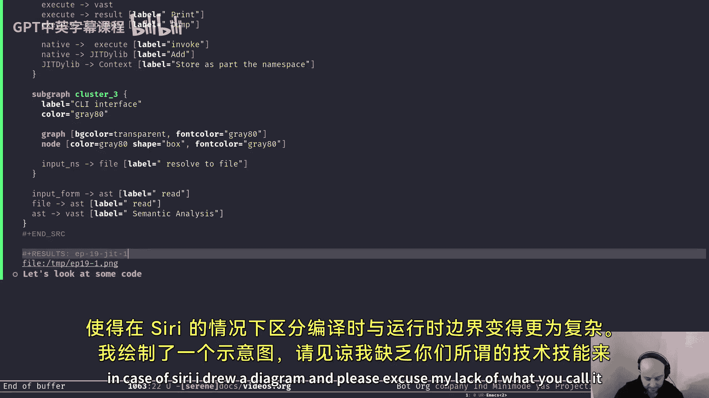

C编译器在编译时从不运行你的代码。你的代码只在运行时执行。因此，编译时（编译器活跃并编译代码的时期）和运行时（编译后的代码运行的时期）之间有清晰的界限。

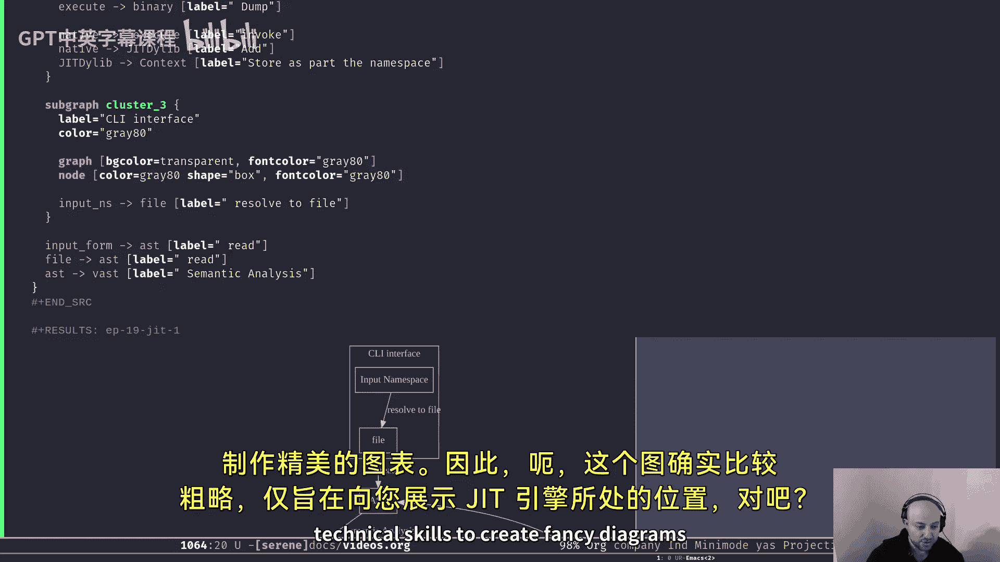

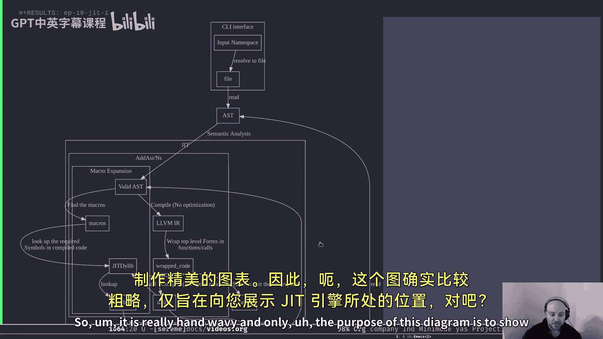

但Serene不同，因为它是一种Lisp。我们需要在编译时也运行代码。这意味着我们必须处理编译时的执行，因此我们的编译时在某种程度上可以与运行时相同。

在核心上，Serene就是JIT引擎。我们将改进JIT引擎，为其添加功能，并在编译时运行它，以实现与静态编译器相同的效果。然后，我们也可以在运行时运行同一个JIT引擎，从而模糊编译时和运行时的界限。

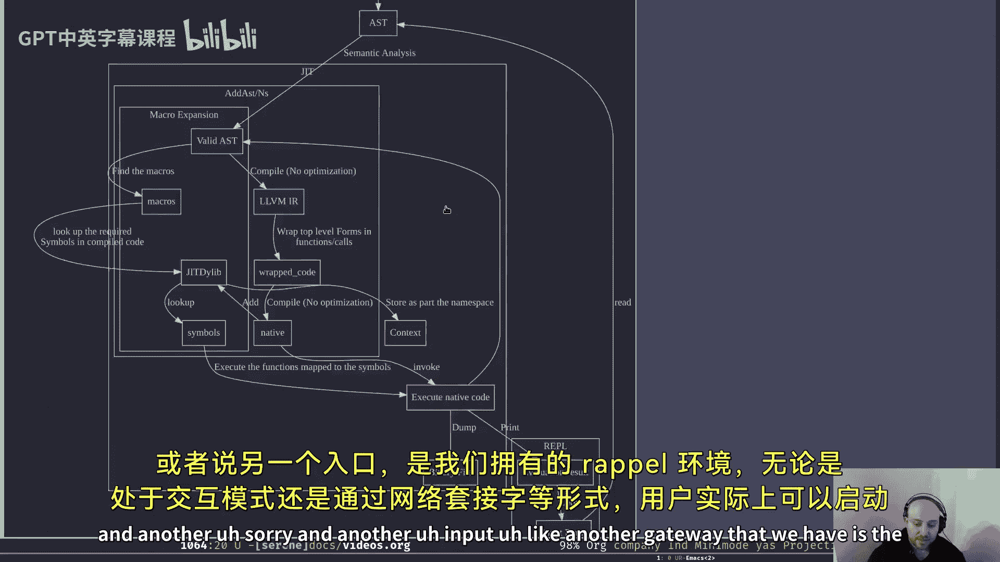

---

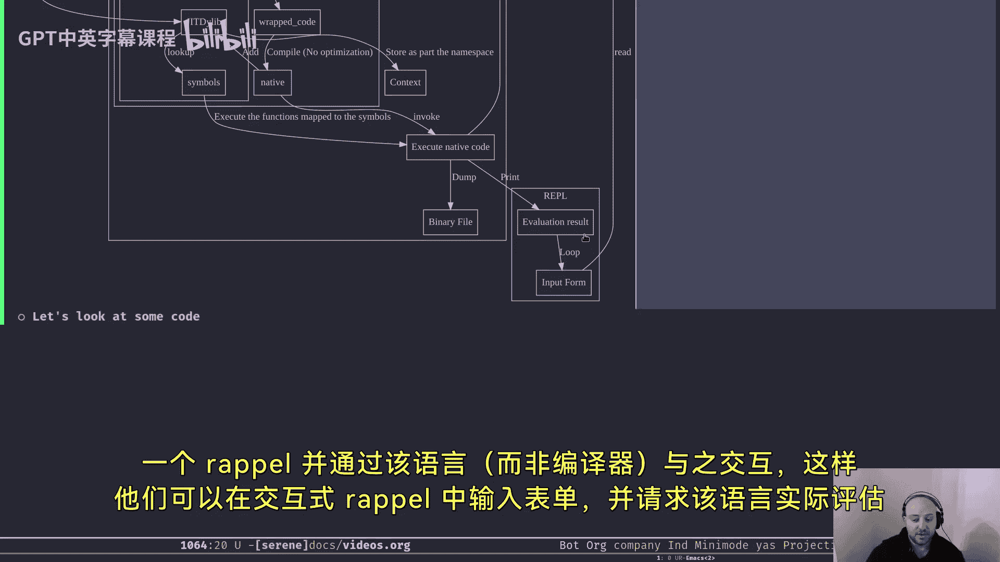

## Serene编译器架构图景

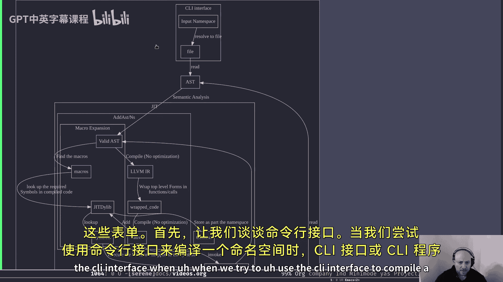

为了展示JIT引擎的位置，我绘制了一个简化的架构图。

Serene编译器有两个主要的入口点：一个是CLI接口（如`serene c`），另一个是REPL环境。

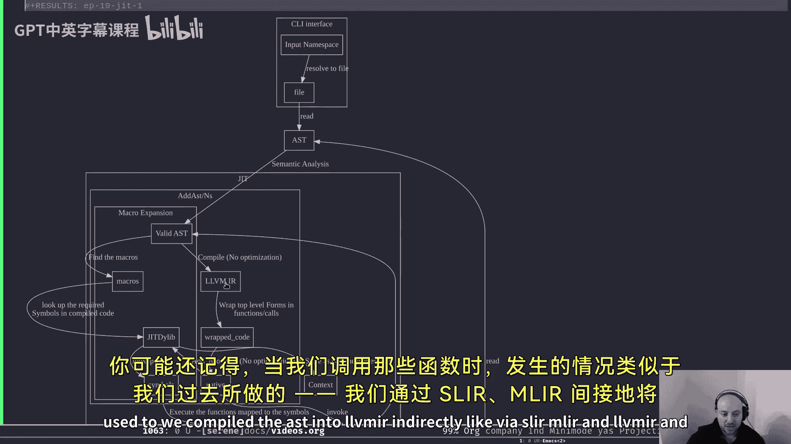

### CLI接口流程

当使用CLI接口编译一个命名空间时，CLI程序会将命名空间名称解析为文件，读取文件内容，并通过`read`函数传递给解析器以获取AST。然后，它将AST传递给语义分析阶段，生成经过验证的AST。

此时，验证后的AST包含了语义上正确的AST，代表了输入程序（命名空间）。在REPL的情况下，输入是用户提交的表单。

正如我们在JIT引擎第一部分所见，我们的JIT引擎有两个函数：`addAST`和`addNS`。我们可以调用这两个函数中的任何一个，将验证后的AST添加到JIT引擎中。

当你调用这些函数时，我们会将AST间接编译为LLVM IR（通过SLIR或MLIR和LLVM IR）。在上一集的结尾，我们完成了将一切编译为LLVM IR，并将其编译为原生代码添加到JIT引擎中，但跳过了中间部分。让我们回到验证后的AST步骤。

最终，当我们将宏的概念引入Serene时，在这一步中，我们将在AST中查找宏。宏是在编译时运行的函数，它返回有效的Lisp表单，我们用返回值替换宏调用。由于这发生在编译时，这是扩展编译器的一种简洁方式。

我们将在未来讨论宏的细节，但现在只需知道它是一个在编译时运行并返回有效Lisp表单列表的函数。

我们尝试在验证后的AST中查找任何宏调用。如果存在宏调用，我们将查找编译所需的符号。这些符号应该已经被编译过，并可以在我们的JIT库中找到。

如果你还记得上一集，每个命名空间可能附加了几个JIT库。因此，我们必须查找所有JIT库，找到所需的符号。如果找不到，我们需要向用户抛出错误。如果找到了，我们将执行分配给该符号的函数。由于它是一个宏，我们将得到一个Lisp表单返回。然后，我们将再次解析它，得到一个新的验证后AST。这个循环将持续进行，直到AST中没有宏为止。这个过程称为宏展开。

处理完所有宏后，我们将经历与上一集相同的过程：将所有内容编译为LLVM IR，将任何顶层函数包装到一个新函数中，并最终将所有内容编译为目标代码（原生代码）。

在这种情况下，由于我们在编译时运行JIT引擎，我们将执行一个名为`compile`或`dump`的函数，它将代码转储为二进制格式。这个二进制文件可以是可执行文件、共享库等。

在REPL的情况下，我们将执行代码。由于我们已经将其包装在一个函数调用中，执行代码意味着调用该函数，并将结果打印给用户。最后，由于是REPL，我们将循环读取更多输入表单，并将其传递给解析器和语义分析。

这就是我设想的方式。最终，我们将拥有一个功能强大的JIT引擎，在编译时运行以编译代码并为我们生成二进制文件，就像任何其他编译器一样。这为我们打开了诸多可能性。例如，我们可以在运行时运行同一个JIT引擎，从而不再有编译时，使得运行时和编译时相同。这将使我们的JIT引擎表现得像一个解释器。我们可以传递一些Serene代码，它将即时运行代码。

这非常令人兴奋，它使得Serene非常灵活。另一种可能性是为不同目的并行运行多个JIT引擎。

这个单一特性使得Serene非常令人兴奋和灵活，但同时也使得编译器本身比静态语言更复杂，因为我们必须处理更多细节，尤其是在尝试编译这些内容时。

这就是为什么在过去两个月里，我试图理解一些关于在MLIR中实现JIT引擎的想法，但实现起来有些困难。不过，我最终会达到目标。

---

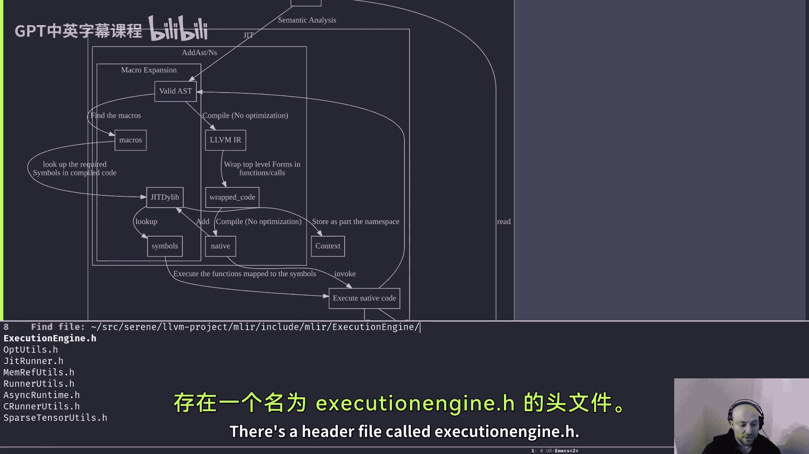

## 查看MLIR JIT引擎代码

现在，让我们来看一些在上一集中跳过的代码。请注意，我将展示MLIR JIT引擎中的相同代码，而不是Serene的版本，因为为了保持基础编译器的连接，我禁用了Serene版本中的某些部分。但如果你之后查看代码仓库，你会发现它们非常相似。

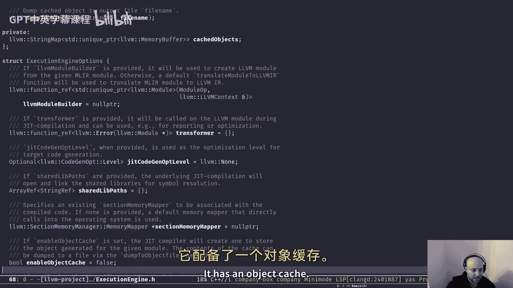

我们需要转到LLVM项目目录下的`MLIR/include/MLIR/ExecutionEngine`。这里有一个头文件`ExecutionEngine.h`。

这是MLIR的JIT引擎。它读取MLIR并执行MLIR代码。它非常类似于我们拥有的JIT引擎，也包装了LLVM，并有一个对象缓存。我选择展示这个是因为我实际上在我们的JIT引擎中使用了一些这段代码，我修改它以适用于命名空间，并添加了`addAST`和`addNS`函数，但加入了一些Serene特定的内容。我们的JIT引擎就是围绕这个版本构建的。

这里有两个查找函数：一个是正常查找符号，另一个是查找相同符号的打包版本。我还会展示其定义。有一个`invokePacked`函数，但正如你所见，这里有一个术语“packed”，这些函数中常见。

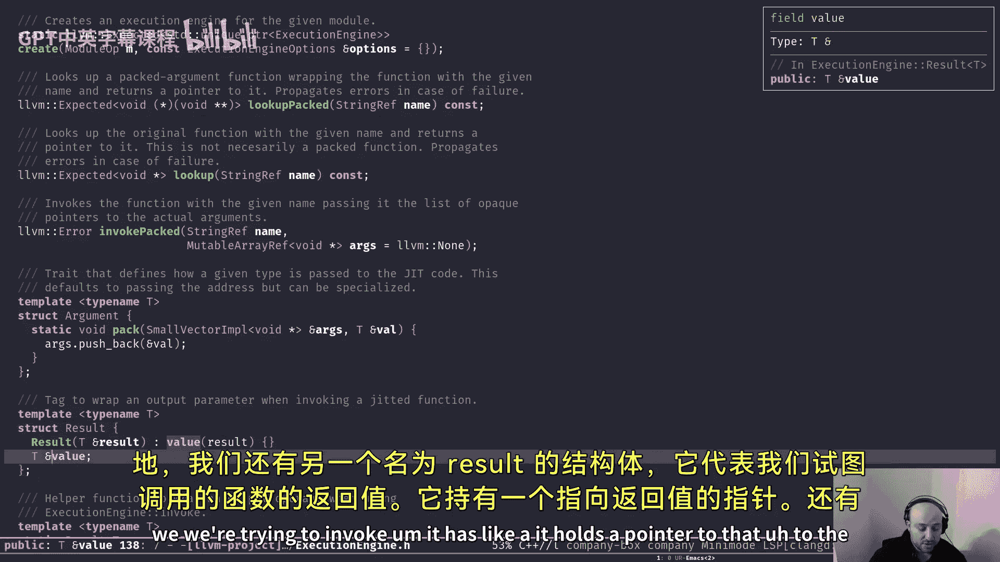

首先，我们需要看一些数据结构。第一个是名为`Argument`的数据结构，它代表我们传递给函数的所有参数。

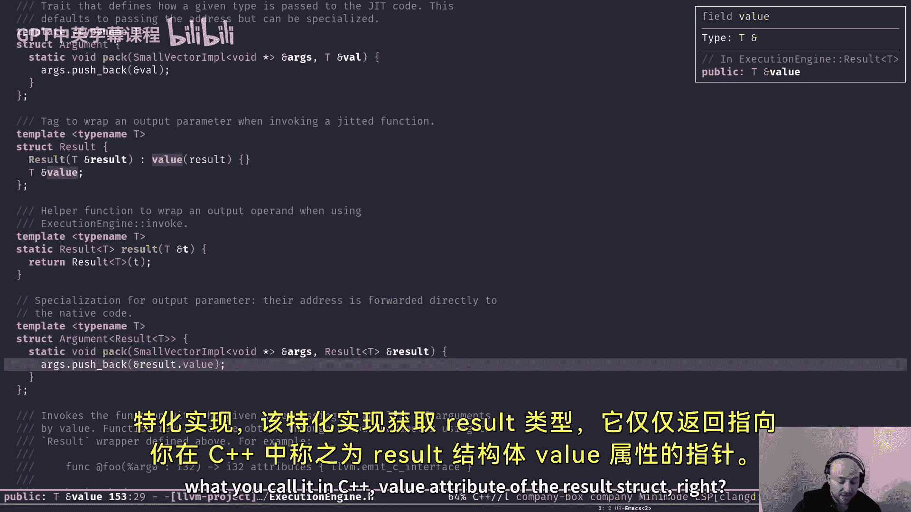

它有一个名为`pack`的成员函数，接收一个包含不透明指针和类型`T`的值的参数向量。它所做的只是将该类型的指针添加到参数向量中。由于向量只包含不透明指针，这应该没问题。

类似地，我们有另一个名为`Result`的结构，代表我们尝试调用的函数的返回值。

它持有一个指向返回值的指针。

`retainResultType`函数用于在调用函数前获取结果类型，它只是返回指向结果值属性的指针。

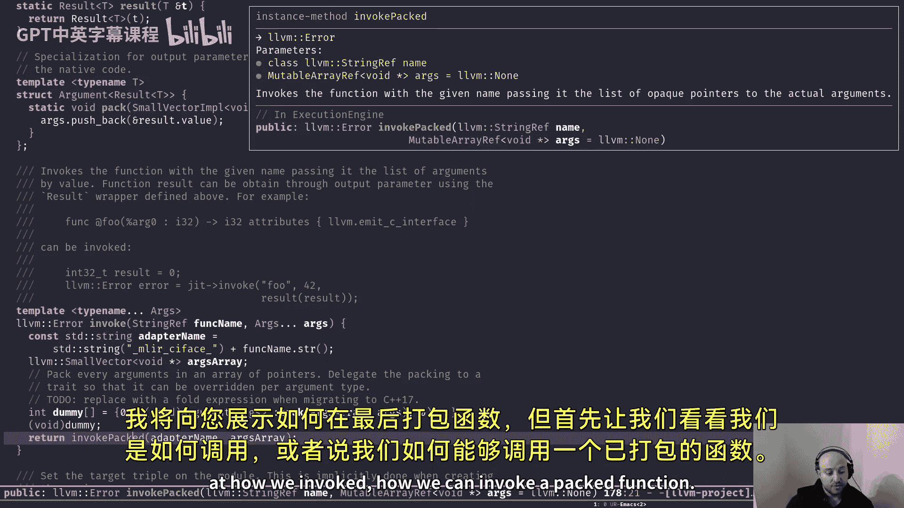

最后，最重要的函数是`invoke`。正如我在图表中展示的，每当我们将某些内容添加到JIT引擎时，我们可以使用`invoke`函数来实际调用编译后的代码并执行函数。

它接收一个函数名和一个参数集合。我们创建一个`SmallVector`（LLVM中的一种类型，比`std::vector`更高效），其中包含不透明指针。我们调用参数提取器上的`pack`成员函数，将所有参数打包成一个不透明指针向量。然后，我们调用`invokePacked`函数，传递适配器名称（基本上是修改后的函数名）和新的不透明指针向量。

到目前为止很简单，没什么特别的。顺便说一下，既然我们在讨论调用过程，我们假设已经打包了函数。我将在最后展示如何打包函数。首先，让我们看看如何调用一个打包函数。

如果我们查看`invokePacked`版本，基本上，我们获取名称作为第一个参数，以及指向参数的不透明指针向量作为第二个参数。

然后，我们使用`lookupPacked`来查找函数名。由于我们打包函数的方式是将其包装在另一个函数中，我们给那个包装函数一个新名称（我稍后会展示）。`lookupPacked`就是进行查找，但它会查找那个包装函数，而不是被包装的函数。

如果函数指针不存在（即没有这样的符号），则返回错误。否则，调用该函数指针并返回参数数据。最后，返回成功。如果写入错误，那也没关系，因为如果我们正常调用函数，它也会抛出一些异常。它以不同的方式返回返回类型，我稍后会展示其工作原理。

但基本上，这就是我们在JIT引擎中调用函数的方式。棘手的部分是如何包装函数，但调用它并不难。

---

## 调用函数示例

让我们举一个例子来说明`invoke`函数如何工作。假设我们有一个函数`f`，它接收一个类型为`i32`的参数，并返回一个`i32`结果。

我们使用`invoke`函数的方式是：首先，我们需要一个变量来存储结果值。由于我们知道它返回`i32`，我们定义一个类型为`i32`的变量，初始化为0。然后，我们使用`invoke`函数调用`f`函数，传递名称作为字符串，以及唯一的参数（例如42）。最后，我们使用之前定义的`result`函数来标记我们想要存储函数调用结果的位置。

我们在这里定义了一个`result`变量，这就是我们想要存储返回值的地方。这就是我们标记的方式。基本上，当我们打包函数时，我们将创建一个指向所有参数的指针数组，最后一个元素将是指向返回类型的指针（如果不是`void`）。因此，最后一个参数将是指向我们想要存储返回值的变量的指针。

这就是我们使用`invoke`的方式。现在让我们看看如何实际打包内容。

---

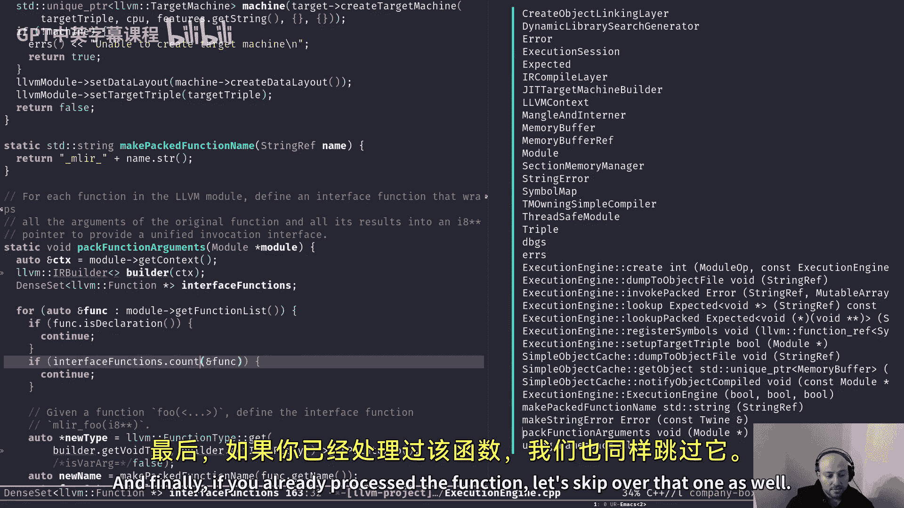

## 如何打包函数

以下是实际打包内容的函数`packFunctionArguments`，我们向它传递一个LLVM模块。

首先，如果你觉得这看起来有点令人畏惧，不用担心。如果你不理解这个函数中的某些概念，完全没关系。这都关于LLVM IR及其工作原理。在未来的几集中，我们将讨论MLIR和LLVM，你最终会理解它们。但现在，主要目的是让你了解我们如何包装函数。细节我们将在未来讨论，或者你可以自行学习。

我们获取LLVM上下文，创建构建器对象（基本上是一个为我们创建LLVM IR的对象）。然后，我们创建一个密集集合（类似于集合的LLVM类型），用于保存指向函数类型（LLVM函数类型）的指针，并将其命名为`interfaceFunctions`。

每当我们处理一个函数时，我们将其插入到这个集合中，以跟踪我们已经处理了哪些函数。然后，我们将遍历模块中所有我们想要打包的函数。对于每个函数，如果它只是一个声明（即签名，定义在其他地方），我们就不关心它，因为它们是外部的，可能已经被打包了。

如果我们已经处理过该函数，就直接跳过。

接下来是魔法发生的地方。我们创建一个新的函数类型，称之为`newType`。它是一个返回`void`的函数类型，唯一的参数是一个指向`i8`指针的指针（即指向字节指针的指针）。基本上，这里是一个指向`i8`指针数组的指针。

如果函数名是`f`，我们将把它包装起来，并将包装函数命名为`MLIR_$f`，以避免任何冲突。因此，我们有一个新的函数类型，我们打包名称的方式非常简单：只是在名称前添加`MLIR_`字符串作为前缀。

然后，我们将该函数添加到模块中（尚未添加函数体）。我们创建函数本身（函数体），首先将其插入到我们已有的集合中以进行跟踪。

接下来是函数体部分。我们创建基本块（入口块），将其添加到刚刚创建的函数中。然后，我们让构建器开始将指令插入到基本块中。

我们创建一个类型为值指针的`SmallVector`，将其命名为`args`。这里的8表示预分配8个槽位。然后，我们遍历所有函数参数，为每个参数创建一个指针，并使用该指针。正如我之前描述的，我们将创建一个参数指针数组，最后一个是指向返回类型的指针。这就是我们实际创建返回类型的方式。

我们创建对函数的调用。这是实际调用函数的地方。现在，我们创建了函数表（函数签名），创建了基本块，处理了所有参数，最后创建了对原始函数的调用。这就是我们包装函数的方式。

我们获取结果。如果结果类型不是`void`（即函数实际返回值），我们为返回类型创建一个新指针作为该函数的最后一个参数。我们查看最后一个参数，如果它是一个指针，我们只需将值存储在该指针中。

你可能不知道什么是`store`、`load`等。再次强调，我将在不久的将来展示。但为了理解这些，我们需要了解一些编译器基础知识，如控制流图（CFG）和数据流图等。最好先学习这些，然后再讨论LLVM IR，这样会更容易理解。

但现在，你已经了解了为什么要包装函数以及如何包装的大局观。最后，由于我们的包装函数不返回任何内容，我们创建一个返回指令。

这就是我们实际包装函数的方式。但为什么我们要这样做呢？

第一个原因是，我们需要包装Serene中的所有顶层表单。因为在Lisp中，你可以直接在文件中编写类似这样的列表，没有什么阻止你这样做。这类似于Python这样的动态语言，你可以直接开始编写文件并传递给解释器。我们应该能够编译所有这些，因此我们将包装任何顶层表达式（它有返回类型）。我们将其包装在一个函数中，调用它，并获取其返回类型。这是一个原因。

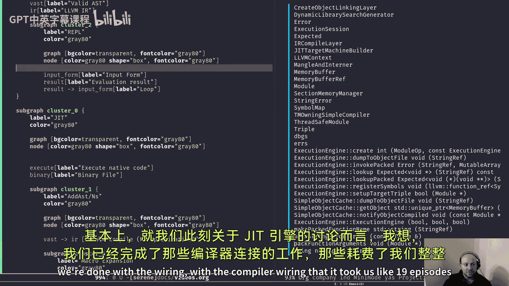

另一个原因是，当我们想要使用`invoke`函数时，为所有函数提供统一的签名会更容易，这样我们可以以相同的方式调用所有内容，而不必猜测返回类型。这将由JIT引擎处理，而不是由我们处理。

---

## 总结

本节课中，我们一起学习了JIT引擎在Serene编译器中的完整图景。我们探讨了Serene作为动态语言与静态编译器的区别，分析了JIT引擎在编译时和运行时的工作流程，并深入了解了如何通过包装函数来实现统一的函数调用接口。我们还查看了MLIR JIT引擎中的相关代码，理解了函数打包和调用的基本原理。

通过本课程，你现在应该对JIT引擎在编译器架构中的关键作用有了更清晰的认识，并为后续学习更高级的编译器概念（如控制流图、数据流分析和优化）奠定了基础。在接下来的课程中，我们将转向其他重要主题，如使用TableGen生成错误信息，并逐步构建更强大的Serene编译器。

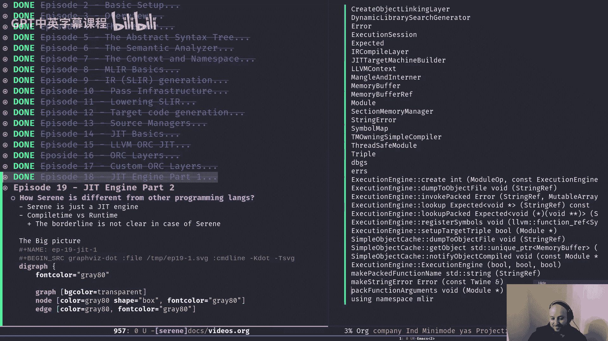

感谢你的学习，我们下节课再见！