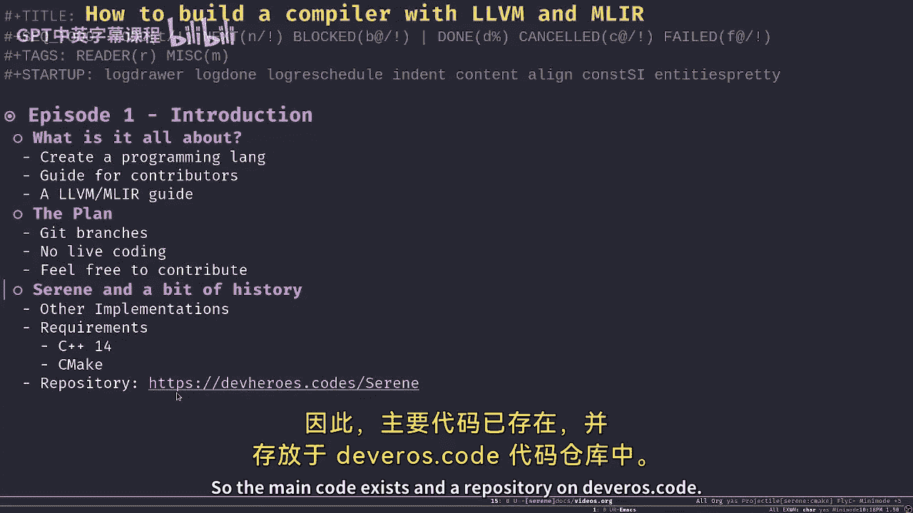
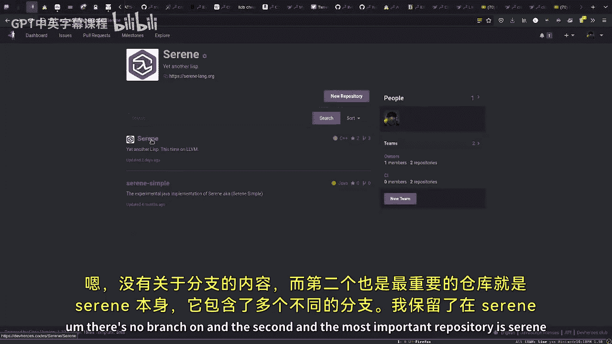
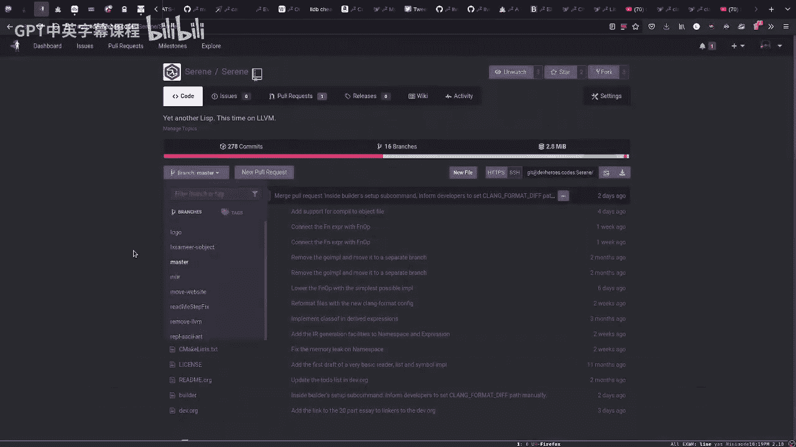
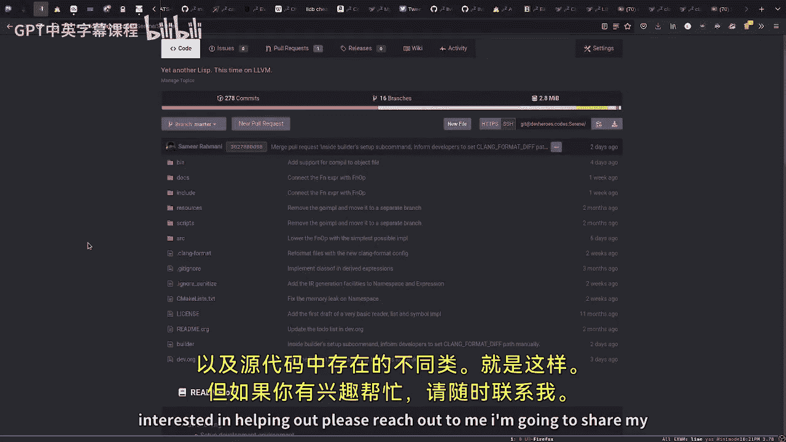
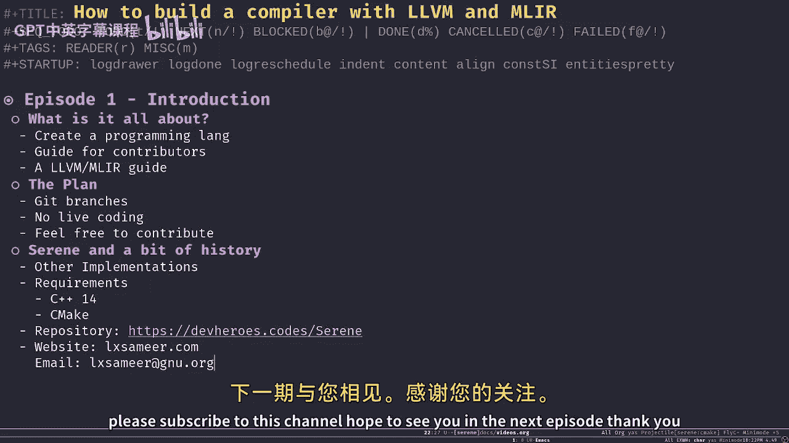

# 【基于LLVM和MLIR构建编译器】 p01 -Tutorial- How to build a compiler with LLVM and MLIR - 01 Introduction -BV1vi421Y7P1_p1-

Hello and welcome to my video series on how to build a compiler with LVM and MLLIR。

This is Samir your host and I am a programmer， I'm a software engineer whos obsessed with programming languages and I've been working on。

Creating a new programming language for my own for over two years now， I guess。嗯。

I thought to myself that it might be a good idea to start a video screencast series on the topic because it's really interesting and you can find really enough information about this kind of stuff on the Internet。

 especially aroundLVM and MLIR， there's great documentation around them， but as stillL。

You need to read a lot of source code， you need to do your own research， and it's not an easy job。

To do so here I am recording my very first episode on the topic and。

Today on this video on this episode， I'm going to just talk about。

Our plan for the rest of the series。And a little bit of history about the programming language I'm working on。

For the past two years。So， let's。Begin with。What。Basically， what we're going to do。

What is this video series all about。Hopefully in the rest of the series we're going to create a new program language。

 which I already made most of it， so I'm going to showcase it for you and we're going to talk about like different sections and different parts of。

This new program language。One of my actual goals besides creating a programming language is to。

like for this video series to be a guide for any contributor who might be interested in contributing to this program language。

 which the name is Serene。S in Lang。Another goal is to for this video series to be as like a tutorial or a guide for whoever is interested in LLVM and MLLIR。

 which is like a subsection of LLVM， there's some really good documentation on LLVM website。

About LLVM and MLR， there's like even a tutorialial for both to create like a really simple language。

 but。That being said， that doesn't mean that by reading that tutorial you would get and you would understand everything you simply need to。

study hard， you need to read a lot of source code because like even we take send of documentation。

 which is available on LLvM。org。It's it's really huge and you have to dig in。

 like ask questions in different communities， read a lot of source code。

 and there's no clear path on how to like。Utilize LvM like to the fullest。

Hopefully I'm aiming to create this video series to be like him。

Guide through like for everyone through LLVM and MLIR。But sorry。So。

If we want to like for the rest of the video series。The plan is to。

 I'm not going to life code anything， so I'm going to go on my own， write some stuff。

 like try to figure out things and come up with a solution to some of the problems problems I'm facing and then when I reach to a certain milestone。

 I'm going to record a video，Describing what I did and hopefully it would be a guide to that section。

 for example， the next my plan for the next episode is to talk about the build system and start by probably the reader part of the language but we'll get to that later。

So。Today is the 2nd of July in 2021， so what I'm going to do for each episode is to create a branch in that moment in time for that specific episode。

The master branch like will do its same， its own thing。For anyone who watched this。

I watching this video in the future， you have to refer to the branch for each episode to find out like the stuff that I'm going to talk about so and my plan is to keep the branches around for a long time to match the videos and each episode。

Also。I can't really refer to myself as an expert， I no expert。

 I'm just someone who's obsessed with these topics and I'm really into like language design and stuff like that so I do my own research I do my own study but if you find something that。

You like picked your， if it picked your interest， please feel free feel free to contribute to the。23。

 I would be more than happy to review your contribution。U to continue， oh， not again， sorry。

Let me give you a brief history about the language itself， which we're going to have a look。

In the next episode。So for the past two years， I've been working on creating a new language。

 which ist a least basically。I started really simple。

I did many implementation in different languages， I started with Java and。

I created like a really simple list interpreter， which。

Really was easy to implement and it worked just as I expected。

 just to gain more experience about like what do I need to do how the reader would look like or what would be the challenges in designing a language I started really simple by creating an interpreter rather than the compiler。

 but little by little when I implemented like newest stuff in like different implementations I had。

 I realized that，having an interpreter might be cool， might be good or even handy。

 but it's not going to be very different than other dialect of Li or other discreteling languages like Python or other stuff and to be frank。

Whatever I create as an interpreter is not going to be able to compete with something like Ruby or Python because they have more than 25 years of experience beside them behind them to support them。

So little by little， I decided to do more research on different topics like the type system。

 the different sorry。About the type system on。Different aspects of a language。嗯。I like。I used。

My research， the result and the fruit of my research to implement me like different implementation using different languages to find out to find like。

What platform can be a good platform for the language I'm working on so obviously the first one was the JVM it worked fine but not really great I moved to using GVM with troffel library I worked on it a little bit which its it seems really promising I have a blog post about it in my。

We blog about the whole research I've done for picking like a choosing a good platform。And like。

I even implemented another interpreter for butrapping a compiler in Golan。

When I got introduced to LLVM and especially MLIR， it changed everything。LLVM is so elegant。

Like well designed that it's simply over like。え。Took my breath like I had no other like when I saw MLIR。

 especially， I was like， okay， I don't need anything else， this is the one。It's the best。

 let's do it。Probably。Future episodes， I'm going to talk about LLVM and MLI are more in depth and why I made this decision。

 why LLVM is like。The best， but for now。To be really like brief。

 LLVM is good because it's modular and it's designed as a library as a framework to help you create your own compiler。

It's the main language for LLVM is C++， so obviously we need to。You need to know C++ to some extent。

 I'm not a+ C++ expert myself， but we're going to use it anyway because the API of LLium is in C++ and we need to know a little bit of how to use CMake the build system。

 which is that ITZ， you don't have to be you don't have to be worryable。

So the main code exists and repository on des that code。

If I want to show you， we have like two main repositories。

 the starting simple is the Java implementation， which I did like long ago。

I I made some tweaks here and there， but the。The majority of the code is done like long ago。嗯。

There's no branch。And the second and most important repository is there in itself。

Which contains many different branches， I kept the other implementation I've done on Sa on different branches just。

I don't know as like a historic thing， I like to have them around like the goal line implementation。

 the first try on C++ implementation， there should be a rust somewhere around here yeah the rust implementation overall up until now I've created。

Enough of of。Infrastructure for the language， which contains a reader， a semantic analyzer and。

Several layers of intermediate representation languages。

 which we're going to talk about in depth in future episodes。Right now， my aim like。

It's not it doesn't have any specific feature at the moment， the type system is missing。

 like it only understands the only thing that it can compiles is functions and integers。

 but my aim is to wire up every single piece of functionality in the compiler to like together be able to like compile a certain file from reading the file to generating the actual binary from a start to end and also create a adjust in time compiler so overall。

I want the MVP of a compiler， you know， like the most valuable product， no， sorry。

I want something really minimal， it just works， but it's going to give me enough insight into different pieces so I won't over engineer any piece or spend too much time on a section which I might have to change in the future which honestly happened to me many times。

So right now，2nd of July， I'm in that state， but it's good enough that we can of start talking about the reader。

 the semantic analyze there different classes we have in the source code also。That's it。

 but if you're interested in helping out， please reach out to me I'm going to share my。

嗯。Info with you as well。So my website is。Hcentric。com。And like my email address is。Again，Yeah。

You know， good know doorg。Fina。嗯。なが。So please reach out to me also if you're interested in this topic and especially if you want to keep updated with new episodes。

 please subscribe to this channel。嗯。Hope to see you in the next episode， thank you。

