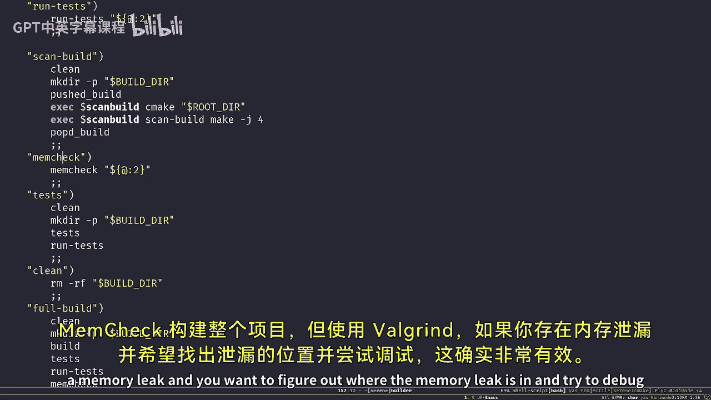
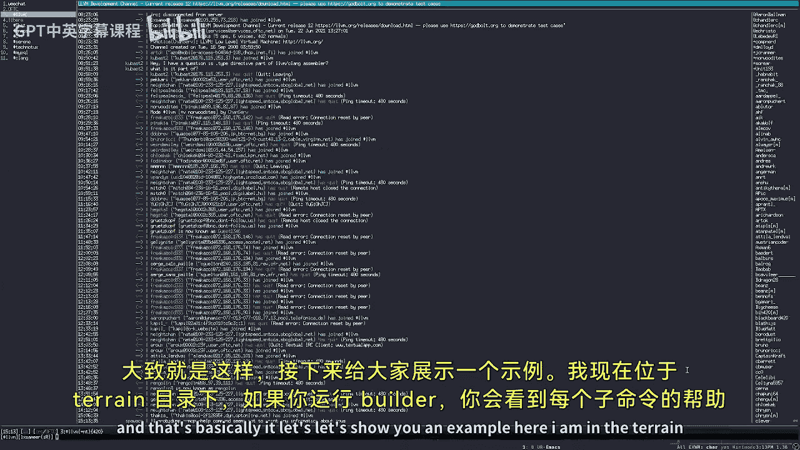
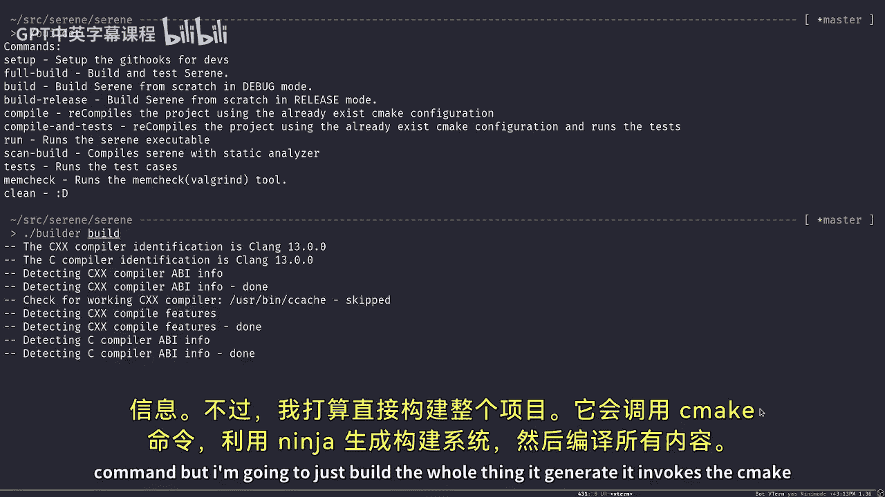
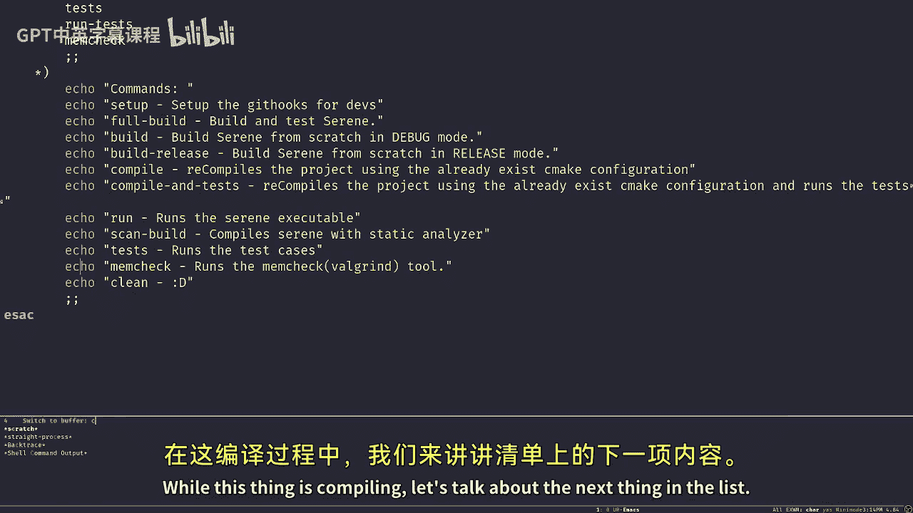
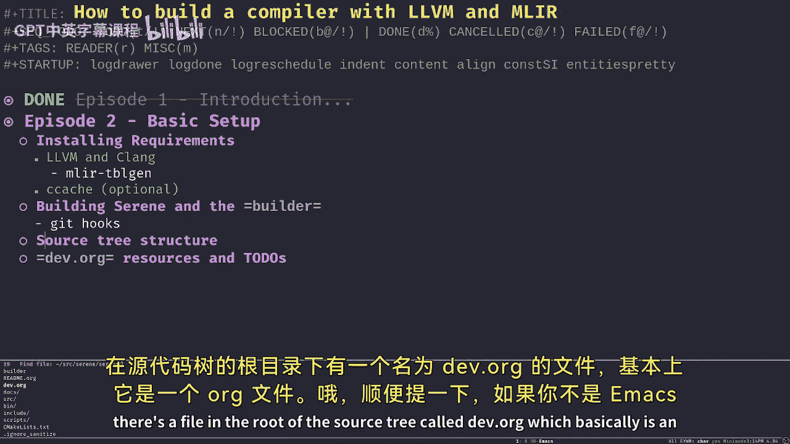
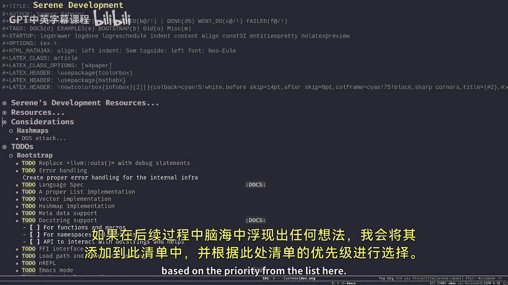
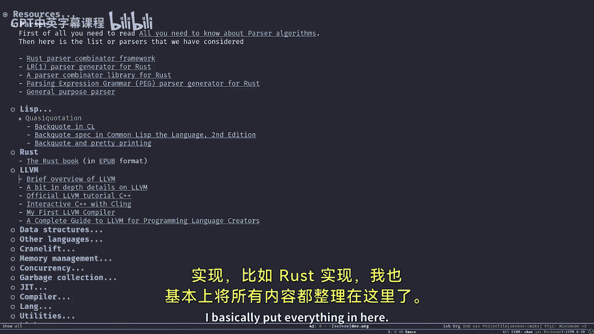
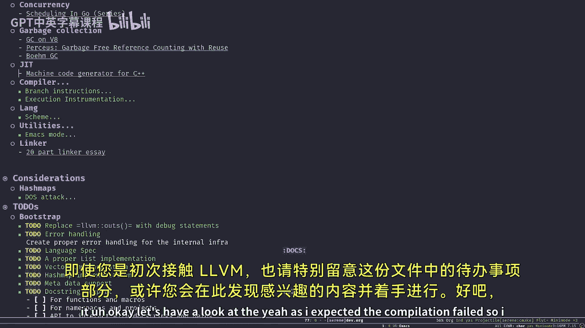
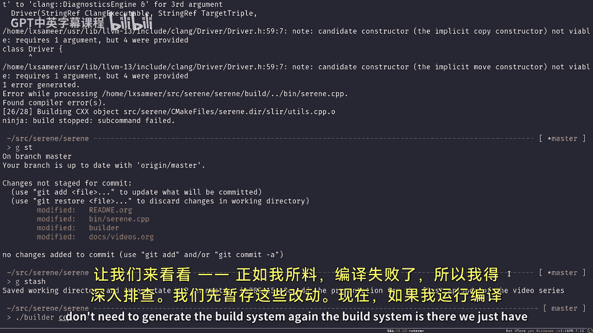
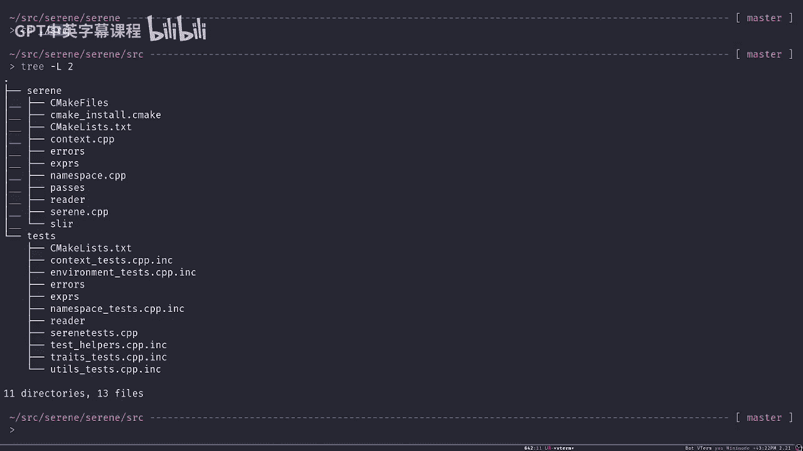

# 【基于LLVM和MLIR构建编译器】 p02 -Tutorial- How to build a compiler with LLVM and MLIR - 02 Basic Setup -BV1vi421Y7P1_p2-

Hello and welcome to another episode of How to Be the compiler with LLBM and MLIR。

This is Sam to your host and in today's episode we're going to talk about the basic steps we need to do before we can jump into steer the development and building the entire project。

Let's start by installing some of the requirements。

 I'm not going to actually show you how to install them I'm going to tell you what to do and like the heads give you some heads ups before actually doing them。

But that being said， still， we need to talk about few of the requirements which are really important。

The most important one is the LLVM project。I'm using Linux and I assume that you're using a Pos system。

 either Linux or MacOS， I don't know much about Windows operating system。

 so I'm going to stick to what I know。on Linux systems。

 most of the distributions provide LVM via different packages from their package repository。

 like informal prebuil packages。But I guess。Like， in order to。

Get a better result We need to compile LLVM from the source code because this way we're going to learn more about the LLVM itself and different bits and pieces and also the requirements the specific requirements of serene at this stage for example。

 like we're going to use MLR later on and we're using utility which called tableG from LLVM and MLR has its own variant of tablegen called MLIR tablegen and previously some of the folks that are working on the serene compiler actually had an issue with the MLIR table gen which wasn't available from their package repository and vice versa so we're going to talk about it today。

Also， it would be nice to have CCash installed， which is going to speed up your compilation process。

I would buy a lot。So let's jump into it， we have a readme file in the ser route directory。あ。

Which contains some of the instructions we need to use to install LLVM。 first of all。

 we have a build script， which I'm going to go through it today， but for now。

Pill there there has a subcom called Se， which is going。

Is going to install some of the git hooks that you need to use with the Ser project like clang format and stuff like that。

 just make sure that you run this subcom first before doing anything else。

We have other dependencies beside the LLVM like Cma。

 ninja oxygen if we need to create the documents while grind， wild grind。

 I really don't know how to pronounce it。But。It's a like useful。

 really useful tool to figure out the problem with memory leaks and stuff like that and obviously seecash。

You can install all of them from the package repository， your package repository bo。

I highly recommend to install LVM from source， and that's what I'm going to show you today actually。

This thing has to go away， okay。My myself I compile LLVM from source from the Giuository。

 like the latest development because sometimes sometimes I need to contribute something to LLVM I don't know since LLVM sports。

C+ plus 14 and I'm on C+ plus 17， the setting project is in C++ 17 times the times I need to patch some of this stuff that's why I'm using there。

Latest development version， but can you're totally safe to use Lviium version 2L。

 which is the current stable version。All you need to do is to either clone or download the source code。

And see like create a build directory for wherever you want， basically， like any other CMic project。

 and invoke the Cic command to create to generate the build system based on Nja for you。There's a。

An intensive documentation on the build system on lvm。org。

 which you can read and learn about every single option here。

 but I'm going to talk just about the most important ones。

We need to build at least for X86 architecture， so if you build your LLVN like this。

 it's going to support compiling your code to X86 architecture。Also， make sure。

Make sure to install LLVM on release mode if you go for debug mode it's going to take forever to compile and on top of that building any any LLVM related code like C is going to take a long long time but sometimes you need to do that because like about a month ago actually I had a nasty memory leak I couldn't figure out where it was so I had to compile everything in debug mode to be able to track it through LLVM and it turns out to be my own code。

 not LLVM but that's a heads up make sure that you compile LLVM in release mode also。

These are the different projects of LLVM that we need to install to in order to build serene。

 obviously clang the compiler， we use it in intensively intensively LLDB， which is LLVM debugger。

 it's quite nice。The user experience is perfect LLD。

 which is the linker of LLVM it's quite faster than the native K LD also it has a better user experience so it has some。

Highlighting and stuff like that， which makes it easier to figure out the issue MLIR itself。

 obviously clang tools extra and compiler run time。

There's two other flags which is like I want Kang to be my compiler if you don't have KLang installed。

 you should avoid using these two。But you can install Clang from your own package repository。

 use the native clang to compile LLVM and Kang from source code and then use the compiled version。

Instead。After you've done this， all you need to do is to build。Build the LLVM using disk command。

 make sure that you built everything， test the MLIR compilation。

 and finally install it wherever you want。The only thing you need to do after this is to make sure that the bin directory of your installation is in your path actually。

 so I done that。Already， actually I'm not going to show you there's some private information there。

 but it's quite simple just put the bin directory in your path and you're good to go。

Just the heads up。Compiling Lium is going to take a long time。

On my books it takes like an hour an hour a half it might like and I have a fairly modern laptop。

 it's going to even take more time on a obviously a weaker PC so bear that in mind expect a long compilation process and don't cares me after you。

Jump in into it。嗯。With LVM installed， we are good to go， we can install sorry。

 we can actually start building the serene project。In order to build the stream project。

 we have a builder script， which is kind of a wrapper around。

SeeMake itself just to a stay on course let meeting okay， before jumping to the B。

 I'm just going to mention sea catch one more time。If you have Cash installed。

 the builder script is going to pick it up and use it by default。

 so I highly recommend to have it installed， it's easy to use。

 easy to configure and it's going to be a lifesaver times to times I have to recompile and rebuild the project a lot。

 not just certain other project， even LLVM like I built LLVM like 14 times before。

Using CCash would save a lot of time for you， basically what it does。

 it cachees the object files when you build something and when you want to build that one again。

 if it has a cache for that object file， it's going to use the cache instead of recompiling the。

Like whatever you're compiling。 So it's going to speed up the。Compilation process quite a lot。

 I have to thank Puya for this he implemented。See cash support in the bill escape just to give him a shout out。

Let's move forward with the。B layer script so it's quite simple， it's just a ba script， nothing more。

 it's some configuration in it it's more than enough for now。

 but later on when we advance the project we might migrate to a more elegant solution but it's fine for now let's stick to what we got and go through it。

Basically we just get the first argument as the subcom and do some configuration。

 set some environment variables and then run that subcom， that's all we do here。

Basically look for Ccash if it was there， use it otherwise just use Kang， by the way。

 we need to have Kang， that's why we install allium frontron source， including the Kang compiler。

We use LLD as well LLD is the link here for LLVM and when you build LLVM from source it already creates sorry comps LLVM and builds LLD if you remember I just talked about it in in this episode also by default we use the address sanitizer to。

They take memory leaks and things like that。Hes up about the be layer script since it's like super simple and we some made some assumption before creating this thing。

 we only should invoke the B layer script when we are at this root of the source3 right so how that's because we use this form of like look path lookups basically there's a more elegant way to kind of figure out the path by looking at where this B layer script lives in the file system。

 but that's too much for now we want to keep it simple that's fine。

We have several functions which each function not represent a subcom but not in a one to one mapping。

 some of them are just like helper functions。嗯。And we have a big switchcase here。

 which go through the subcoms and try to match them against some strings and then called the。

Corspondent function for each of those subcoms。Several of I just go through some of the most important commands。

 Obviously， the build command is the most important one， which screens the old build and。

Generate the build system again and compose everything from a scratch。

We have build release which does the same thing， but in the release mode rather than the debug mode。

 compile is a subcomman which doesn't generate the build system。

 so it just recomplies all the changes that you made to the project。

I'm going to show you like the exact some examples when I'm done with this while。

 but basically you would use compile quite a lot， you make a change to the project。

 you call compile again to compile your changes or you can even use like a demon or something to watch the file system and call it for you I'm not doing that but that's totally up to you。

And the run command， which calls the whatever when you call the run sub command and pass any argument to it。

 it's going to call the。Built binary of serene and passed those arguments to that。Also。

 there's a compile and test。Subcommand， which basically compiles the changes and run the test cases again。

嗯。There should be another target call。Oh yeah， so we have a test subcom as well。

 which basically is exactly like build builds everything from scratch。But on top of it。

 it runs the cases as well。Another important one is Meche， Meche builds the entire project。

 but with well grind and it's really good if you have a memory leak and you wants to look like figure out where the memory leak memory leak is in and try to debug it。

And that's basically it， lets let's show you an example Here I am in the train directory。

嗯。I want to just like if you run B there， you see the help message for every subcom。

But I'm going to just build the a whole thing。 It generate。

 it invokes the C make command to generate the build system using Ninja and then compile everything。

 It might actually not。 It might not work at the moment because I have some changes in the。

In the source tree that I didn't finish and probably it's going to fail but youll like you get how it works and actually that this one can be a good example of when to use compile。

 I'm going to establish my changes and invoke the compile command again to see the difference。

While list is compiling， let's talk about the。N anexing。In the list。

So before jumping into。Sorry。😔，Before jumping into the source tree structure。

 let me talk about the dev dot org really quick。There's a file in the root of the source really called dev。

org， which basically is an org file oh by the way， if you're not an emax user。

 you might not know like what this format is and like why everything is kind of。

I guess weird I'm using emax intensively and this thing is called org mode which is available for other editors and IDs as well it's quite nice it helps you to organize your documents and your life basically better we're using it quite a lot and that dev。

org is actually a org file。😊，It contains some todos。

 like really high level todos of things that I want to do and some some like。

If anything comes to mind later on I'm going to add it to this list and I pick them based on the priority from from the list here also here I。

Basically listed everything that happens， every single resource that I studied over past two years that。

relateslates to setting in any way， even for other implementation that we have like the rust implementation I basically put everything in here there's like really nice really nice resource base here you can find everything basically if you read everything that is in this list。

A。You're more than ready to work on setting already。So。Even。If you're new 23。

 please have a look at this file， especially at the2 do section。

 you might find something here that picks your interest and then start working on it。

Okay， let's have a look at the yeah， as I expected。The compilation failed。So I have to。

Look into lets s the changes。Okay now if I run the compile command。

 since we don't need to generate the build system and again， the build system is there。

 we just have to recompile everything as you can see it just compiles three it wants to compile three files and that's it。

喂诶。Actually， I need to talk about the Cmic files as well。

But that can be a little bit too much for this episode。

 so I'm going to leave that to the next episode for now。

So we just compiled the compiler and we can run the。Compiler that we just。

Compiled with the run sub command and passed a full path of a setting file to it。

 like the hello word is like super simple。 it just has a function in it right now， yes。

I'm going to talk about。Come like the interface in depth later， but just to。

IShow you how it works at the moment。And。So as you can see， I just invoked the compiler。

 asked it to show me some SLIR， which I'm going to tell you what it is later， it passes the file。

 analyze the file like the syntax and everything。In the output， you can see the SLR there。

Resolultve of compiling that source code into SLIR。

That's how you use the wrong command and the bili script is quite simple。

I'm pretty sure you're going to be fine with it。Now let's jump into a really high level introduction to the source tree and to help you navigate through the source code。

So， yep so。Basically， we have。A source tree， which contains。Several directories。

 but the most important directories are the bin directory。

 which basically the Se that CPP file leaves there， which is the inter。

The entry point to the project。Basically， we are going to compile C。

cppP using clang and the result of the compilation would be set C， which is the string compiler。

The build directory is it's obvious， it's just temporary and the build re in this directory。

The biller script Cic file not important for now， we talked about the dev。org dos is quite obvious。

 but the include directory is where we store our header files inside the serene directory。Oh。

You can find the same structure in almost any CC++ project， it's not that uncommon。

The resource directory is just for the website of Ser some images for the logo。

 a script directory contains some of the gi hooks and smaller scripts that we use with Ki。

 not important。But the most important of all is the serene directory there's two subdirecty in this。

Let me， actually。なけ。The Ser directory itself itself is the host of all the CPP files。

 all the implementation files for different header files， and the test directory is quite obvious。

We include like we use the director to store our tests。

Using the SRC directory is not common among CC+ Pla tertories。

 usually everyone used a directory called lip。But， you know。

 I don't know why but I chose to use S RC。So。I guess that's。

Quite brief and enough for now about the source3， all you need to do is where to look for the files also。

If there's a header file the implementation file leaves by the exact same name in the SRC directory。

 some of the header files are selfcontain and doesn't have an implementation I mean they contain their own implementation and I guess that's it so that's it for today folks in the next episode my plan is to go over some of the high levels and basic concepts of designing a programming language and also some of the。

Pros and cons of the LLVM so。Thanks for sticking around， and。Watching the video series。

 if you're interested， please subscribe to this channel and hope to see you in the next episode。

