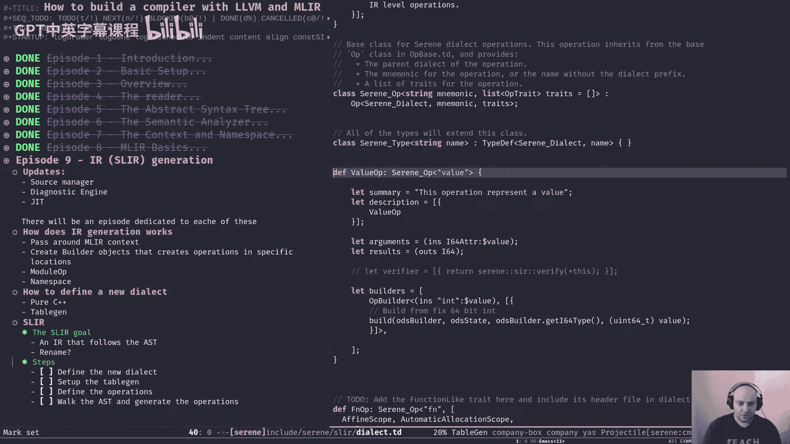
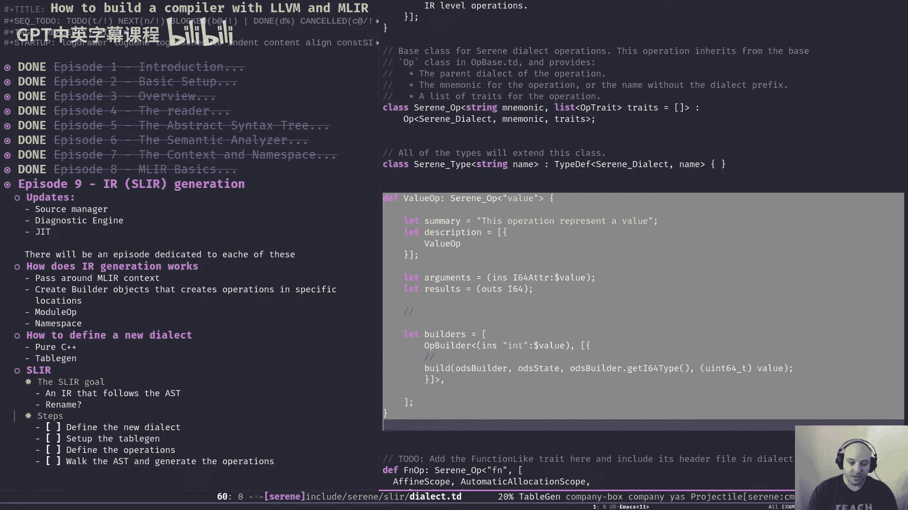
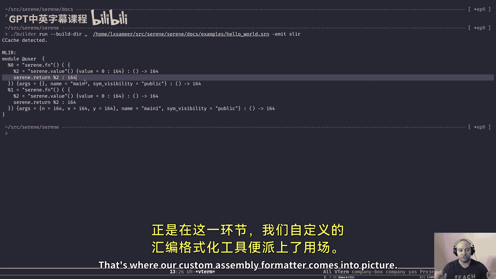
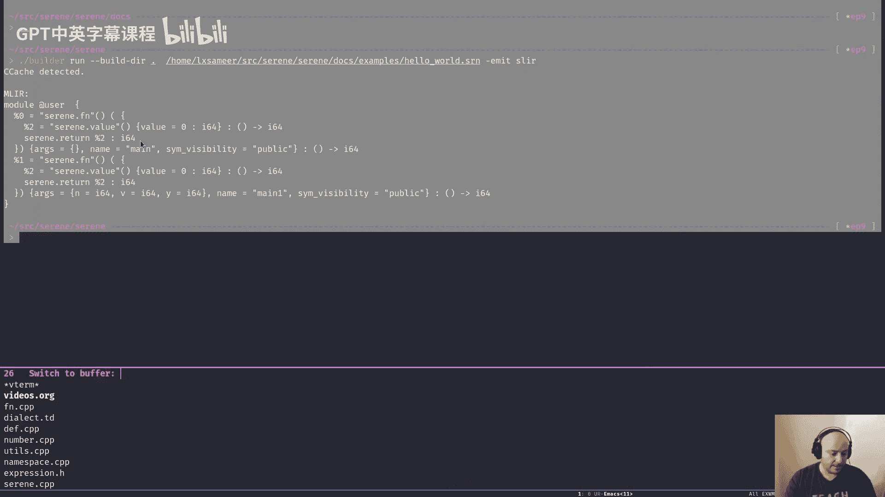
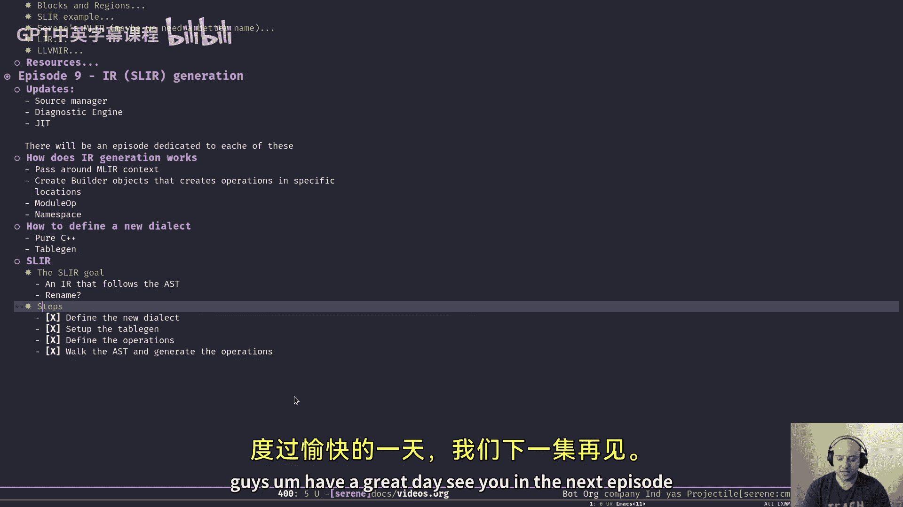

# 【基于LLVM和MLIR构建编译器】 p09 How to build a compiler with LLVM and MLIR - 09 IR (SLIR) generation -BV1vi421Y7P1_p9-

嗯。Hello and welcome to another episode of How to Be the compiler with LLVM and MLLOAR。

 this is your host Samir and in today's episode we're going to talk about IR generation。

Before we jump to the main topic。I have few updates。 So in the master branch。

 I finished up a really basic source manager。What is a source manager I'm going to have a dedicated dedicated episode about my changes in that area I created a diagnostic engine to report back errors。

 issues and things like that it's very basic it works on in the parer level at the moment but it has all what do you say like foundation that we need to create like a full edge engine and I did that to resume my work on the JIT so that's what I'm doing these days。

Obviously I'm going to create a dedicated episode for each of them。

 but if you look into the master branch today， you might not find everything that we talked about in previous episodes。

 that's because every episode has its own dedicated branch and today's Gt Bra。

 like the Gt branchch for episode9， which is today's episode is based on episode 8。

 not based on master。Little by little， I'm going to introduce new features。Eventually。

 we're going to catch up with master。Okay。So sir。Did do do。Made the mess。Okay。Okay。

So for today's topic， let's have a look at how we create an IR representation。

It's a high level discussion but I'm going to show you some code as well we're not going to go in depth into the like IR like the details of the current IR that we have because we don't care at this estate we want just a bare minimum compiler we want the wiring as you remember from a previous episodes so。

If you remember， we talked about a class that we have called Serene contextt。

Basically this is like the the estate of the compiler， pass it around。

 we pass a reference to the reference of certain context around。And it owns everything。

One of the things that it owns is another type of context， which is MLO context。

That is important for today's topic。 So MLIR context is the similar concept to ser context。

 but for MLIR， it contains all。Types， basically， whatever you need to use M IR and。

By passing ser context around， we obviously passing MLOR context around as well。

 and we use the MLIR context to create something called a builder。The builder class。

 the builder object is responsible for creating operations and operations。

 if you remember from the previous episodes are the building blocks of MLO or and different dialects that we might want to create。

But there's two things like。You need to remember two things about the builder。

 the first thing is unlike the MLIR context， this is actually one of the things that。

I didn't get at first， I thought since we have one MLIR context we should have one bill there as well that's not the case can you can build the build there whenever you want based on the same context。

And the second thing is。The bill like let's imagine we have a like a file， right。

 we want to create we want to write our IR representation， sorry。

 we want to write the IR in that file。嗯。Biller basically has a cursor that points to a specific location in that file when we create a new operation using that biller and insert it into the file it。

The new operation will like， start。In the。Casor location。

 so let's say the cursor points to the line 10 and when we create a new operation that operation will start at line 10 like the text representation of it right start at line 10 and continues to wherever where it needs to go like the length of the operation is important there and by doing that were moving the cursor to another location So the next operation will end up in a different location。

So sometimes we need to actually manually change the location of the cursor， for example。

 we want to have a function function like operation we create the。

kindind of the prototype of the function and then when we want to generate the body。

 we move the cursor， to builder cursor to another location and start generating operations from there。

Actually， while it was like just an example， we don't have a file we like it was just an imaginary example in real life we build everything in memory。

That cursor that I mentioned is kind of some location in a graph， right。

 you move it around and start generating operation and expand the graph that way。

Obviously when we generate operations using the builder。

 all the operation had to be wrapped in a module and MLIR has a thing called moduleuloppi or like module by itself is a cooperation so it has the same interface and finally in case of serene。

 it has a name a space that wraps。The entire module， it， it more like。

Depends on how the JIT goes in the future， certain name of spaces might have more than one module to deal with。

 but for now we can think of nameless spaces and module in a one2 one mapping。

As a one to one mapping。Okay， so。We pass around the MLIR context， we create build layers。

 we use that build layer to generate operations。As we discussed in the previous episode。

 we need to have a dialect。So either we need to use other dialects or we need to create one dialect for。

Our own， which is the case for us。We have two options to create a new dialg either created in C++ like purely C++。

Or use tablein。Creating it in C++ can be really hard because there's so much detail to take care of and like you have to spend。

Too much time on it。That's where tablegen basically shines。

 The M IR engineers actually created a back and forth table gen。 You can create everything in。O D S。

 that's what it goals。Tables will generate everything for you。

 that's what we did today we're going to do today actually I did today did already we're going to talk about it today。

And。The name of the IR that we have currently is SLIR likex Syrian language intermediate representation right。

 but probably it's going to change in the future， we're going to have another IR completely different than this one because like this one is just。

A minimal set of operations just to get going and like to。

Get to the more interesting part of the compiler and I create the wiring， but。For now。

 it's good enough。But it might change it I don't know。 I might rename it or create a new one。

 totally the goal of SL IR is。To actually model the ASD as an intermediate representation。

I expected one on one mapping from a node to SLIR operations more or less。But that's the entire goal。

 we can like in future episode， probably in the next episode。

 you'll see how we're going to actually analyze the SLIR and generate another IR from SIR to eventually get to the LLVMIR。

Okay， in order to generate IR SLIR， basically， we have few steps to take。Before anything。

 when we actually in the constructor of the serene context， as you can see here。

We can load our dialects， different dialects that we might have。

 as you can see here I already loaded the serene dialect。

 the SLI R singingi that we're going to talk about today and a standard up dialect or STD dialect。

If you need to use any other dialect， you have to load it first obviously and here is like how you do it。

 you use the MLIR context to load the dialect and obviously MLIR context will be the owner and take care of everything。

For now， we only use these two。So。The first step is to define a dialect we define a dialect like in case of serene we use the cable Gen and ODSS stock to generate the dialect This is to be honest I don't know how to actually what to call this syntax I call it ODS because I saw it on the MLIR website like documentation。

 I don't know whether I'm close or not， but let's just stick to ODS for now。Okay， so。

What happens here is we describe what we want from a dial act and then we use table Gen to generate different files out of this one。

 it generates header files， CPP files like everything for us so when you see like what do you call these in plus plus like macros like this right like oh preprocess or sorry。

When you see a preor like this。It reminds you of like a head air fan， right and events like。

The fact is it ends up in the header file as well， so we treat it as a header file for now we describe some stuff and obviously we use N2。

I'll finish it。诶。Like other programming languages， like this ODSS stuff you can include other definitions。

 other descriptions from other files and MLIR has it。Tnons of things to use。

 I'm going to talk about them briefly， but。Most of them are for interfaces or traits。

 so when we create a nice thing about the ODS is that when you like most of the functionality that you might need in your dialect is modeled in different traits or interfaces shipped with MLIR。

 so you can just use those traits in your operation to like achieve what you want or create your own。

The first step is to actually define a dialect。We define the dial likes like roughly like this。

 right。I this black。So at first we define like this deaf form here translates into a class later on。

 so we end up with a class called serene dialect that inhers from dialect class that has a name it has a like a name of space to live in some summary description and the nice thing is we can actually generate。

You call it documentation out of the description here or the summary here。So。

We created the like as simple as this like this actually。

And then we're going to create a base class for all the operations that we have。

So we create a base class called Serinopi。 again， it translates to our class somewhere。

And I'm not going to talk about like the details here。

It needs its own episode and we don't want to spend time on it yet。Just the high level。

 we create a base class for our operations， I'm not going to even talk about the types right now because we don't use them。

But here's the important part， so this is how we create an operation。

So。

Right now we're describing an operation called Val O value operation that inherits from Cop and the name of this operation like the textual name of it is value if you remember from the previous episode in an actual dialect。

In the sorry， in the MLIR， when we operations are in form of like the like something like this。

 the dial like name。Dot operation name， right， So in case of value O P， it would be。Sene dot value。

 right。呃。Like the dialect itself， it can have a description， a summary。

 I didn't put anything here just because it's going to go away， but the most important stuff is here。

 like argument results and probably the builder or verify fire even。In the argument。

 we define how many argument this operation gets and what are the types for now it's only one。

And the type is an I 64 attribute。Wch we assign the name， value to it。Its called value for no reason。

 It doesn't have anything to do with the value here。

 if I rename it to another thing like I don't know。Like Apple， for example， that would be fine。

 right？Sorry， sorry， sorry。Made a mess。Okay。So， it was。Value， okay， and the result of。

Value operation is an I 64。 it's a value of type I 64 Y I 64 just to keep things simple I choose to use just one type。

 right。We don't use any other type for the wiring and when we're done with the first stage of the compiler and we go to like design the actual language。

 that's where new types comes in you have to create a like a type system。

 but for now let's stick to one。Each operation can have its own verifier， what's a verifier。Actually。

 I'm going to show you an actual。Useage of a veryifier later on， but for now。

 whenever we create an operation， like each operation might have its own criteria。Later on。

 when we built the entire moduley， we can call to verify it has like a verify。

Fun function number that verifies every operation in that module。And this way， we can， like。

 actually。Create a mechanism that。Validate the logic for us I'm going to show you an example。

 but for now let's say you pass something beside an I64 to a value operation。

And when we call the verify。Function member is going to raise an error saying that， yeah。

 the types doesn't match。You can by default， every operation has a verifier。

 but if you need like a specific。Vify， you can define it like that。

 So what happens here is that it's going to call a function called verify or whatever you name it in this name and space and pass a。

Value operation as the only like that specific value operation as the only argument。

That we don't need it for now。And finally。You can have by default。

 there there would be some build layer functions that the build object will use to generate your operation for you。

 like an instance of your class for you， but you can have it have more basically in our case。

 we want to have a like a。Another version or yeah， another version of the build member function that gets unsign ice in 64 and created like a value operation based on that we're going to use it when we get to。

To the exp classes and like ASD nodes and you'll see it in action there。And moving on。

 we have another function here called sorry， another operation called FNOP or function operation。

 it inherits from the serOP， but as you can see there's like bunch of other stuff in here that value OP didn't have any of this。

These are called operation traits and these are the things that I was talking about。

 you can use them to create to actually use some of the common functionality that MLIR provides like for your operation。

 right？For example， I'm not going to talk about them right now again later on when we want to design the actual IR。

 we need to talk talk about specific traits at that time， but for now， for example。

 isolated from above says that。Functional might have a region。

 it should have a region and that region is isolated from the above scope right so you have to pass the arguments explicitly to it。

I hope I didn't make a mistake because I can't。Remember correctly， but that was something like this。

Okay， and again， summary description arguments， in this case we have three arguments。

 the first one is a string attribute called name， a dictionial attributes called as for the input arguments of the function。

 and an optional attribute called sea visibility， which basically says whether this function is a public function or a private function。

 public private instanceense of a name of space。Also， function O has a region， it's like the regions。

 it can have more than one region but。It has just one and that region is like any kind of region。

 any region is kind of a type here。And finally， it returns on I 64。

Y 64 again because we just want to have one type in our compiler for now。

We don't use any bele type or functional P， so that's same over there。Stuff that I used before。

 actually， I tried to use and never use them。And。Finally the last operation which is a return OP again it inherits from seropP。

 the name is return and it has some traits， for example has parent is really obvious it should only appear in the context of a function OP anywhere else like MLIR will yell at us saying that yeah it should be under a function OP it should be a return return like and it's a terminator I'm going to talk about them these traits in a different episode let's move forward。

Finally， it has just one argument we call opera brand， and it has it can have any type。

Can as any type and I used something here called assembly format。Just to make things interesting。

 more interesting。When we we want to dump our IR into text format by default MLIR use some default print to print everything right you might not like the format that default print uses for one of your operations just because it might be simpler than that in our case returnOP is quite simple it's like return this thing right we don't need any extra information so if you want to do that and like change the format you have two options。

Either use assembly format which is much easier like this。

 or use your own printer and if you use your own printer， you have to use your own par as。

We're not going to go down that path right now。 We're going to stick with assembly format。

 So how it works is that okay。The new assembly format， the new when you want to print this thing out。

 the new format is first the attribute dictionary should appear in the format after the name and then a brand which was the only input followed by a Coon and the type of that operas a there's some documentation on assembly format on MIRs docs。

 you can have a look it's super easy to use。And pillar， we're not interested。 Okay。

 so we ended up with the。Really simple dialect with three operations only， right。

 So that's how we define our。Dline now we have to set up table gen and basically。

Set up the build pipeline to generate C++ files out of this one。In order to do that。

 we have to take a look at the CMake file。So it's quite simple。

 what's happening is we instruct or build。Bill pipeline to use the dialect TD。

 the file the file that I just showed you。As a target definition。And then basically it says that。

 okay， I want table Gen。To use this file， right， roughly translate to that。 And then we want to。

Generate all the declarations right， you want to use generate all the operation declarations in a file called opsh。

 innc and the definitions of those into another file called opstcpp。 innc。

And then the same for the dialect declarations and definitions。

They're going to end up in a file called dialect that H that ink and dialect that cP do in。

 And finally， we， we will name this target something and then。Probably， if I remember correctly。

Here in the。DMake file for the lip serene。We use that name somewhere。得得得。😔，Oh yeah， here。

We added as a dependency to the thing that we're going to generate to our artifact， pillar artifact。

That's how table like we can use tablegen that's that's it Oh one more thing when when tablegen generates these files they're going to be in the include directory basically beside the CMake file in the bill directory so you have to make sure that your bill directory is part of the pass to your bill directory is part of the。

Pats that CMMake users to build your project。When you when you set up the。Smic like this。

 We're going to end up with。Let me show you。Okay， like this is actually the result of the generation。

 this is up Hdo ink as you can see table generated a bunch of stuff for us like an operating a。

 we don't care about that right now。Operations themselves， basically just a declaration， right？

It's the long file， it's yeah， almost 250， 250 lines of code。

And if we take a look at the definition file， which is like the CPP file。It's the same， right。

 I want to show you something in here， actually。Let's find a good example， yeah。

Remember the builder functions that we talked about that you can add your builder function。

 here is the actual code that table generates for us when you create a new one。

And you failure function， right， when you generate a new one， you can， in our case， we created。

Actually， we we added the definition as well。 If you don't include the definition。

 you have to implement and。He find that。Be their function that you ask from table Gen yourself in a CPP file。

 right？But it's okay for now we can skip that one too。So， actually。What was it。W you。Okay。

The and should summer。W I am doing this。嗯。O。So these are， as you can see。

 this one is exactly the one that we describe even the comment。Lives here as well， right。So。嗯。Yeah。

 that's how you can actually generate new builder functions。

And let's have a look at the other dialect。h。 inc which is like contains the dialg declaration if you want to use C+ plus like purely to define your dialect that's like you have to do all these yourself so that's why table gen is actually really good to to do all this and yeah you have to write all this yourself and if we look at the definition nothing special here。

So when we end up when we created all this， we need to actually use them。

 just generating the files won't do anything for us so to that end we have another file called dialect do H。

This far。First of all， the header files， if you use anything in your dialect in your ODS file like。

In here， right， for example， if I use any trait in here like。Return。

 like this specific trade caused me a。A lot of headache because the mistake that I made was that I thought if use if I include a trade or an other audience file in my audience then table gen will take care of the includes and everything like it will include the right header for me and blah。

 blah， blah but I was wrong， so when I use return like here， like when I wanted to build the project。

 like I had to deal with an error saying that yeah return like doesn't exist in I don't remember the name andspace。

 but in some name andspace right？嗯。I was wrong basically my assumption was wrong when you use something you have to actually include the header file your serve manually in your project which in our case we have a dialect dot H we include a bunch of stuff in it that we needs for our dialect and finally we include the dialect doh。

 ink here and then the operation the ops。h do ink here as well this thing is here describes what to include basically it's a flag that when when you say I want just the operation classes when you include it it only you include only that piece in your header file that's it you have to include both ink files and if we take a look at the。

Definition file。It's the same。 but here is the tricky part。 So if you know， if you。

 if you saw it in the。Where was it that I like that ink。

D dialg has a member function called initialize， we have to implement that， right？

And this is how we implemented it。We just use add operation that adds bunch of operations into our dialect and then include the definition file of our operations by specifying get ops list it only return like you will only include the list of operations you can have a look at the ops that cP and look for get OP list and it's super easy you'll see how it works and finally we want the definitions themselves like the actual implementation so that's how we actually use tablegen to generate a new dialect。

So。That's all good now。We have a dialect。 and as you saw in the。What was the name。As you saw here。

 we loaded in our context in the construct constructor of our context。

 so we're all set to actually start generating。Our new I。But in order to see how it works。

 we need to have a small trip to our。Main function， so。

This is the actual main functional or compiler it's in a file called。

Ting that CPP in the bin directory。I didn't talk about it up until now。

 and right now I'm going to escape it as much as I can because I'm pretty sure I'm going to change this file quite a lot in the future and to to be honest like even if you compare it to the math there。

ToThe master， it's actually really different now。But。

To show you how it works and like where's the entry point of the entire code generation I'm going I have to show you something from here so we have different actions we。

Decide what to do based on the action and。One of the most important thing here is that after we do the。

ASemantic analysis phase on things like that。Sorry。

 we get to a point that if the action was dump SLIR or MLLIR or LIR。

 just use the member function dump from the name ofspace right that's kind of we can't think of it as the starting point or to our。

IR generation。 So let's have a look at the do。 So in the do function。

Besides all this like debug information that we don't need。

 we call to a generate function that returns a maybe modular O。嗯。

Basically that generate function from name andspace is what we call to generate a new modlo for our name ofspace。

If you have a look at that one， so it returns a mod P， maybe mod P。

 which which as you can see in the top right， it's a result type that。

The success case is an owning OP reference to MLR module and the failed case is a Boolean。

I wrote this code。Okay， a long time ago I guess and back then we didn't have any diagnostic engine today that we have that engine。

 I changed this type to be something else so don't pay attention that much to the return time the return time the the only important aspect of the return type here is that owning OPF。

That class is really important， so basically when you have an operation。

Somewhere somewherewhere in the future you have to actually destroy it right that's the C++ thing like freeing optimal theum resources like old CS stuff。

But the thing is in order to destroy an operation， destroy an operation。

 it doesn't matter what it is， you have to call the arrays function member function on that。

Operation， so。What I had before was to call that array function in the。And what do you call it？

The structure of name and space class here。Here， I used to say large。Sorry。😔，Mole dot。Rise， right。

That was how I actually destroyed the module when the name of space got destroyed。And。

That wasn't nice。I looked around and I found this thing in a code example of MLI already is it out here。

So。That owning op P ref is basically just。An entity a wrap around an operation which owns the reference。

 and when it goes out of the scope， right， just like other。

What do you call it other values in C+ plus it get destroyed but it's smart enough to know that it has to call the arrays function and blah。

 blah blah so what it does is pretty simple it just makes it destroys the operation when it goes out of the scope。

So let's see what we do in the generate function， we create a new builder。

 that O builder thing that we talked about earlier。We pass a reference to MLIR context to it。

 so basically we can say we create a build there for that context and then we will use that build there to generate our operations。

We create an empty module with an unknown location， unknown because。Basically。

 we need to pass the location here actual location， but again。

We don't care about like these kind of details for now because like。

If we want to have a location actually， the actual reason is we have to have an Ns form。

 like a least Ns form， we don't have that， so we either have to pass like a file address here with the like a。

Like where we actually included this name ofspace or it should be a rep or a user name ofspace or something that demonstrate that this name ofspace is used as the entry point to our application。

We don't have to deal with all that， so I use a get unknown location。

 actually in the new version with the map and source manager and everything。

 this thing is gone so we know where we actually load anNS from。And a name， a name for that module。

 which is the name of our name ofspace and then。We get the AS see of that name and space if you remember from episode。

7， each name as space has its own ASD， so we get the three， we get the ASD3。

 and for each node we call a member function called generate IR so x here。

Will be like a expression so X is an expression and it has to have in the expression class if you remember we had to generate IR which we always escape to we're going to talk about that the first argument is is the reference to the name of space。

 the current name of space and we pass the module to generate IR as well。

 basically just because when we generate a stuff we want to append it to the module。Finally。

 we called the verify。Function on that module so the ver will walk the graph will actually cause the verify member function on every operation and make sure that everything is in good shape。

If there was an error or something went wrong， we're going to emit an error， this emit error。

 we're going to have another episode about diagnostic engine。

 but it basically calls to the diagnostic engine and causes some kind of like it's going to bubble up to the surface and。

Blow up right， but for now it's fine。And we're going to erase the module why we erase the module here because like it failed since we still didn't create any owning reference here。

 we have to delete it manually like destroy it manually， return on error。

 I know this is ugly but in the newer version when I created that diagnostic engine this thing is gone so we return on optional value。

And then we run some passes。 If you remember from previous episode， when we run like。

Ml O and LLVM has like a pass infrastructure。 You can run some passes on your module to do some。

Depends on the path like either optimization or rerite or analysis， different things。

 that's very random， we're not going to talk about them today。And finally， if everything was right。

 just return the module and create that owning reference from it。ok。Actually。

Something bothers me here。What's the type of this thing， Oh Mar right。So。Let's have a look at。

What was it a expression， yeah。As a reminder， we had the like a expression class。

 which was the kind of the abstract class that every ASD note has to inherit from and it has the generate IR function that we just used。

 this is the signature if you want to have a look at。But。Let's have a look at different nodes。Oh。

 let's start by number first。So。In case of a number， all we do is we're going to create a builder。

Actually， you know what， I think I made a mistake， it's not a mistake。

 but why did I create this builder in here？We don't need to， right， because we create them later。

 Probably it's a leftover from oh oh， oh， oh， oh， yeah， I I remember， I remember。

Because of this get unknown location， it needs a build lift， that's where we created that one。

But anyway， in case of a number， we create a build there and then。This is how we create an operation。

 So we use that build there to create。new operation。In this case。

 we want to create a new value operation。And then we convert our location to an MLIR location。

 we're going to take a look at that one too。And， finally。Pass the current value of2 I 64 to this。

Value operation。And as you can see， to i 64 is basically just converts the value of the current node。

Into a I 64。So。Excuse me。So we use the exact same builder function that we provided in our dialect TD and we pass a location every build layer that every build function that the builder used expect MLR location right and in the newer version I created like a member function for the location range itself so it returns the like location MLR location we don't have to do this all the time。

 but for now it's like this and we pass the integer that we want to embed into our like to use it with our value operation and if the value operation if there was like just to validate it if it wasn't nu push it back to the module appended to the module。

Simple easy enough， let's have a look at this thing it's quite simple， create another builder。

 we use their rael as the file name because sorry if the file name if the name and space didn't have any file name we use the rael as the file name and then we use the location and the line number and the column number and then use the file line call location。

 it's like a type of location in MLLR， there's different different type of location like a call site or different things even like that unknown location that you saw you can have a look at them in the documentation but we need to create our own later on use to use the NS as well so we wanted to keep the NS name or some other information。

呃，还是怎么样？Okay。And。Let's have a look at the deaf one。The deaf node， where is the deaf node。Okay。

 so it's quite simple。If the type was an FN， like if we try to define a function。

 if you just do like as a refresher。Deef is a node type that is like directly correspondent to a de form。

 So we would say de， some things like a name and a value， right？

It will translate into a deaf node after semantic analysis and here's what the deaf oh actually the deaf node。

ens how it generates the oil actually。If the value type and the value will be like this thing that we try to。

Like assign a name to it right not assign a name to it point a name to it if it was a function type。

 then we call the generate or on that function and simply return nothing special right and。

That's the only thing that di does。Because again， we want the most basic compiler ever。

 we want to do the wiring first。🤢，It will be changing the future， but for now it's fine。

We just want to make things worse and have a like insight into different pieces to be able to actually see the whole picture and then design everything。

Be the like a。What do you call it okay， with a good vision for the future。

So if we have a look at the。Yes， the function， the function node and its generate I R。Function， okay。

 so here's a little bit more complicated part。We create a location again based on the MRIIR location。

We create we get the context， this context is the ser context that wraps the MLIR1。

Create a be layer and then start doing our thing。So we create a small vector。

 a small vector is like a LLVM type。 it's similar toD vectors， but it's more efficient。

It contains some named attributes and this number here is like how many elements do you want to？

Per with your vector， like allocate with your vector at firsts， like four is like a good number。

Depends on your use case it might be different right I use four so we keep that vector for our arguments and then we loop over the arguments and try to dynamically cast them to a symbol if they were a symbol if they werent this symbols we have to raise an error and return basically and if you remember emit error will cause like a diagnostic to be raised blah。

 blah， blah， we're going to see about that in the future you can think of it as just raise an error and return。

But if they were， actually。Symbols， then we're going to create a。

Name attribute that the name is that symbol name， so it would be like the argument name。

Would be the name of this attribute and the value would be the type of that argument。

 which in our case is only I64。In the future， for example， when we have a type system。

 we have to look up the type， match the types here。

 and do some type checkings to create the correct name that attribute。

When we took care of the arguments。Then。We create a function。Like before like the function O P。

 actually this thing has to go away， like the value O P， sorry。We use beard that create。

 we ask it to create a functional FNOP for us， we pass location。

 but as you can see on the top right it gets a different set of。Arguments。It needs a return type。

It need a name and it needs like a named attribute。

Argument to kind of reflect the input arguments to the function that we created already。 And we just。

Create a dictionary attribute out of it and finally whether this thing is a public function or a private function。

 which we hardcode it public for now， we can change it in the future。If the function。

 if we couldn't create the function， emit an error and return， otherwise let's go for the body。

So if you remember from the。Daxing ra it。Here so。We have a version。Oh here。

We create we asked for just one region， like any region。Called body。

 So here we actually get that body。 We get a reference to that body。

 and we create a like a empty block。As you can see， we create a blog。

By like allocating it on the heap and push it back to the body。

I told you in the previous episode that region can have multiple blocks。

This thing is our entry block if you look into how the function op of the standardar diallect works it's more elegant and like it has like an entry block or and it can has like different types of block but for now for our case we don't care about any of that just yet because again we want the most basic thing so we push that block into our body and set the builder like the beer cursor or the in point to that block to the start of that block so we move the move that imaginary cursor around and then start to generate。

Operations， we create another value O with the value of0 just as just to have something in our function because we don't want to actually keep generating every single re cursively for our compiler because of the simplicity that were looking after so that's why we just want something in our body and that would be like a value O with the value of 0 the get result here we return the value of that operation so from the previous episode if you remember。

Should be here， I guess。Yes， here。 If you can remember these SSA forms here are values right。

 so get result will return the name of this same for the value。 for example， oh， here's the value。

 right， This is the value operation。 This number two here will be our value。

 and base and this red valve will point to that number two。So。嗯。Okay。

Let's move on and finally we create a return operation that returns that rate value。

 return value of value OP， so that number two， right？If the return value wasn't there。

 emit error erase the function and return， otherwise our job with the function is done。

 push it back to the module and then done。For the。For now we only have this for our。For our。

I we don't have any。More operations or we don't generate anything else。Veryally basic stuff。

 So let's see it in action。Actually， let's mark this thing。As done。

 we've walked ASD and generated as well。 So this thing is done as well。

So to have a look at how it works。😔，So as you can see。

I want to emit SLIR here and I want to like parse this wall and the build directory is the current directory。

So when we generate that。IR it will look like something like this。

 this is the textual representation of our IR which was in memory we donnked it into a text format。

Here's our function operation it gets a gets a region and one block。

 this is that block we generate a value operation which has value0 as you saw we hardcoded this thing it returns an necessary form called two and then we return that to so there's like two things I want to actually talk to you about the first thing is as you can see this return value has a like a custom assembly format that's where our assembly like our custom assembly formatter comes into picture if I if I。

If I remove it or comment it out from here and then try again you'll see the difference right but we'll do that in a second and the second thing is we don't see any location information here right that was one of my questions which I got the answer just before this recording this episode so by default the default printer of MLIR don't print out the location information but it doesn't mean that we missed them right the reason is because they might be long so the MLIR engineers decided to not include this in the。

Dump information。In order to do that。We have to go back to our name ofspace and dumb function。Right。

We use the dump function that basically you saw what it does。Instead of that。We need to use， sorry。

We need to use a print function， So if we call print we we give it the stream that we want to print the current operation into that stream and a bunch of flags。

 a flag is like a O printing flag that actually defines the behavior in our case we enable the debugging info the debugging info and pass that flag as。

To instruct the print to actually include the debug info for。So with those two changes。

 if I actually。Sorry。No no no no no no。😔，If I compile the whole thing again， oh。

 it's going take long time。So while we're waiting for this thing。嗯。For the。Future episode。

 we're going to have a look at how the Pass manager works and how we can use passes to rewrite and lower some of the operation into other dialects。

 in our case， a dialects and then to LLVM IR。That was the whole。Generation。

 IR generation in like really brief。Episode it took a long time actually but again we stick to the basics。

 we don't want any complicated stuff for now to have the most basic compiler that we can have to then have insight into different pieces。

 especially like later on I learned few things about linking and things like that that changed my vision of how to design a compiler。

 so it's good to stick with the basics for now and。Later on， we have time to create the actual thing。

 So if we run the whole thing again， so here's two three actually thing that you need to pay attention to。

As you can see since we actually。Didn't use our custom format here。

 the return operation just showed up as a like regular operation， right so it doesn't look。

It looks complicated， that's why we use that formatter to keep it simple。

 it will help us to debug this thing in the future。

The second thing is now we see the locations right， the location is here， everything has a location。

 but what's up with this thing？Location like a hashtag location or what I don't know what to call that character。

These are called location Alls。Apparently they're new to MLIR， I didn't know about them。

 I asked in the MLLIR channel and we had a discussion and I just learned about them actually today。

There's something called like type all in。MLIR that you can name like like something like a type de in C or C plus plus。

 you can create a short name for like a longer type or like a。A specific specialization of a type。

And use that name in place of that type。 The same concept applies to location analysis as well。

 So we call this thing a location like we name a location somewhere called Lo 1 log2 and things like that。

 And then at the end we have a look kind of a table like saying that says log 0 is unknown。

 Lo 1 is wrapped from line。Sorry， line  zero at column 10 and look 2 is line 1， column 11， right？

So that's how you get the locations， I spent like two days thinking why what I mean is that the locations doesn't show up in the IR。

I guess that's wrap it up for today' folks。Thanks for stick around。

 it was like a long episode if you again， if you like my work if you。Like what I'm doing。

 please consider subscribing to my channel and leave a like if you're interested in sharing itself。

 please reach out to me there's tons of things to do and I use a hand。

 I definitely could use your help。嗯。That's it for today guys。

 have a great day See you in the next episode。

