# 【基于LLVM和MLIR构建编译器】 p11 How to build a compiler with LLVM and MLIR - 11 Lowering SLIR -BV1vi421Y7P1_p11-

Hello and welcome to another episode of how to be the compiler withLVM and MLOR。

I hope you are having a great time wherever you are。 And in today's episode。

 we're going to talk about lowerring SLLR。😊，As an overview of what we did up until now。

 we created a compiler that reads the source code of a kind of a least like language。

Creates an ASD out of that source code。It runs some semantic analysis on。

The ASD and rewrite the ASD to be a semantically correct ASD。

We make sure that by the like the purpose of semantic analyzer is to make sure that we have a correct semantic。

 the source code， the input code is semantically correct。

And then we defined a new dialect of MLIR called SLIR， serens。Sin language。

 Intermedia representation。W whichch has like two， three operations， not a fancy one。

 we might end up rewrite like creating a new dialect in the future， like a real dialect。

And then we use SIR to generate some IR， some form of IR。

And that was by the end of episode number nine in the episode number 10。

 we had like a quick overview of the pass infrastructure of ML and LLVM。

We looked at what is the pass， how to define a new pass。

 what is the purpose of the pass infrastructure structure in general。

 how to create a pipeline of passes using the pass manager and things like that。In today's episode。

 we're going to use whatever we learned in episode number 10 to lower SLIR to other dialects of LLVM。

 especially LLVMIR。But talking about lowering， what is it like what is dialect lowering and why we want to do it basically。

We discussed earlier in previous episodes， MLIR， like we can create our own dialect in MLIR。

 each dialect might be specialized in doing something。

Um and there's like a least a long list of built dialects。

 or there are like tons of dialects made by other people。

The nice thing about MLIR is that we can take advantage of other dialects at the same time。

And use them in our advantage。For example， right now we have aLIR， we can actually so the target。

 the target goal for us is to transform SLIR to LLVMOR and then feed the LLVMOR to the back end to the LLVM backend and generate some object files。

Or basically compile it to some target code。That's the like an end goal for us， but。

It's not going to be a direct transition to the LLVMIR。

We have to either directly or indirectly transform the SLIR to other forms and eventually to LLVMOR。

 and that's what lowering means。So。It's just an example。

 but we can actually transform and translate SLLR to， let's say， I don't know， like。

Blah dialect right that bla direct dial might be defined by some other people somewhere we have to like add it to our project。

 load it like I'm going to show you how but load it before we like our。

Basically when we want to use the past infrastructure we have to make sure that we already loaded that dialect and then we can transform operations of SLIR into that like foreign dialect and then probably they have some rules to transform that blood dialect to other dialect and eventually to LVMIR but each dialect usually has a goal。

 you know， for example，Our own dialg SLIR's goal would be to map directly to our ASD。

 so we would create a graph of like which each node in that graph is an operation。

 and then we map the ASD to our own SLIR and then we can use the pass infrastructure to do some optimization。

 decide like what to do with the IR， how the program looks like in our IR。

 and then translate that IR into LLVMIR。So。There's a dialect in MLLIR called LLVM dialect that's like the end goal for us we can actually directly translate SLIR to LLVMIR but it's easier to convert to that dialect because there's。

Like it's already made and MLIR engineers already created that for us and so why not？

Let's use that one。And。In today's episode like the code that I'm going to show you。

 the actual process is we transform SLIR into a standard dialect and then standard dialect to LLVMIR dialect so we jump twice to get to LLVMIR。

But in order to do that。嗯。MLIL actually provides some tooling and some like library。

 not library a framework to help us to achieve our goals。In that area。

So basically there's a framework called Tyla conversion。

It's something on top of the pass infrastructure， so we have to use passing infrastructure。

 but the dialg conversion is like。Easier way to transform or translate our dialect to another one。

It has like three， not sections， like in order to use it。

 we have to do three things or two mandatory things and one optional one。First。

 we need to do target conversion。 It means like we want like in order to transform SL IR to a standard dialect。

 that a standard dial would be our target。 we might。

Cose to do choose to do like multiple transformation or translation for example。

 translate SLIR to a ST dialect or to like SCF dialect or something like that right or to async dialect at the same time some of the operations would be translateating to will be translated to standardar operations。

 some of them will be translated to anc operations and basically we can have a mixture。

The second thing is we need to have a rewrite pattern。

 I'm going to talk about them when we get to the code and finally we might need a type converter。

 it's an optional process since we don't have a type yet。We're not going to use it。

 but if we decide not like this site in the future， we will have our own types so。At that time。

 we need to have the type convert as well， but it does is。Since our types would be kind of SLIR only。

 they will be part of the SLIR dialect， we want to let MLIR knows how to translate our type to a type in another dialect。

And finally， there's a concept of full conversion versus partial conversion。

 so a full conversion is when we translate the entire dialect into other forms of dialect and LLVMIR LLVM dialect finally。

 but partial conversion is like，We know that。 We want to。

kindind of hold off on translating some of the operations and leave it to other passes so we just partially translate some of the operations that we have in just one past and leave the rest to other passes。

So to begin with， let's have a look at the name of space code。The the the。Okay。Where was it。

 So we had to generate。Yeah。So we looked at the generate function in episode 9。Just a quick overview。

 we create a build there and then we create an LLVM MLIR module which is like an operation on its own module OP and then we ved ASD and call the generate IR member function on each ASD node passing the。

Nam and space itself and a newly created module。So each node will generate some IL and attach it to the module。

 so by the end of this for loop here we like our module would be populated with some operations。

Related to the ASD node。And then we verify the generated IR。

 we want to make sure that they're semantically correct。If there was a failure。

 we're going to rate an error and。Basically， return。Otherwise， we are going to run some passes。

So this is where we want to do。Lering basically in our using our pass manager。So here。

 if the pass manager failed， if any of the passes fail to process the IR， we're going to raise a。

Sorry。Raise an error and delete the module and return。Sorry。So， one thing to。Kind of。As a heads up。

 you might think that， okay， this error message is not useful enough。

How can I figure out what's wrong and what failed in the what has failed in the。

Pass5 so in as I'm going to show you in each pass， if there's a failure that pass itself is going to emit an error so。

What we kind of end up what we end up with is kind of a stack of errors in our diagnostic engine。

We have to like we're going to leave the error processing for now to the diagnostic engine。

 we're going to have an episode about it， but basically it would be like if you ever worked with a C+ plus C or C++ compiler。

 which probably did，You know that when you get an error。

 you'll see errors on top of each other as a kind of a stack like。I all messages but。Basically。

 each pass will emit its own errors and at the end we just。

Imit another one after we run the entire pipeline。So， let's look at the。Ran passes member function。

All it does is to call the run function of the pass manager。We saw that in the episode number 10。

It's just like a public API we pass the module to the run function of the pass manager， this PM here。

 which is defining our context， is our main pipeline。For now， it's fine。

 but I'm pretty sure in the future。We have to change it。

Because we have to have different pipelines for different purposes。

 but for now this is fine because as you already know we want to have a minimal compiler。

 we want to actually have the wiring phase and then we're going to build like a more sophisticated compiler later。

Okay。But in order to know what type like what passes do we have in that pipeline， we have to look at。

Context。嗯。Actually， okay oh， by the way。We already talked about this。

 but we have to make sure that we load all the dialects that we want before we do anything so right now in the current version of the compiler we use the Serin dialect which isLIR and the Sunar dialect。

 which is built in which is a built in dialect in MLIR and then context。Do c。Where was it。

Can't remember I you owe here。都。We have a member function in our context。

 which is set operation phase。Basically， depends on the parameters that we pass to the compiler。

 we set different passes， we add different passes to the pass manager。Ts thing like the way I did it。

Kind of makes sense for now， but the truth is。For difference like phases we need different pipelines。

 so for example， if we wanted to just generate some like LLVMIR。

 we would have one pass that one pass manager， sorry。

 that has all the passes we need to translate to LLVMIR or if we want to generate like a target code。

 then we have to have another pass manager with all the passes for that purpose。

But for now it's fine， I'm pretty sure I'm going to change it in the future。Depends on the。

Compilation phase， if we want to generate SLIR， we don't need a pass manager。

Because we directly generate SLIR afterward ASD without running any pass on it， so it's fine。

If we want to generate some MLIR code， the name I chose here is kind of not good MLIR。

 but it's kind of it means。After translating SLIR to any other dialect of MLIR that's why I chose MLIR。

 but basically it would be like a standard dialect so here I added a pass called createate aLIR lawyer to MLIR pass weird I know but。

Anyway。And if the compilation phase is LIR， I mean， like lowered IR。Which means by this point。

 we have to have everything lower to LLVM dial， not LLVMIR， LLVM dialect。We I added a new press。

 So since。Basically， since。These faces are ordered。If our current phase is LIR。

 then we have both passes in our pass manager。So let's have a look at them。 They they're defined and。

Actually， let me show you。Let me show you that they're defined in a header file called passes。

So as you can see， both of them return a unique pointer to MLIR pass。And then。One of them。

Wwhich is the first one create aLIR lawyerer to MLIR pass。

 is defined a file called in an implementation file called SLIR lawyering in the passes directory in Le serin。

like I have to kind of。Talking about the lip ser a little bit here。

In the previous episode I mentioned that I made some changes to the C files and the build pipeline。

 so Le Sein is the object library from now on， but I ended up like，Changing the data again。

the reason is because at first I had this mentality that let's have just one binary as the compiler and let's build everything in it。

As it turns out that might not be a good idea， I don't know why I thought like that。

 but the truth is to be true to the unique philosophy and to have like we should have a smaller tools that they do one thing really good so right now since I'm working on the JIT I had to create a like a rep environment so I created serene dash rep binary I'm working on that it's I have to work on it for a long time but so we have certainency。

 we have serene rep。If I wanted to use lip setting as an object as an object library。

 it meant that I have to link the object files in both pioneers。

I would have end up with like a giant piaries at the end， so I decided to change that。 So by default。

 lip serene would be a shared library right now like there's a flag for any。

Distribution maintainer if they want to change it to a static library or whatever。

 but for now by default it's a shared library and that I dynamically linked that against both binaries。

嗯。That wasn't related to our episode today， but you needed to know about that。So。

Going back to the topic。So here's the function that we use to add the past to。To our past manager。

It creates a unique pointer out of a class called SLIR2 MLI or pass。

So this thing is a class in the same file。As we discussed in the previous episode， as you can see。

This is just a pass， you know？And if you remember we had like two types of passes。

 this one is operationeration a specific pass， and it works only on module operations of MLO or obviously。

都。If you remember again， everything has to happen in the run on operation member function。

 so first of all， we need to kind of tell MLI or what other dialects。

We want to use in our past or what other dialects on we are dependent on。

In our case it's a standard dialect if there's another dialect。

 we just cant pass it as like a template argument here。

 but for now we have only standard dialect and then obviously Git module is just a wrap for Git operation since our pass works only on module operation so Git operation is going to return a module anyway。

And finally， run operation would call Ron module， oh by the way。Basis of not the basis even。

This code is based on the MLIRs tutorialial code for lowering IRs， I just had to make some changes。

 especially on the rer patterns， but it's based on that code basically。

So in the run on module member function， the magic happens here。

We gets the module that we try to translate， we created a conversion target。

And we have to pass the context to it， the get context will return the MLR context in this case。

Then oh。Here's the important part。So。All the that we want to all the passes that we actually create to transform SLIR to other dialects。

 to other targets。A normal passes。But since we're going to use the conversion framework there is。

There's a concept you need to know。We have a target which is， in our case， standard dial lag and。

Our source dialect is SLIR， obviously。SLIR has a set of operations。

If we want to do a partial conversion， we're going to say， okay。

 from the list of operations that SLIR has。Let's say three operations， operation number one， two。

 three。We can mark some of them as legal。Which means if you mark an operation as a legal operation。

It tells the pass manager that if I didn't provide any rewrite pattern for that operation， it's fine。

 it's legal， you can forget about it， don't yell at me if I didn't convert that thing。

 that operation into other operations of that target。But if we mark any。

Operation or any dialect as illegal dialect or operation， it means if I didn't， it asks aR basically。

That if I didn't provide any。Reloite pattern for that operation。

 And if I failed to translate that into an operation in the target dialect fail the pass。

 and basically that's how we keep track of what we already translated to the target dialect and what we didn't right So here we marked a standardar dialect as a legal dialect it means like all the operations in that dialect is legal to this pass。

 So when we generate some operation operation from a standard dialect。

 current pass and the pass manager would be okay with it。 It would be a legal operation。

 and we marked as a serene dialect as illegal dial。 So anything in the serene dialect。

 which is aR is considered as。Illegal operation， yeah， consider as illegal。

 So we have to transform that into legal operations。Which is a standard lack operations only。

We can actually。Mark operations as legal or illegal like this。

We don't have to do only based off the dialect。At dialect level。

I wanted to create like a printer dial act before。Because like that was how MLIRs tutorial actually progressed。

 but I didn't do it， basically if you follow the tutorial。

 you'll know that there's a print operation and the since they're going to lower that operation in another path they marked it as a legal operation here。

 it means that if I didn't again， if I didn't translate this thing。

 the print operation into a standardar dialect operation， it's fine。

 but since we don't have that I just commented out。And this is like upon now， we generated a target。

 we defined the target and we mark some dialect as illegal and illegal alongside with some operations。

 and here's where we defined the reite patterns。What is the real light pattern we're going to see in a bit？

But we have to add patterns to our re pattern set， right。Basically。

 it's like run these rewrite patterns are on my dialect， on my， not on my dialect。 sorry。

 on my operation。Which in our case right now is the module。 and by the end of all these rewrites。

 we have to have a new dialect。 that's that's a little bit incorrect。

 So by the end of the when we apply all these rewrites into the module operation， we would have。

Like we would transfer， we should have transferred the transform， sorry， transform the。

SLIR operations into a standard operation and legalize the illegal SLIR dialect into a legal dialect。

 which is a standard dialect in our case。That's how we're going to do it。

 And finally we apply the partial conversion here。 We do partial conversion because for example。

 if we had the like a print operation or any other operation that we wanted to do it in another pass。

 we would have marked as legal here， we we might not have。

Like basically this pass is not about translating everything into LLVM dialect。

 that's why we're doing the partial conversion version and if it fails。

 we signal a pass failure this function signal pass failure is how we let the pass manager know that this pass is failed。

So。Right now， we have to look at these two。Rerte patterns。

 one is to lower the value operation and the other one to lower the function。Operation。

 let's start by evaluate。So same file again。Basically， it's astruct that inherits from。

A class called OpP rewrite pattern， we have to pass the concrete type as well here。

It just has one function。That returns a logical result。

 logical result is a type in MLIR like sexes or failure。嗯。The function is match and rewrite。

 So it's like it。At the first stage， it has a pattern to match against， right so in our。

Module operation， we kind of walk through whatever operation is in that module operation and we try to match against a pattern in this case。

 since we we use the opP rewrite pattern it's it's basically it's like match against a specific operation in our in our case。

 that operation is。Sorry， is value operation。By mistake I mentioned that we have to pass the concrete type here。

 it's not the concrete type that we're creating， it's just the operation class that we want to actually match against。

 so this rewrite pattern will run on all the value operations and then rewrite value operation to something else。

Let's have a look at the implementation so since we know we're going to rewrite a value operation and that's our pattern。

 we kind of were sure that we're going to get a value operation as a as an input to this function and then we have a rewwriter pattern rew is exactly not exactly。

It's really similar to a builder object like a OP buildder from MLIR。

 the difference is it rewrites the operation that we match against。

So what we do here is quite simple if you if you remember the value operation has had an attribute called value。

 that's how we get that value it。It should be like a in。64 or something。 I can't remember。

 I 64 value。And then we get the location of the operation again。

 if you remember location referred to the place in the source code that this value is coming from。

Finally， I'm creating like I'm wrapping that value。In a like a function。And then， where is it。

And use like I'm using a standard operation called the constant intoop。This operation here。

 let me highlight it for you， this operation here is from a standard dialg。

But why am I actually creating a function here， So apparently on the top level of a module。

 we can't define like， we can't have a normal。Operation like constant int。

 so only global symbols are allowed in the top level top level of a module operation。

 so that's why I had to wrap it in a function basically a function that a constant function that returns the value directly。

This is a nasty implementation， it works for now， but in the future， obviously we need to。

Change this behavior， but why you erupted in a function because since we have a lisp。

It's definitely possible that someone in the rep might just put number three entered number three and decided to evaluate number three that number three would be on the top level of our module so we have to provide the functionality to the user so that's why I wrapped it in a function called random name I have a to do which is like。

Generate a unique name here for now it's fine so what happens is we wrap it in a function and call it in place and use the return value as the result of the evaluation。

So thats that's a plan， the way we do it is we create like a small vector。

 a small vector is like a vector like object in LLBM， which is like really。

It's like an optimized vector， you can think of it like that。

 you have to look into the LLVM programmers manual to read about it this number one here is like allocate only one slot。

Of type MLIR type。 That's it。 So this is like we have a a small we have a vector of MLIR types。

 which is empty。Like we don't have any input type and we created a function type which basically is like input types of a function and the return type since we only have I64 type like we support at the moment only I64 that's what our function is going to return we don't have to do like magical stuff to figure out what type of what type actually this function is going to return so I64 for now and then we use the rewriter to create a function operation function operation is part of standard dialla we passed a past location。

The location should be the same so wherever the value operation is defined that would be the place that function operation is going to define as well again。

 it might be a little bit vague， but location refers to the source code to the like input source code So whatever expression that caused the creation of value operation would be the same as this。

The same location that we use for this function。this way we create a function。

If the function was new， do I need to check this？No， so here's the mistake I made。

 I don't know why basically since。This create function doesn't return a pointer。

 apparently doesn't return a pointer。Does it。No。😔，Doesn't return a pointer since it doesn't return a pointer。

 I shouldn't really check this thing， so if I remove this， it should be fine， right？

Let's do it anyway， I have to make sure but we don't I don't need to check that that was a mistake well I don't know why I did that。

When we create a function。Actually him。It now I， Im a little bit confused。

 There might be a reason why I did that。 I can't remember why， but I have to check。

 It shouldn't be nu because it。It doesn't return a pointer anyway， I have to check that。

But when we created a function， we need to add an entry block entry block basically is where the body lives right it's the body of the function we create an entry block。

 which returns like a blockup object。And then we asked the rewriter object to start writing in the entry block。

 basically set insert point insertion point to the start of entry block。

 it means if you remember since rewwriter is like the bill there， it has like a cursor。

 when we create some operation， it creates the operation in that position and move the position forward。

 moves that cursor forward by doing this， it means like if you're here。

 move to a start of that block and start adding operation operations there。

And we create just since it it's going to be a constant function。

 we create a new constant end operation， it's like a built operation in a standard dialla we pass the location again we know the value has to be in 64 because we have just one type and here's the type of the value that we we have to pass to constant end and then we get result on it the get result is directly it's like。

Due this operation。St the result into。Value and get me that value。 So if let me see， let me。

 let me let me see。Do we have it or not。Let me show you what I mean。So， if I do J。嗯。Let's do my来。

So if you so basically what happened like we're creating this thing in here right。

 so the constant inop prints like this number three in 64 is the type and the location is on location one。

 which is in this file this line this column blah， blah， blah， but。

That get result gives us this thing in here， like the value， the SSA form of the entire function。

 entire operation right， so when we do this in here， like create an operation， we're doing。Oops。

We're doing this thing， right？And when we say get resolved。We get this value name here， right。

 we get the value of that thing and we pass it to the return。

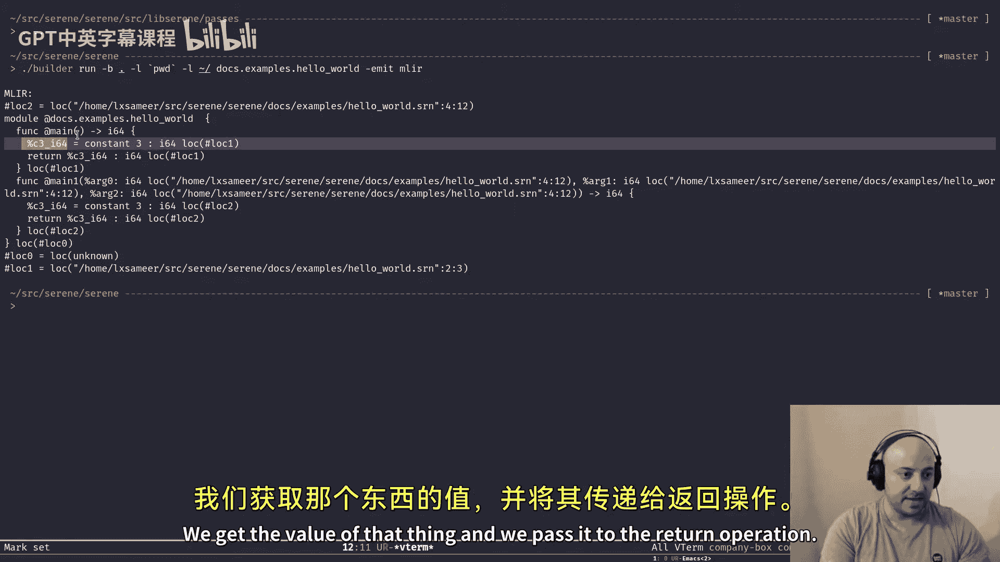

Operation return on its own。

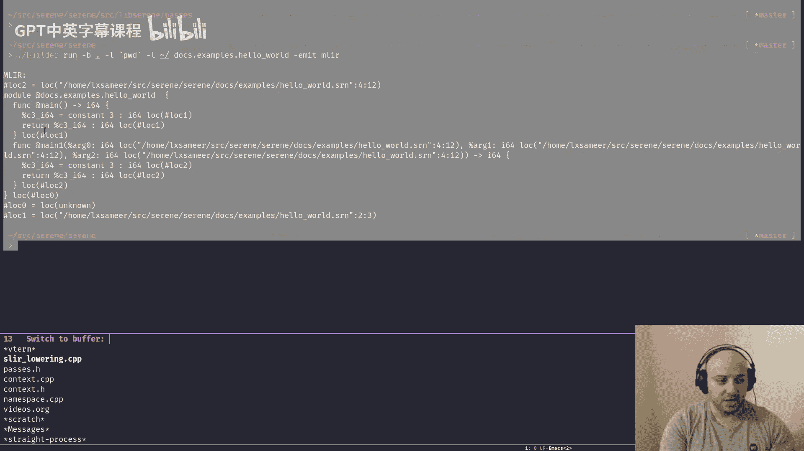

Here we define the return return is another operation in a standard dial。

 we passed that name we got like a say form that we got from constant in operation and you create a return operation out of it again I don't have to do this。

Don't know， for some reason probably in my head while I was creating the same， I thought， oh。

 now I know， yeah so。It was just to shut up the link probably I thought that it returned a pointer like I used to do that sorry something like that I thought it's going to return a pointer so I was actually checking thats checking that the return operation is not now but since it doesn't return a pointer I don't have to check that and if I want to make sure that my L is going to leave me alone I can just do。

嗯。Used。😔，Micro in here on。Os refused。Yeah。NoSo this is a macro I define in setting that H。

 it just like ignores。Ignores the。Linter rule， basically it's like I'm using it， leave me alone。

Let me have that in here。 I forgot to。23。U teens。Okay。Very go。So。WhenWhen we get here。

 it's like we already generated the function。The only step remaining is to set the function as private。

 We don't want other module to be modules to be able to import and use this function because basically it's a wrapper。

 It's like a hack we use to represent constant values。 and at the end， we have to erase the。

Old operation， which was illegal， so being marked。Sloard they like。

As an illegal dialect so every operation in that dialect would be considered as illegal if we leave the value operation around and don't delete it MLIR will surround on it or saying that okay you have a illegal operation in your IR after this pass it shouldn't happen so that's why we erase that year you。

I made a mistake here before so just to share my experience， I did something like this。

Erase right I did something like this apparently you shouldn't do it。

 I don't remember why to be honest， but you have to use a rewriter to erase an operation。

All the time in the re patterns and finally we return success to mark this operation as successful I know I have to remove this thing。

 but to show you how a pass might return。Like emit an error。 Basically， it's like。On this operation。

 which is a value error， emit an operation error with this message in here and return failure。

The reite pattern will fail， if re pattern fails， it causes the pass to fail， if the pass fail。

 the pass manager will fail and it's kind of like bubblebb up to the surface。

 that's how we like mark failures but since it's not a pointer I don't have to do this。

And the other operation rewrite we had like every rewrite we had was for functional lowering again。

 another OP rewrite pattern we define like we。Describe FNOP。

 like FN operation of SLIR to be the pattern we want to match against and then in the match and rewrite function。

 obviously we're going to have a FN operation and same thing as before we get the arguments list of the function。

Right it should be a yeah it's a dictionary attribute basically this arcs here is a dictionary attribute if you remember from episode number nine we defined the function operation to have some attributes and like two for the input arguments to be a dictionary attribute right name type name type。

You can review it， like look back into。Episode number9 C， right。

 and actually we can see it here as well。So as you can see， this function here， right？It had like。

 this is the dictionary。This this one actually， this is the dictionary input for。

This function in here and this one is the same for this function in here as you can see it says there's an argument called name。

 type I64 another argument called V type I64 and vice versa so by doing this we are getting that dictionary attribute and put it in as variable。

Another attribute we had was the name of the function， reading didn name and the symbol visibility。

 which is either public or private。嗯。Yeah， it's like。

 is it a public function or a private function and finally get the location light before putting it to look very well。

So we're going to create a standard dialect function just like we did in the previous reite pattern this time we want to allocate at least four slots with allocation or。

A small vector， if you want to know more about like this thing in here。

 just look at the LVM programmers manual。It's's best to read there。

And then we kind of loop through all the arguments that we have。We dynamically。Cast the。

 this is like since。Or is a dictionary value if we want to get the value part， not the key part。

 we have to use SCD get， which is like yeah， in this pair， get the second thing， not the first one。

And then we try to dynamically cast it into a type attribute what it means is we get this one so we loop over pairs like this every time we loop over a pair so this thing in here the art here should be a pair yeah as you can see on the top right corner it's a pair the first element is a is an is an MLIR identifier and the second one is another attribute that attribute。

Should be a type attribute， so it should be a attribute describing a type。

 We try to dynamically cast it to that type attribute。 If it wasn't a type attribute。

 we have to fail because it。There's an error there。 We expect a type there。 So that's how we。

Imit an error and then fail a rewrite pass， but if it was a type attribute， get the value of it。

 which basically means get give me the type since it's a type attribute。

 if it was a like I don't know like a string attribute for example。

 I don't know even if there's a string attribute or not， get value would have give the string value。

We get the type and push it to the art types that we defined here， right？

And then we create a function type from that like had these all argument types that we just created and returns on the I64 type again。

 since we support only one type at the moment， it's easy to tell what type we have to return here。

 otherwise we had to check for the return types somehow。And finally。

 we create the function operation just like before， again， I don't have to do this。

So how did they move it？5。So here we create the。Intry block， right？Intriular。

I have a bad habit whenever I can't pronounce something， I make some noise， I was about to do that。

So。Adding three block actually creates the block and return a pointer to it right so here if I do this it would be。

Better， right。Oops， sorry。嗯。Yesし。So。And then we ask the reader to start writing on the。

beginningginning of the entry block， just like before we create a new constant in operation。

 I hard coded number three here because。The reason is。

Since I don't want to actually walk the function body and I start like generating the code for。

 I don't know， whatever is in that function body， I just hard coded something like an integer here。

This is absolutely wrong， I know， but for the sake of our goal which is to have a minimal version of our compiler。

 this is fine， I don't care what the function does at the moment I just want a function that returns the value so I can compile it to object code if I can't get this thing wrong right and if I can make it work right now I would definitely Ill fail at like。

Generating the body as it is， right， So this is the simplest thing that a function can do just return and。

Sorry， return some value as number three。So whatever function that we define in the ser code。

 it doesn't matter， its always will return number three。呃。It is so like I know it's really a stupid。

 but as I mentioned， I don't care about the body yet， that's not our goal for the minimal compiler。

 we want something to be able to compile thumb serene code。As simple as possible。

 this is the most simple thing that we can do。Bear with me。I know it's hard to tolerate。

 believe me we're on the same boat， but soon enough we're going to see some better stuff here。

 but what we have to do since we got here already，When we get to like here we have to get the body of the function here as well。

 so here what we have to do like give me operation body， the body has to be like a。

Severalever operation on its own because when we wanted to generate the function。

 the SLR for the function， we walk the body and we generated operations there。

 so we get the body here and basically we have to insert them in the in the entry block so our entry plug has to contain everything that is in the body of the function instead of doing this right and the trickyy part is that we have to figure figure out what is the actual return value of that body so we have to find the leaf nodes and do some stuff there that's why I didn't want to go through a rabbit hole for now and just use the simple。

Constant return here。Like before， if it was a public function， we leave it。

 otherwise we set it at private and we remove the original operations。That's it for。

That's it for our first past， right？I'm going to show you everything at the end。

This is the new like command line interface for for the steer compiler for now I changed it a little bit。

 I want to show you how it works like how our pass works so it's really simple the dashB argument is like where's the build function a build directory I'm saying I'm telling it that。

Current directory is fine。 The dash L parameter is a load pass， so it's like。

As I mentioned or like in previous episode， build the build unit of learning would be name andspaces。

 so we compile name andspaces into object files it's like a C file or CPP file for C+ plus。

But our unit of compilation would be a name ofspace so with dash L parameter I would provide some passive like paths to the compiler saying that whenever you want to look up name ofspace looking look into these directories so right now I'm asking the string compiler to compile the name andspace docs。

ex do hello word for me and I want to look into the home page like sorry home directory and the current directory what it does it's basically is to look for a docs directory and then look for examples directory and try to find the hello underlying word do Sr and file and then I'm asking the string compiler to just emit SLIR this emit here is' going to change in the future it's just a debug thing for now and when I do like emit sLR basically。

I'm not invoking any past management。 So when I do this you'll get the SLIR the generated SLIR here。

 but if I do MLIR， I set the compilation phase to MLIR so。So。I'm on my keyboard on some keys。

 I use like I like really sensitive。Keys， so even a little bit of pressure would like activate the switch。

So if I do MLIR it actually it runs the past that we just reviewed and transformed this SLIR here to this MLIR2 yeah MLIR which is basically a standard dial like as you can see we generated a function called main out of this function here。

 the name is main， yep no input it returns I64 a constant and the return operation。

 another one called main  one。

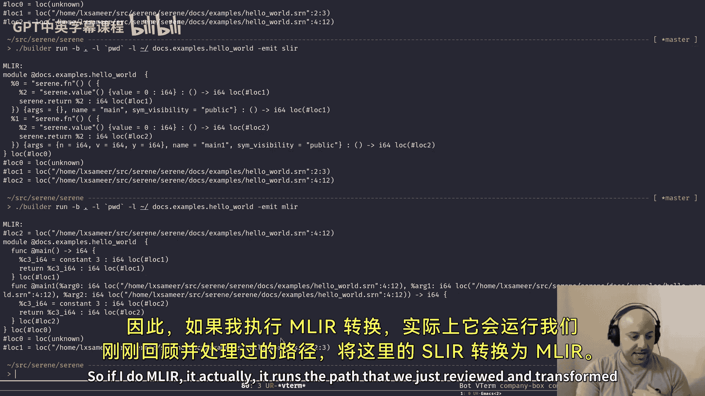

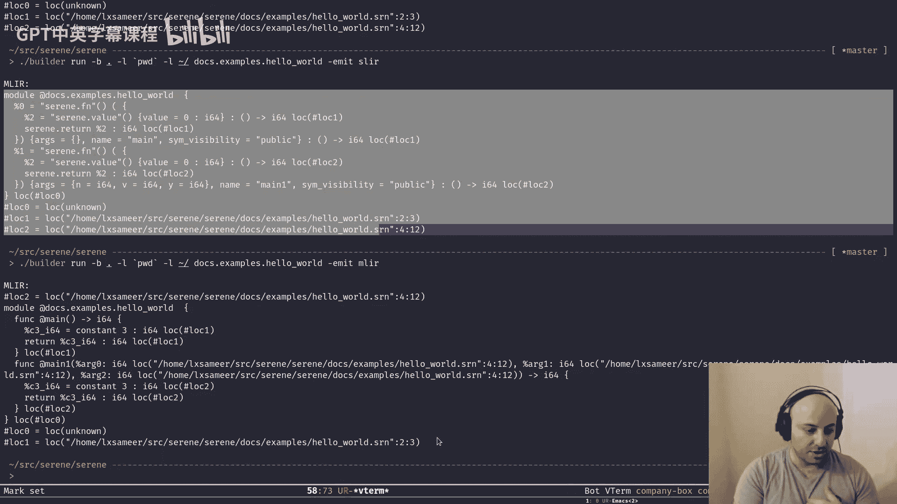

This one has several。Input， by the way， I intentionally， as you remember in episode9。

 I intentionally set the printer to print the locations。

I have to like it's nice to know the locations for debugging。

 but in the real world we don't need that because it's all everything is in memory。Anyway。

So main one out of the main one functioning here， here's the input and like the visibility。

Pretty simple， right， and finally we can ask。Generate LIR for me。

 we're going to look at it just now this episode got really wrong， but anyway。

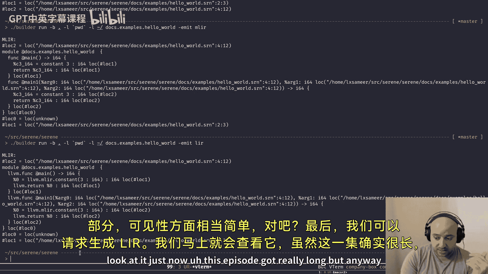

It generates some， so basically when we ask certain compiler to generate LIR。

 we sets the compilation phase to LIR， so added we add another pass to translate the standard dialect。

 which is here to LLVM dialect。

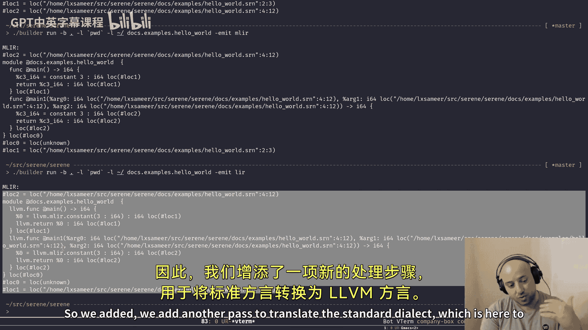

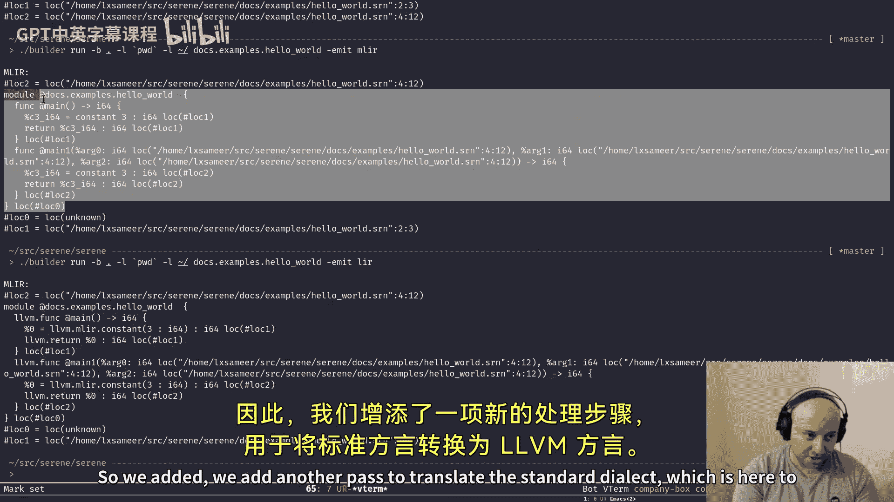

This one right quite similar， but as you can see the dialect is LLVM here LLVM constant blah， blah。

 blah in the next episode we're going to see how we can generate LLVM or your out of this but。

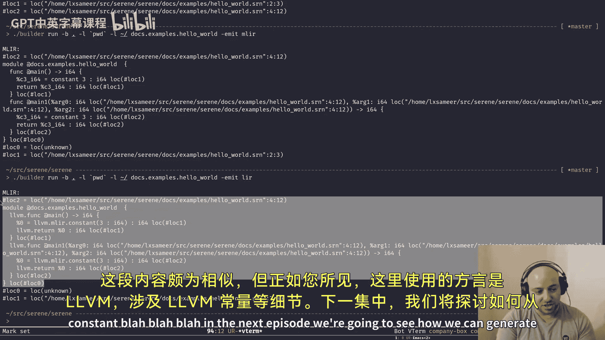

Let's have a look at the other path。There's another file called to LLVM dialect， or is it。

 to LLVM dialect？This is， it's quite simple。As you can see， it's not that big。

And it's quite similar to what we had in the previous past。

 as you can see it's just a pass that operates on module operations。

We have to register the dependencies in our case is LLVM dialect。

 so our target would be LLVM dialect， our source would be a standard dialect。And finally。

 on run operation。We create a target of conversion。

 we mark MLIR module operation as a legal operation。

 which means if we didn't translate this thing to a target operation is like this is fine， continue。

And we create a type convert。 again， this， the whole pass is based off based off of。MLIR， tutorial。

Since we don't have any type。It doesn't do anything for us。

 but this is how we create a type converter。 If we create a type in the future。

 that's how we actually。Create a converter for it to map to another type in the target dialect。

And finally， we create our patterns just like before， the only difference here is this function here。

So this is a built in function in MLIR called Pulate STD2 LLVM conversion pattern。

What it does is basically we give it a type converter that we just created。Return pattern， sorry。

 rewrite patterns that we created here。 Both are empty。 We pass it to this function。

 and what it does is to。Do the same thing that we did in the previous past it just do the same。

 it just does the same thing for all the operation in STD dialect。喂。

ItJust go over all the operations in the standard data Act。Quate like， transform them into LVM。

Lower them into LLVM dialect， it adds all the reddooid patterns to the patterns and type converters to the spe converter here。

And finally， we get the module and this time we do a full conversion。

We want everything to be converted to LLVM dialect。We pass the patterns， the target， the module。

 if anything fails， or I hate this thing。If anything fails， signal a failure， pass failure。

 otherwise rear grand， let's move forward and here is the function that we use to generate the past like before creates a unique pointer and returns it。

都。Again， if you look at the terminal and run LIR here。

 we see that it actually generates LLVM dialg based out of that standard dialect， it's quite similar。

 but the only difference is，All the other dialects in MLIR no like built in dialects。

They know how to transform or translate themselves either to another dialect or to LLVM dialect。

 so LLVM dialect acts as like the leaf dialect for all other dialects everyone tried to translate into LLVM dialect and LLVM dialect itself knows how to translate itself to LLVMIR so。

Based like as far as I know we don't have we never have to actually translate anything directly to LLVMIR。

 we always use LLVM dialg and we use some other function that I'm going to show you in the next episode to translate LLVM dialg into LLVMIR and to see the actual LLVMIR。

Of this dialect here， we can emit IR and here is the actual LLVM。I are in the next episode。

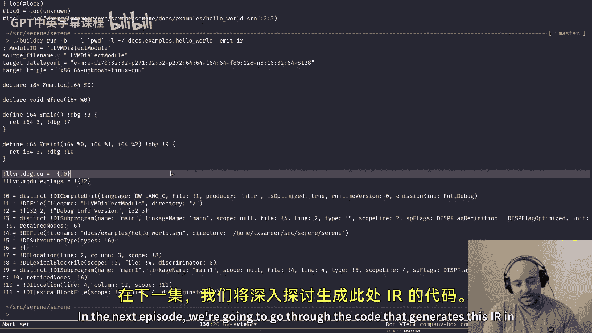

We're going to go through the code that generates this IR in here， we have to know。

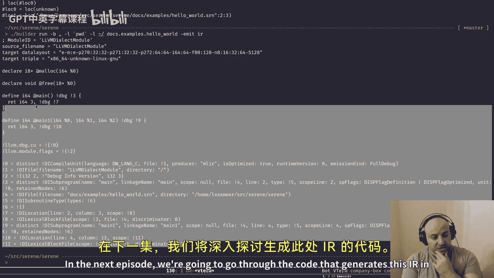

A little bit of about some of the details in LLVM。I don't know whether we end up generating object files in the next episode or not。

 but we'll see this one was a long one。Thank you to。You can add basically， if you like what I do。

 please leave a like and subscribe to my channel if you're interested in working on this compiler with me。

 just send me a message we can。I can talk to you and figure out what would be a good idea for you to focus on。

Have a great time and see you in the next episode。

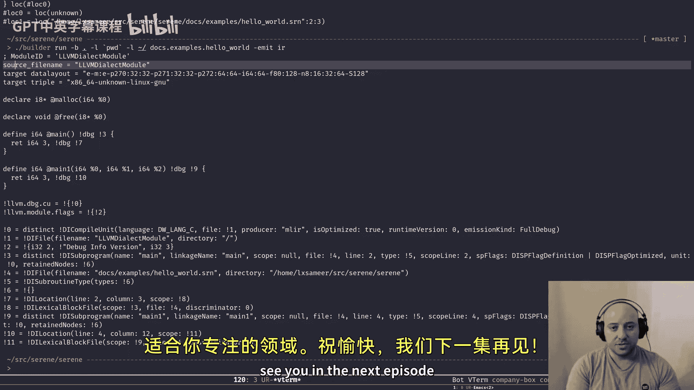