# 【基于LLVM和MLIR构建编译器】 p14 How to build a compiler with LLVM and MLIR - 14 JIT Basics -BV1vi421Y7P1_p14-

Hey lovely people， welcome back to the channel， I hope you are doing great and Merry Christmas in advance。

In today's episode ofHow to Be the compiler with LLVM and MLIR， I'm going to talk about JIT basics。

Some updates， as usual， actually updates。It's a strong word for this one because two weeks ago I had a bad incident and I lost my SSC drive。

I had a major data loss， I almost lost everything。And。Yeah it was a major setback。

 I had to reorder my reorders on SSD drive， revealeded everything in advance， like move them over。

 it took me two weeks to get to here and actually be able to do some work。Unfortunately。

 I didn't push some of my changes like in this project， other projects。

 and I lost some of my data permanently I didn't have backup for them。嗯。

I had like I have backups for the majority of my sister like data and like configurations are everything same。

 but but you know， I have to reconsider my strategies that。

But the bright side is I actually had a chance to look at how things works and I had the chance to rebuild Serene from scratch again。

Because you know， when you work on a code base for so long。

 you set up things in a certain way and you forget about some minor details。

I had to pull down the recent changes on LLVM and like build the recent region of LLVM。

 not the stable region， I mean， like the development region。

 I try to work with the development region all the time so when I get to the point that I can release the first version of serene length theory will be based on the latest LLVM。

So。Because of that and all the API changes in LLBM。

 I had to make some adjustment to the compiler and some。I had to。

Fix some of the issues regarding to compatibility。And yeah。

 that's it for I didn't do much in the past two weeks because of that incident。

This episode is probably going to be our last episode of 2021 and obviously I'm going to continue recording this video video series in the new year as well。

 to be honest I didn't expect to be able to actually record 14 episodes。

And its kind of makes me happy， but because of like a special occasion that is upon me。

 I'm going to create a new video series。That is all about how to be in the。

Build an editor with Iax list。Like my editor is more than 10 years old now。

 I worked on it a lot and I have a lot to share on this project as well。

 like beside the compiler project， this thing is kind of my another ongoing project I have。

 I work on it a lot because like I use it has a few users。

I already created a similar video series in another language and I got really good feedback so I was like yeah why not it makes sense to。

Kind of reboot the video series in English this time。

Hopefully it will be useful to someone who knows that's the goal。But right after this episode。

 I'm going to actually start recording the very first episode of the a video search as well。

Both of them are going to be in parallel。It's not it's not the case that I'm going to abandon this one or put more energy on the the other one。

My main focus is in this my compiler project is Serene and my secondary goal is the other one。

So that's enough， let's get to today's topic。

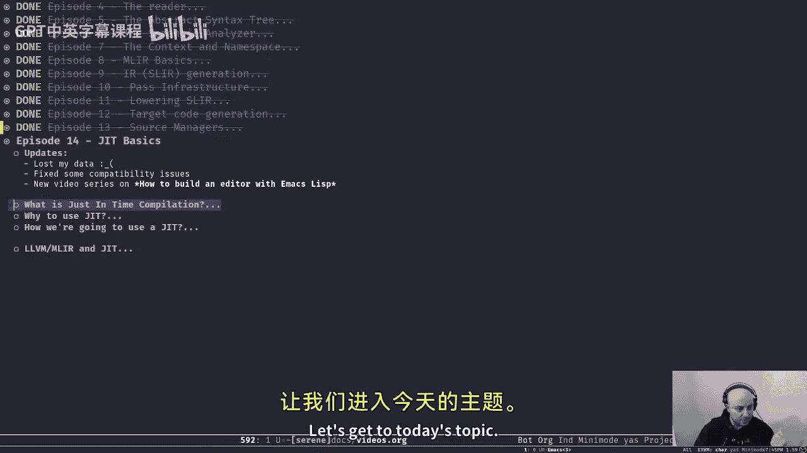

What is just in time compilation？

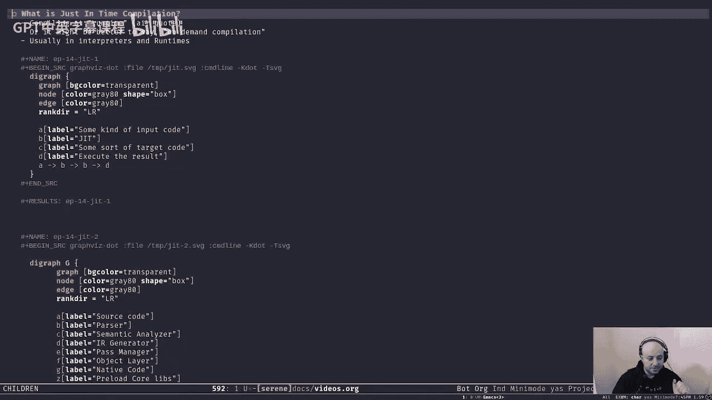

So。You put it simply， it's just compiling at runtime。

 I did the air quote there because runtime is kind of a。嗯。

popular choice I guess like the popular languages these days use JIT at run time。

 but it doesn't mean that you like there's nothing that prevents us from actually using a JIT in compile time or anything like that and in fact we're going to do that。

So to put it in better way better words， we can say just in time compilation is kind of compilation on demand whenever we need a piece of code。

 whenever we need to execute some code， we can。

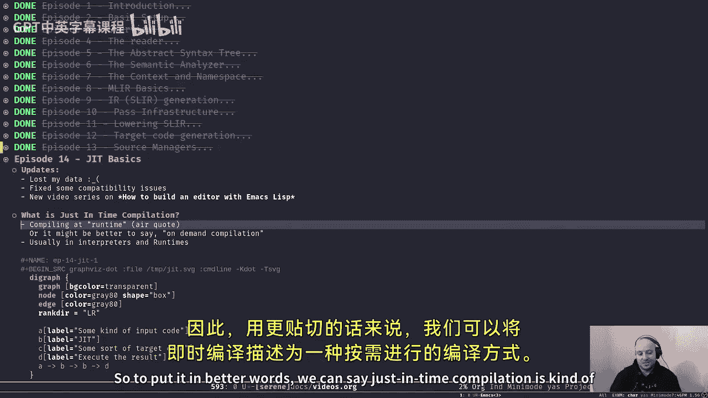

Compile that code just right at the time that we want to invoke it。

Usually interpreters and runtime use JIT to kind of speed up things。For example， Java。

 like Java J is kind of famous， but some Pythonum implementation have JIT。

 Lua Ha its own JIT to speed things up and stand fast。

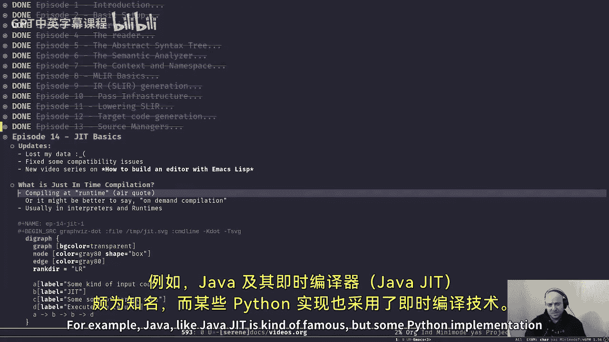

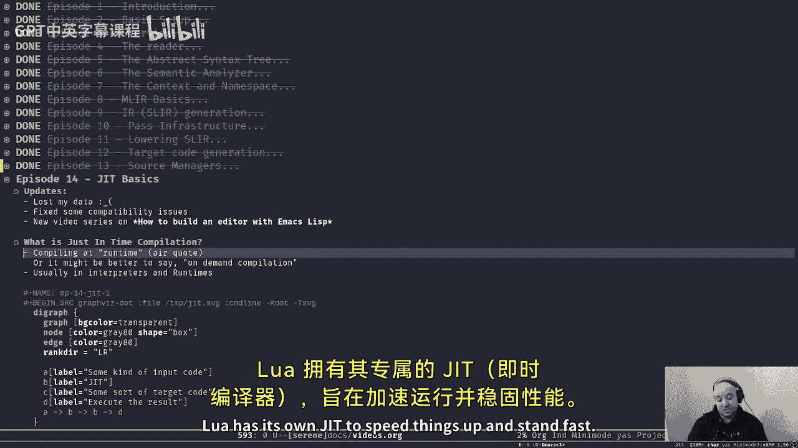

嗯。Just to kind of。

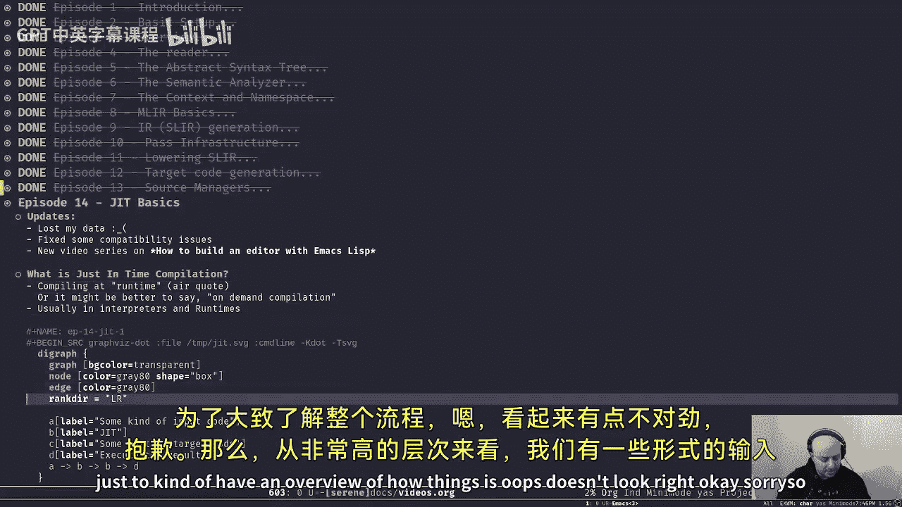

Have an overview。Of how things is。Oops。Doesn't look right， okay。

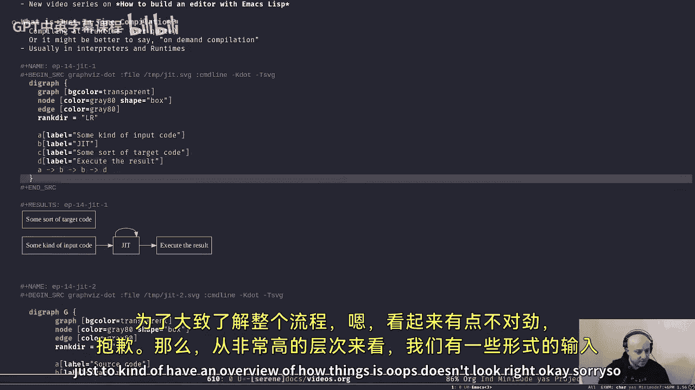

Gorry。So。At very high level we have some sort of an input code。

 we fit it to a jet engine and it spits out some form of like a target code and then we execute the result。

But that input， like that input code can be anything。Sorry， it can be like a。Regular source code。

It can be ASD， it can be byte code or some sort of IR or whatever depends on the J implementation and the output can be again anything it can be like a native code。

 it can be some sort of IR。Pretty much anything it can be even like a， I don't know。

 like a Json file， you know， to compiler stuff into a Json。

But the most important thing here is the J IT reads some sort of a code and generate the target code just at the time that we need。

That code to be compiled， right？

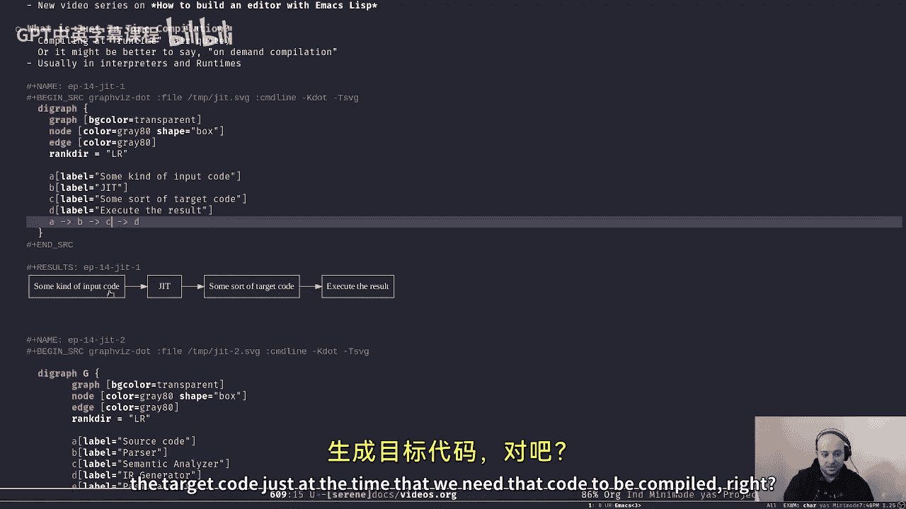

To。To kind of show you more details， I need to kind of come up with an example。

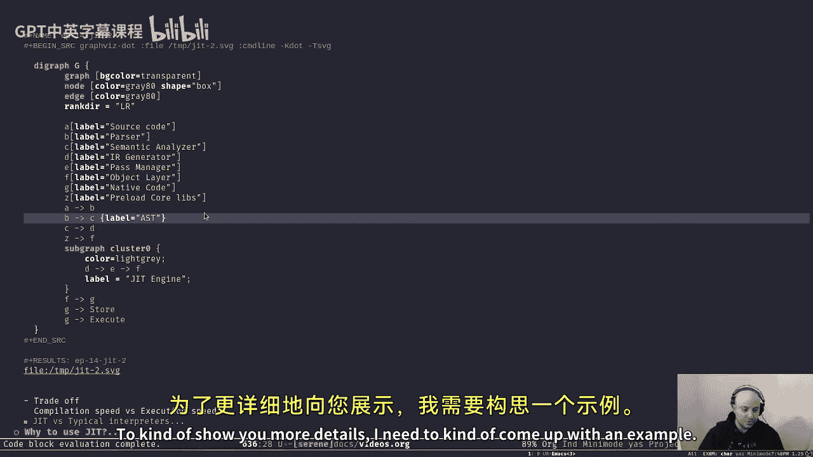

This is just an example， it really depends on different implementations of a JIT like there can be。

10red%。Oppossite of what I'm describing here， like opposite of this example here。

 but in general the idea is the same so let's imagine a JIT engine that is kind of similar like it that uses LLVM stuff。

It's kind of similar to what we're going to do， so that's why I use this example we have some sort of a source code in our case。

 it's a steer code。We pass it to a parer and we get some ASD back。

 we pass that ASD to the semantic analyzer to make sure that it semantically sound。

 we saw this imperious episode。And then we entered the JIT engine。

 we passed that AST to some sort of an IR generator unit or component。

We generate some IR either in ML IR or LL VM IR doesn't matter。 It's just an example。

 Then we use the pass manager to run some passes， make some optimizations， pass the final。

kindind of module to the object layer， the object layer is kind of responsible to compile that thing to compile the module to a native code and then link it at long time with other libraries if it uses like an external library。

And finally generates some native code。Then we either sort it to a file as like a executable binary or a shared library or execute the native code like invoke it。

This is just an example， right？The jet engine can be。Simppleler than this。

 it can be more complicated than what we have here。But。Just by looking at this graph。

 we can see that if we put more like too much passes in our pass manager。

 the process of compiling the source code to the native code is going to take longer because we have more passes to apply to the our IR and it's going to take longer。

 right？Also， our object manager， our language is going to have like a standard library。It might。

 it might not， but let's assume it does。Our object layer probably needs to preload some of the shared libraries or。

What whatever format that we use for our standard library in advance before like as a startup process as part of its startup process。

So。The bigger the standard library is the longer it's going to take for our street engine to a startup and like we have to wait for it a startup。

And like and depending on where we want to use our J engine， like is it a rep environment。

 is it part of our compiler， is it in runtime？Depends on the different scenarios it might like we come up with different tradeoffs right。

 So let's imagine a rep environment user type some to actually。

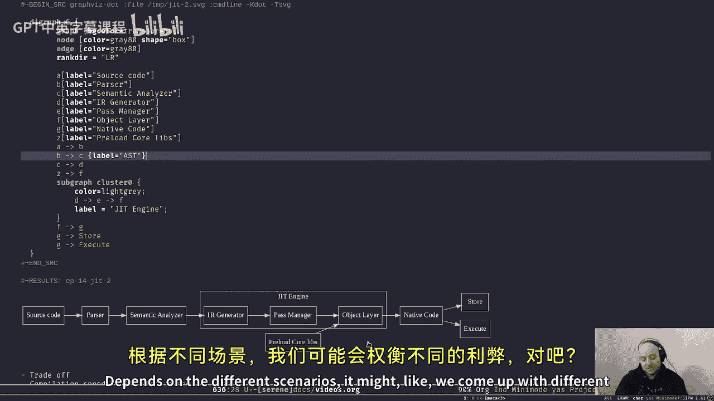

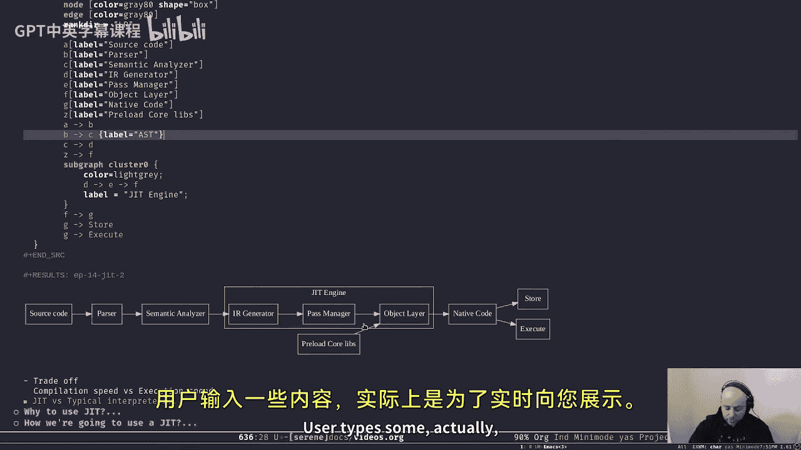

To show you in real real time， this is like a image list rep just because it's right there and I。

It's easiest to access， right it's a ripple environment if I write something here。Right。

 I and I press enter。Like。The engine runs that expression for me and return the result right let's assume something like this like we have a rep environment if I type it like a new expression here right。

And hit enter， what happens is like the engine parses the code and everything。

 actually EmX has a JIT itself。It can kind of it works。It matches our example。So what happens is。

Eax par my expression， to an ASSD does some semantic magic to it， blah， blah， blah。

 and when it passes past that expression to the JIT，If we。

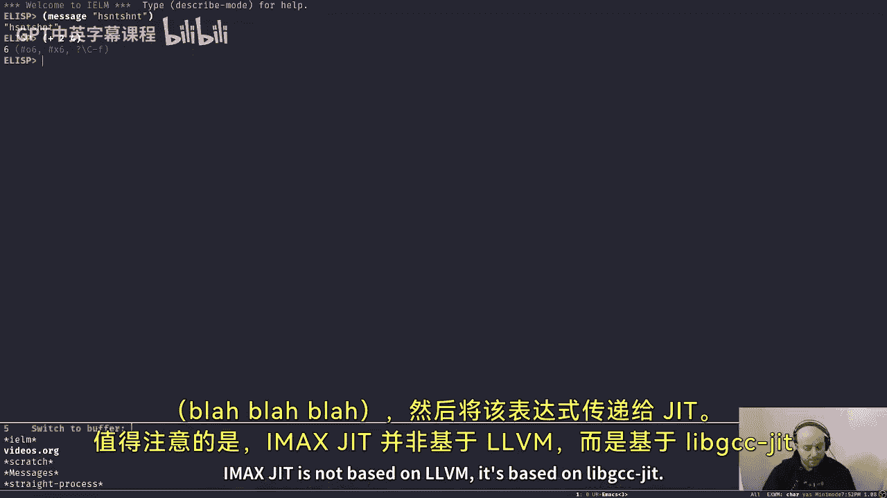

MX JIT is not based off LLVM it's based on LibBGCC Jed， I have no idea about that library。

 but obviously it might not have something like a pass manager or。

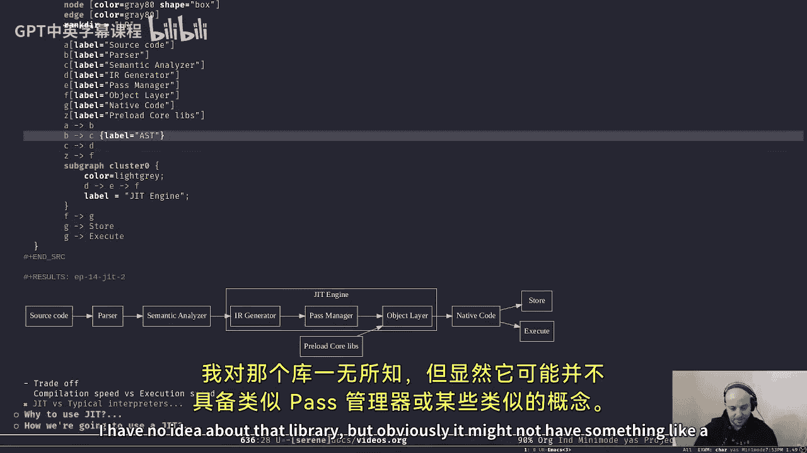

Some similar concept。

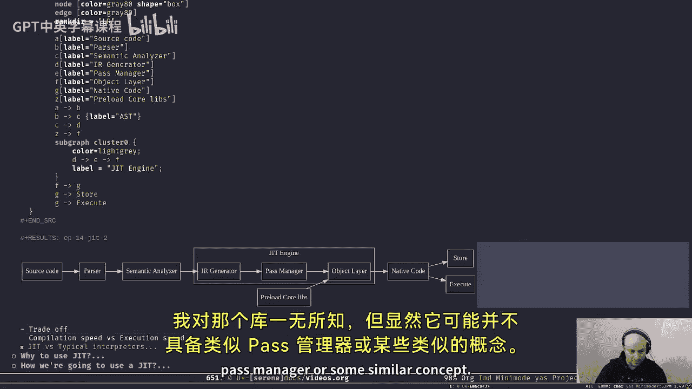

But let's assume it's based on LLVN， right？If we put too much， too many passes in the pass manager。

 there're going to be a longer delay。

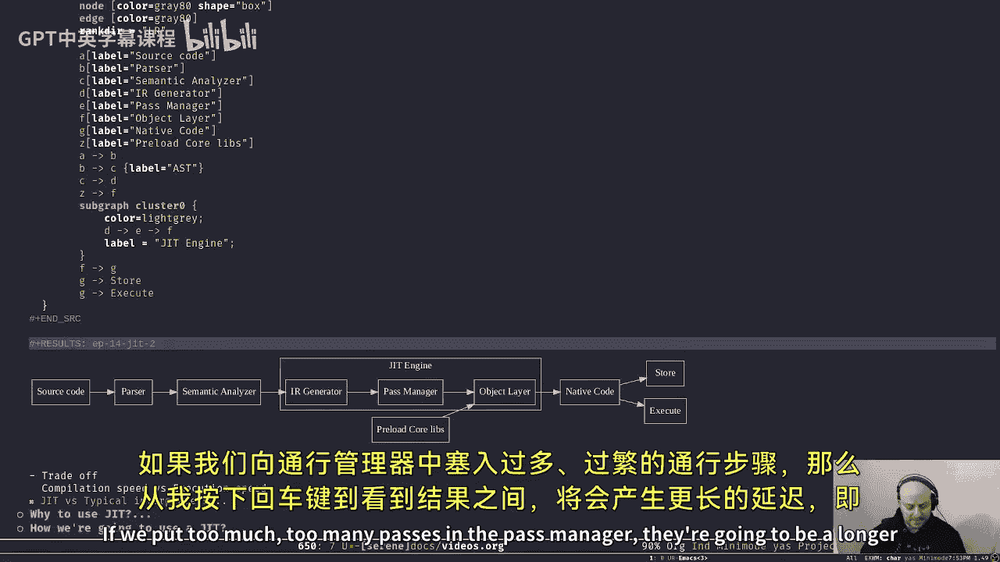

Between like since the time I press enter till the time I see the result。

 there's going to be a latency there， like a larger latency and bigger delay。

Which is not a good user experience， but if we run the JIT as part of our compiler。

It makes sense to do it because like if it takes more than few even few minutes。

Who cares like the end result is more important than the compile timer？Obviously。

 it would be nicer to have like a shorter compile time as well， but。It's kind of。

 we can kind of ignore that fact。

But at the same time， if we put like if we use this Jit engine at runtime。

 this startup process like preloading the core libraries can be like a huge deal when we start the process of whatever language we have we have to wait for a few seconds for the object layer to load everything single in memory or other type sort of magic it might does right so it's a tricky business it's a trade off we have to design our J engine based on what we really need and based on different scenarios that we have for example。

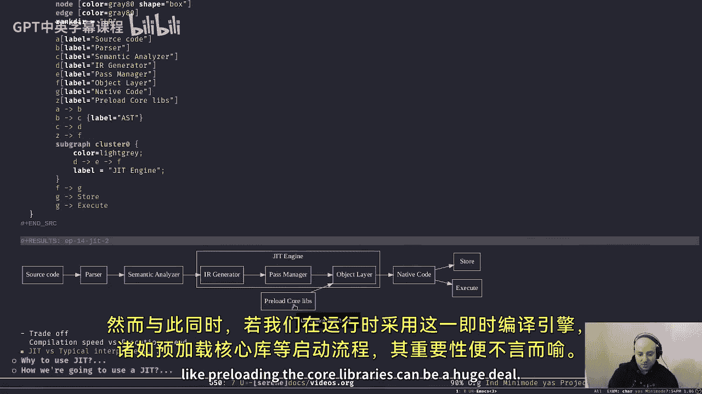

嗯。In Java， right， so。Java has two different like two main components。

 there's a compiler and there's a runtime， right？So there's like。When in any JVM language， like Java。

 closure， scholar， Kathleen， whatever。All of them parse like they work the same。

 they parse the source code， they run the semantic analyzer and all that。

 but their compiler job is to compile the source code to a Btecode right so when you end up with a J file that Ja file is just a zip file full of different bytecode every class compiles to a Bte code like a dot class file。

And then at runtime， we pass that Java file and that byte code to a JI engine to a jet engine and that engine reads the input like the input of that engine is the byte code like a Java byte code and the output is like native code right so it's a。

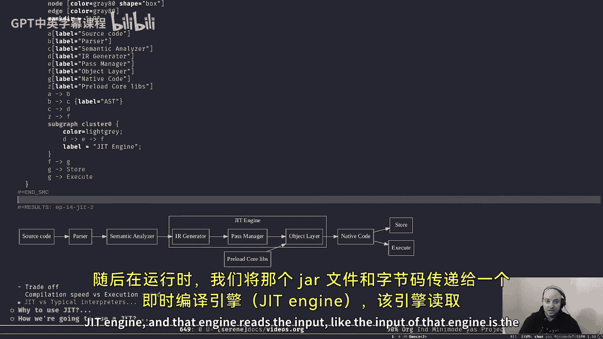

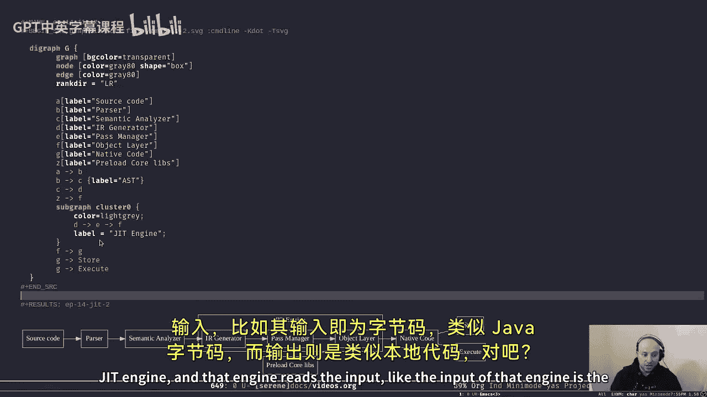

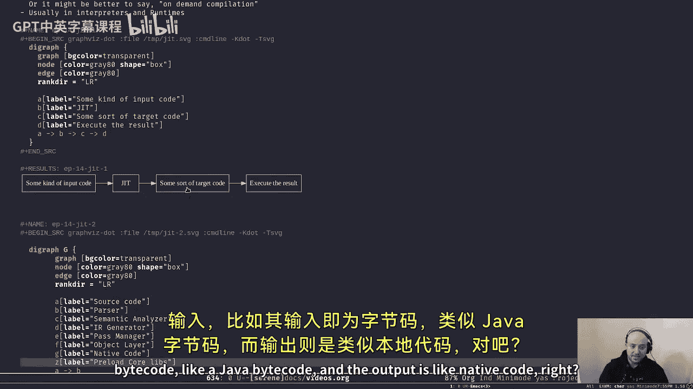

Git engine that runs the bytecode generates native code out of the bytecode and runs it right。

 so it's like a two phase operation in Java。

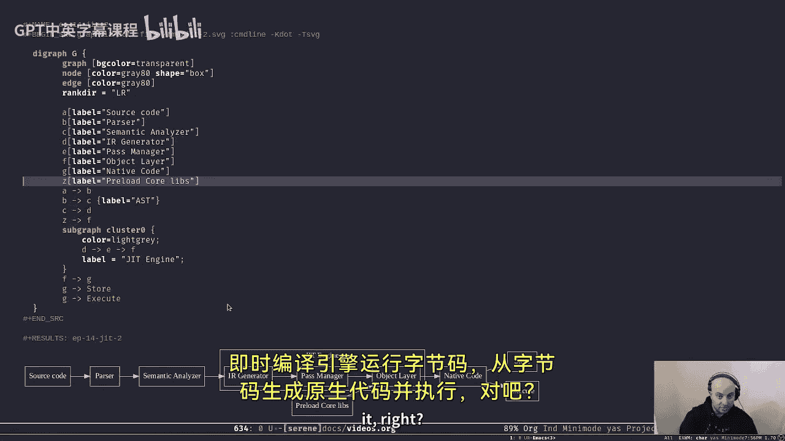

So that's a design decision that the Java team made and based on different scenarios we have to come up with a different design。

No two JIT engine might be similar to each other and in fact like I tried it three times with three different approaches that I'm going to talk about them in a bit。

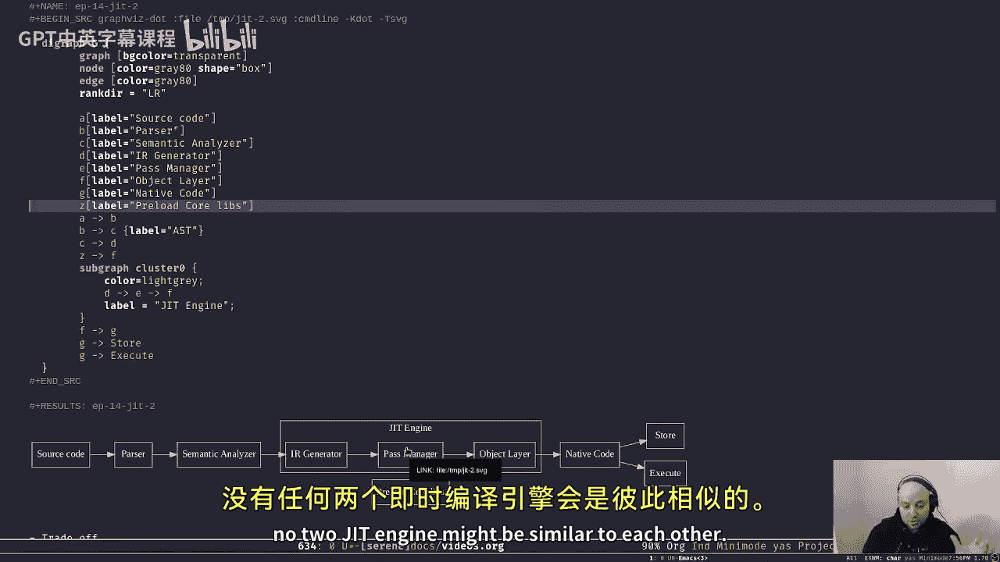

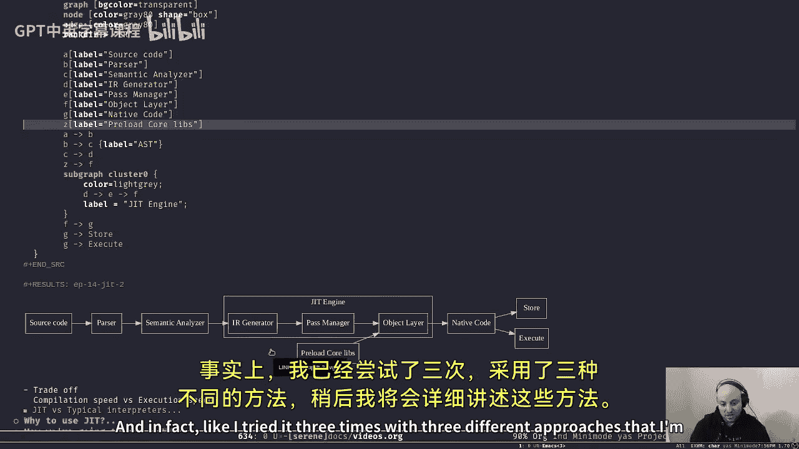

And， well。Each approach has some pros and cons， but at the end of the day。

 I have to see what works for me and what scenario is kind of the best for our own compiler。

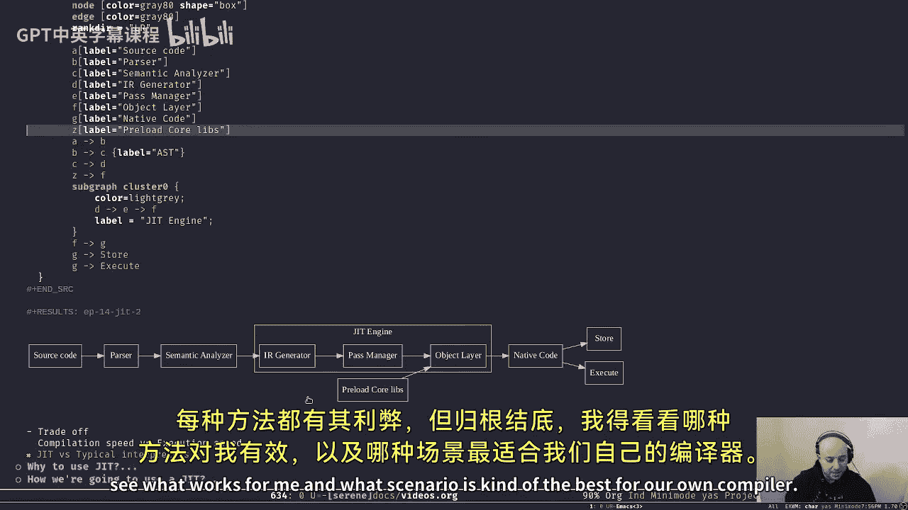

So。Also， one more thing that I need to talk about before moving to why we need to use a JIT is that。

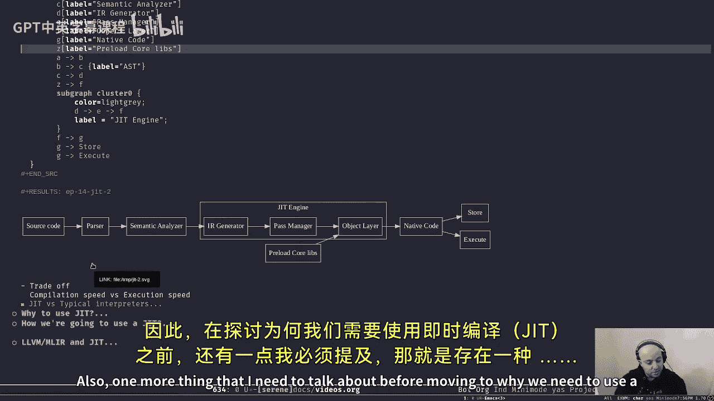

嗯。There's a kind of a， I had this discussion with a friend of mine and he kept comparing a JIT with something like Python with an interpreter。

So。To to clarify the situation like theyre kind of they work the same。

 but they're not the same when you pass a source code to an interpreter that interpreter knows how to run that source code so。

the actual execution unit is the interpreter itself， right， but in case of a JIT。

 JIT just knows how to compile that source code into some native code or some form of a target code。

And then asks the native platform to execute that， right？JIT itself is not a runner。

It can run the code obviously， but it just compiles the input to an output and。

As the platform to run it。In case of an interpreter， the interpreter itself is the。

The unit that executes the codes， it kind of the interpreter knows the instructions in the source code and like。

It might say okay， this is an instruction one I have to do this， this is an instruction two。

 I have to do this， but JIT is like okay instruction one，23。

 I have to compile them to this thing and。Fed it to the platform to run it， right。

 So there's a difference like a。It's easy to me， but it can be like a deal break later on。

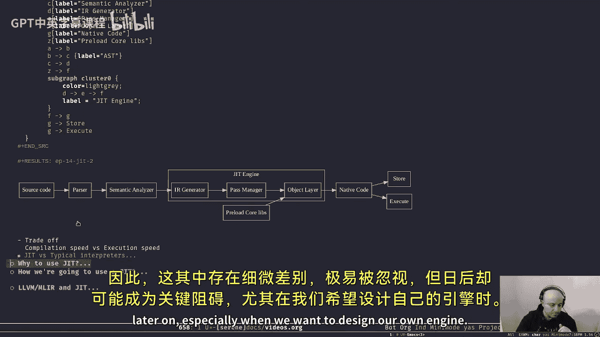

Especially when we want to design our own engine。So why do use a JIT first of all？Popular languages。

 popular interpreters use J IT to make things to run things faster。 Again。

 air code because speed is just relative， you know in。

Relative to what make it faster relative to what probably relative to jless kind of workflow。

 but it's again， it's a trade of。Just having ajiit doesn't mean that it's going to run faster because the jet engine can have some details that might make things even slower。

One other thing is to make to speed up the compilation compilation process。

 we're going to talk about it in a bit， but basically。

Java is doing the same thing instead of aiming like the Java compiler instead of compiling everything to the native code from the like。

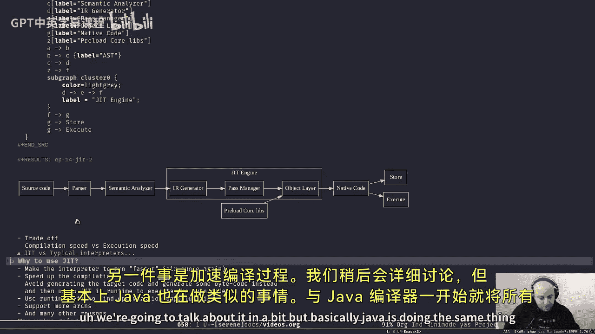

From the Gigo， it actually compiles everything to the bytecode as I mentioned。

 and later on use a jet engine to compile that to run that bytecode。

 so it's kind of a shorter process of generating some byte code rather than generating the entire native code。

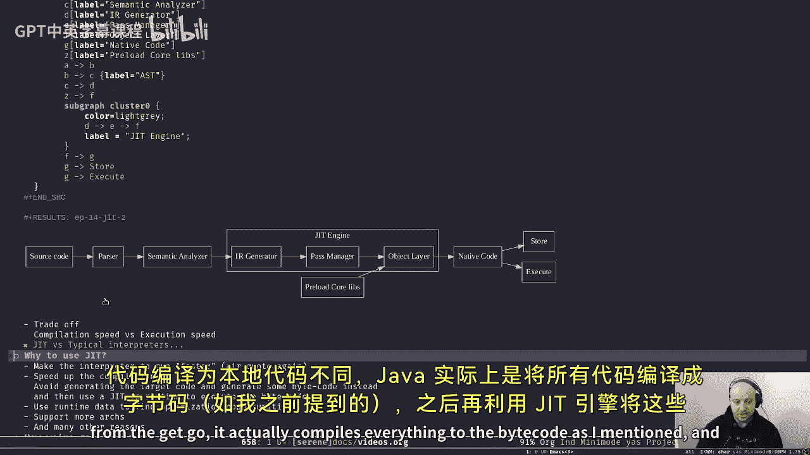

That can help as well。

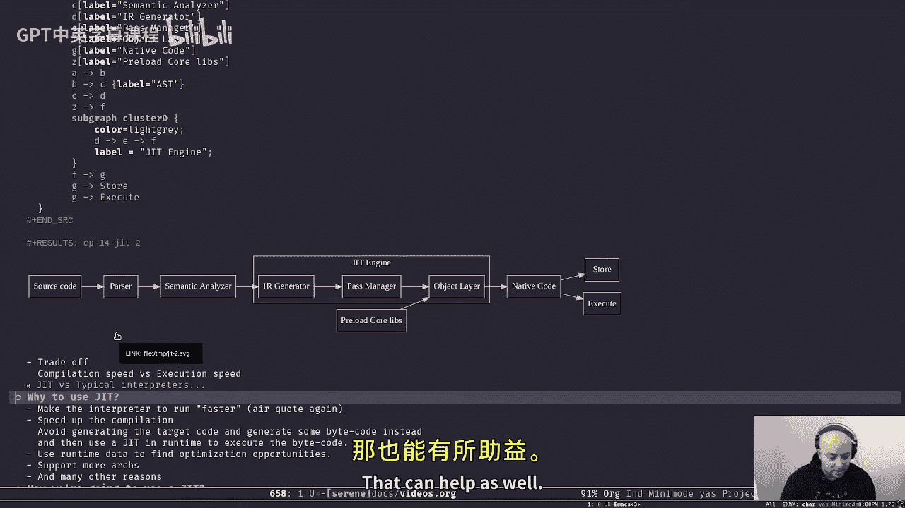

Also。嗯。It's another approach that Java compiler takes based on some runtime data。

 we can choose some optimization that we might like our G engine might do on compilation time right。

 sorry， while it's compiling the。

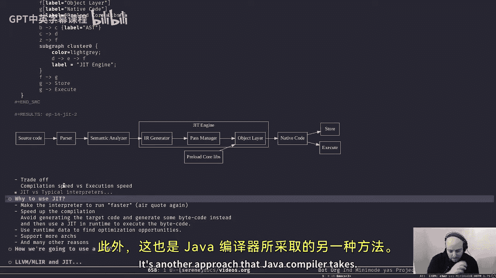

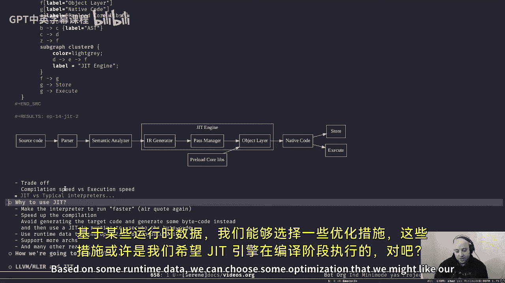

Input code to the target code。And finally。Since again， I'm a Java example， by the way。

 I'm not a Java fan。To be， to be honest， I don't like Java that much。But that。

There's a lot to learn from other languages， including Java。

Another thing is the way JavaWA does it when they generate everything。

 when they compile everything to a Btecode and they pass around the Bte code and compile use the Jit in the target platform to just in time compile the Bte code to the native code。

 it means that。

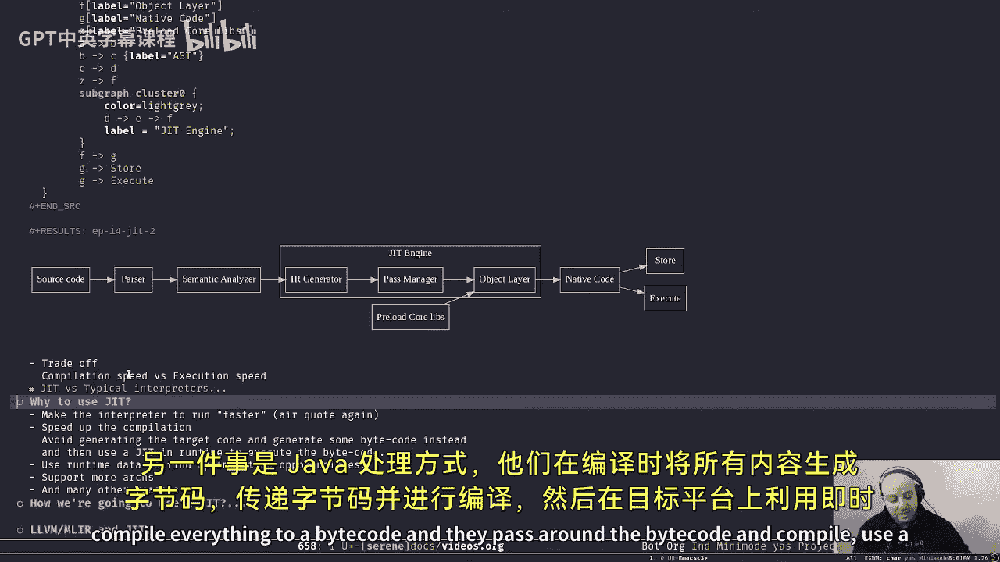

Just by creating the like。Creating another Jit for another platform， they can support a new platform。

 right？In our case， that byte code is kind of similar to our IR so we can actually compile stuff to the binary format of LLVMIR。

 pass it around and use a platform a specific G engine to run them。That way， we can， like。

Easily add support for new architectures。And so many other reasons。To use a JIT。

 but these were like these are the most important ones。

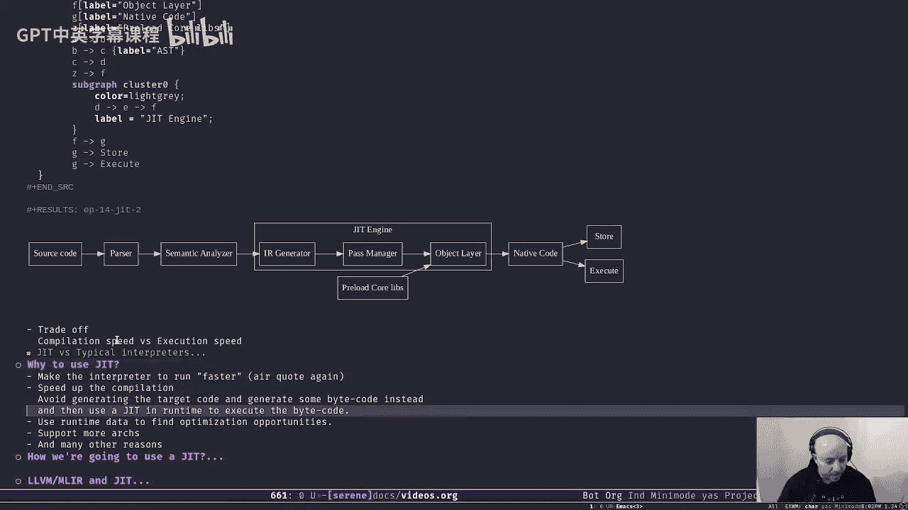

Now how are we going to use the JIT？The first reason that we need a JIT。

 as I mentioned in previous episodes。ICan't remember which episode it was。

 but if you're working on working on a static compiler like I don't know。

 like a language similar to C C++。Go rust or stuff like the like static languages。

 you don't need a JIT because。

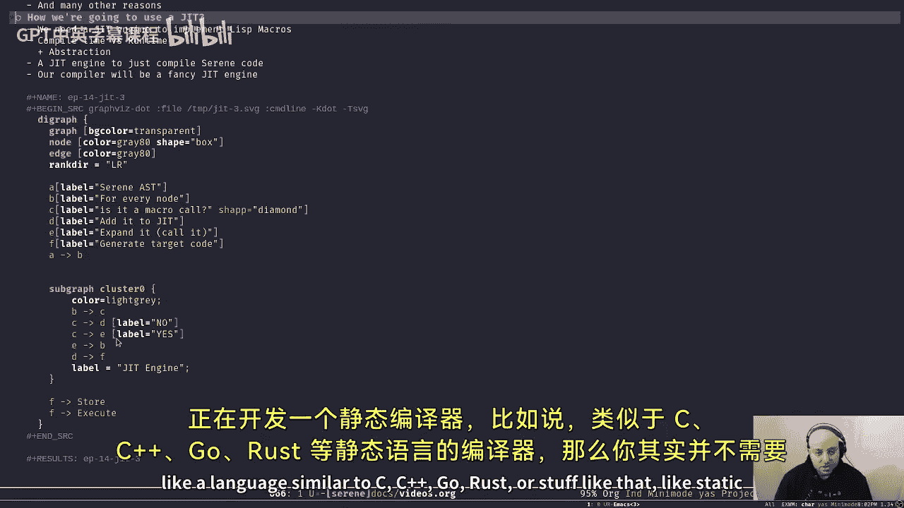

Your user will write some code， feed it to your compiler。

 you're going to compile it at compile time completely to native code and just run that native code code and everything would be grant。

 right？But in case of a least， it's a little bit different， right？

I don't know whether you you're a familiar with Lis or not。

 I highly recommend to learn about Li in general， there's a lot to learn， it's like amazing。

But these micros are。Amazing， I just can't say that I have to show you， right？So let's go back to。

 let's create an buffer actually。嗯。

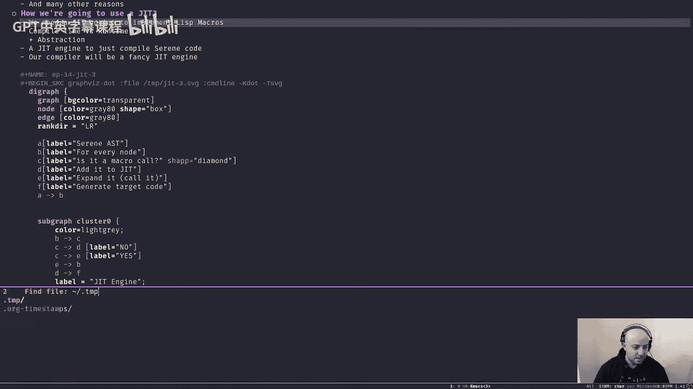

Pep。So。As you know， like if I define a function to understand macros。

 I first need to tell you about functions， you already know about functions in any language。

 but let's go。Read do like a really simple example here。

 Let's have a function that adds one to its input right I execute that function and then I can actually call that function。

 You can see the result on the bottom of my screen， right。Bottom left。

 as you can see when I evaluate this expression， which is a function call。

 Ive called that function with input like the input value is4。

 it adds one to it and return5 as the result the entire process happens in runtime so when I call it function that function call happens in runtime。

The difference between a macro and。Function is that macros run on compile time， not on run time。

it might be a little bit hard to understand at first， but let's consider this example here。嗯。嗯。

Why not？ Let's do it like this。嗯嗯嗯。Oops， os， sorry。So， on my。哦。Yeah。Or。Name for example。Okay。

When I evaluate this macro， now I define a macro called ABC1。It gets two parameters x and name。

 if x is， if x isil it's going to return Neil， otherwise it's going to return message and replace the value of name。

It here like it's like a template， right？So if I run it。Let's A。You can see that it's like pla sound。

 right？To this point there's no difference between a function and a macro。

 but the difference is I can actually expand this macro to see。What was the micro。柠檬哎。Y。

 as you can see， let me actually。

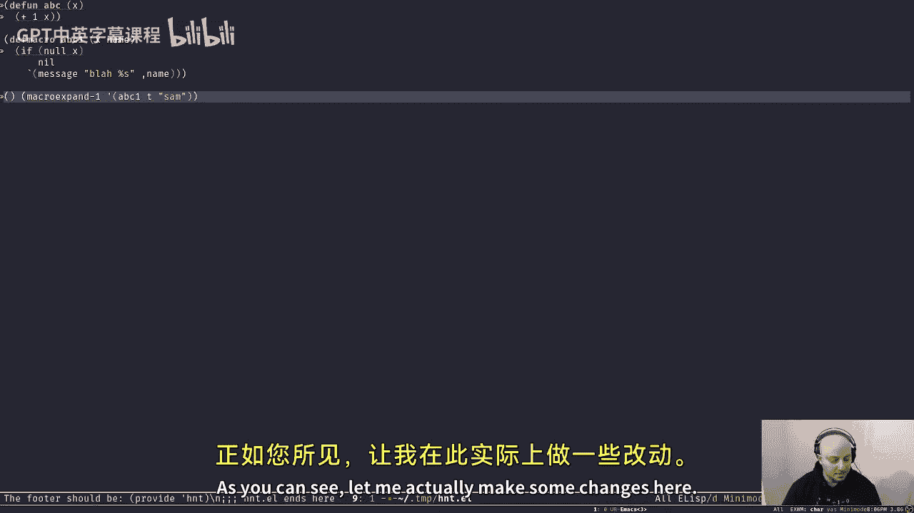

Make some changes here。 you can see the result on the right pan。😔，If I run this code right now。😔。

As you can see here。This macro call， this function call or macrocol。

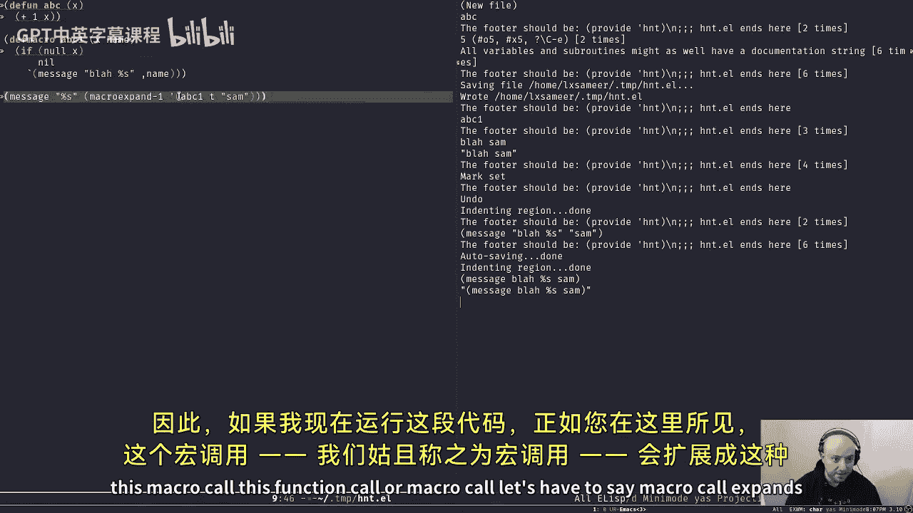

Better to say microco expands to these four。 right。

 So what happens is on the compile time when the compiler is trying to compile。

This code basically it gets to this micro and then。

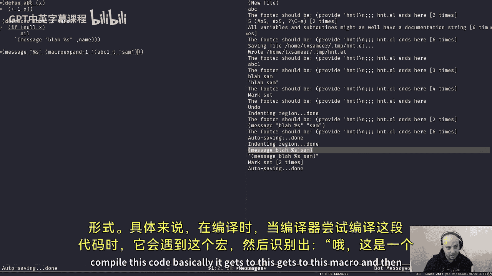

It figures out that okay， it's a macro， I need to expand it， it expands it to another reform。

 another expression and replace this call with that expression and then compile it again， right？

It does it till basically it can find any macro call again。

 right so it resolve all the macro callss and end up with just pureX runtime expressions and finally it compiled it and run it in our case。

 right？

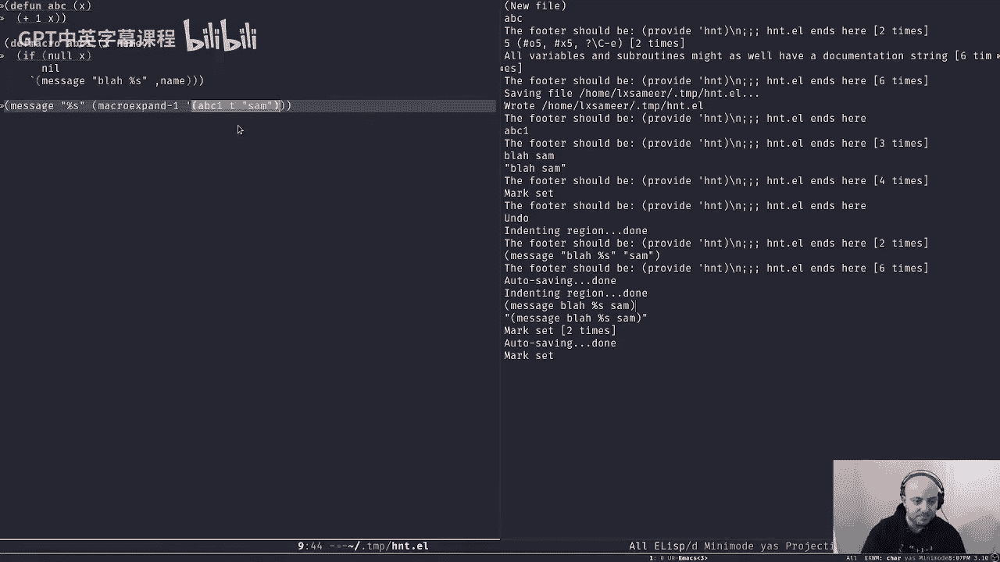

So in order to do this。In order to do this， we need to have a JIT I'm going to show you how it works in a bit。

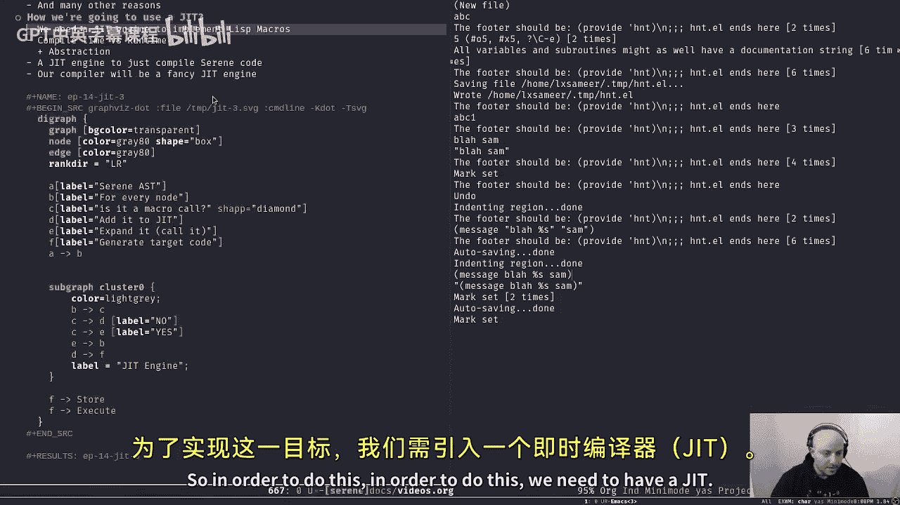

So we're going to have like in all the list languages around。

 there's a concept of compile time versus run time。Actually， it's not。Specific to lists。

 every compiler has every language has a compile time and a run time every。

Language that as a compiler。For us in order to。Sorry。

In order to be able to actually make things happen and be more flexible。

 we're going to make some abstractions and abstract the notion of compile time and time away from the language。

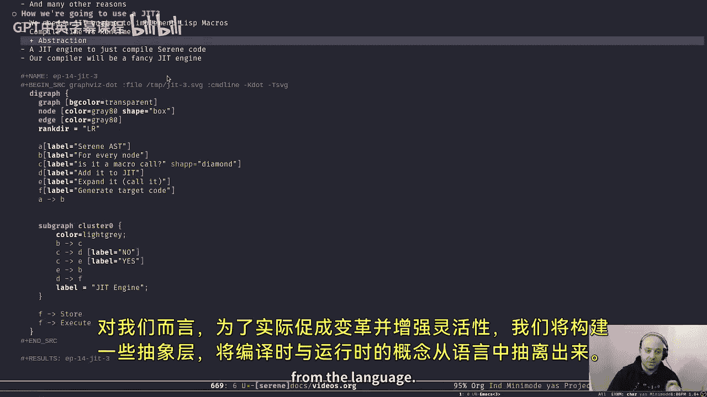

So in our case， we're going to have our compiler would be just a jet engine， right？

As I mentioned before， unlike static languages that doesn't need a like a Jit engine in general。

We don't like we don't need to statically compile a Lsp， it's a dynamic environment。

 so we need a jetT engine and our compiler is going to be just a big fancy jetT engine。

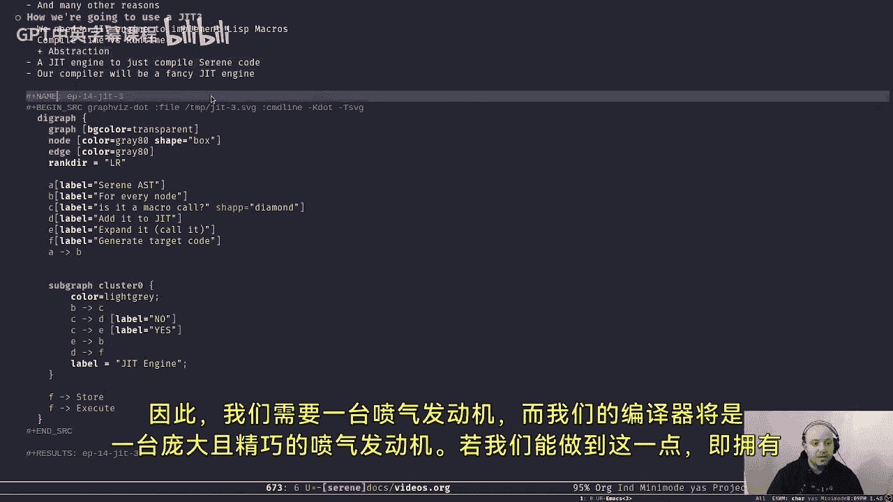

If we do this， if we have like a good jet engine running， we pass a like a s source code to it。

 it's going to generate some native code。

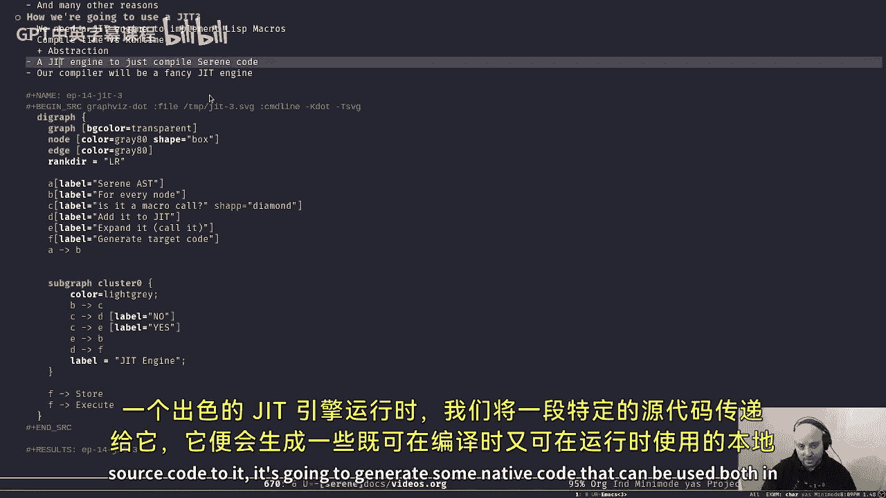

That can be used both in compile time and run time as well。

So it' kind of makes this distinction of compile time and run time kind of blurry， right？

Like we don't know whether we are in compile time or run time。あ。

ItIt makes a good abstraction if we look at our compiler that way。

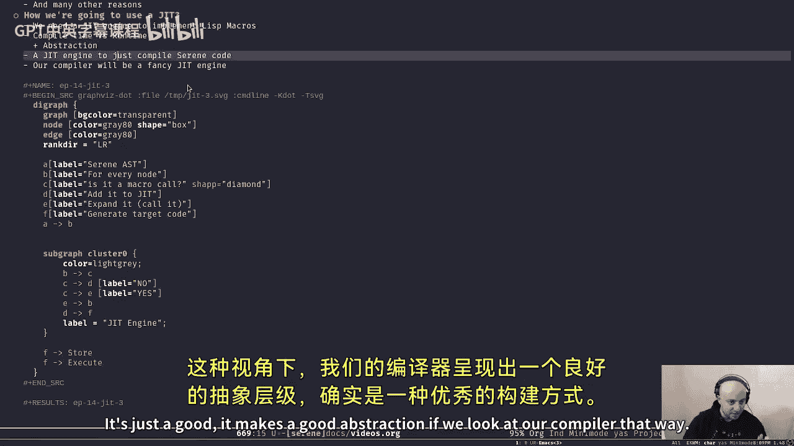

Again， to show you some pictures and graph of how it might work。

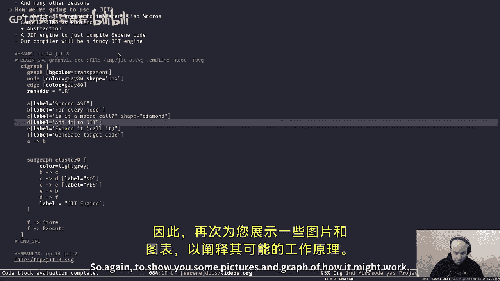

As you can see here。Like this is in my head and it's like super simplified rational or jet engine。

We have some sort of serin ASD when we read the serene code。

 we turn it into an ASD and we make sure that it's semantically correct， right？

And then when we pass it to the jet engine inside the jetT engine。

We kind of iterate through that ASD， look for every node， look at every node in the ASD。

Is that not macro call like are we calling a macro if no？Fine，Add it to the JIT。

 generate the target code and then based on the input parameter of the compiler either。

Genererate a like executable binary， like a traditional compiler or executed。Right there。

 like a rip environment， right？Okay， let's continue from here from this note here and then I'll talk about the main point here。

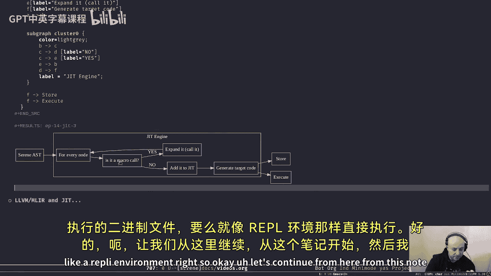

So if the node was a macro call， what happens is we're going to expand that macro。

Expanding a macro means calling the function that。That micro describes。In general。

 a macro and function are exactly the same， right， They're just functions， but they run。

In different times， a macro is a function that takes whatever input you pass to it and generate another expression。

 right？don'We're not talking about the type system yet。It's going to make things more complicated。

 let's leave that aside。Like macros are pretty simple。Exactly like functions。

 but they return expressionursions and they're especially because our jet engine know that if we call it macro。

It needs to replace the call to that macro with the returned expression。

And then we're going to loop over。through our nodes again right if the return value of that macro was an expression and itself was a macro again we're going to expand that one as well so usually it might happen that。

We're going to end up in a chain of micros and we need to expand all of them。

If we leave our abstraction out of the picture for a moment。

Like the simplest way I can describe it is that in compile time。

 you're going to run a Jit engine that。Make sure that we have no macro call left in our AsD。

 expand every macro call to the。Expression that it actually generates and then compile that ASD into a native code。

 which is in turn is going to be like a。Executable binary and we run that executable binary like any other executable binary for runtime at runtime。

 right？But now let's talk about our abstraction。If we kind of mix the run time and compile time together and just have like a J engine that knows how to compile serring code。

 then at this point when we generate some target code。

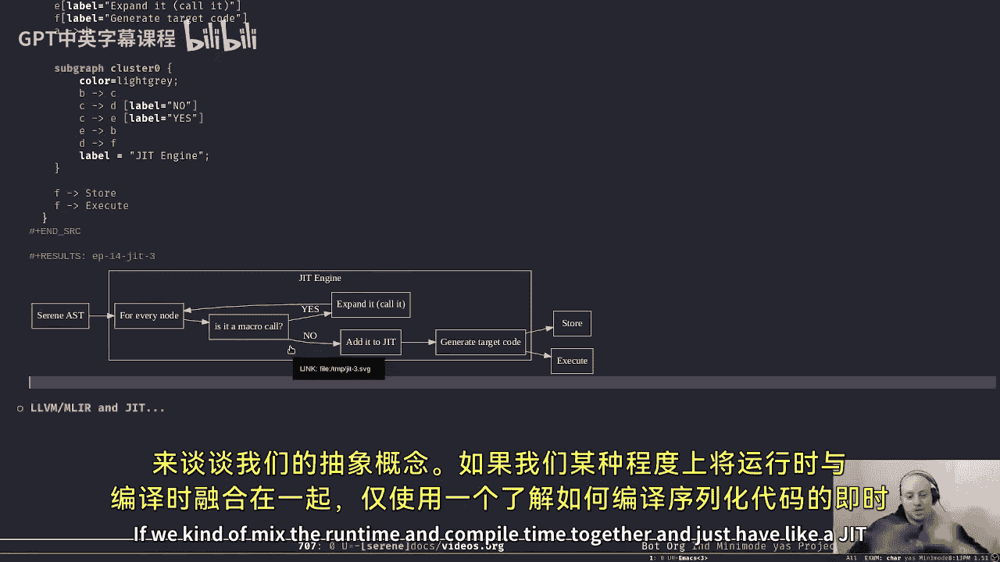

It's up to us to like to decide what to do with it。Either restore it。

 either executed what to do with it， right in a rep environment， they store the。

ASD is going to come from like an interactive shell。Excuse me。Users， as I show you showed you。

 users will like type stuff in the rep and we're going to pass like a line of code basically we're going to pass that line of code through the pipeline it's going to be evaluated in our just in time compiler it's going to be like we're going to generate some code for it and then we executed just there right invoke the generated code but in case like if we decide to run the compiler as like a traditional compiler we can just store the entire target code in a file right and the input code would be like files after files of input like third code。

And also。By doing like doing this means we can run our Jit engine again in runtime。

 you know users might like import the Jit engine， set it up and run it to do some stuff with it basically since like least macros are。

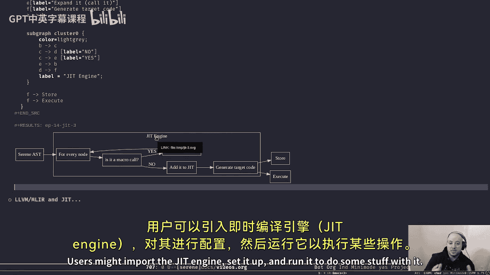

Really good and like a really nice way to expand the compiler because they run in compile time。

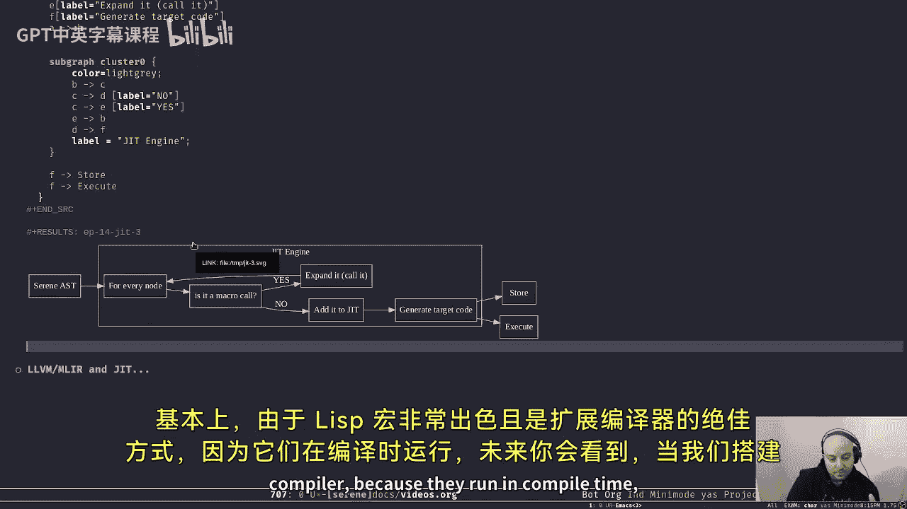

You'll see in the future lab we're going to when we set up the wiring of our compiler。

 what we're going to do is to kind of lay down the basic foundations of a list like have some。

Create the macro system basically， and then we're going to expand our compiler using that macro system and write our compiler in the Se itself。

But in order to do that。We needed just same time compiler。

 an engine to know how to generate code out of setting code at run time， sorry。On demand。Also。

 one more thing before I move to the next header。Having a just adjust in time compiler have some advantages as well for us。

Imagine we want to run our justin time compiler or jet engine gene as a traditional compiler。

 we pass like a code base to it and we ask it to compile it to target code and then we're going to store it in。

Binary in native binaries or shared libraries or whatever， right？

Since it's going to be an on demand compilation。When we read the entire source code and we created the ASC and。

Even like generate the IR for all the modules， all the ASs that we have。

 we end up with few dozen modules or。I don't know any number， right？Then。

In case of like an executable binary， there's always a entry point to the binary， right。

 a main function， for example。We can ask the adjust in time compiler to okay invoke this function for me or like compile this function for me and then it would be up to the adjust in time compiler to figure out what functions the main function are using is using and like it creates like a dependency tree of different functions。

 like a control， like a controlflow graph， if you don't know what that is don't worry I'm going to talk about it in future episodes when we get to the time that we need like CFCs sorry。

Yes， C Gs。so it's create like a control graph it can like eliminate that code I don't know like just compile the stuff that we need for that entry point so I don't know we might have a project that。

Has like 50 functions， but depends on the entry point of that executable binary。

 we might end up compiling only like 15 functions， right， like 10 functions。

And those 10 functions only would end up in our final binary。

 that's one other advantage of using a digitt engine。 it helps us to make smarter decisions。

 as I mentioned earlier。But。Ho works with LLVM and MLIR as I mentioned earlier。

 I tried three different approaches。MLIR itself has a Jeit。That is based on LLVM's G library。

 I'm going to like the org， basically。I tried it， it's really good。

 the input is MLIR modules and you can generate native code with it。It works great。

 but it had some limitations。That might not be good choice for us。

 that was the first approach I tried and I'm going to talk about it。

 we're going to have an episode about MLI or ZIT。Because it might be useful to other people。

And Ceciilla a fun idea and a good idea to study the source code to see how they' done it basically。

LLVM itself has some GitT implementations， MCGit is deprecated。

 I'm not going to talk about it at all， I didn't use it because I knew that it's duplicated and we shouldn't use it really there's a little Git。

And lazy。LLG tax actually， right， so LG is just like a。

G engine that gets LLVMIR modules and compile them to native code。

Lazy Llegitt is like a soft class of Lleggit， which is lazy， it just compiles the stuff。

 compiles symbols right when they get invoked， right？When we want to invoke them， actually。

We're going to have a look at both of them， both of them are based on O versionion 2 library。

I tried both of them as well， they have again some limitation for scenarios that。Doesn't fit syene。

 so。I had to actually use the OcV2 API to create a Giit engine myself I read the code of other like LLG。

 lazy LLG and MLIRG and use their codes and their ideas as like a guideline for myself。But。Yeah。

 that's what we're going right now， it's not finished yet but。

I'm going to talk about that one as well。 It's a good practice， actually not good practice。

 It's a good idea too。Learn more about OrRCV2 to learn like how layers work。

 and how to create a new layer， blah， blah， blah， and yeah I'm going to have another episode about that。

Kudos to the folks in the G channel of LLVM， they helped me quite a lot。嗯。

Just to give them a shout out here。They're great if you like during the during our episodes about Jit。

 if you had any question， either ask me or。Just pop up to that channel and ask the folks they're quite useful helpful and friendly。

This is it for today， folks。In the future episode， we're going to start with the ML Os direct first。

And move forward。In order that you can see right now。

 so our own implementation is going to be last that day I' am going to have more time to finish it。

Um， if you， if you like my work， please subscribe to the channel and consider to leave a like again。

 Merry Christmas and have a fantastic time， take care。

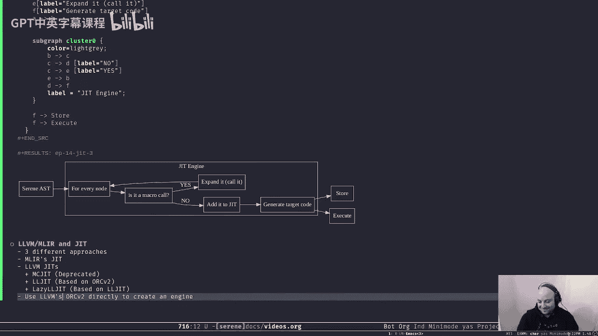