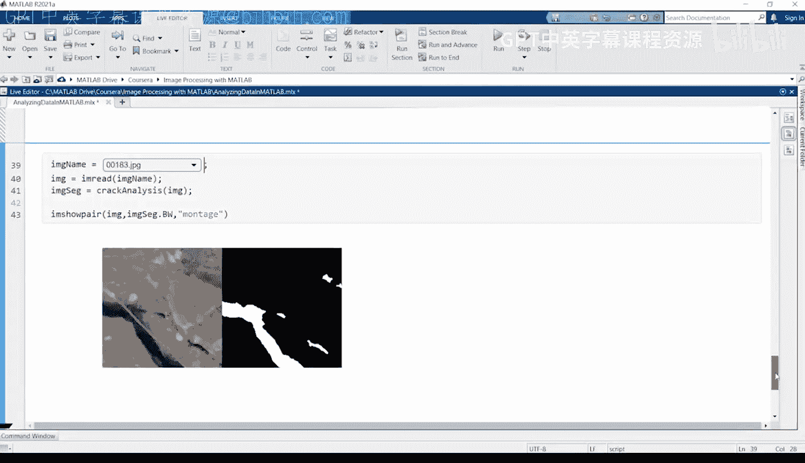
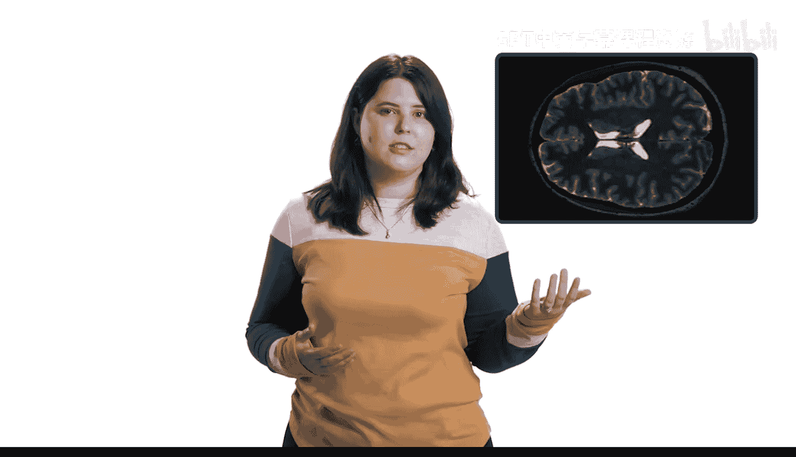
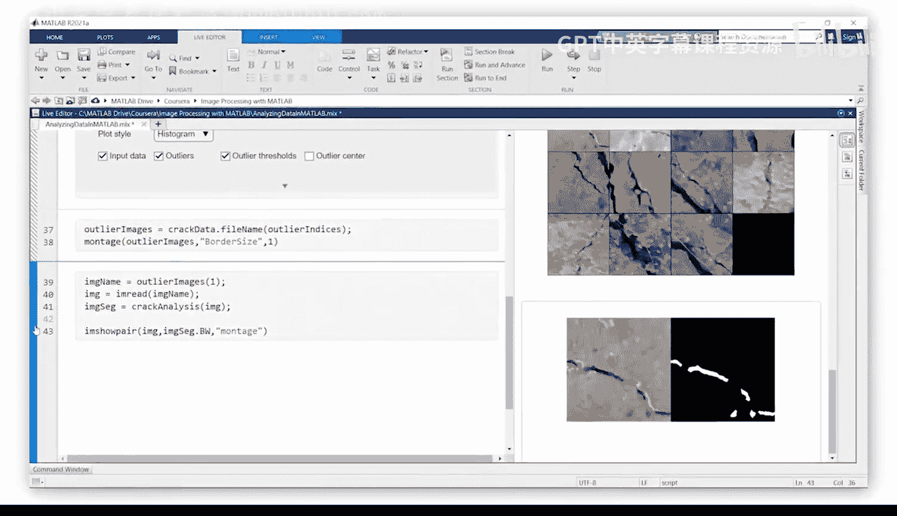
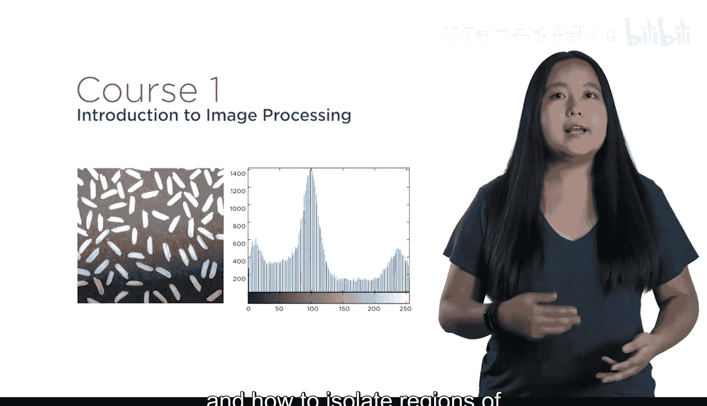
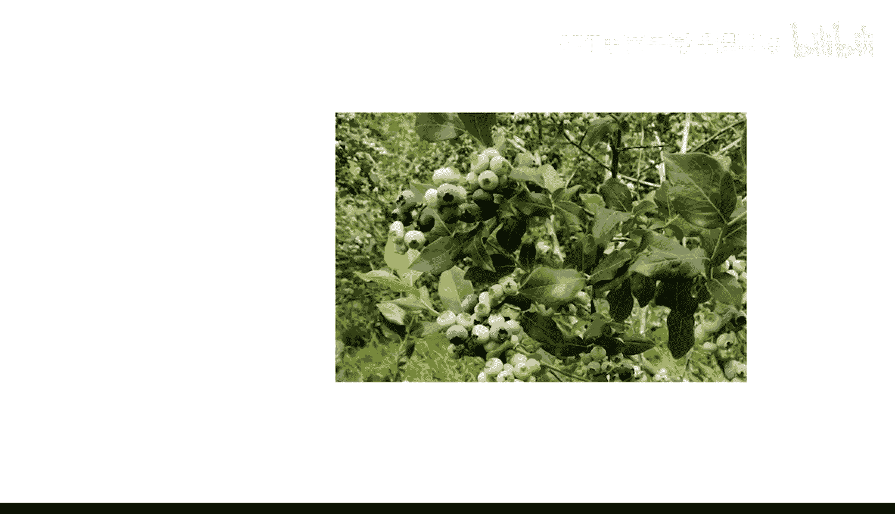
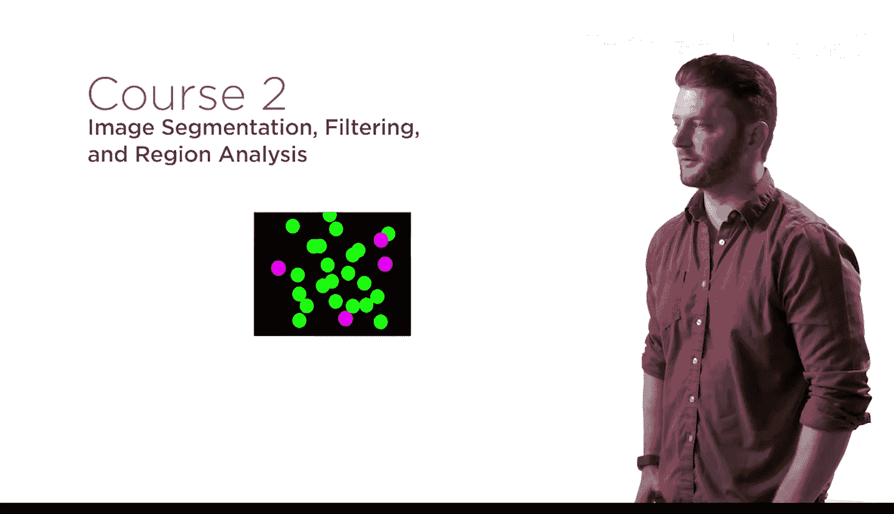
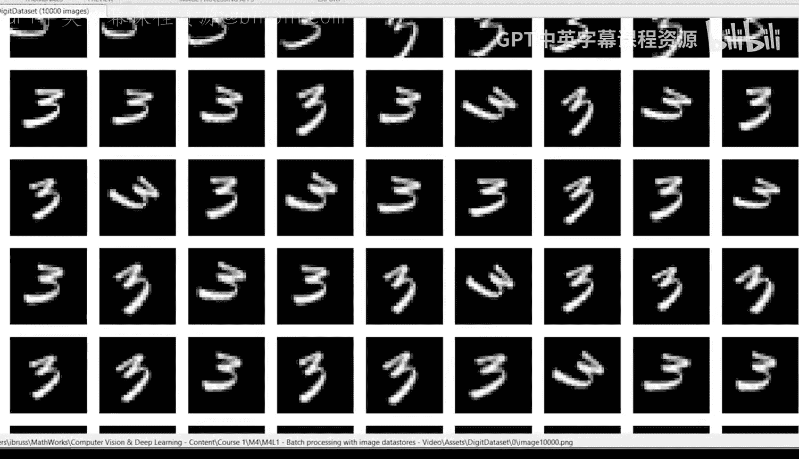
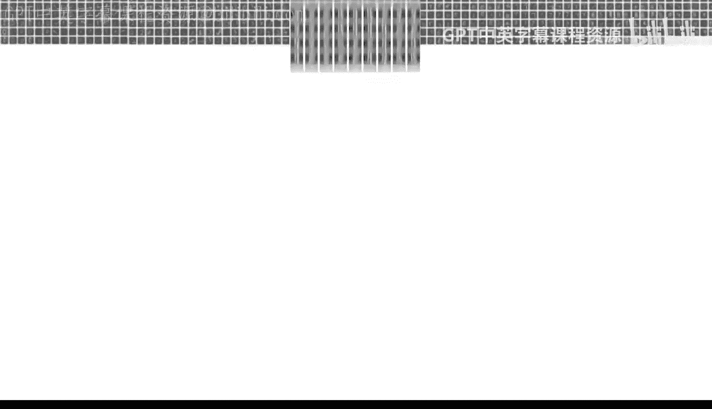
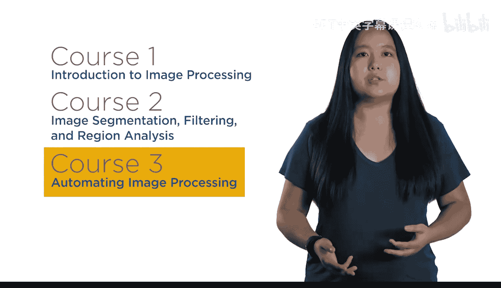
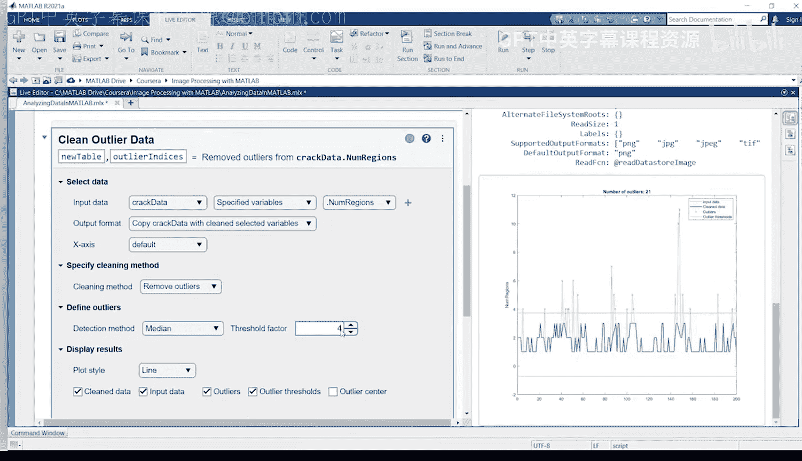

# 1：专业领域概述 🖼️

在本节课中，我们将要学习图像处理在工程与科学领域的广泛应用及其重要性，并了解MathWorks提供的系列课程结构。

从图像中提取信息对于众多应用至关重要。

这些应用包括诊断医疗状况、研究气候变化的影响、设计自主系统以及改善农业。

无论您身处哪个领域，分析图像都是当今许多工作所必需的技能。这就是MathWorks创建《工程与科学图像处理》系列课程的原因。

无论您是图像处理的新手，还是正在寻找新工具来提高工作效率，这个专业课程都适合您。😊，因为您将使用MATLAB来快速执行图像处理任务。

MATLAB专为工程师和科学家设计，包含许多应用程序，使您能够快速测试不同方法并可视化结果。这些应用程序会自动生成代码，以便您可以复现和扩展您的工作。

该系列课程分为三个部分。在第一门课程中，您将扎实地学习如何处理数字图像。

您将学习如何创建常见的图像调整，以及如何隔离感兴趣区域以进行进一步分析。

例如，您将使用颜色信息来识别成熟的蓝莓。

并从卫星图像中计算冰川融化的量。在第二门课程中，您将解决图像分割中的常见挑战。

例如，您将学习减少噪声的技术，以及分离重叠的物体，确保您只隔离相关信息。

重要的是。

您将分析找到的区域，计算诸如面积和方向等属性。通常，您需要将图像处理步骤应用于许多图像，或者可能需要分析视频。

在第三门课程中，您将自动化您的算法以处理数千张图像，从而节省时间和精力。

当您拥有大量图像时，目视检查所有图像是不可行的。您将练习分析结果，以识别需要进一步调查的异常值。

在系列课程结束时，您将把新学到的技能应用到一个最终项目中：在嘈杂的视频中检测汽车以分析交通模式。😊。

您甚至能够处理一些复杂情况，例如当物体被部分遮挡时。最后，您将创建一个视频，其中包含在检测到的车辆驶过时围绕它们的边界框。

图像处理是一项需求量很大的职业技能。无论您是开发自主系统、诊断疾病还是研究宇宙，这个系列课程都将帮助您取得成功。

那么，让我们开始吧。

---

本节课中我们一起学习了图像处理在多个关键领域（如医疗、气候、自动驾驶和农业）的核心作用，了解了MathWorks《工程与科学图像处理》系列课程的三部分结构：数字图像基础、图像分割挑战以及算法自动化，并明确了掌握这些技能对职业发展的重要性。