# 2：图像处理导论 🎼

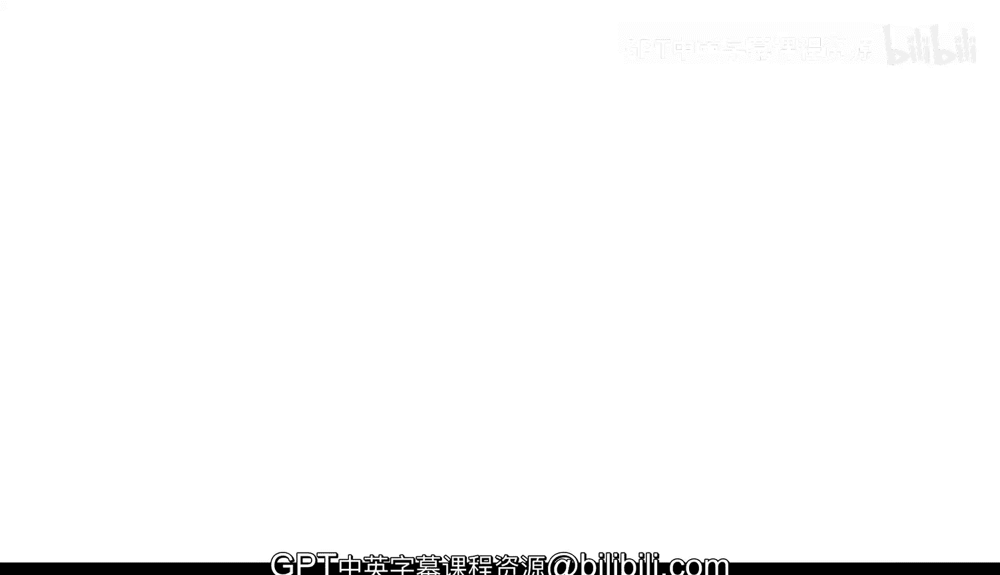

欢迎学习《图像处理导论》。在数据驱动日益重要的世界中，从图像中提取信息在许多应用中变得越来越关键。在接下来的几个模块中，你将学习如何对各种类型的图像数据进行定量的科学分析。

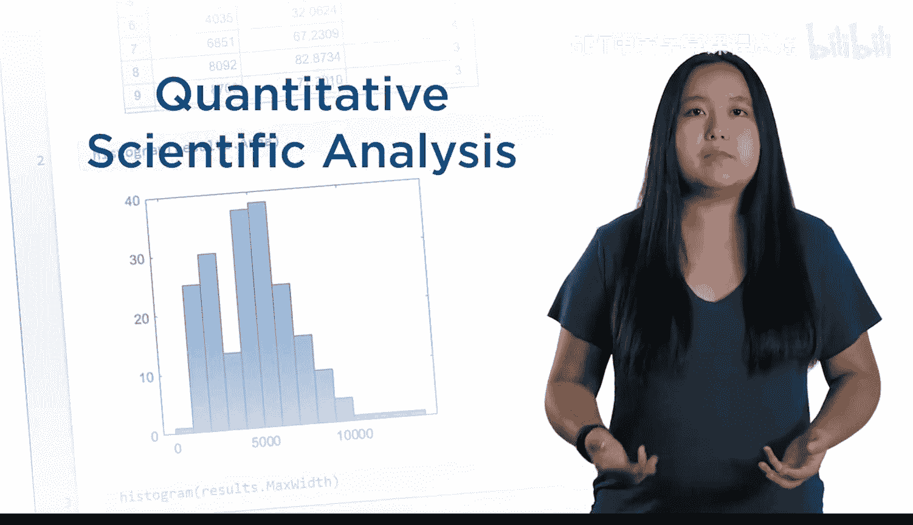

请看这两张相隔两年拍摄的冰架卫星图像。在本课程结束时，你将能够分离出蓝色的融水区域并计算其面积，从而估算冰架随时间的变化情况。

课程首先介绍数字图像。你将学习图像是如何被捕获、存储并导入到 MATLAB 中的。

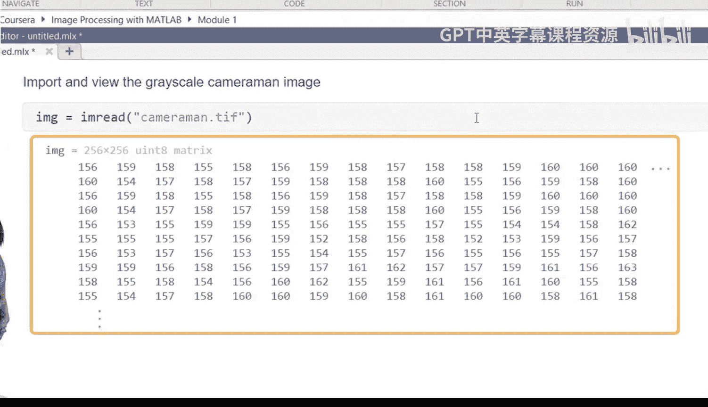

接下来，你将学习对图像进行计算，例如旋转、调整大小以及通过平均来降低噪声。为了从图像中提取有用信息（比如这条裂缝的尺寸），你通常需要隔离出感兴趣的区域。

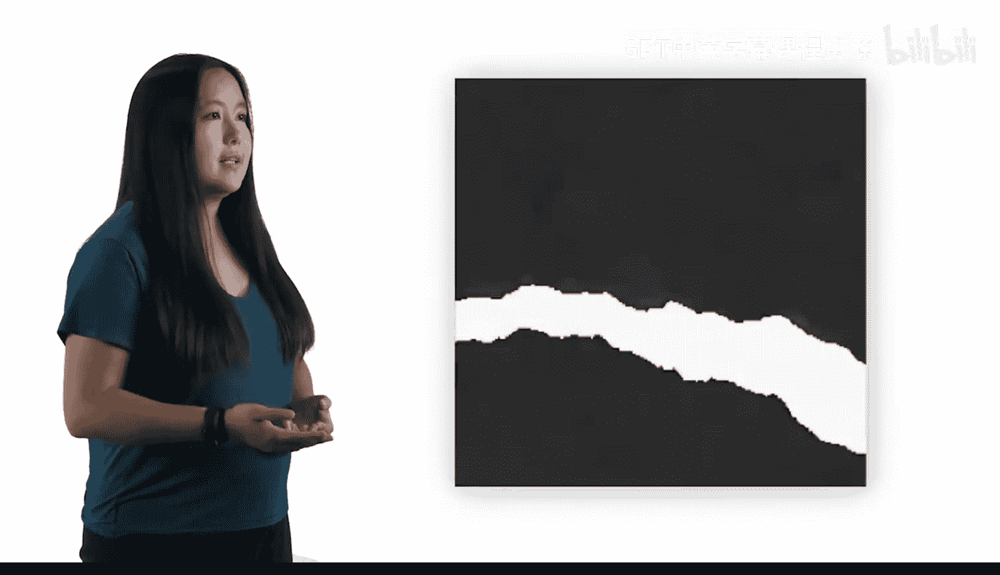

你所采用的具体方法取决于图像的类型及其属性。

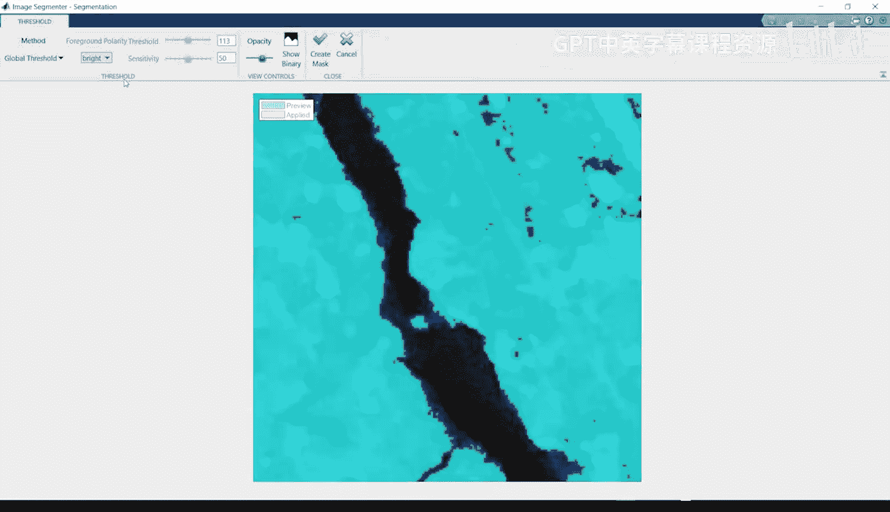

你将学习基于灰度强度或颜色信息来分离图像中区域的不同技术。

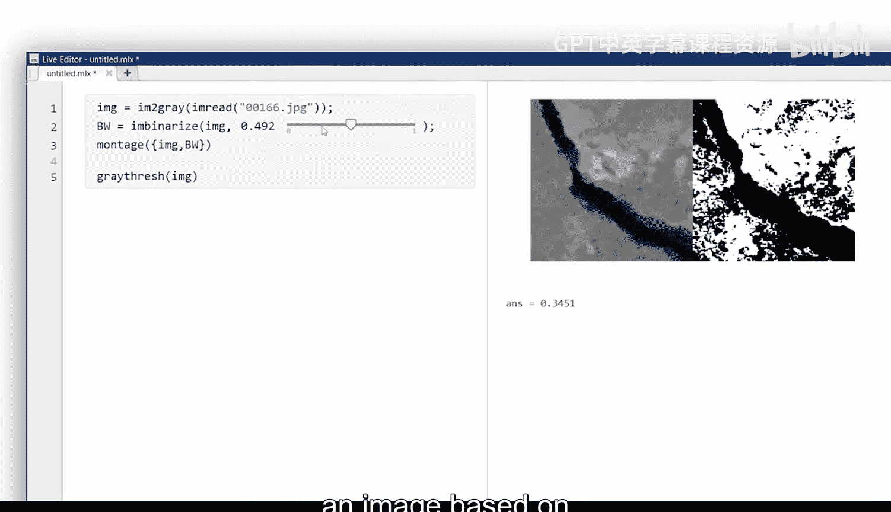

当然，并非所有图像在原始状态下都适合直接处理。你通常需要先对它们进行调整。为了让特别暗或特别亮的图像中的细节更容易看清，你将学习几种改善图像对比度的方法以及它们各自的适用场景。

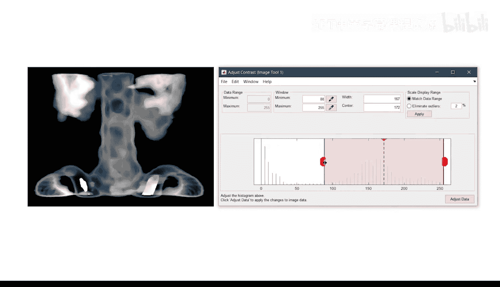

本课程中使用的图像旨在代表你在自己领域可能遇到的情况。

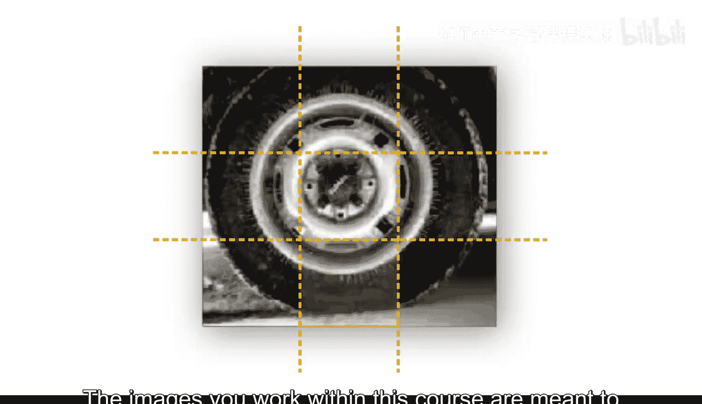

在学习示例的过程中，请花时间将这些技术应用到你自己的图像上。如果结果不是最佳，也无需担心。在后续的专题课程中，你将基于本课程学到的技能，学习更高级的分割方法、处理整个批次的图像。

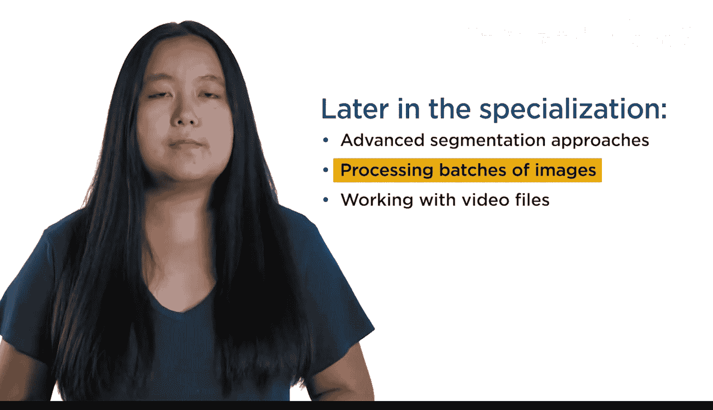

以及分割视频文件。学习本课程不需要任何图像处理经验。但是，你应该熟悉 MATLAB 的基础知识。如果你是 MATLAB 新手，我们建议你先完成 **MATLAB Onramp**，这是一个免费的两小时入门教程。

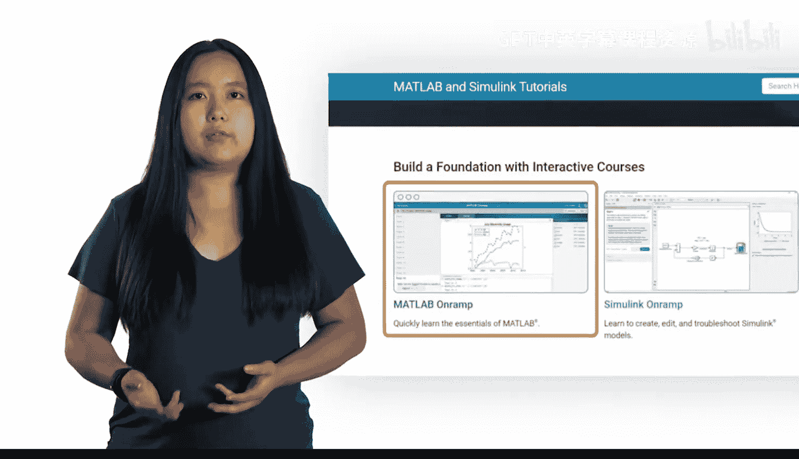

我们将在讨论区随时为你提供帮助。

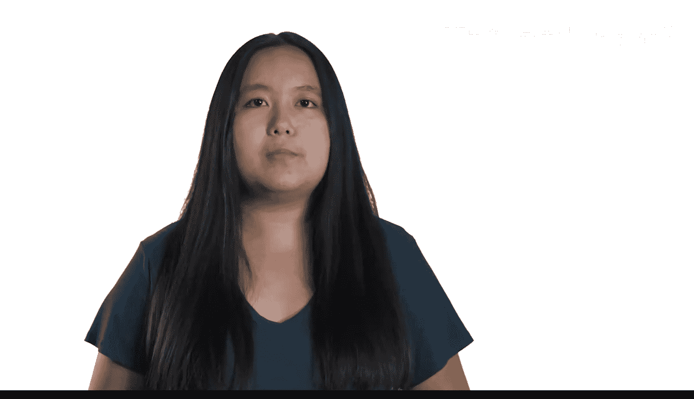

祝你学习顺利。