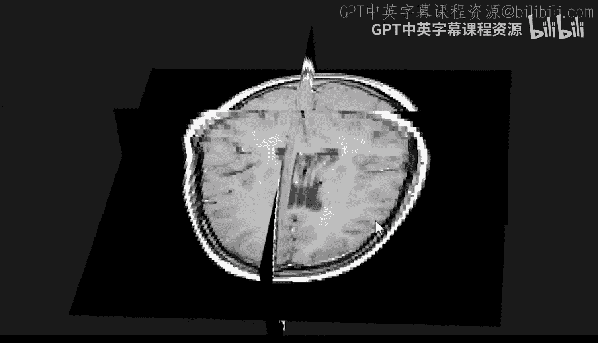
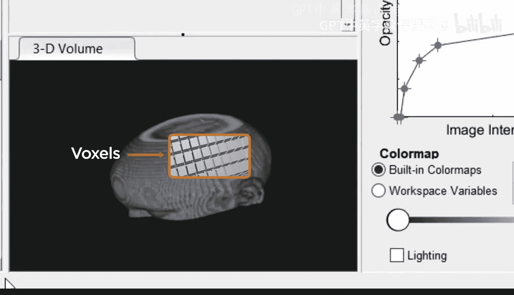
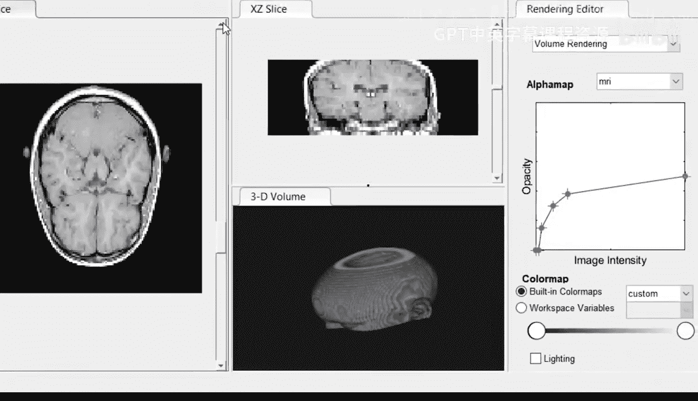
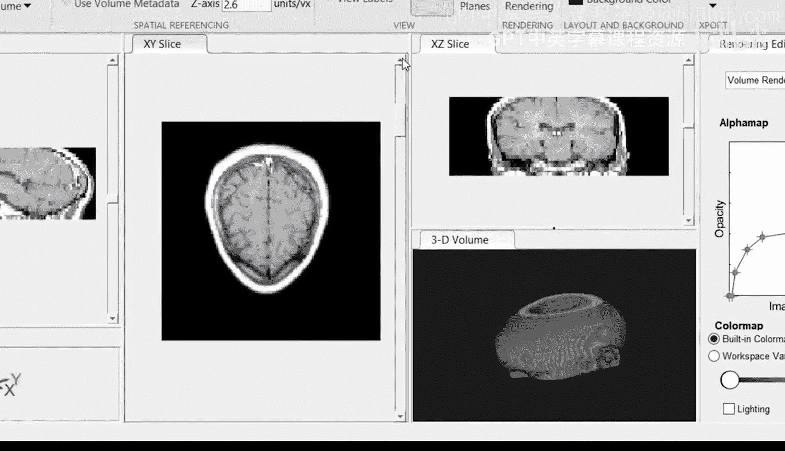
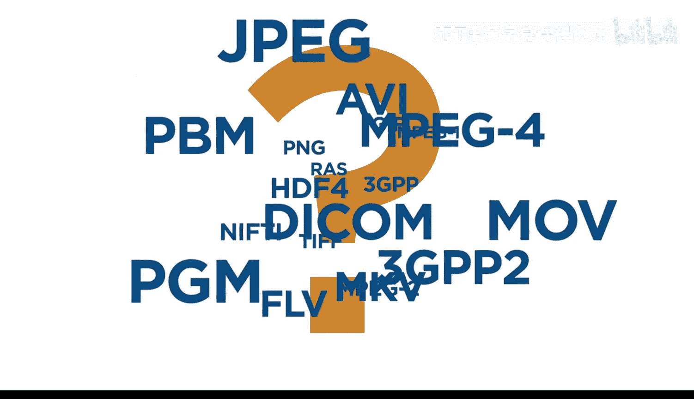
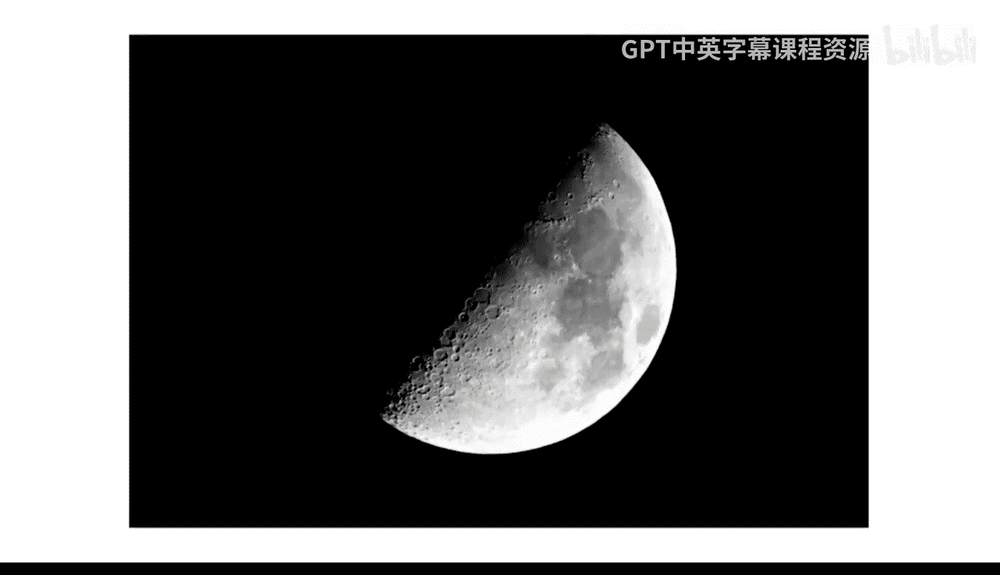
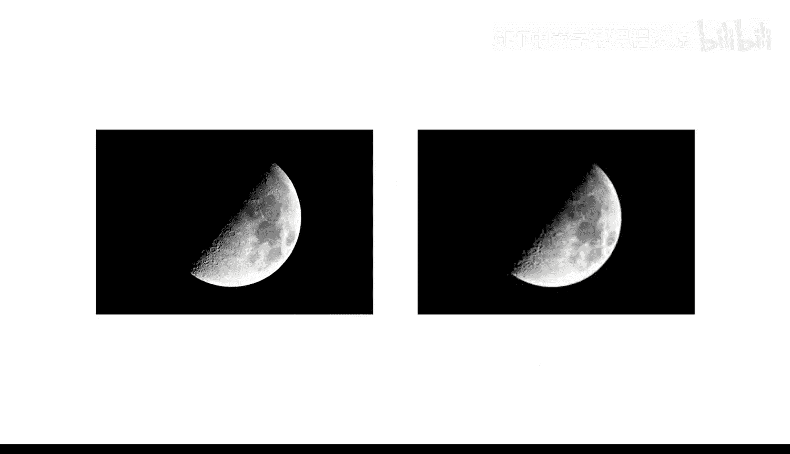
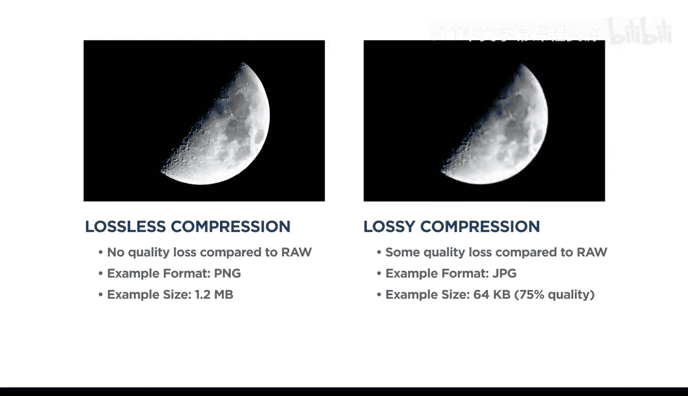
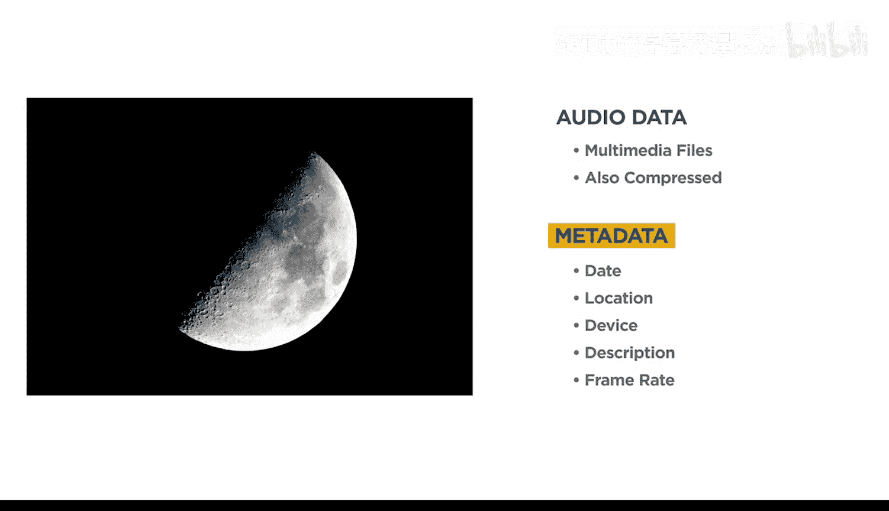
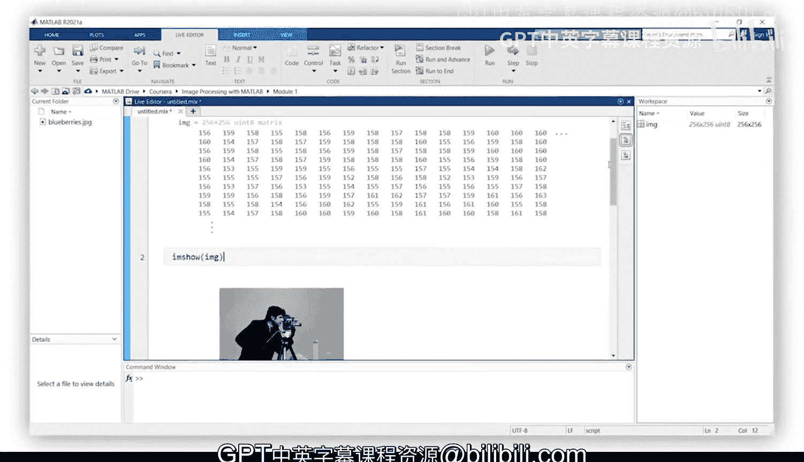

# 3：什么是数字图像 📸

在本节课中，我们将要学习数字图像的基本概念，包括其构成、类型、常见文件格式以及影响图像质量的因素。理解这些基础知识是进行后续图像处理的第一步。

---

数字图像处理被用于解决许多科学与工程应用中的挑战性问题。但在使用 MATLAB 处理图像之前，图像必须先被捕获并以数字格式存储。

## 数字图像的捕获与构成

数字相机使用电子光感受器。这些感受器利用光敏材料将入射光波转换为电信号，并将其记录为数字强度值。

人类将强度感知为亮度，亮度由光的振幅决定。单色传感器仅记录用于捕获灰度图像的强度值。

为了创建彩色图像，需要使用多个传感器来记录三种不同波长下的入射光强度，人类将其感知为红、绿和蓝。这些颜色分量被称为**通道**，它们可以根据各自的强度重新组合以形成原始颜色。

光感受器通常排列成矩形网格。网格上单个感受器捕获的强度被称为一个**像素**，像素是数字图像的最小组成单位。用于构成图像的像素数量被称为**图像分辨率**。

分辨率通常表示为像素总数或垂直与水平方向上的像素数量。通常，更高分辨率的图像可以捕获更多视觉信息，从而获得更好的质量。影响图像质量的其他因素包括传感器效率、对焦以及曝光量（即允许到达传感器的光量）。

## 科学图像与三维图像

科学图像也使用人眼不可见但光感受器可检测的波长（包括紫外线和红外线）进行捕获。但这些强度信息仍然可以转换为人眼可见的波长。

除了相机，图像数据也可以由其他类型的仪器生成，这些仪器使用图像来表示非视觉信息。例如，天气图是使用雷达信号生成的。这里，检测到的反射信号量取决于多种因素，包括降水量的多少。医疗专业人员则通过拍摄X光图像或使用磁共振成像来可视化人体结构。

在这些专业领域，当测量是在一个体积上进行时，通常需要处理三维图像。与摄影图像类似，三维像素（称为**体素**）位于矩形网格上。查看三维图像中的所有信息具有挑战性，因此通常选择高维数据的切片，这些切片对应于在特定平面或表面上进行的测量。

另一种你可能熟悉的三维图像类型是视频，因为二维图像帧可以沿着代表时间的额外维度按顺序堆叠。

## 图像文件格式与压缩

数字图像数据的类型如此之多，存储它们的方式也多种多样就不足为奇了。其中一些文件格式你可能已经熟悉，而另一些除非你在使用它们的领域工作，否则可能不熟悉。

为什么有这么多格式？一个原因是图像数据可能具有不同的维度，以及它们代表的是单张图像还是一系列帧。另一个原因是每种格式使用不同的压缩技术。

大多数文件格式使用压缩来减少存储图像所需的内存。这是因为传感器记录的信息（称为**原始图像**）需要大量数据来存储，即使是低分辨率图像也是如此。而图像数据集通常由数千或数百万张图像或视频帧组成。压缩的目标是尝试用最少的内存存储最多的视觉信息。

压缩算法可分为两种主要类型：**无损压缩**允许精确再现原始图像，但文件大小的减少通常有限；而**有损压缩**能显著节省内存，但在压缩过程中会丢失视觉信息，因此压缩后的图像接近但不完全等同于原始图像。

图像文件类型之间的另一个区别是文件中可能包含的附加数据。例如，视频数据通常与音频数据结合为多媒体文件。图像、视频和多媒体文件还包含称为**元数据**的附加文本信息。元数据可以包括图像拍摄日期和位置、使用的设备、图像描述、视频帧率等信息，具体取决于图像类型和文件标准。

## 如何选择文件格式

面对如此多的格式，你可能想知道应该使用哪种格式。重要的考虑因素包括压缩与质量之间的权衡、你正在处理的图像数量、图像是二维还是三维，以及你打算执行的图像处理任务。在处理大量图像或执行计算机视觉和深度学习任务时，还必须考虑硬件限制，例如可用内存或处理能力。

然而请注意，除非你计划捕获自己的图像或愿意在格式之间进行转换，否则这个选择通常已经为你做好了。正如你将在下一课中看到的，一旦图像数据被导入 MATLAB，无论原始格式如何，大多数图像数据都以类似的方式表示。

---

在本节课中，我们一起学习了数字图像的基本原理，包括其通过像素和通道的构成方式、分辨率和质量的影响因素、科学图像与三维图像（如体素和视频）的概念，以及各种图像文件格式和压缩技术（无损与有损）的作用。理解这些概念是有效进行图像处理的重要基础。