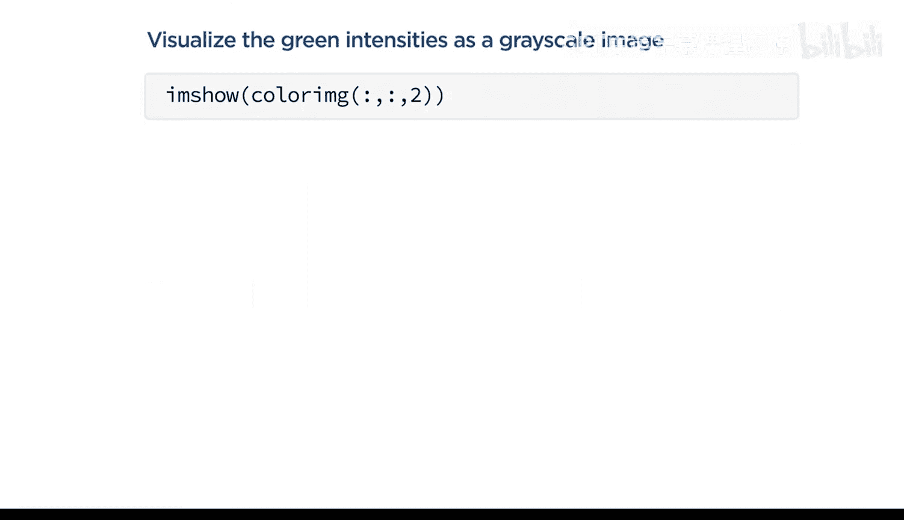
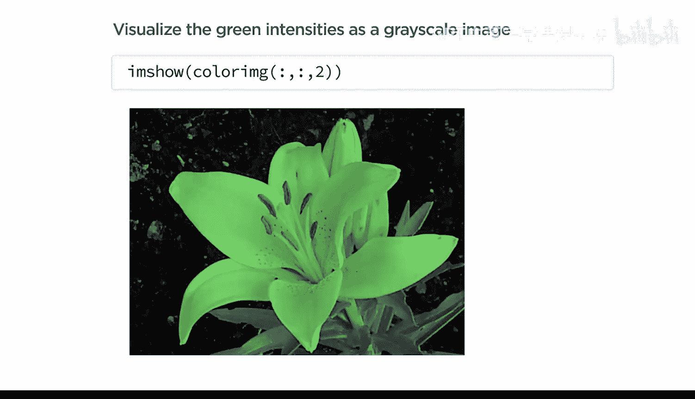
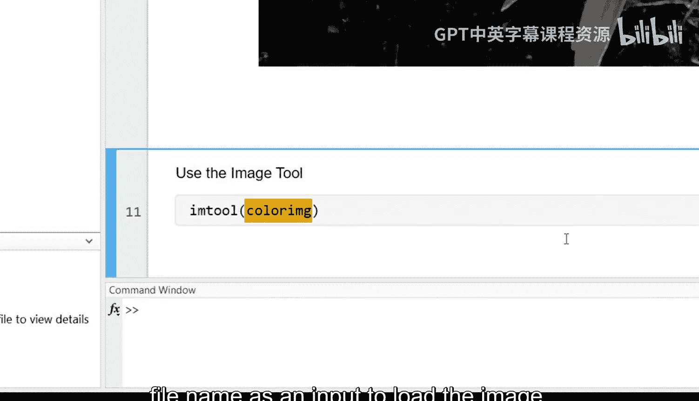

# 4：在MATLAB中表示图像

在本节课中，我们将要学习如何将图像导入MATLAB，并理解图像数据是如何以数值数组的形式表示的。我们还将学习如何从图像数组中提取像素强度值，以及如何使用图像查看器应用来探索图像数据。

---

## 🖼️ 导入与显示图像

科学家、工程师和其他专业人员使用MATLAB执行常见的图像处理任务。但在处理图像之前，必须先将图像导入MATLAB。

要导入图像数据，可以使用 `imread` 函数。该函数将图像数据作为数值数组返回，并存储在一个新变量中。请注意，您的图像文件应位于MATLAB的当前文件夹或搜索路径中。

**代码示例：**
```matlab
% 导入图像
imageData = imread('your_image.jpg');
```

导入图像后，可以使用 `imshow` 函数来查看图像。

**代码示例：**
```matlab
% 显示图像
imshow(imageData);
```

---

## 🔢 理解图像数据表示

仔细观察输出，您会发现导入的图像被表示为一个整数数组。数组的总行数和总列数对应于图像的分辨率，而数组中的每个值代表一个像素的强度。

您可能还注意到，图像数据的类型是 `uint8`（8位无符号整数），这与MATLAB通常用来表示大多数数值数据的 `double`（双精度浮点数）类型不同。

`double` 变量可以表示广泛的数值，包括负值和小数值。而 `uint8` 变量只能表示0到255之间的整数集合。

那么，为什么不使用 `double` 类型来存储图像数据呢？为了理解原因，我们可以提取一个像素值进行比较。

**代码示例：**
```matlab
% 提取特定位置的像素值（例如第100行，第50列）
pixelValue_uint8 = imageData(100, 50);

% 将其转换为double类型
pixelValue_double = double(pixelValue_uint8);

% 使用whos函数查看变量信息（内存占用）
whos pixelValue_uint8 pixelValue_double
```

一个 `double` 值所需的内存是 `uint8` 值的8倍。对于单个值，这种差异可能无关紧要，但当乘以典型图像数组中大量的元素时，这种差异就变得非常显著。对于高分辨率的彩色图像尤其如此。

---

## 🌈 处理彩色图像

彩色图像同样使用 `imread` 和 `imshow` 函数加载和查看。

灰度图像和彩色图像数据的主要区别在于，彩色图像的每个像素现在有三个强度值，分别对应红色、绿色和蓝色通道。

存储三个强度值的需求意味着彩色图像数组是三维的，其中每个颜色的强度值存储在第三维度上。





**代码示例：**
```matlab
% 访问单个像素的某个颜色通道强度（例如第100行，第50列的红色通道）
redIntensity = colorImageData(100, 50, 1); % 1代表红色通道

% 提取单个像素的所有三个颜色强度
allChannels = colorImageData(100, 50, :);

% 提取整个绿色通道（所有像素的绿色强度）
greenChannel = colorImageData(:, :, 2); % 2代表绿色通道
imshow(greenChannel); % 显示为灰度图像
```

在上面的代码中，冒号 `:` 是“该维度所有值”的简写。提取出的绿色通道是一个二维数组，可以可视化为灰度图像。亮区表示绿色强度高的像素，暗区表示绿色强度低的像素。



---

## 🔍 使用图像查看器交互探索

仅凭强度值预测亮度或颜色，或仅凭图像估计强度值，都具有挑战性。因此，使用图像查看器应用同时检查图像和强度值会很有帮助。

使用 `imtool` 函数，并以图像变量或文件名作为输入，即可加载图像。

**代码示例：**
```matlab
% 在图像查看器中打开图像
imtool(imageData);
```

该应用会自动预览图像，并提供一种交互方式来同时检查图像和数据。例如：
*   将光标悬停在图像上可显示像素位置和强度值。
*   点击标尺工具可测量两个感兴趣点之间的像素距离。
*   使用缩放按钮放大区域，使用平移按钮在图像中导航。

要调查特定区域的像素值，可以从“工具”菜单中选择“像素区域”。这将在图像选定区域上打开一个强度值覆盖层。

如果您想将注意力限制在单个区域，可以使用裁剪按钮并根据需要调整选框。结果将生成一个新图像，可以进一步分析或导出为变量。

---

## 📝 总结

本节课中我们一起学习了：
1.  如何使用 `imread` 和 `imshow` 函数加载和显示图像。
2.  灰度图像和彩色图像在MATLAB中如何被表示为整数数组（`uint8`），以及这种表示方式在内存效率上的优势。
3.  如何通过提供行、列和通道值，或使用冒号运算符，从数组中提取图像数据。
4.  如何使用图像查看器应用交互式地探索图像数据，包括检查像素值、测量距离和裁剪区域。


掌握这些基础知识是进行后续图像处理操作的关键第一步。