# 07：色彩空间导论 🎨


在本节课中，我们将要学习色彩空间的基本概念，了解为何有时RGB色彩空间不适用于颜色分割任务，并探索HSV等替代色彩空间如何帮助我们更有效地处理颜色信息。

## 概述

色彩空间是描述和表示颜色的数学模型。最广为人知的是RGB（红、绿、蓝）色彩空间，它通过混合三种原色的强度来产生各种颜色。然而，在某些应用场景下，如识别成熟水果或处理不同光照条件下的物体，RGB空间会显得力不从心。本节将介绍RGB的局限性，并引导你认识其他更适用于特定任务的色彩空间。

## RGB色彩空间的挑战

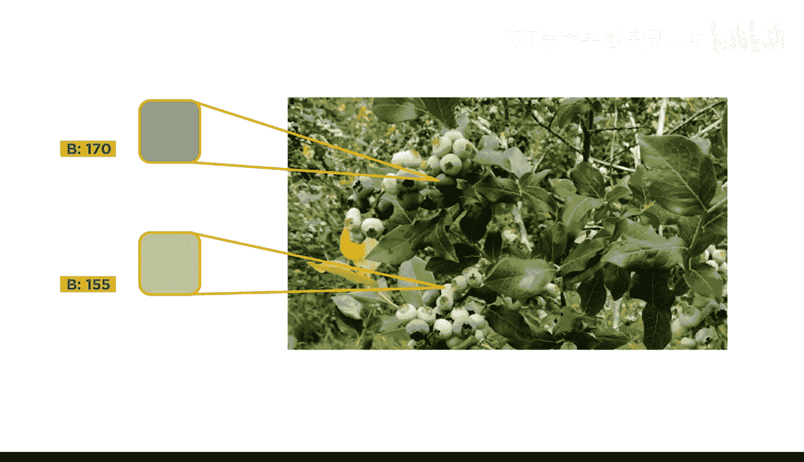

上一节我们介绍了图像处理的基本概念，本节中我们来看看使用RGB色彩空间进行颜色分割时可能遇到的困难。

考虑使用成像技术来确定采摘成熟水果（例如这些蓝莓）的最佳时机。你可能会猜测，可以通过观察RGB色彩空间中的蓝色通道来识别蓝色的成熟蓝莓。


但事实上，蓝色成熟蓝莓和绿色未成熟蓝莓的B（蓝色）通道数值非常接近。

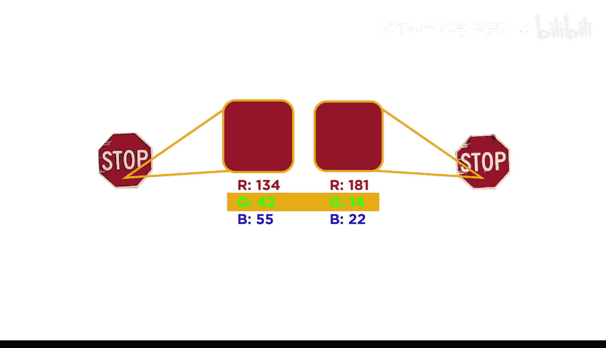


类似的情况，以及阴影和光照的差异，使得在RGB色彩空间中进行颜色阈值分割变得困难。以下照片展示了同一停车标志在一天中不同时间的样子。请注意所有三个RGB分量值都发生了显著变化。

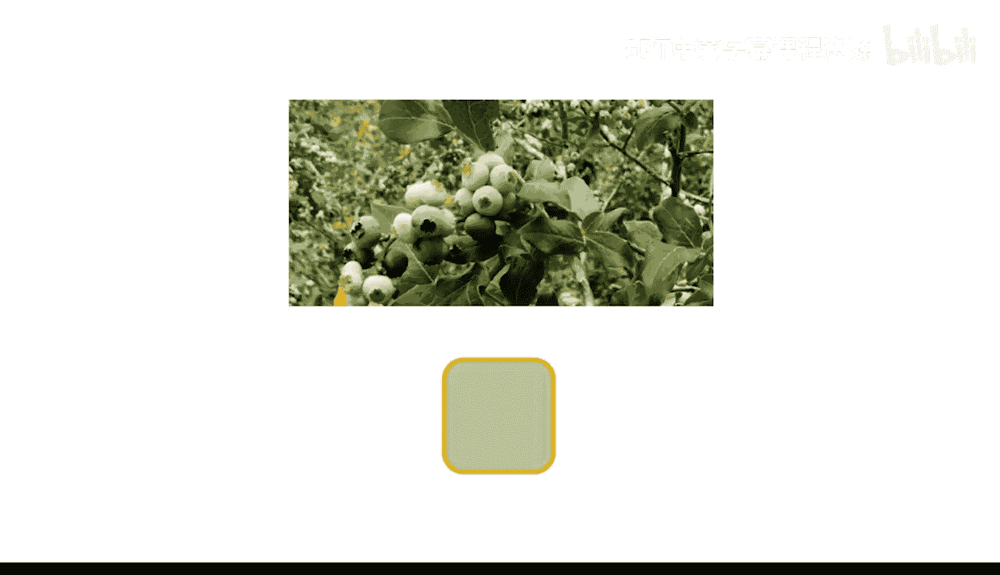


让我们看看未成熟蓝莓的颜色，以理解其原因。仅看这三种颜色（红、绿、蓝分量），你可能不会猜到它们组合起来会呈现绿色。


## 色彩空间转换的必要性

不同的颜色是通过改变红、绿、蓝三个颜色分量的强度产生的。将一个颜色分量值向其最大值移动，会增加该颜色的贡献度。

除了RGB，你可以使用其他替代色彩空间。这类似于笛卡尔坐标系中的点可以用其他坐标系（如球坐标系）来描述。最重要的是，一个坐标系中点之间复杂的关系，在另一个坐标系中描述起来可能简单得多。

例如，仅改变点P的θ值，就相当于在笛卡尔坐标系中改变所有三个值（x, y, z）。

## HSV色彩空间简介

一个常用的色彩空间是HSV（色相、饱和度、明度）。与RGB色彩空间类似，HSV色彩空间也使用三个分量来构建颜色。

以下是HSV的三个分量定义：
*   **色相 (Hue)**：对应色轮上的角度，决定颜色的基本类型（如红、黄、蓝）。
*   **饱和度 (Saturation)**：决定颜色的纯度或强度。饱和度越低，颜色越接近灰色。
*   **明度 (Value)**：决定颜色的明暗程度。

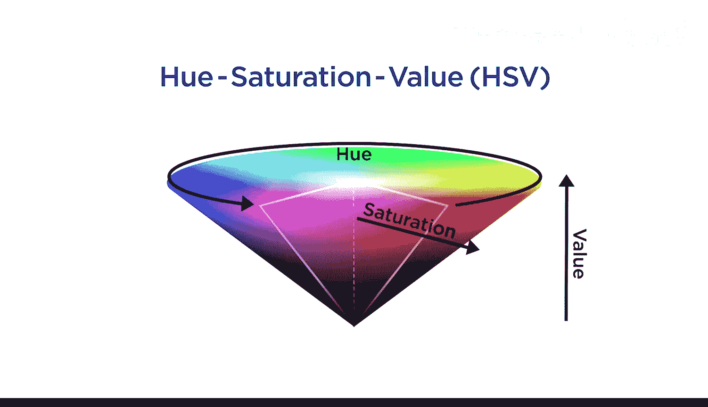

回到蓝莓图像的案例。在HSV色彩空间中，你可以通过仅限制色相值来分离出蓝色。


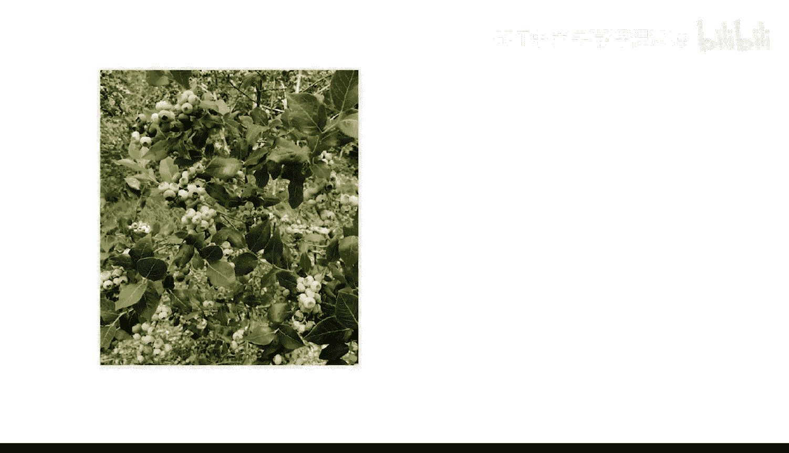
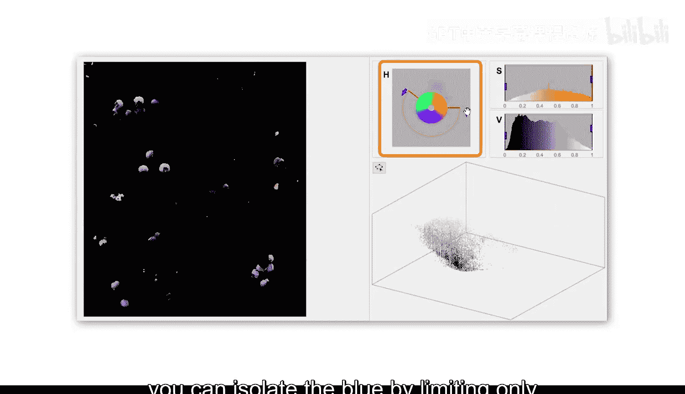

这在RGB空间中要困难得多，因为在该空间中所有三个分量都会发生变化。


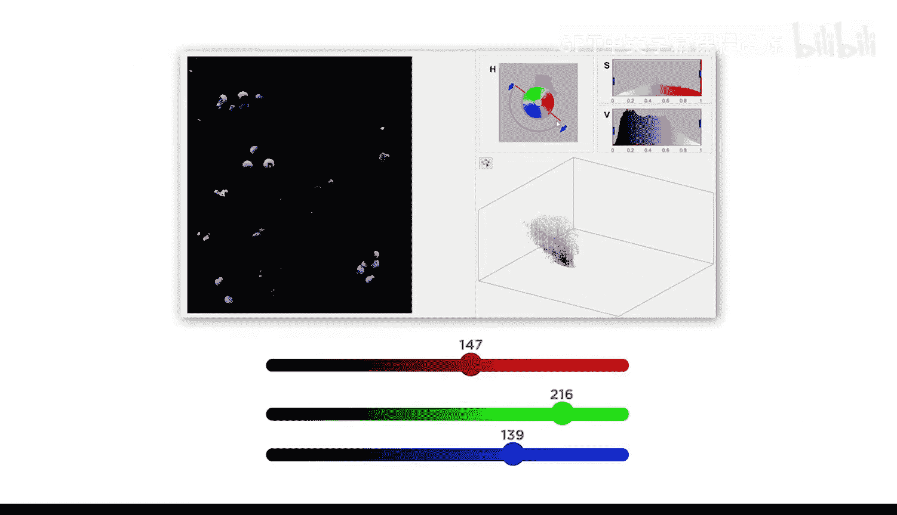


## 在MATLAB中操作色彩空间


在MATLAB中，你可以使用 `rgb2hsv` 函数将图像从RGB色彩空间转换到HSV色彩空间。

```matlab
hsv_image = rgb2hsv(rgb_image);
```

请注意，RGB值通常是整数（如0-255），而转换后的HSV值是介于0和1之间的小数。

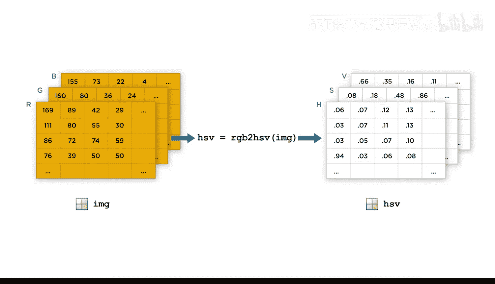


使用 `hsv2rgb` 函数可以转换回RGB色彩空间。得到的RGB图像仍然是 `double` 类型。

```matlab
rgb_image_restored = hsv2rgb(hsv_image);
```

## 其他色彩空间

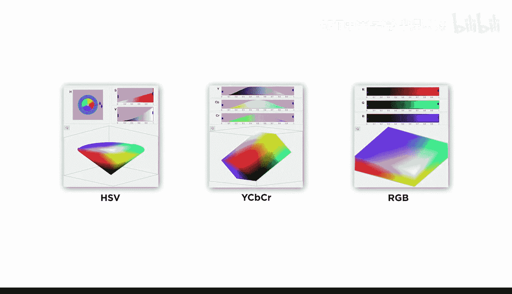

除了HSV，还有其他替代方案。例如：
*   **YCbCr色彩空间**：常用于视频设备。
*   **LAB色彩空间**：常用于照片编辑。


MATLAB也提供了在这些色彩空间之间进行转换的函数。由于很难预先知道哪种色彩空间最适合你的具体应用，因此你需要进行实验，尝试不同的色彩空间。

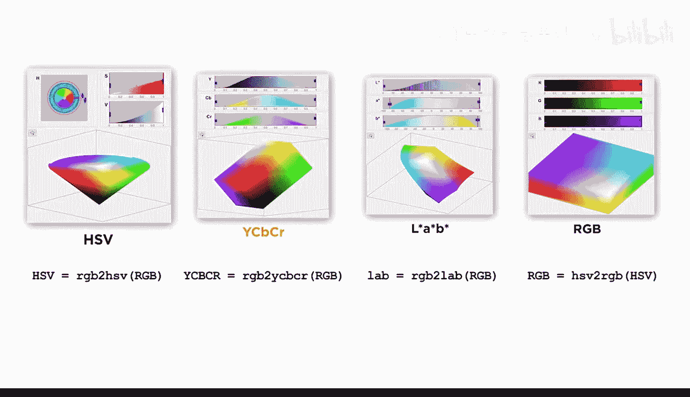

## 总结与预告

本节课中我们一起学习了色彩空间的基础知识。我们认识到RGB色彩空间在颜色分割上的局限性，并介绍了HSV色彩空间如何通过分离色相、饱和度和明度来更直观地处理颜色。我们还了解了在MATLAB中进行色彩空间转换的基本函数。

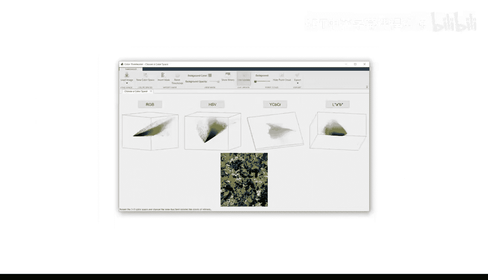

在下一个视频中，你将认识一个颜色阈值分割应用程序，它将帮助你在不同的色彩空间中对图像进行分割。

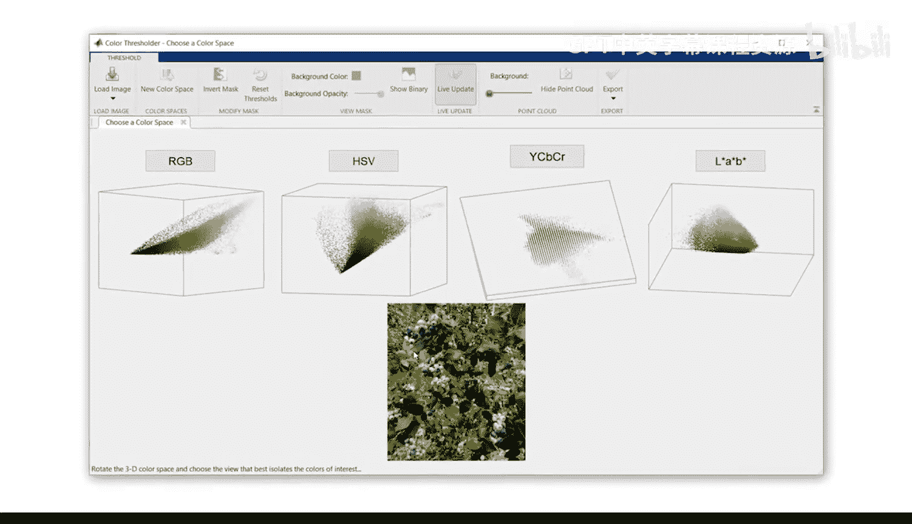


