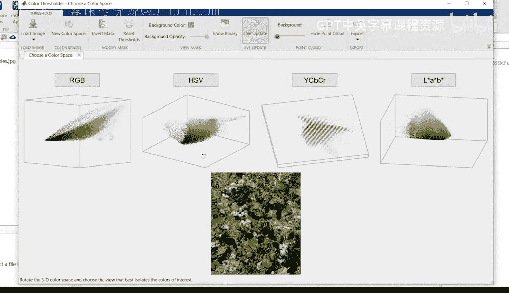
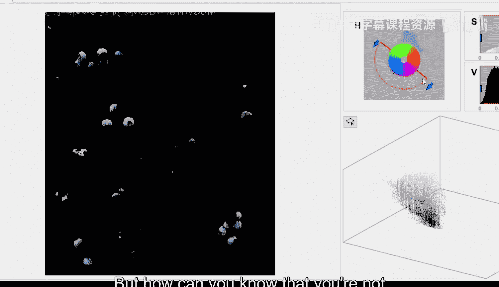
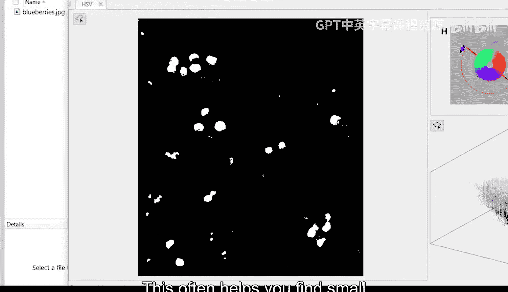
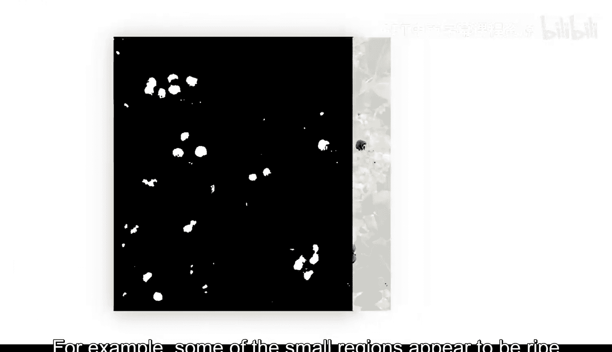
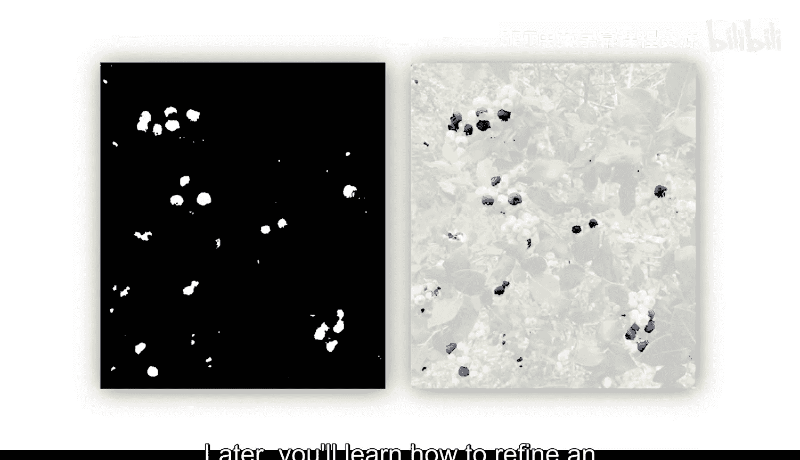
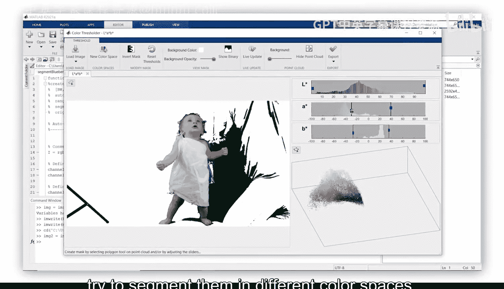

# 08：彩色图像阈值处理 🎨

---

### 概述
在本节中，我们将学习如何使用颜色信息对图像进行分割。颜色分割能提供重要信息，例如识别哪些蓝莓已经成熟。然而，分割彩色图像通常需要一些尝试和调整，因为选择合适的颜色空间和阈值往往具有挑战性。我们将通过使用Color Thresholder应用程序，快速尝试不同的分割方法。

---

### 导入图像与启动应用程序
首先，导入蓝莓图像。接着，导航至应用程序选项卡。请注意，这里提供了多种与图像处理相关的应用程序，包括本系列课程中将探索的几个。现在，打开Color Thresholder应用程序。

---

### 选择颜色空间
打开应用程序后，第一步是加载图像。在本例中，我们从工作区加载图像。接下来，系统会提示选择用于分割的颜色空间。通常，HSV和LAB颜色空间是良好的起点。我们的目标是将蓝色蓝莓从图像的其他部分分离出来。在HSV点云中，蓝色似乎分离得较好，因此我们从HSV开始尝试。

---

### 调整阈值
请注意，HSV的三个通道由右侧的滑块表示。您可以调整滑块的范围，并立即看到阈值处理对图像的影响。我们尝试通过移动H值的阈值，仅包含看起来是蓝色的部分，以分离成熟的蓝莓。

**结果看起来很有希望**。我们只看到蓝色部分透过掩膜显示出来。但如何确保没有意外移除一些感兴趣的区域呢？

---

### 检查分割结果
应用程序提供了调整背景不透明度和颜色的控件。掩膜为假的区域显示为不透明，这有助于判断阈值是否合适。您还可以查看二值掩膜。这通常有助于发现分割中的小缺陷，这些缺陷可能需要在后续处理中解决。

例如，一些小区域看起来是被叶子遮挡的成熟蓝莓，而其他区域则不是。稍后，您将学习如何优化初始掩膜并分析这些区域。

---

### 尝试其他颜色空间
HSV颜色空间在此图像上效果良好。但在分割其他图像时，您可能需要尝试多种颜色空间。选择新的颜色空间以尝试另一种方法。您之前的工作会被保留，以便比较结果。

---

### 导出结果与生成函数
一旦对结果满意，您可以将分割后的图像和掩膜导出到工作区进行进一步分析。您可能会想，是否需要每次都这样做，或者如何确保重现相同的结果。通过导出自动生成的函数，您可以记录所采取的步骤，并获得一个可应用于其他图像的函数。

建议为函数起一个描述性的名称，然后保存它。

---

### 实践与分享
现在，您已经完成了这个示例，可以导入自己的彩色图像，并尝试在不同的颜色空间中进行分割。在论坛中发布您的结果，并分享您采用的方法。

---

### 总结
在本节中，我们一起学习了如何使用Color Thresholder应用程序对彩色图像进行阈值分割。我们探讨了如何选择合适的颜色空间、调整阈值、检查分割结果，并导出函数以便重复使用。通过实践，您可以更有效地利用颜色信息进行图像分割。