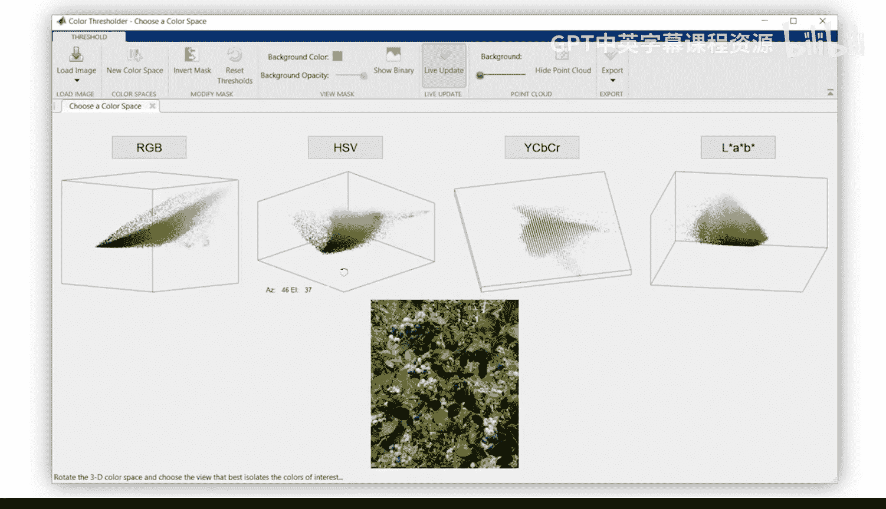
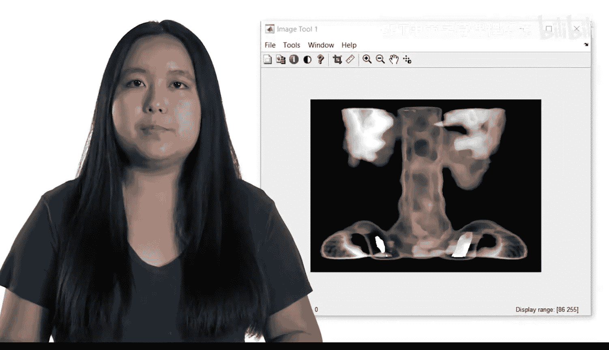
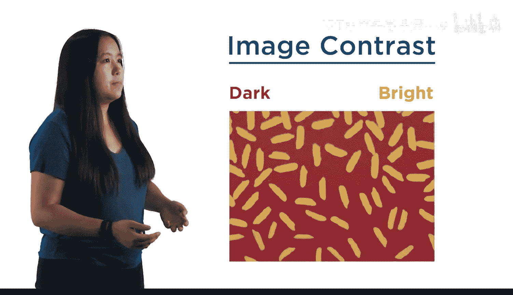
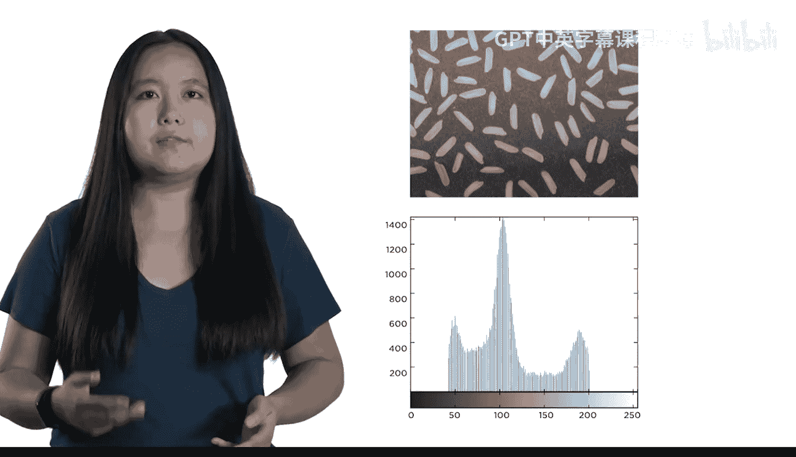
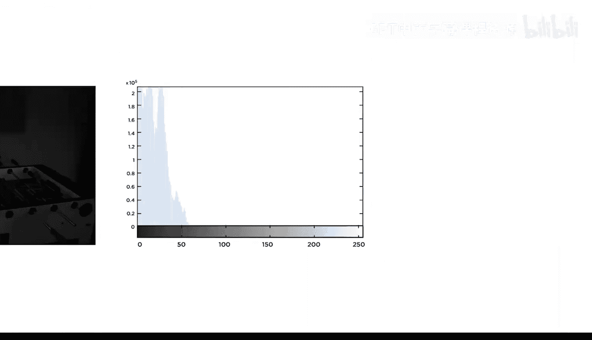
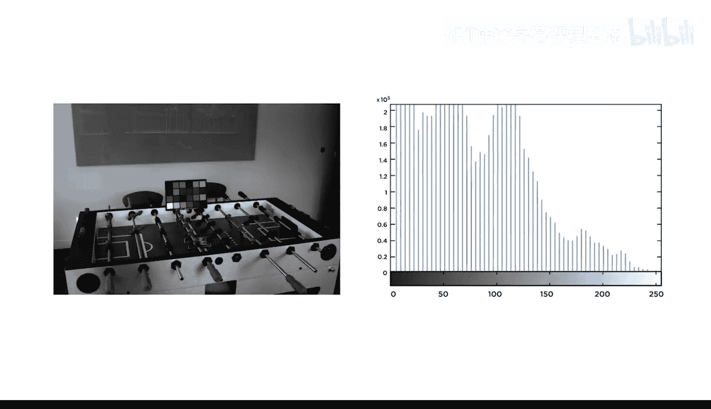

# 09：常见图像调整 📊

在本节课中，我们将学习如何通过调整图像的对比度来优化其视觉效果。我们将从像素层面入手，了解图像直方图的概念，并学习两种关键的调整方法：直方图拉伸与直方图均衡化。这些技术能有效改善图像中难以看清的细节。

## 课程概述

欢迎来到本课程的最后一周。本周，我们将深入到像素级别进行图像处理。

到目前为止，你已经学会了调整图像大小、旋转和裁剪图像。你也学会了在不同色彩空间之间转换，以及将图像转换为灰度图。然而，所有这些操作都是对整个图像整体进行的。

在本模块中，你将学习如何可视化并调整图像的对比度，通过改变单个像素值来使图像整体光照更均匀。

## 理解图像对比度与直方图

上一节我们回顾了已学的整体图像操作，本节中我们来看看图像对比度的核心概念。

图像对比度指的是图像中暗部与亮部区域之间的差异。

图像直方图有助于可视化像素亮度值的分布情况。

在检查图像直方图之后，你将通过拉伸直方图以使用全部范围，或通过重塑直方图以突出图像的特定细节，来改变单个像素的值。

以下是两种主要的调整方法：

*   **直方图拉伸**：扩展像素值的分布范围，以增强整体对比度。
*   **直方图均衡化**：重新分布像素值，使直方图更均匀，从而增强局部对比度并突出细节。

这可以改善曝光过度或曝光不足图像中难以看清的细节。

在本模块结束时，你将运用所学的所有技能完成一次最终测验。

那么，让我们开始吧。

## 总结

本节课中我们一起学习了图像对比度的概念及其重要性。我们介绍了图像直方图作为分析像素亮度分布的工具，并探讨了通过直方图拉伸和直方图均衡化来调整图像对比度的两种核心方法。掌握这些技能，你将能够有效改善图像的视觉效果，揭示更多隐藏的细节。