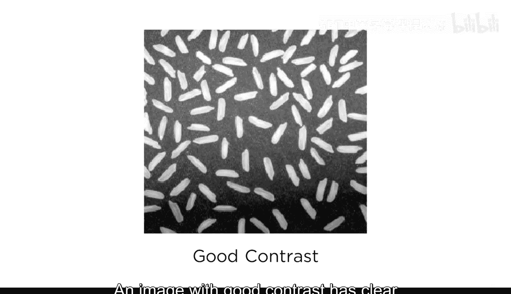
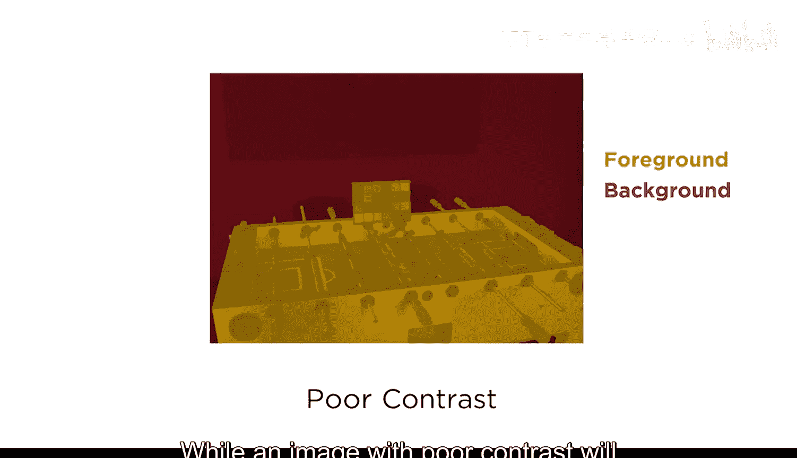
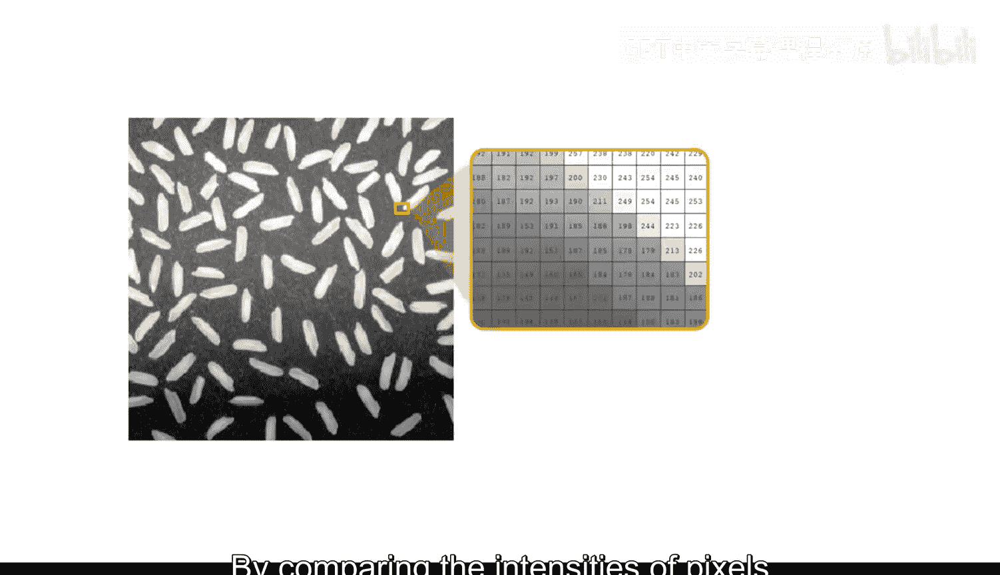
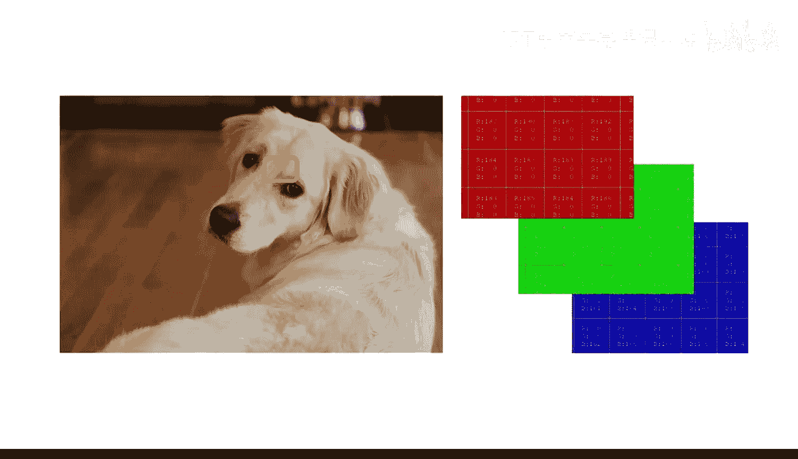
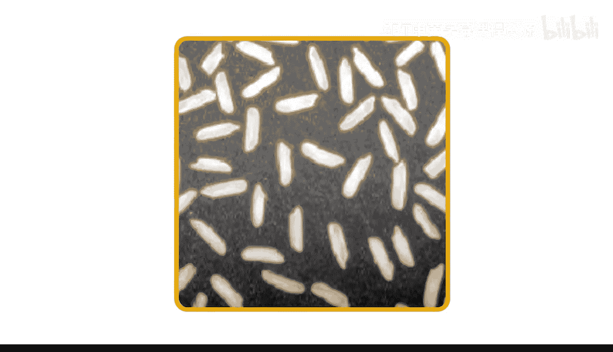
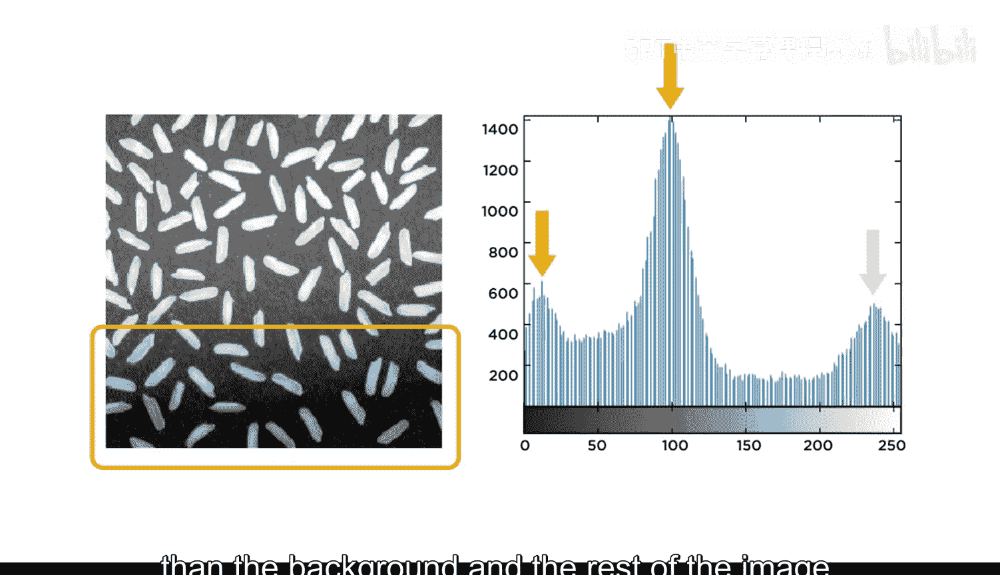
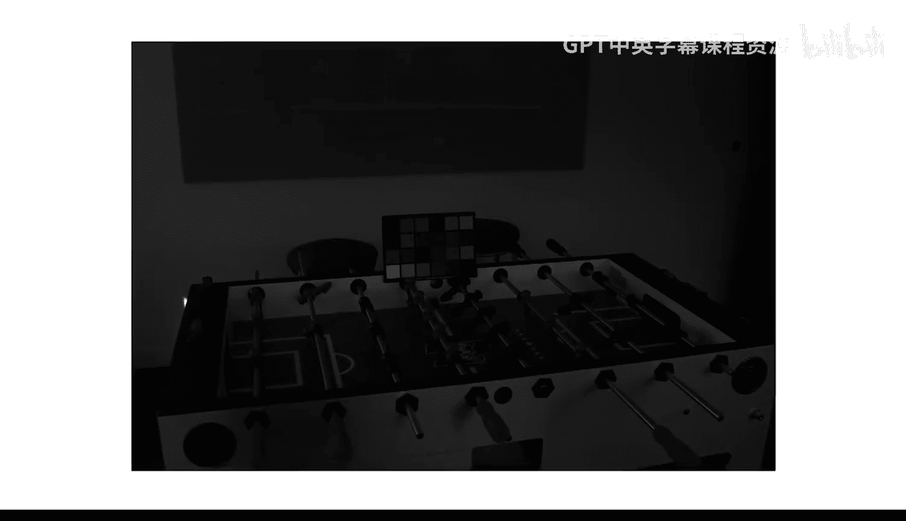
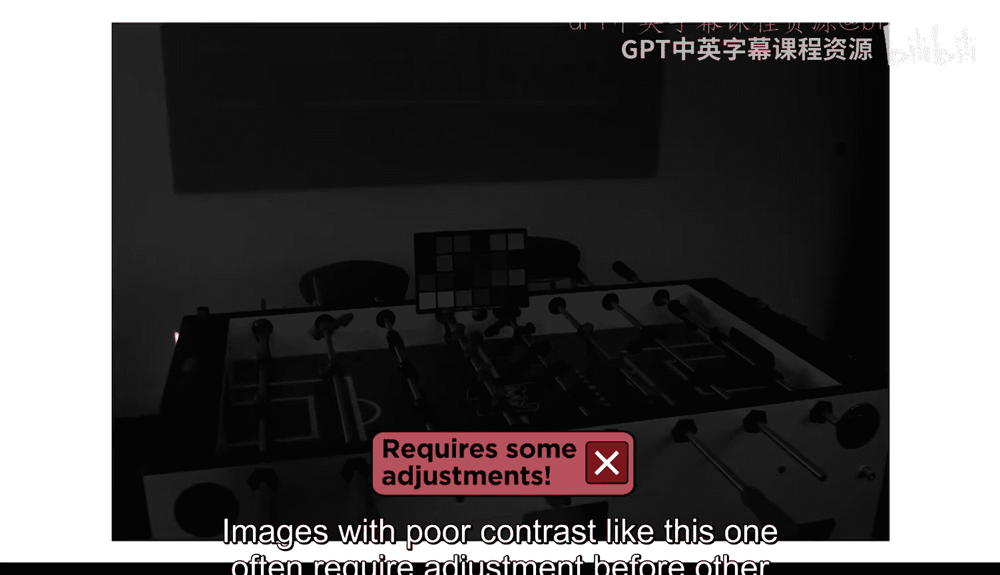
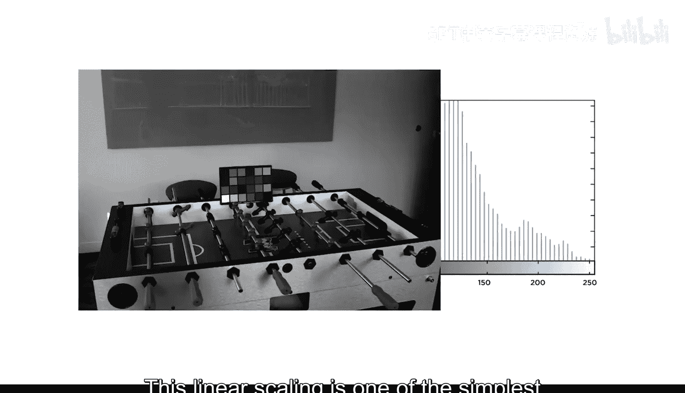
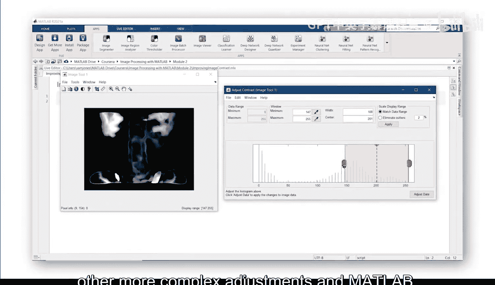

# 10：图像对比度与直方图 📊

在本节课中，我们将要学习图像对比度的概念，并了解如何使用直方图这一工具来可视化图像的像素强度分布。理解这些基础知识是进行后续图像处理操作的关键。

## 什么是图像对比度？ 🎼

图像对比度指的是图像中暗部区域与亮部区域之间的差异。一张对比度良好的图像，其前景物体与背景物体之间有清晰的区分。

而对比度差的图像，物体之间的区分度则较低。

就像这张曝光不足的图片一样。不过请放心，图像的细节信息仍然存在。

对于图像对比度的“好”与“坏”，并没有一个严格的技术定义。通过比较几幅图像中像素的强度，我们可以直观地感受一幅图像是否已经“准备就绪”，可以直接用于分析。

还是说它需要进行一些调整。

虽然本视频主要关注灰度图像，但所介绍的技术同样可以逐通道地应用于彩色图像。

## 高对比度图像示例 🌾

让我们来看一个简单的例子。这张米粒的图像具有很好的对比度。较亮的米粒在深色背景上清晰地凸显出来，并且每粒米的边缘都有明确的界定。

观察单个像素的强度值可以展示局部对比度。你可以看到从米粒像素（值高于200）到背景像素（值接近100）之间存在明显的变化。

## 理解图像直方图 📈

图像直方图是一种可以一次性查看所有像素值的方法。这张图显示了图像中每个可能的强度值（从0到255）分别对应多少个像素。

对于这张米粒图像，直方图上有几个峰值。右侧的峰值代表米粒中的像素，而其他峰值则与背景相关。值得注意的是，图像底部三分之一的背景比其余部分的背景要暗得多。

## 低对比度图像分析 ⚽

现在，让我们再看一下那张曝光不足的桌上足球台图片。

像这样对比度差的图像，在应用其他图像处理技术之前，通常需要进行调整。

其直方图显示，几乎所有的像素值都集中在强度范围的低端。为了看清图像中的细节，我们可以改变像素值，将直方图拉伸到整个强度范围内。这种线性缩放是调整图像对比度最简单的方法之一。

调整的结果是得到一幅改善后的图像，之前被隐藏的细节现在清晰可见。

## 总结与预告 🔮

本节课中，我们一起学习了图像对比度的概念，并探索了如何使用直方图来分析图像的像素强度分布。我们看到了高对比度图像与低对比度图像在直方图上的显著差异。

在下一个视频中，你将学习如何在Matlab中执行这种线性对比度拉伸以及其他更复杂的图像调整操作。

