12：课程总结 🎉

在本节课中，我们将对《工程与科学图像处理简介》课程进行总结，回顾已学知识，并展望后续课程内容。

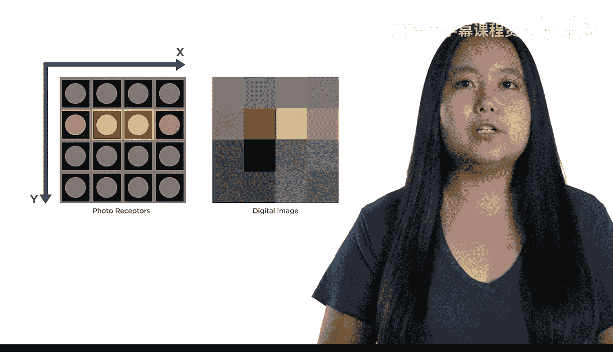

恭喜你完成了《图像处理简介》课程。你已经打下了一个良好的基础，并且能够完成相当多的工作。

你学习了不同类型的数字图像，以及它们在 MATLAB 中的表示方式。

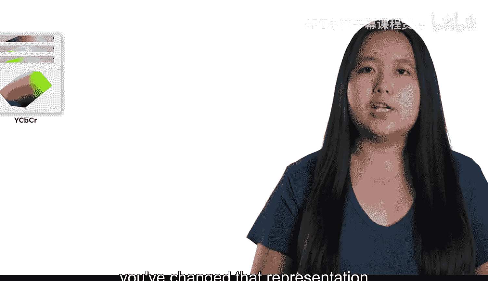

上一节我们介绍了图像的基础表示，本节中我们来看看如何转换这些表示以更好地访问数据。

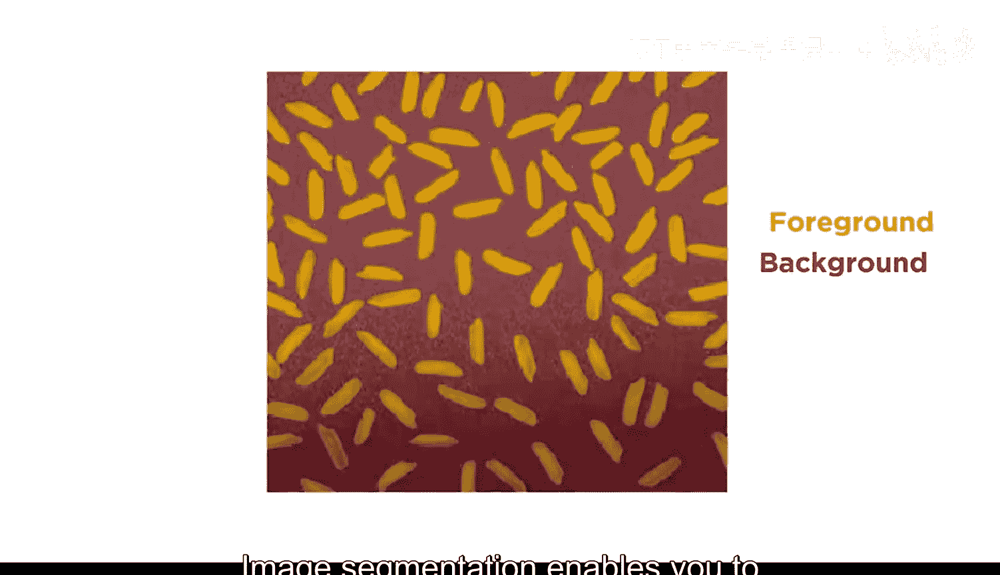

你改变了图像的表示方式，使数据更易于处理。这包括在**不同色彩空间之间转换**，有时通过转换为灰度图来完全移除颜色信息。

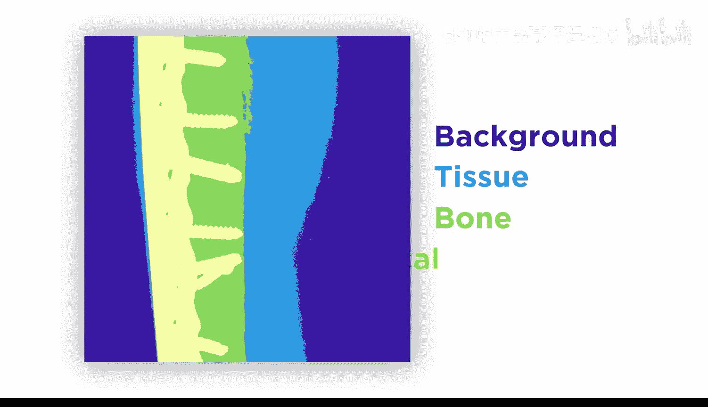

图像分割使你能够将数据从背景中分离出来。

有时，这种分割足以让你分析数据并得出结论，正如你在分析冰川图像时所看到的那样。通过将这一想法扩展到**多阈值分割**，你成功地将肌肉和骨骼与人工植入物分离开来。

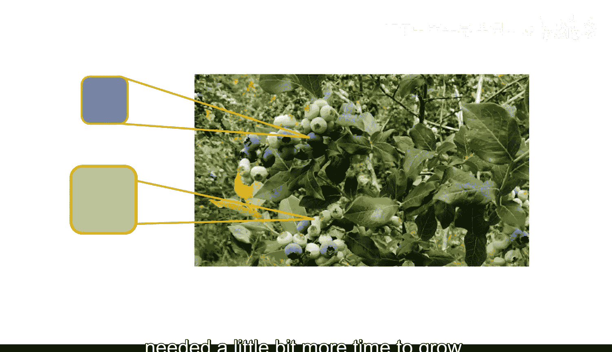

通过利用颜色信息，你创建了一个函数，能够识别成熟的蓝莓和那些还需要时间生长的蓝莓。

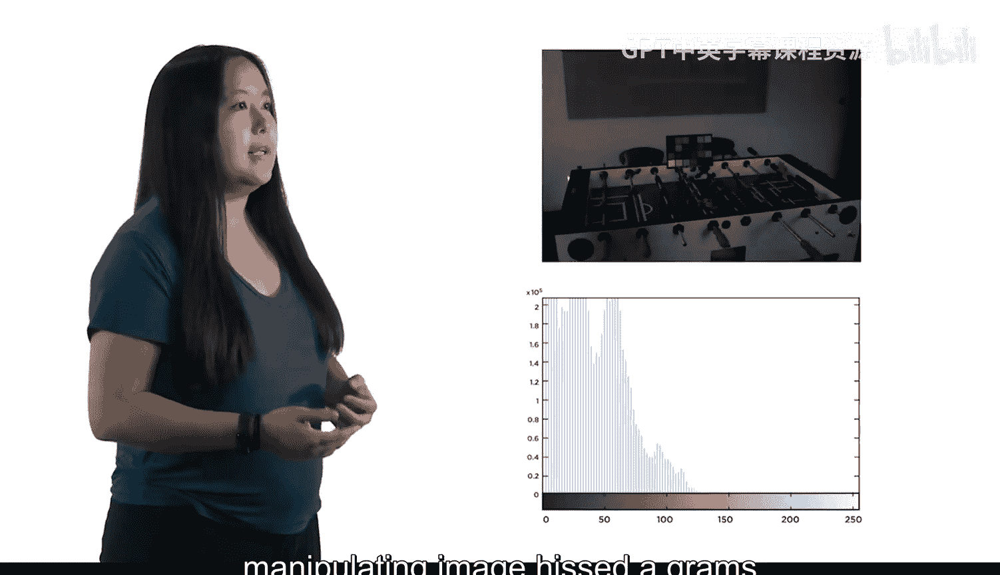

最后，查看和操作图像直方图使你的数据更加清晰。

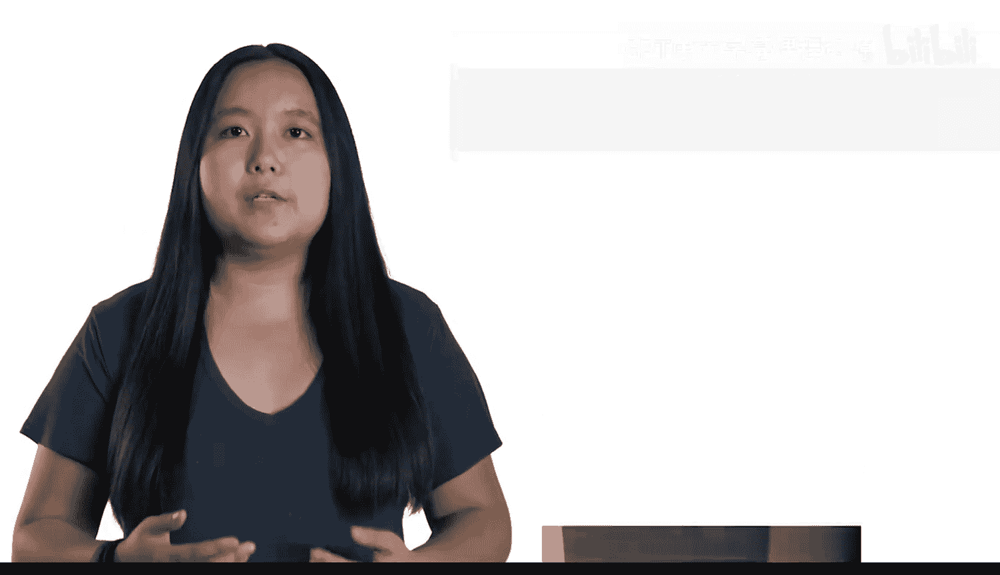

在整个学习过程中，你遇到了一些困难，部分结果可能并不完全令人满意。

你需要学习更高级的图像处理技能来克服这些挑战。梅根，我们在下一门课程中将学习什么？谢谢阿曼达。在课程二中，你将学习强大的技术，以从图像中提取数据。

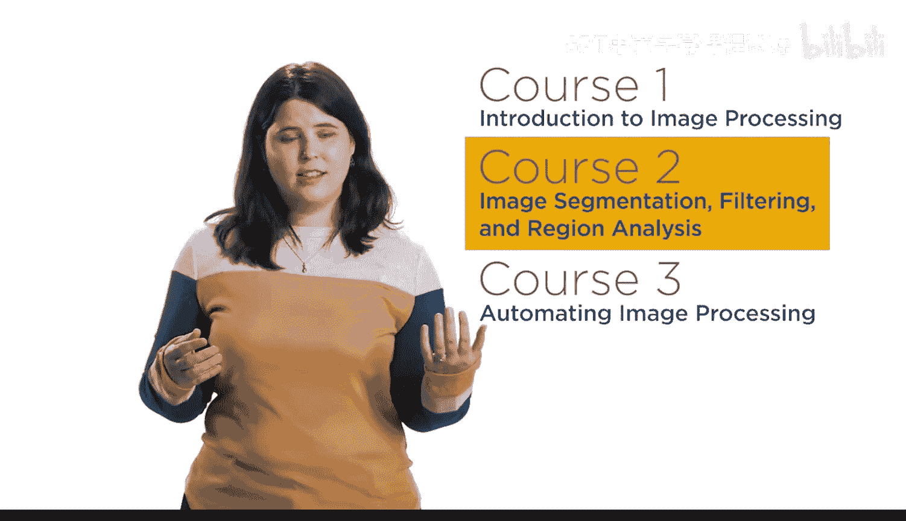

以下是课程二将涵盖的核心内容：
*   **空间滤波和形态学操作**将改善你的分割效果。
*   但分割通常只是第一步。你还将学习**计算分割区域的属性**，以便得出结论。

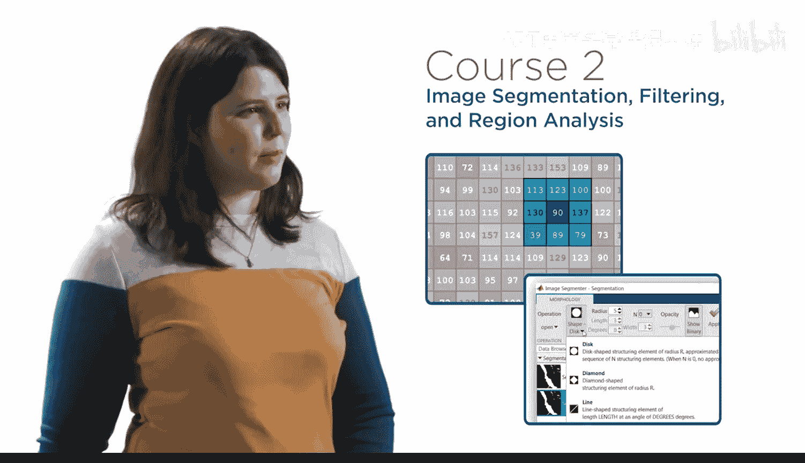

图像处理是一个广阔的领域，但你已经掌握了基础知识，并准备好开始将它们应用到自己的项目中。

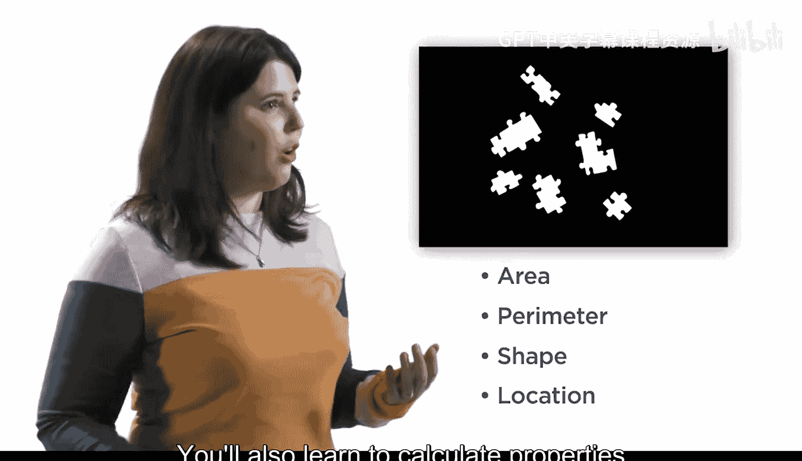

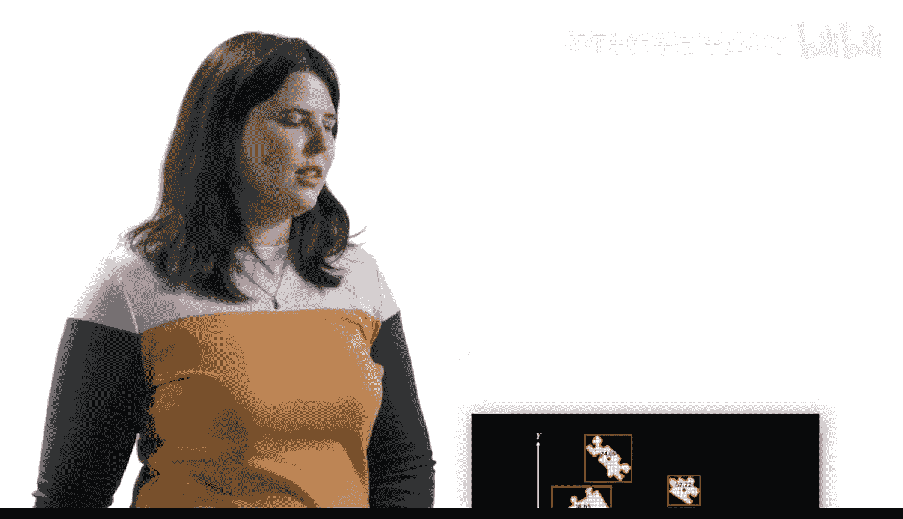

加入我们的下一门课程，将你的知识提升到新的水平。

本节课中我们一起回顾了图像处理简介课程的核心内容，包括图像表示、色彩空间转换、阈值与颜色分割以及直方图分析。同时，我们也预览了下一阶段将学习的空间滤波、形态学和区域属性分析等进阶技能。