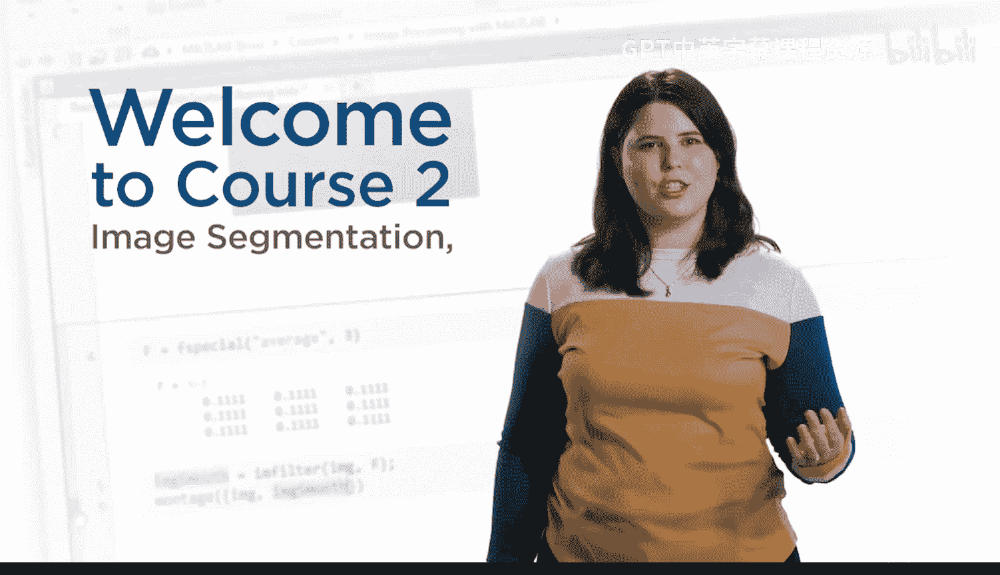
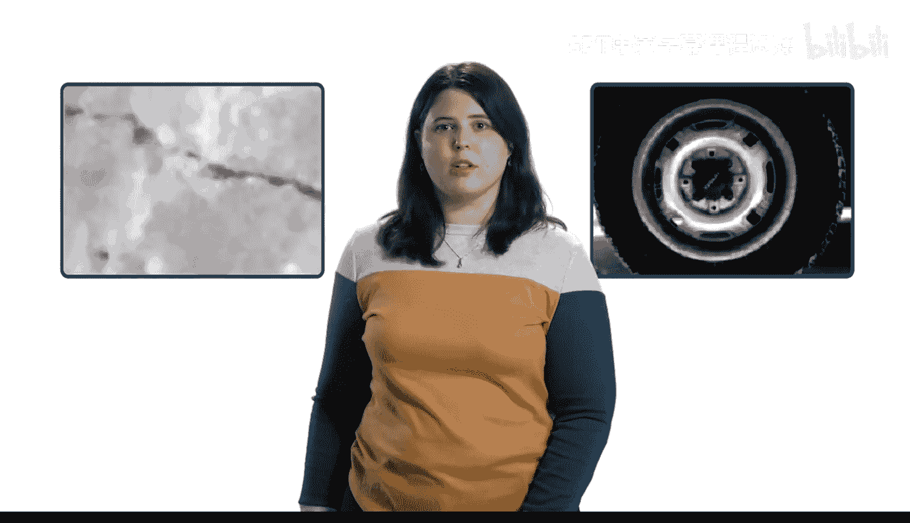
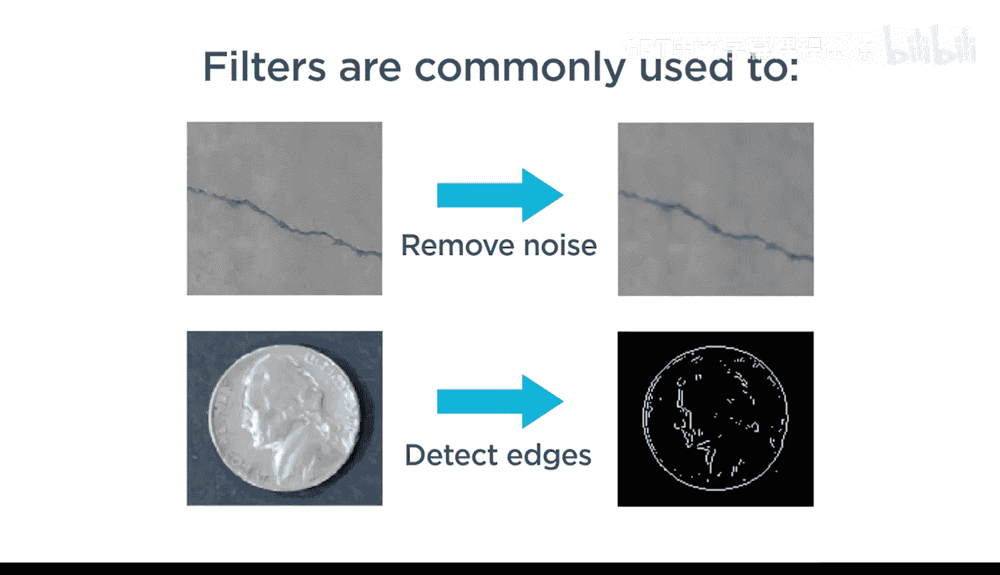
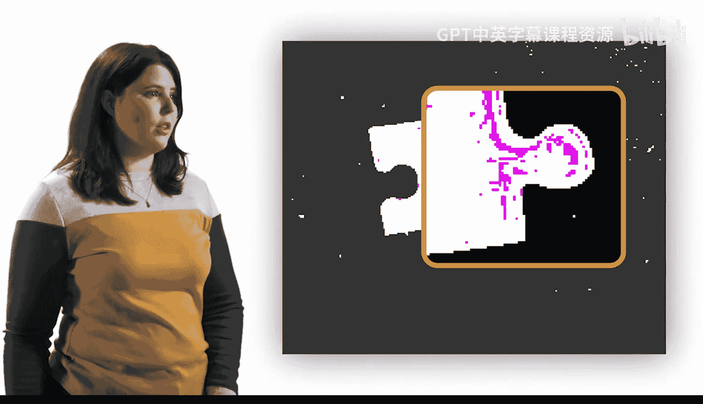
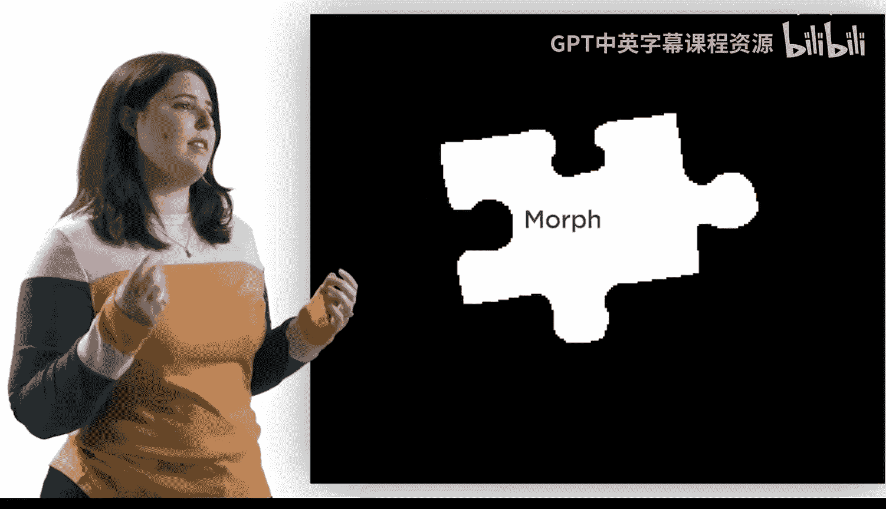
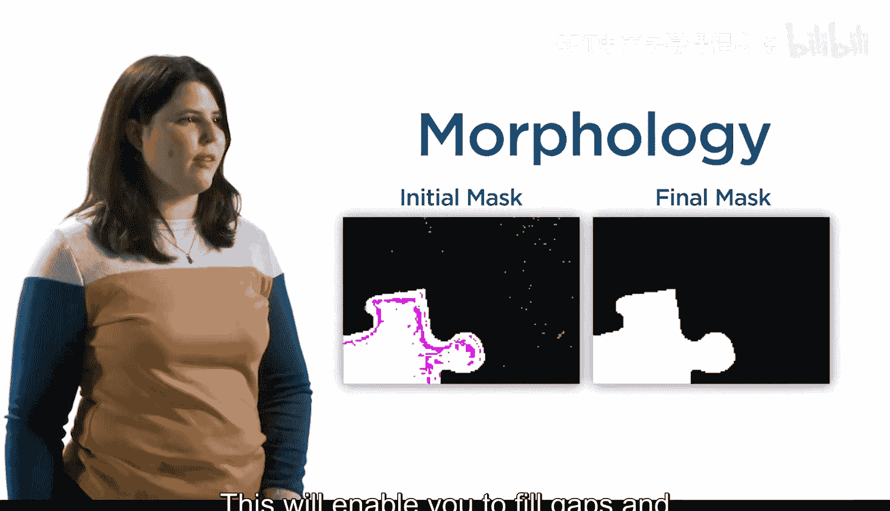
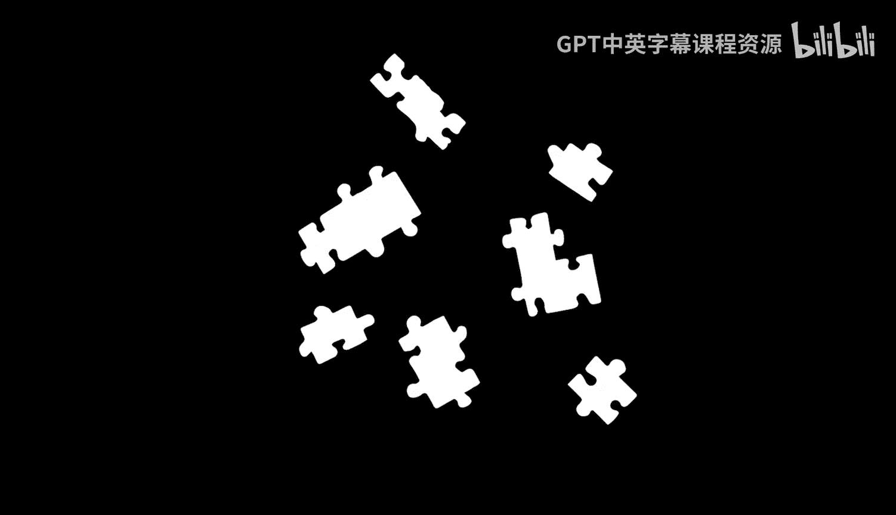
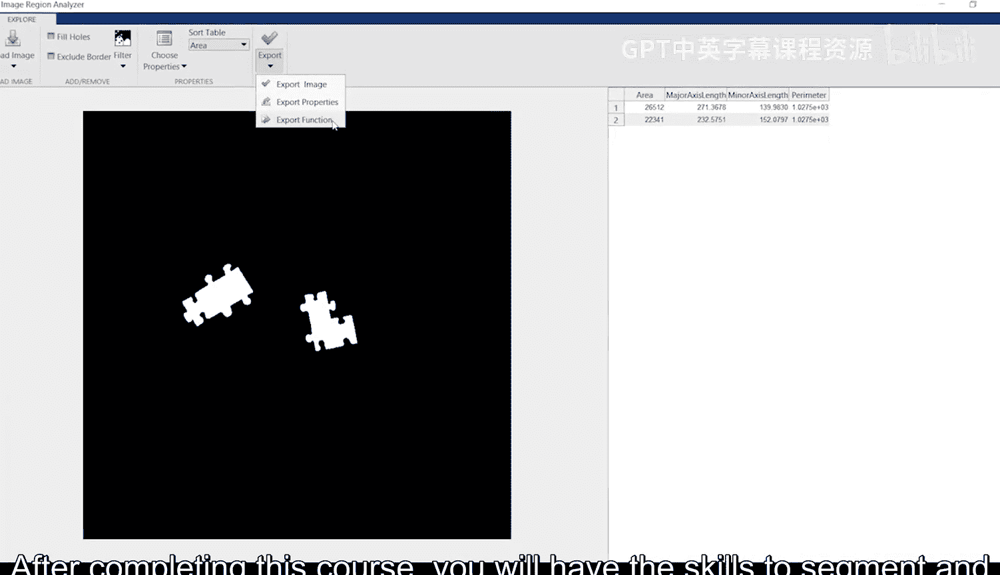
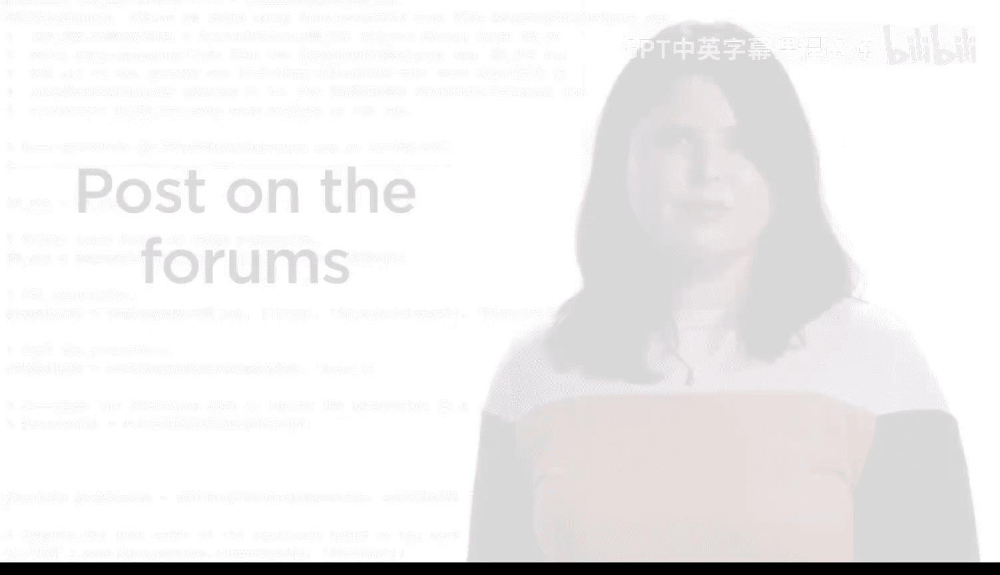

课程2：图像分割、滤波与区域分析 🎯

在本课程中，我们将学习如何应用空间滤波器来优化图像分割，修复分割掩码中的瑕疵，并对分割出的区域进行量化分析。通过本课程，你将能够从图像中提取出有价值的信息。

---

到目前为止，你已经在图像处理方面打下了坚实的基础。你已经在不同的场景中实践了这些技能，处理过从骨骼到蓝莓等各种对象。

你现在可以改善图像对比度，并分离出你最感兴趣的区域。然而，你也发现并非每张图像都易于分割。例如，这张图像中非常不均匀的背景使得将裂缝从混凝土中分离出来变得困难。

上一节我们回顾了基础分割方法面临的挑战，本节中我们来看看如何应用空间滤波器来解决这些问题。

空间滤波器使用相邻像素的加权和来修改某个像素的值。其核心公式可以表示为：

**新像素值 = Σ (邻域像素值 × 对应权重)**

更广泛地说，滤波器通常用于去除噪声和检测图像的有用部分，例如边缘。

---

在通过阈值法进行分割时，图像常常会存在缺陷。

以下是常见的分割瑕疵类型：
*   区域内部存在孔洞。
*   区域边界不平滑或有毛刺。
*   存在小的、孤立的噪声点。

---

在本课程中，你将学习如何优化掩码以修复这些不完美之处。

这将使你能在生成初始掩码后，填补空隙并移除伪影。

---

我假设你学习本课程不仅仅是为了创作漂亮的黑白图像。你可能对你分割出的区域有进一步的问题。例如，你可能想确定其中有多少个对象、它们的大小或位置。

在完成本课程后，你将掌握从图像中分割并提取有用信息的技能。

---

如果你有任何问题，请在论坛上发帖，我们很乐意提供帮助。现在，让我们开始吧。

---

本节课中我们一起学习了课程2的总体目标：通过空间滤波改善分割效果，使用形态学操作修复分割掩码，并对最终分割出的区域进行量化分析，从而从图像中提取出有意义的测量数据。