# 14：边缘检测


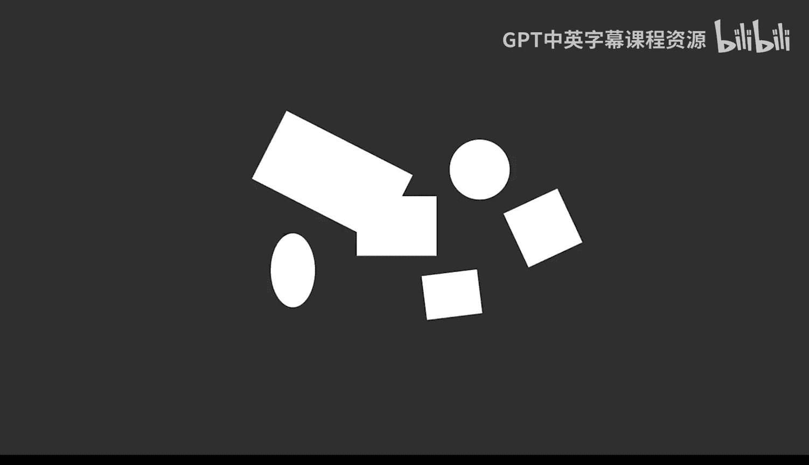

在本节课中，我们将要学习图像处理中的边缘检测技术。边缘检测用于识别图像中不同物体或区域之间的边界，这对于图像分割、物体识别和形状分析至关重要。

## 概述

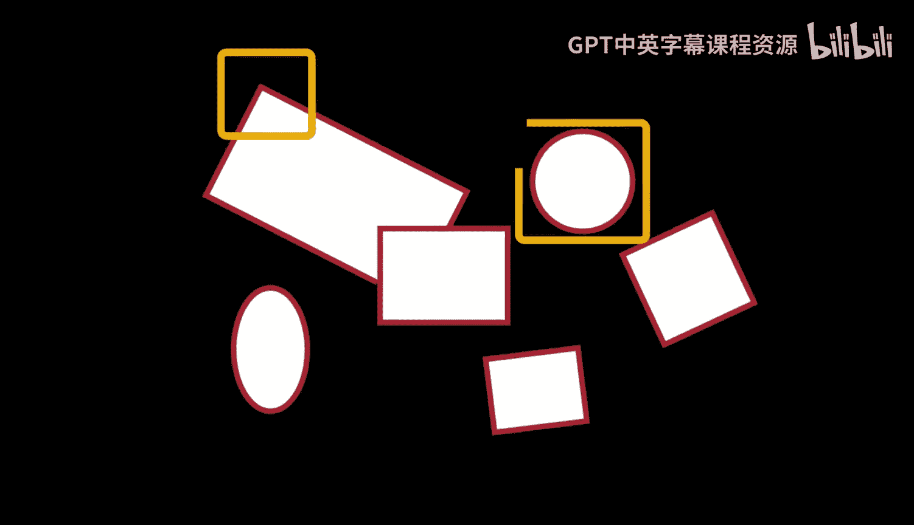

上一节我们介绍了阈值分割，它可以将图像分为前景和背景。然而，有时一个前景区域可能包含多个重叠的物体。边缘检测则专注于**隔离物体之间的边界**。通过从分割后的图像中移除这些边缘，可以将重叠的区域分离开来。此外，边缘也常用于寻找特定的形状或模式，例如角点或圆形。

## 边缘检测的基本原理

边缘检测需要一系列操作，包括对图像应用多个空间滤波器，以及对结果进行组合与处理。

大多数边缘检测算法都基于能够近似计算图像梯度的空间滤波器。**Sobel滤波器**是最简单的此类滤波器，被包括Sobel方法在内的许多算法所采用。

以下是Sobel滤波器的核心概念：

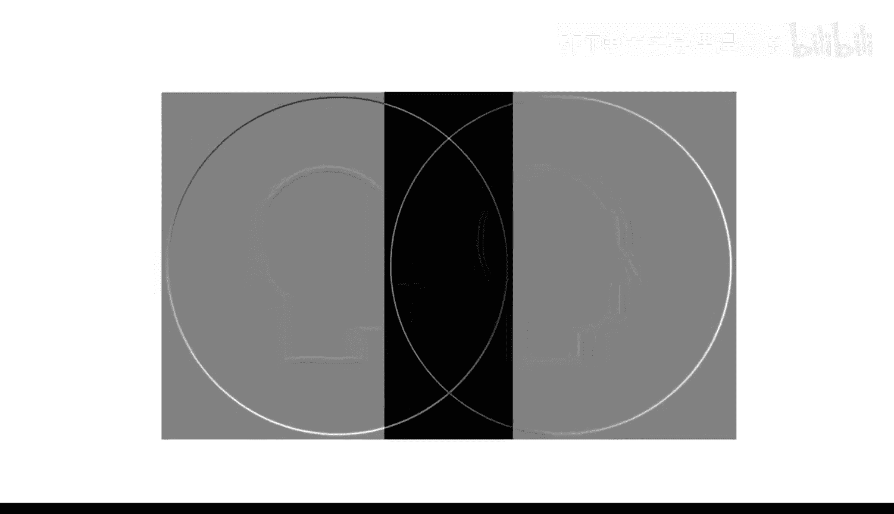

*   **梯度计算**：Sobel滤波器通过比较中心像素邻域内像素的强度来计算梯度。公式上，它通过卷积核来近似计算图像在水平和垂直方向上的导数。
*   **边缘指示**：计算出的梯度值中，**较大**的正值或负值可能指示边缘的存在。
*   **均匀区域**：**接近零**的值则表示该区域强度较为均匀。

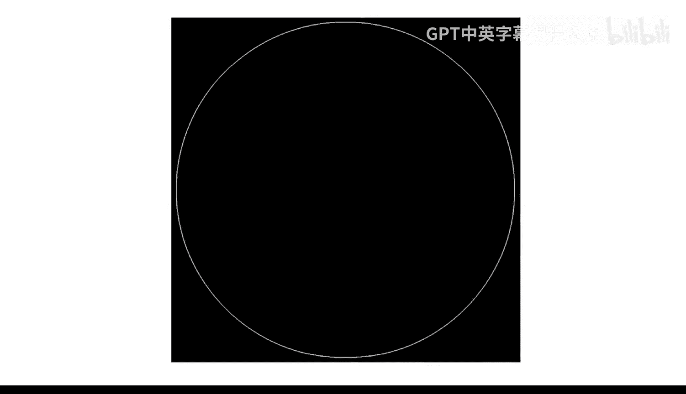

例如，一个强调水平边缘的Sobel滤波器核可能如下所示（代码表示）：
```matlab
% 水平Sobel滤波器核
H = [-1 -2 -1; 0 0 0; 1 2 1];
```
应用该滤波器的转置（`H'`）则会强调垂直边缘。将水平和垂直梯度结合起来，就能显示出所有潜在的边缘。

**Sobel方法**会从水平和垂直梯度中计算出梯度的**幅度**和**方向**。梯度幅度图像显示了边缘的强度。最后，对该幅度图像应用一个**阈值**，以移除梯度值较低的区域（非边缘），并将高梯度区域细化至一个像素的宽度。这些步骤的具体实现细节因算法而异。

## 在MATLAB中实践边缘检测

边缘检测过程包含许多步骤，但在MATLAB中，你可以通过一次函数调用就完成它们。让我们尝试使用`edge`函数来处理一张真实硬币的图片，以将硬币从背景中分离出来。

这张高分辨率图像捕捉到了硬币表面的许多细节。由于我们只关心硬币的外边缘，这些内部细节可以被视为噪声。与处理背景噪声类似，在边缘检测前对图像进行**轻微模糊**处理可以提高输出质量。

**高斯模糊**常用于边缘检测前的预处理。高斯滤波器比均值滤波器更重视中心像素的权重，这可以在保留较强边缘的同时，移除较小的细节。在MATLAB中，`imgaussfilt`函数可以直接模糊图像，而无需单独创建和应用滤波器。高斯函数默认的标准差是0.5，但对于更高分辨率的图像，你可能需要尝试更大的值。

将模糊后的图像传递给`edge`函数，会得到一个硬币边缘的二值图像。默认使用的是Sobel方法。与图像分割一样，可以调整**阈值**值来根据需要保留或移除更多边缘。`edge`函数可以返回它计算出的阈值，你可以将其作为调整的起点。让我们稍微提高阈值：

```matlab
% 示例：使用Sobel方法进行边缘检测并调整阈值
blurredImg = imgaussfilt(coinImage, 2); % 应用高斯模糊，标准差为2
[BW, threshold] = edge(blurredImg, 'sobel'); % 获取默认阈值
adjustedBW = edge(blurredImg, 'sobel', threshold * 1.2); % 将阈值提高20%
```
提高阈值后，硬币内部的一些细节被移除了，但一些较微弱的硬币边缘也可能丢失。这需要在保留主要边缘和抑制噪声之间进行权衡。

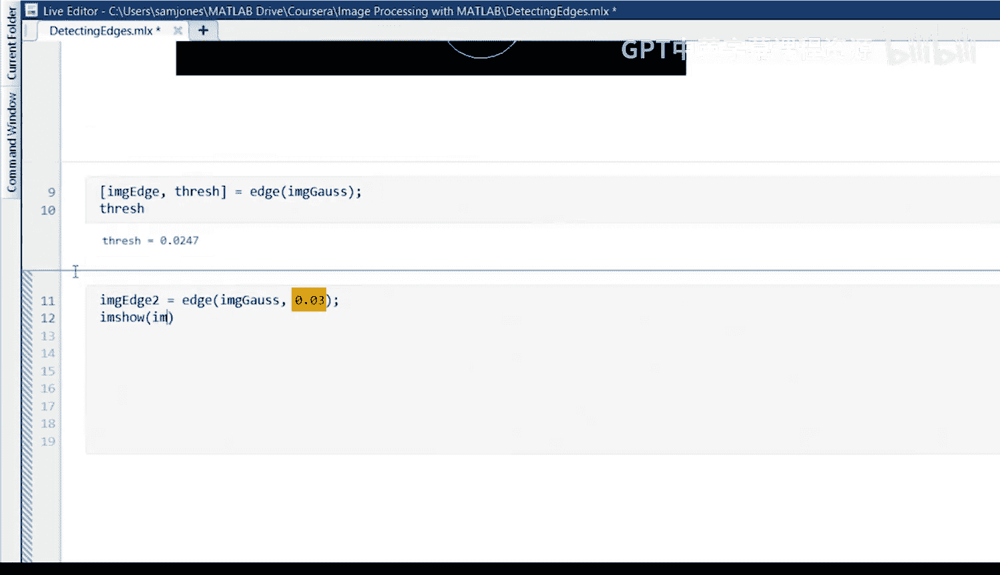

## 其他边缘检测方法

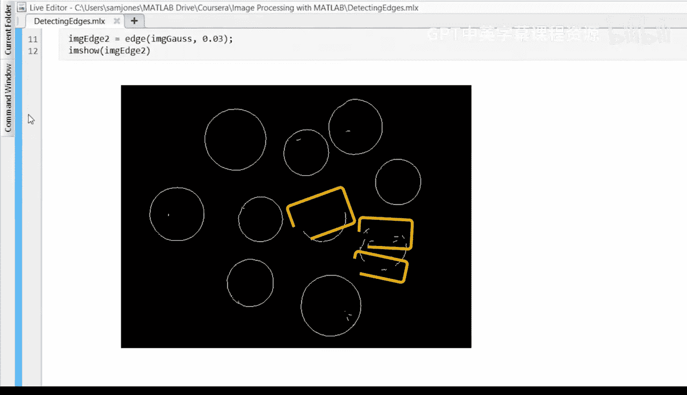

**Canny方法**是另一种流行的算法。它使用与Sobel方法相同的滤波器，但对输出进行了不同的处理和阈值化。它通常能比Sobel方法检测到更多的边缘细节，这在某些应用场景中非常有用。

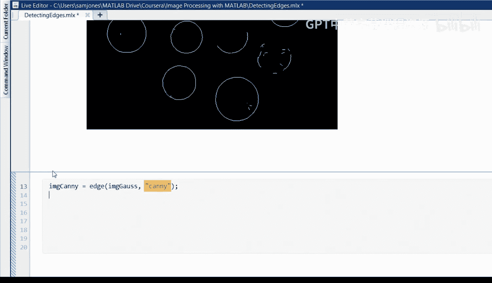

`edge`函数还包含许多其他流行的边缘检测方法，如Prewitt、Roberts和Laplacian of Gaussian (LoG)。

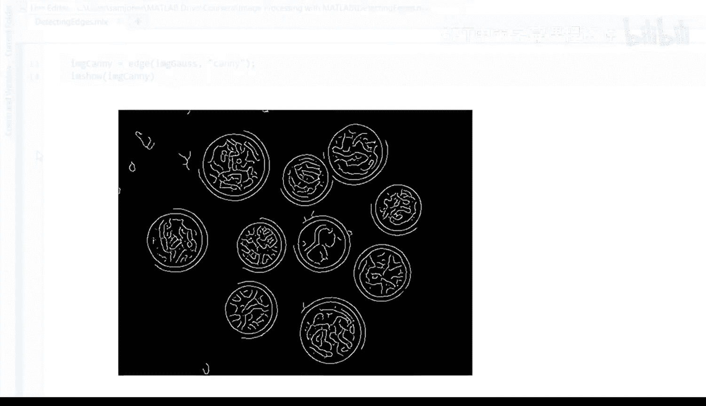

## 特定应用：检测圆形物体

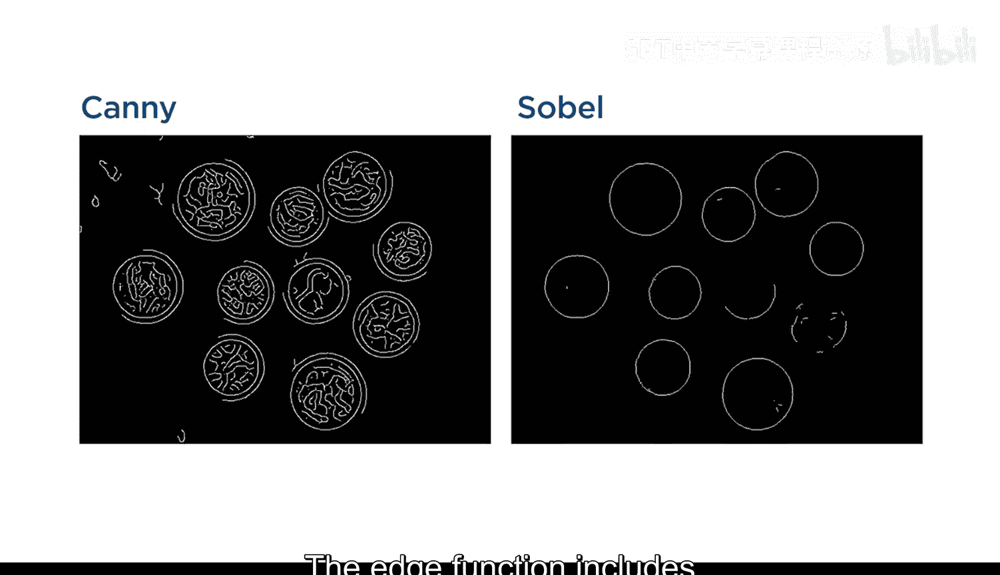

利用边缘来寻找圆形或近似圆形的物体是一个常见的应用。MATLAB为此提供了专用函数。

`imfindcircles`函数通过寻找圆形边缘来分割图像。随后，可以使用`viscircles`函数将检测到的边缘叠加显示在原图上。

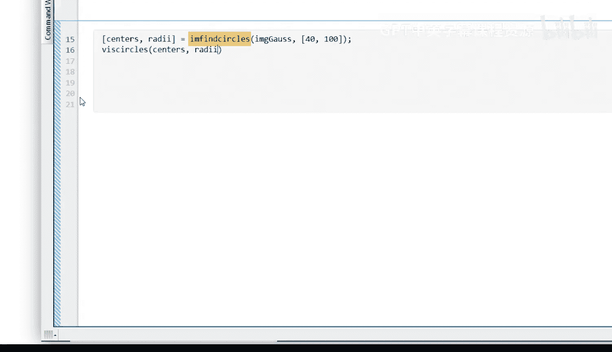

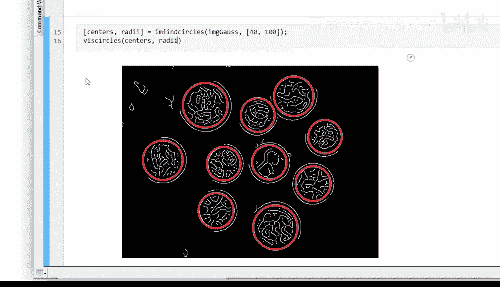

```matlab
% 示例：使用 imfindcircles 检测圆形
[centers, radii] = imfindcircles(blurredImg, [20 100], 'ObjectPolarity', 'dark');
imshow(coinImage);
viscircles(centers, radii, 'EdgeColor', 'b'); % 用蓝色圆圈标出检测到的硬币
```

## 总结

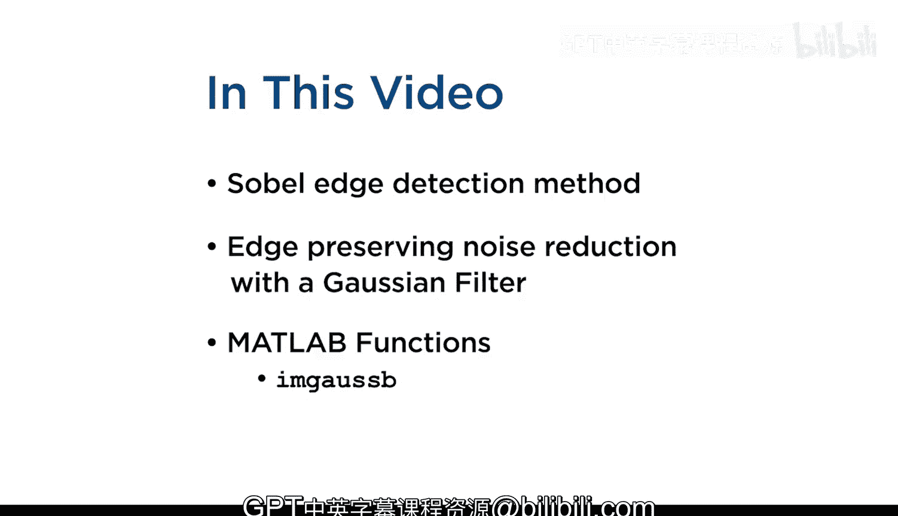

本节课中我们一起学习了边缘检测的核心知识。你了解了**Sobel边缘检测方法**背后的基本思想，包括梯度计算和阈值处理。你也看到了**高斯滤波器**如何在保留主要边缘的同时移除微小细节。最后，你学会了如何运用MATLAB内置的函数（如`edge`, `imgaussfilt`, `imfindcircles`）来应用这些技术，从而有效地从图像中提取边界信息。