# 15：利用形态学优化分割 🧩

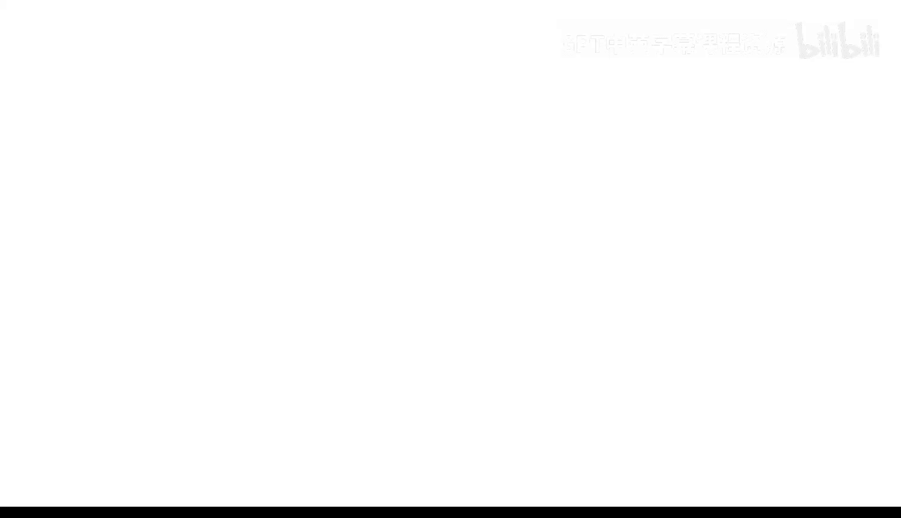

在本节课中，我们将学习如何使用形态学操作来优化图像分割的结果。分割后的掩码（mask）常常会包含我们不想要的孔洞或孤立的噪声点，形态学提供了一套强大的工具来修正这些问题。

## 概述：分割的挑战与形态学的引入

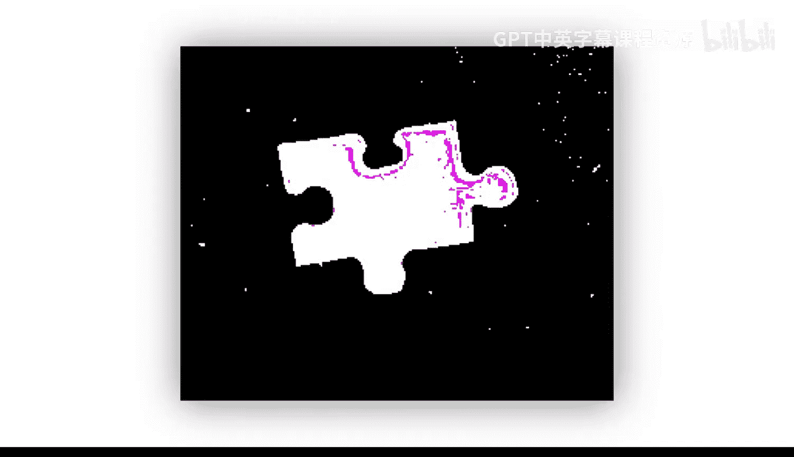

当我们进行图像分割时，例如对下图中的拼图块使用灰度阈值法，得到的初始掩码往往并不完美。

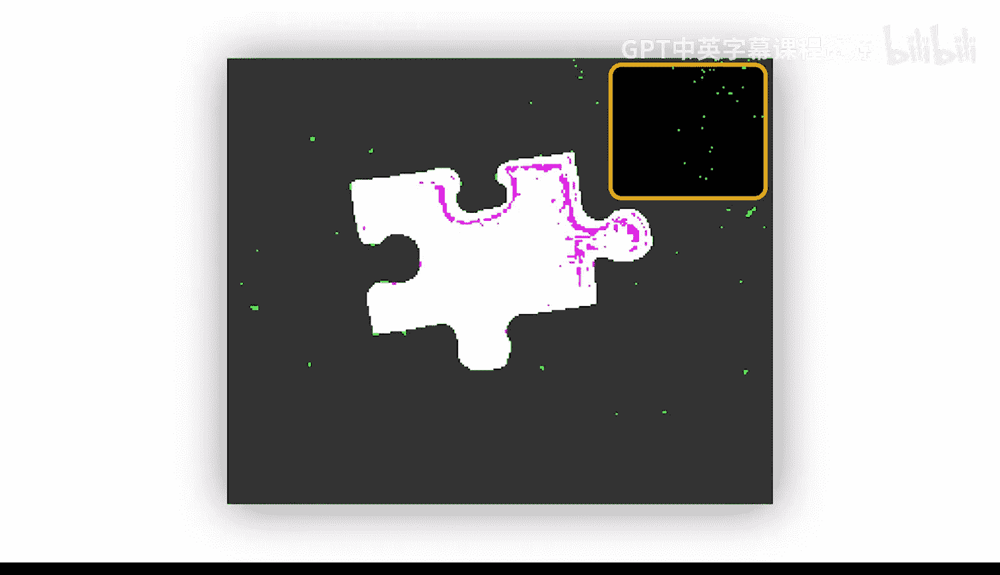

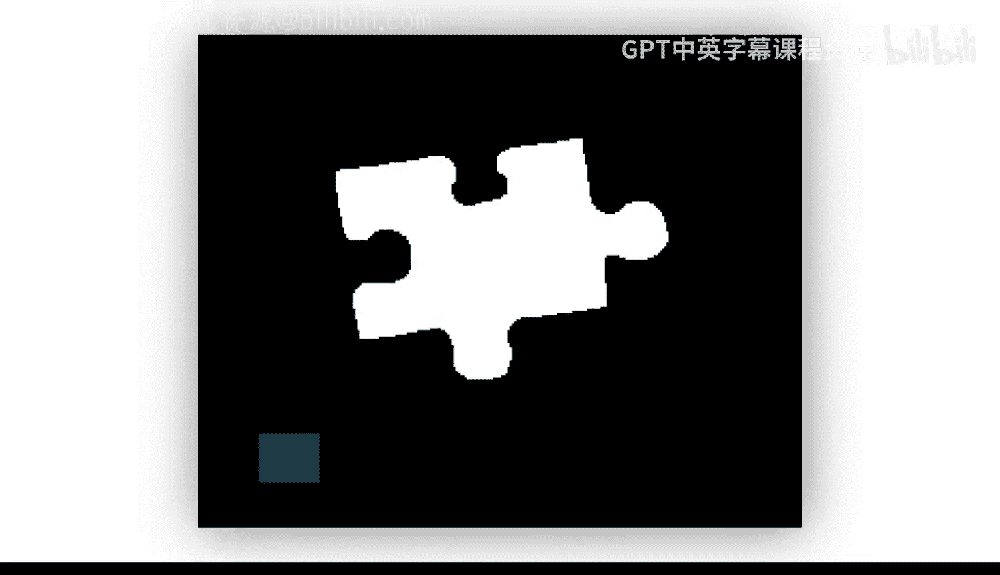

初始掩码中，我们想要的真实像素区域可能存在我们不希望的间隙或孔洞。

同时，在背景区域也可能存在我们不想要的、孤立的真实像素点（噪声）。

解决这些问题的有力工具被称为**形态学**。

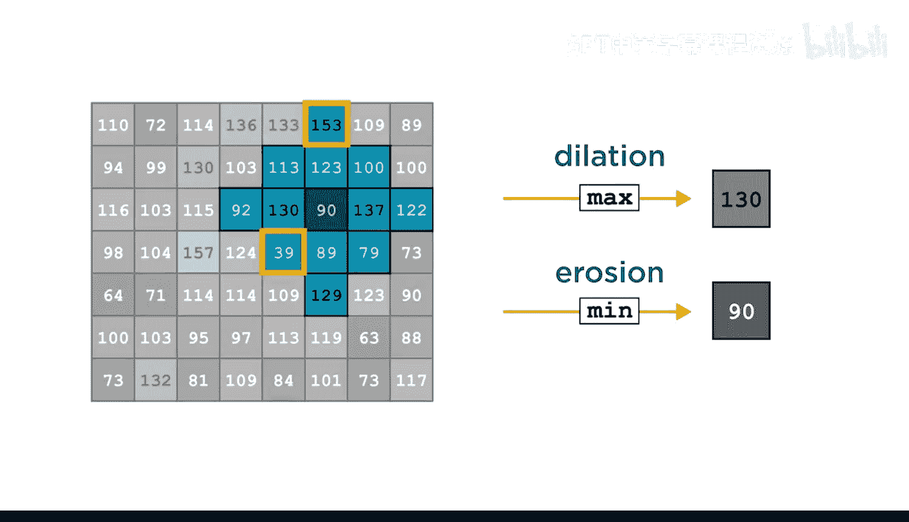

## 形态学基础：膨胀与腐蚀

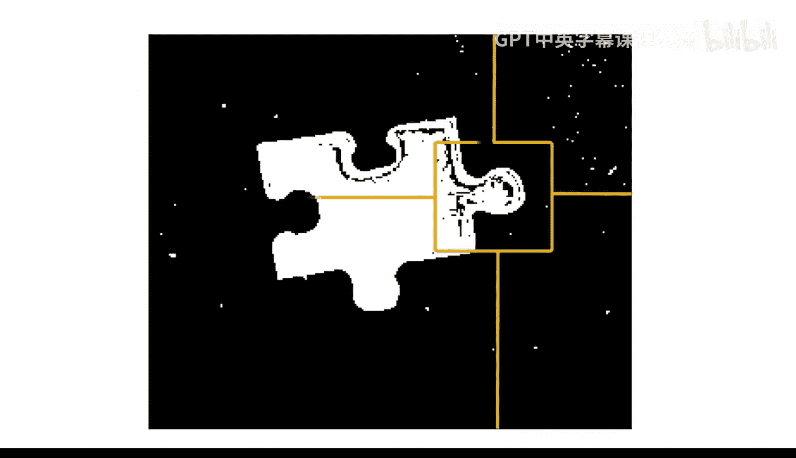

形态学操作类似于空间图像滤波。它通过一个在原始图像上移动的像素邻域（称为**结构元素**）来为每个像素分配新的值。

形态学有两个基本操作。第一个是**膨胀**，它将邻域内的最大值赋给新像素。第二个是**腐蚀**，它将邻域内的最小值赋给新像素。

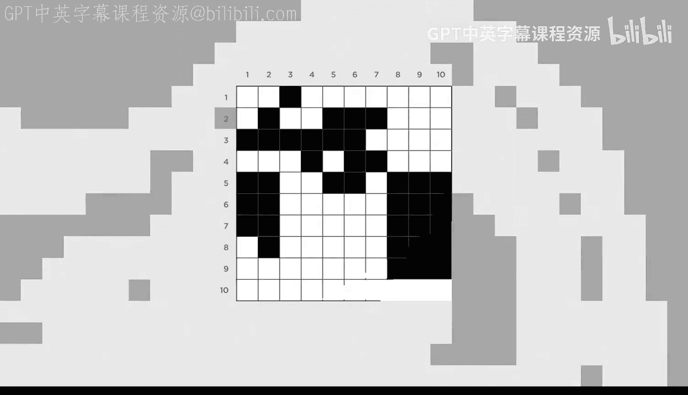

在二值图像（掩码）中，这可以简化为：
*   **膨胀**：如果结构元素覆盖的区域内**有任何**像素为真（True/1），则新像素为真。
*   **腐蚀**：如果结构元素覆盖的区域内**有任何**像素为假（False/0），则新像素为假。

形态学强调改变结构元素的**大小**和**形状**，这允许你对图像中不同大小或形状的物体产生不同的影响。

让我们仔细观察拼图块的掩码，看看这些操作如何影响它。

### 膨胀操作详解

使用一个简单的3x3方形结构元素。

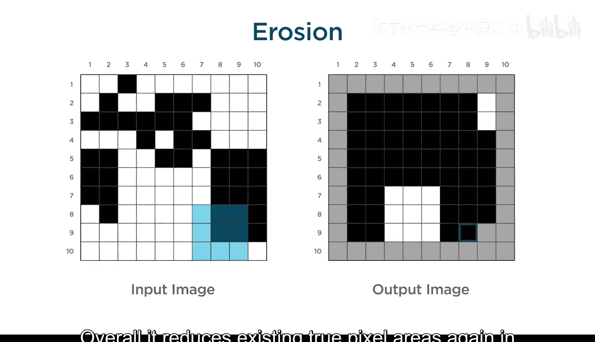

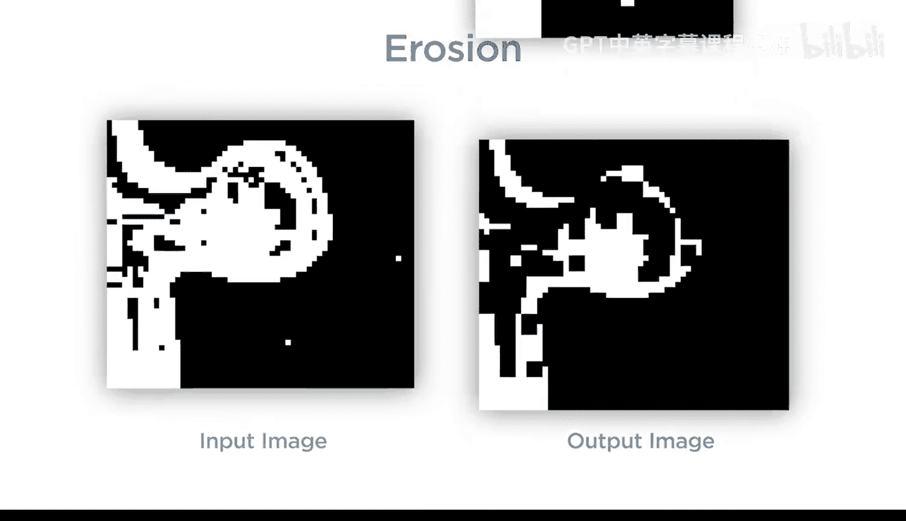

对于二值图像，膨胀操作会**扩展**现有的真实像素区域。结构元素的大小和形状会影响结果。改变结构元素的大小或形状，会影响图像的哪些区域被改变，以及改变的程度。

### 腐蚀操作详解

腐蚀操作则相反，它会**缩减**现有的真实像素区域。同样，其效果与结构元素的大小和形状成比例。

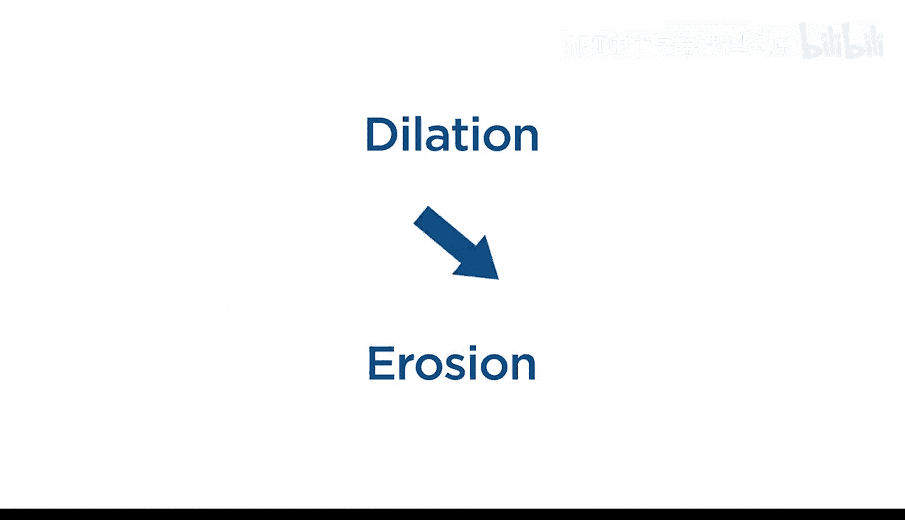

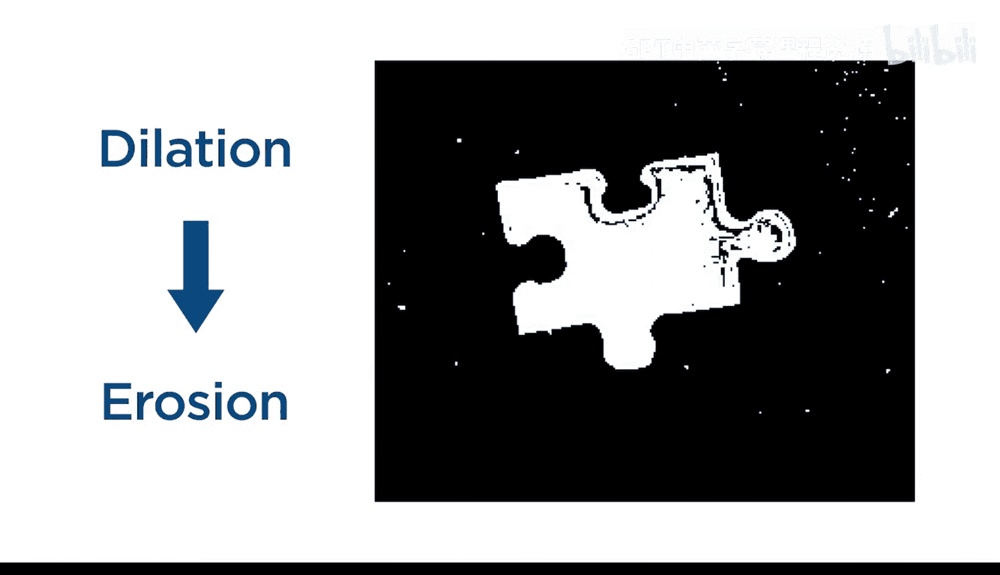

## 组合操作：闭运算与开运算

有时，单独使用膨胀或腐蚀就足以修复掩码。但在本例中，单独应用其中任何一个操作，在解决部分问题的同时，也会使其他问题恶化。按顺序组合使用这些操作通常能获得更好的结果。

### 闭运算：填充内部孔洞

在本例中，一个包含两种操作的序列可以专门填充拼图块内部的孔洞。

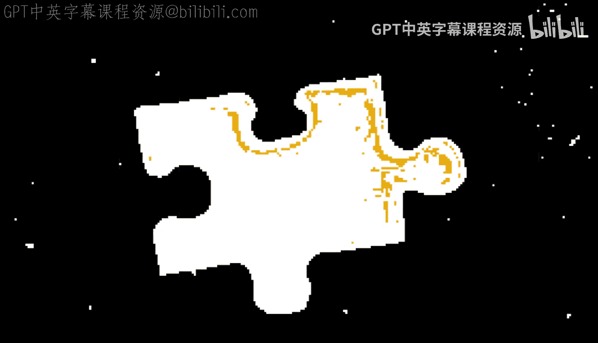

以下是操作步骤：
1.  **膨胀**：使用一个足够大的结构元素对掩码进行膨胀，以完全填充拼图块内部的间隙。这填充了间隙，但也在边界周围增加了额外的真实像素，并放大了我们不想要的噪声点。
2.  **腐蚀**：使用**相同的**结构元素对膨胀后的结果进行腐蚀。这个操作移除了边界周围额外增加的像素，也缩小了被放大的噪声点，同时保持了拼图块内部已被填充的孔洞。

**原理**：膨胀完全闭合了拼图块内部的间隙，创建了一个比结构元素更大的真实像素区域。然而，在拼图块边缘产生的多余部分以及小噪声点的放大区域，其边缘仍然与假像素相邻，处于结构元素的作用范围内。因此，随后的腐蚀能够反转这些变化，而不会影响拼图块内部已闭合的间隙。

这个**先膨胀后腐蚀**（使用相同结构元素）的序列被称为**形态学闭运算**。关键是要记住，此操作会**闭合**能够被结构元素覆盖的真实像素区域之间的间隙，而掩码的其余部分保持不变。

### 开运算：消除外部噪声

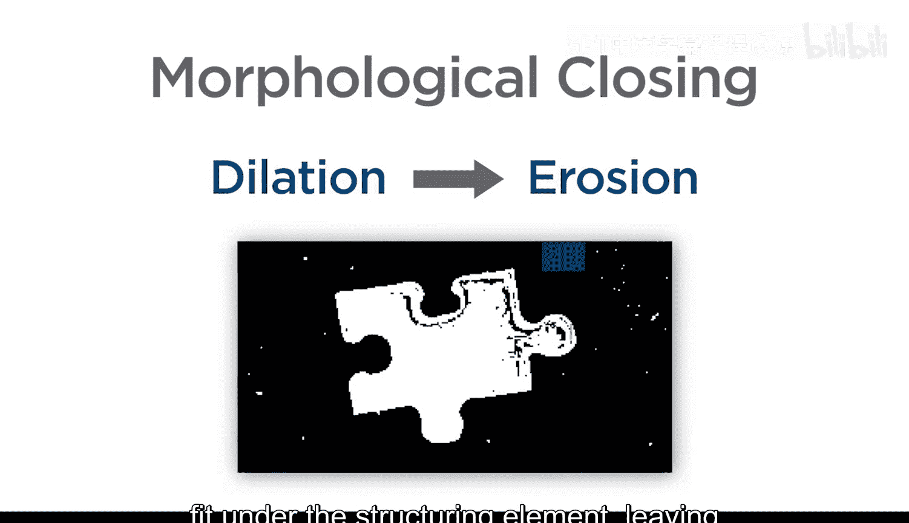

回到我们的例子，经过闭运算后，仍然存在我们不想要的孤立真实像素点（噪声）。你可能会想，应该存在一种对偶的方法来消除这些小簇的真实像素，同时基本保持大的拼图块不变。你是对的。

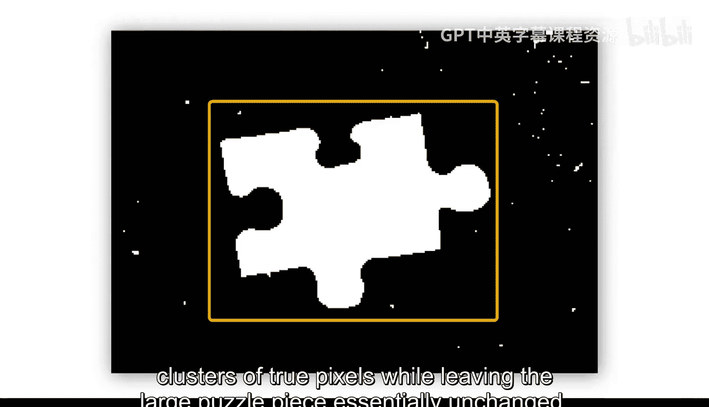

只需反转步骤，你就得到了所谓的**形态学开运算**。

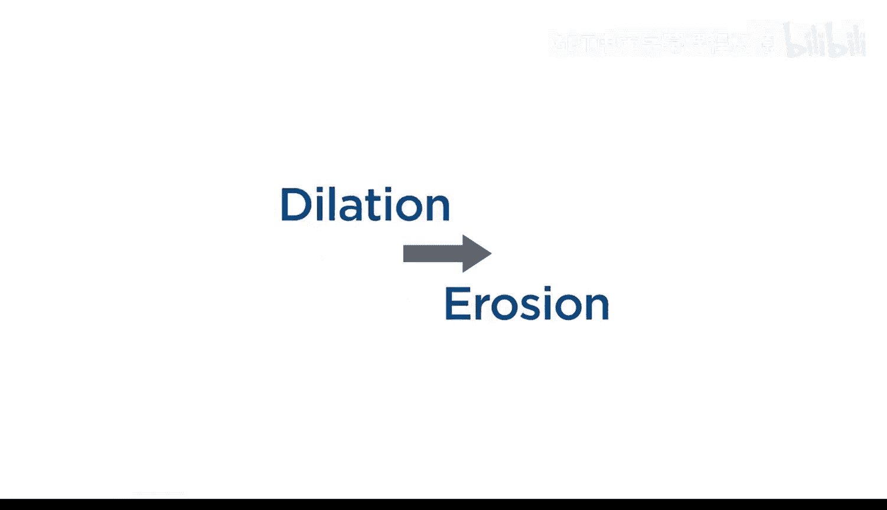

以下是操作步骤：
1.  **腐蚀**：使用一个足够大的结构元素对掩码进行腐蚀，以覆盖（即消除）那些小的噪声点。
2.  **膨胀**：使用**相同的**结构元素对腐蚀后的结果进行膨胀，以恢复拼图块的边缘。

开运算序列通过**移除**能够被结构元素覆盖的小的真实像素区域，从而**扩大**了假像素区域。较大的拼图块基本保持不变。

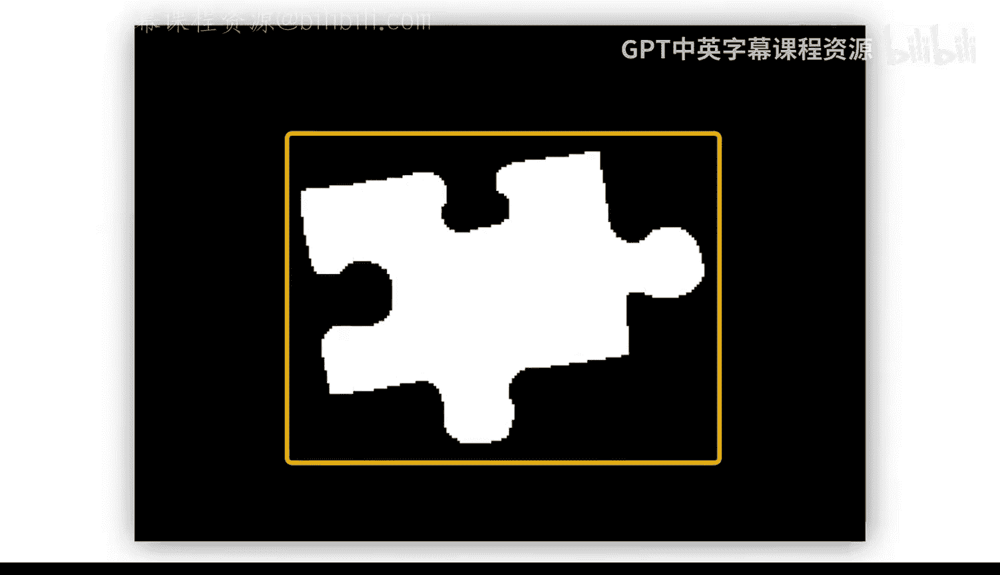

## 效果对比与总结

将经过闭运算和开运算后的最终掩码与初始掩码进行比较。

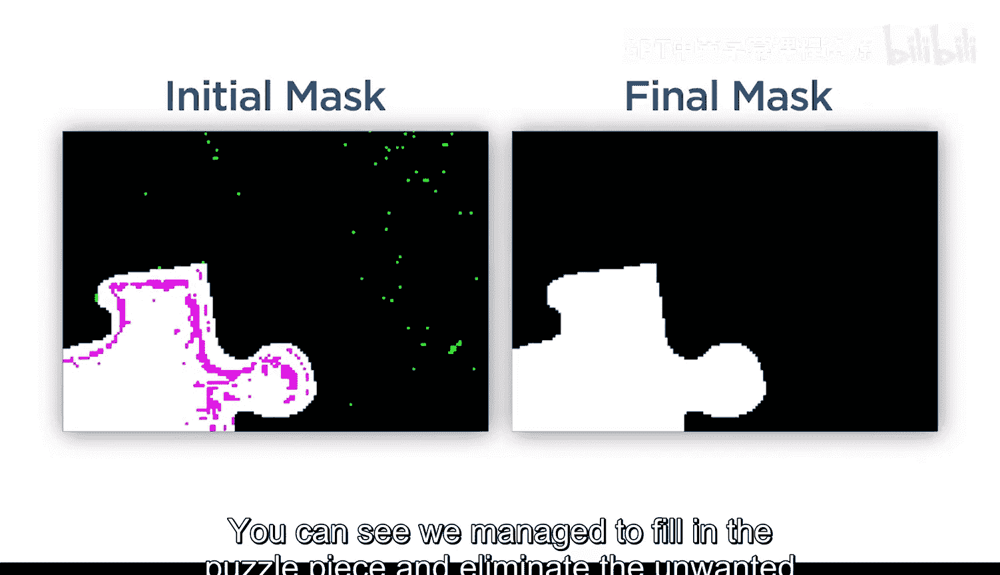

可以看到，我们成功地填充了拼图块内部，并消除了不想要的噪声点，同时没有改变拼图块本身的轮廓。

将这个掩码叠加到原始图像上，可以看到它提供了非常准确的分割结果。

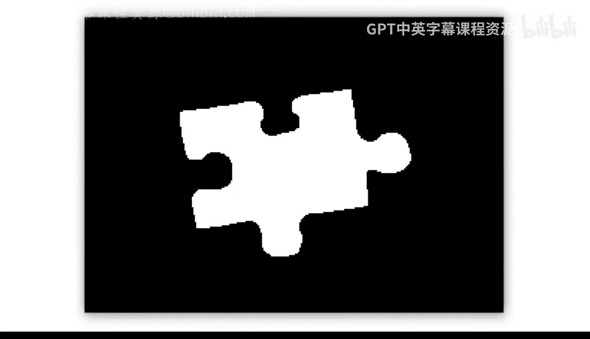

**本节课总结**：我们一起学习了二值形态学的核心概念与技术，包括**膨胀**、**腐蚀**以及它们的组合**开运算**和**闭运算**。这些工具能有效优化分割掩码，填充目标内部的孔洞或消除外部的孤立噪声。

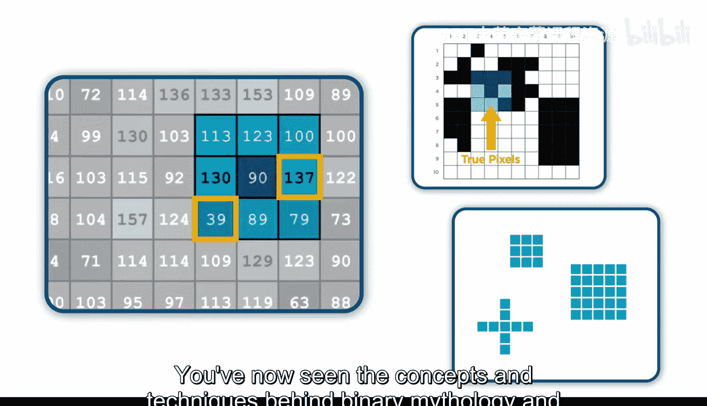

接下来，你将学习如何在MATLAB中使用一个应用程序来轻松尝试这些操作并可视化结果。

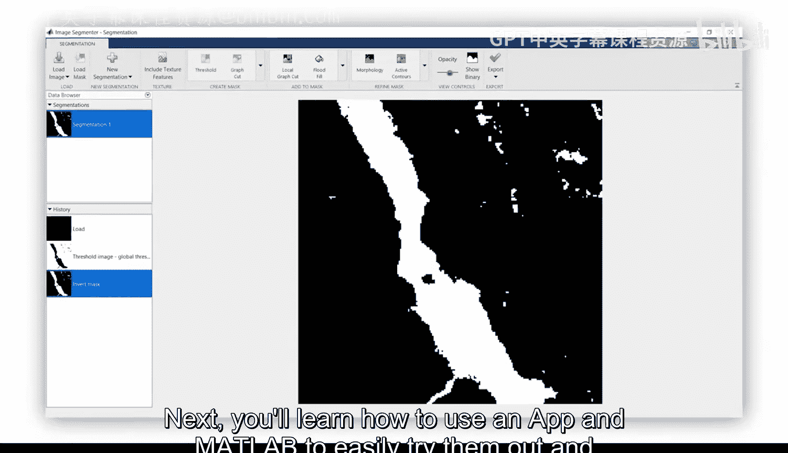

