# 16：组合多个掩膜 🎭


在本节课中，我们将学习如何通过组合多个掩膜来实现更精确的图像分割。有时，单个掩膜无法满足我们的分割需求，这时就需要使用逻辑运算符来合并多个掩膜。

## 概述

有时，单个掩膜无法产生理想的分割结果。例如，从一张图像中分割出所有彩色芯片。

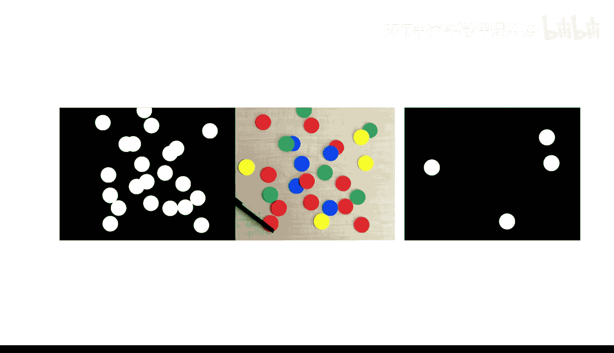


然而，通过组合多个掩膜，我们可以实现所需的分割效果。在本视频中，你将学习如何使用逻辑运算符（如 **AND**、**OR** 以及 **NOT**）来处理这种情况。

## 问题分析

由于芯片是圆形的，分割它们的一个好方法是使用图像分割器应用中的“查找圆形”工具。

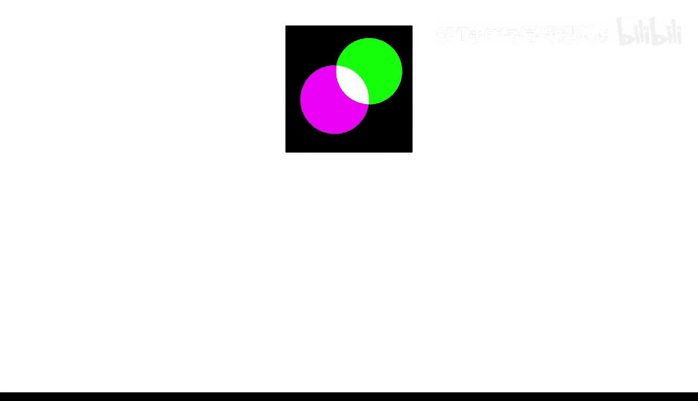

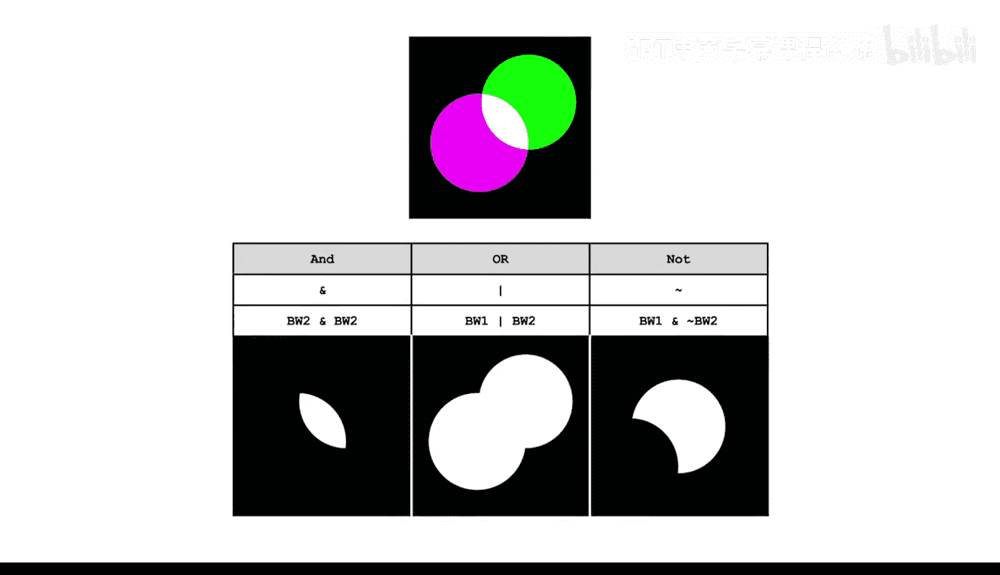


调整大小和灵敏度可以分割所有黄色芯片，但无法分割其他颜色的芯片。这是因为前景极性设置为“亮”。

将前景极性更改为“暗”可以分割所有剩余颜色的芯片。因此，我们需要为每种极性设置生成一个分割函数，以便在脚本中创建掩膜。

## 创建掩膜

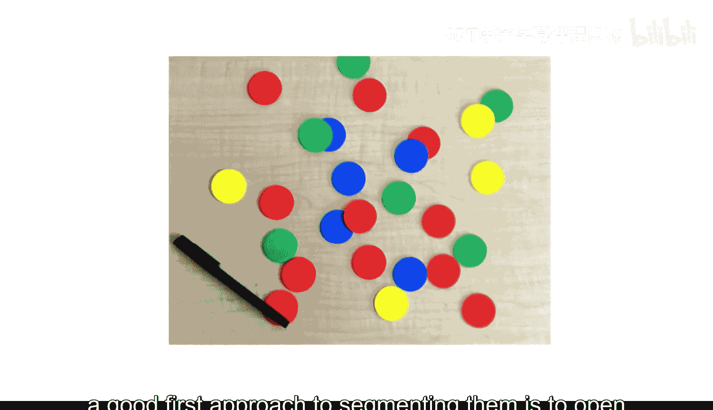

首先，打开一个脚本并加载图像。接下来，使用从应用中生成的函数为两种前景极性创建二值掩膜。

```matlab
% 加载图像
img = imread('chips_image.png');

% 使用应用生成的函数创建掩膜
mask_bright = segmentChips_bright(img);
mask_dark = segmentChips_dark(img);
```

## 组合掩膜

要组合二值掩膜，可以使用逻辑运算符 **AND**、**OR** 和 **NOT**。在本例中，我们需要使用 **OR** 运算符来获取图像中任一掩膜为真的部分。

```matlab
% 使用 OR 运算符组合掩膜
combined_mask = mask_bright | mask_dark;
```

现在，让我们检查结果。

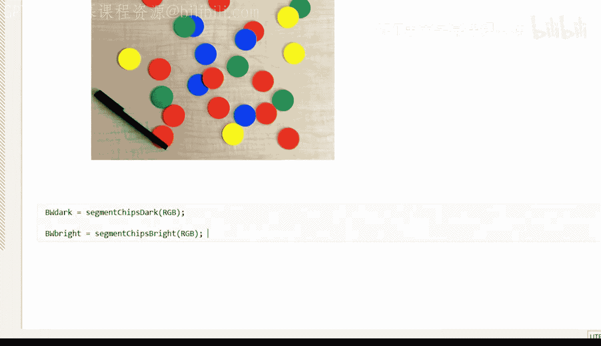


看起来这个掩膜应该能够分割所有芯片。

## 应用掩膜

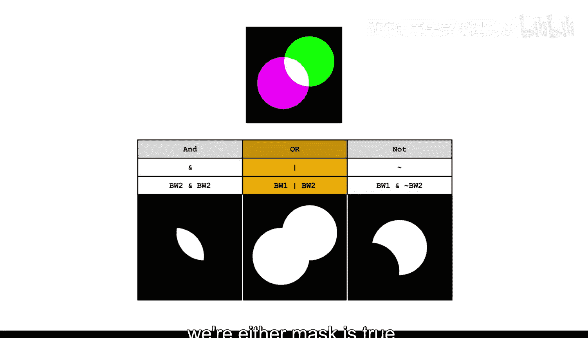

接下来，我们看看将掩膜应用到图像上的效果。

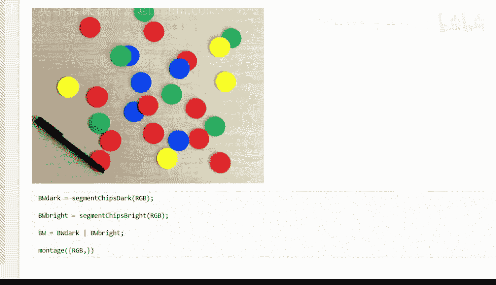

首先，创建图像的副本。然后，应用掩膜。使用 `repmat` 函数将二值掩膜复制到所有三个颜色平面。

```matlab
% 创建图像副本
img_copy = img;

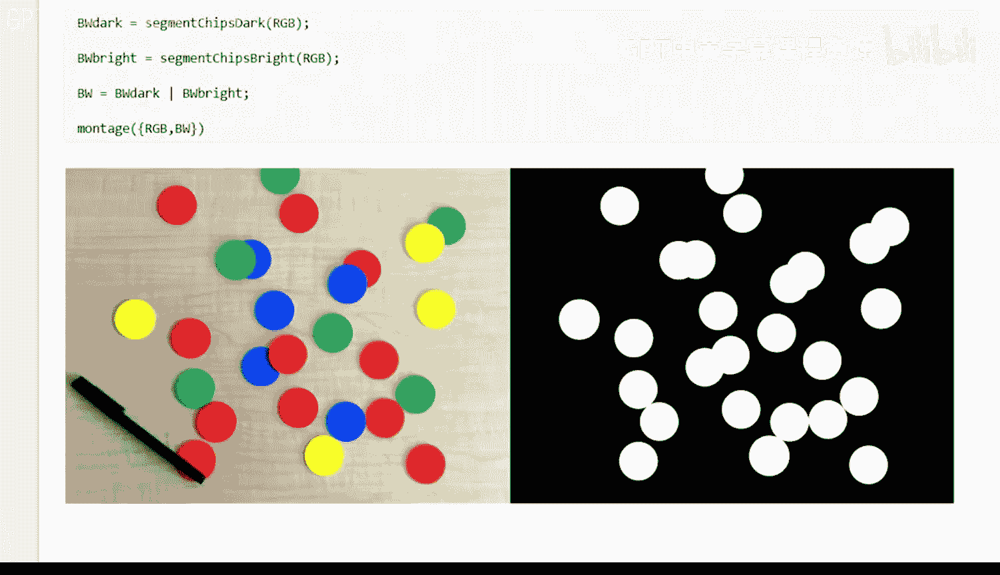

% 应用掩膜
mask_3d = repmat(combined_mask, [1, 1, 3]);
img_masked = img_copy .* uint8(mask_3d);
```


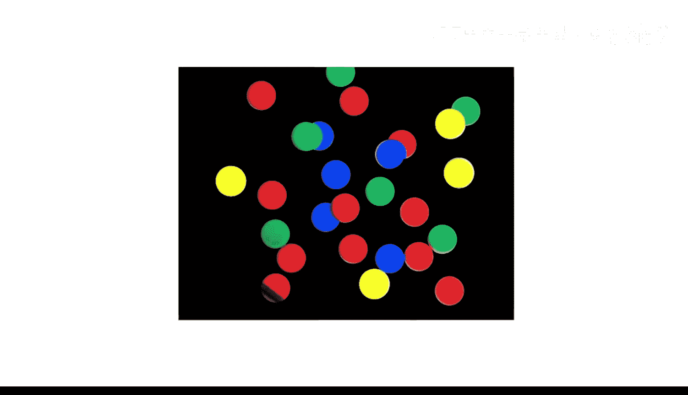

效果很好。每个芯片都被这个掩膜成功分割。

## 复杂掩膜组合

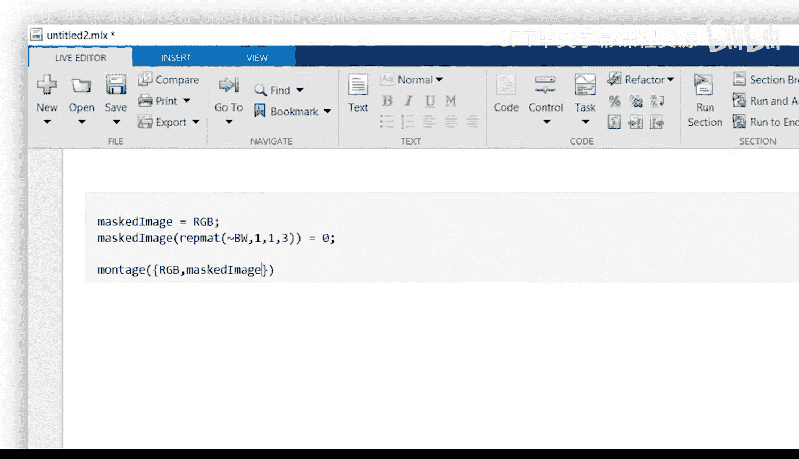

在你的应用中，可能需要组合两个以上的掩膜，并且它们之间的关系可能更复杂。但你可以始终将组合分解为单个运算符对。

例如，如果需要组合三个掩膜 `A`、`B` 和 `C`，可以使用以下方式：

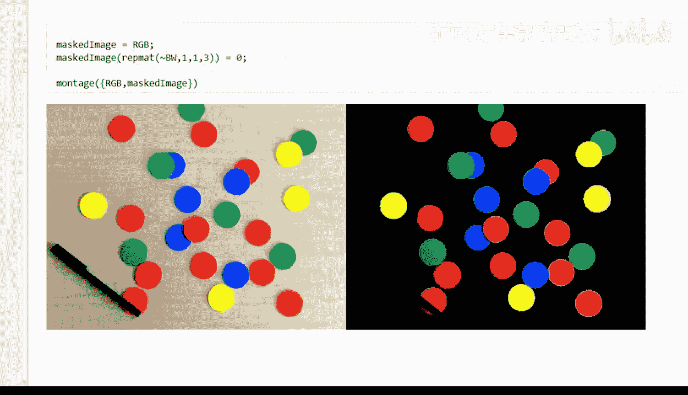

```matlab
% 组合三个掩膜
final_mask = (A & B) | C;
```

通过这种方式，你可以灵活地处理各种复杂的掩膜组合需求。

## 总结

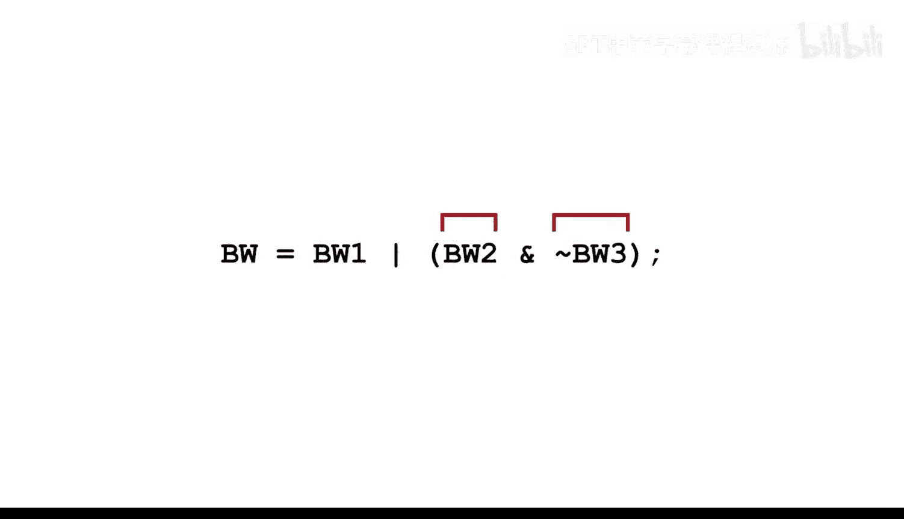

在本节课中，我们一起学习了如何通过组合多个掩膜来实现更精确的图像分割。我们使用逻辑运算符 **OR** 将两个掩膜合并，从而成功分割了所有彩色芯片。我们还探讨了如何将复杂掩膜组合分解为简单的运算符对，以便更好地处理实际应用中的需求。