# 17：使用聚类进行图像分割 🧩

在本节课中，我们将要学习一种非二值化的图像分割方法——聚类。我们将探讨如何利用聚类技术，根据像素的颜色属性将图像分割成多个不同的区域，从而一次性标记出图像中的多个对象。

## 概述

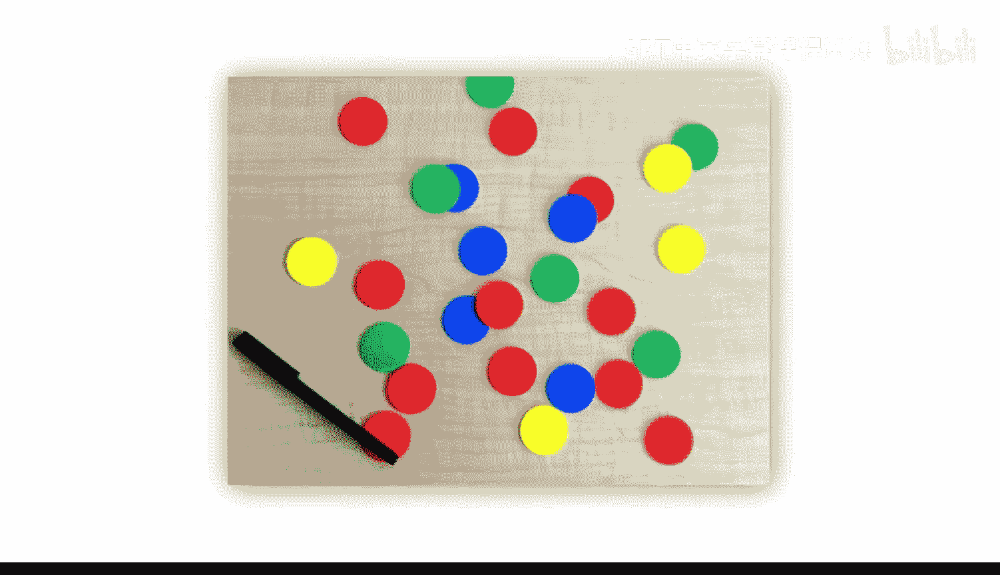

分割并不总是二值的。某些应用需要在同一张图像中标记多个对象。例如，在下图中，如果我们希望将每种颜色的芯片单独分割出来，就需要一种能够生成多标签掩码的方法。


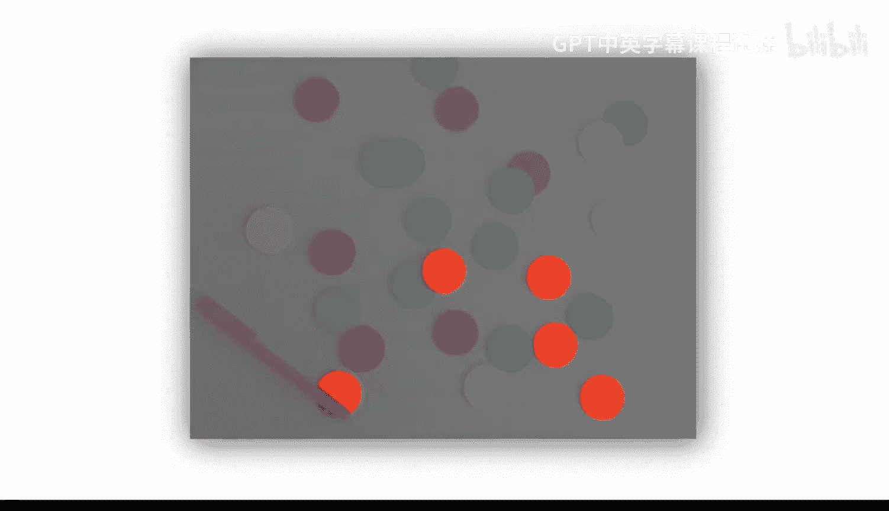


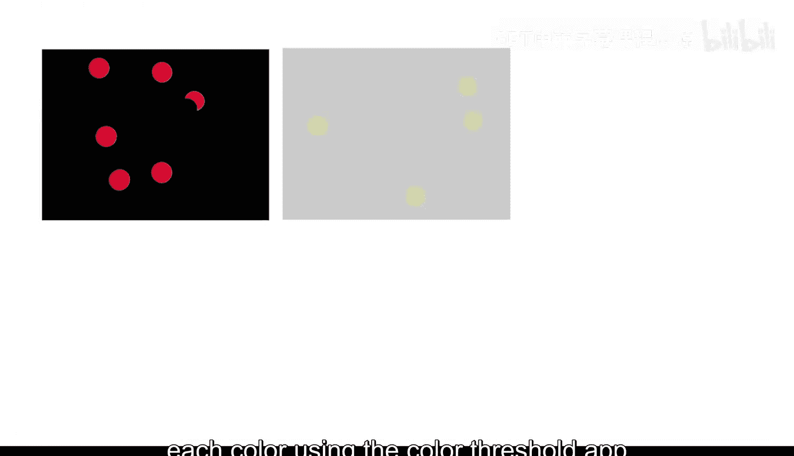

一种可能的方法是使用颜色阈值应用程序为每种颜色创建一个二值掩码，然后将它们组合成一个多标签掩码。


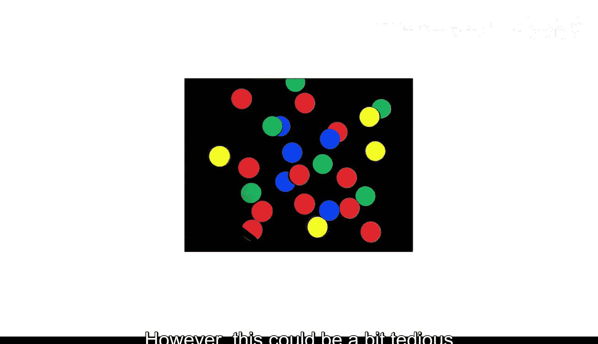


然而，这种方法可能有些繁琐。


## 聚类方法简介

上一节我们介绍了多标签分割的需求，本节中我们来看看一种能直接生成多标签掩码的方法：**聚类**。聚类是一种数学技术，用于将具有相似属性的数据分组。在图像处理中，我们可以根据像素的颜色坐标（例如在HSV颜色空间中的值）将图像聚类成不同的区域。

与颜色阈值处理类似，在聚类时，使用替代颜色空间（如HSV）通常是有利的。在本例中，HSV空间似乎能最好地区分芯片的颜色坐标。

以下是转换图像到HSV颜色空间的代码：
```matlab
hsvImage = rgb2hsv(rgbImage);
```

## 执行K均值聚类

接下来，聚类算法需要知道图像中要标记多少个颜色簇。图像中有五种颜色的芯片、一支黑色笔和一个木色桌面，因此我们最初尝试使用7个标签。

`imsegkmeans`函数将对图像执行K均值聚类。请注意，输入图像的数据类型需要是`single`。

以下是执行聚类的代码：
```matlab
numLabels = 7;
[labelMatrix, ~] = imsegkmeans(single(hsvImage), numLabels);
```

函数的输出是一个像素标签矩阵。矩阵中的每个元素都是一个数字，指定了对应像素被分配到的簇。

为了将标签矩阵与原始图像进行比较，可以使用`label2rgb`函数：
```matlab
coloredLabels = label2rgb(labelMatrix);
imshow(coloredLabels);
```

## 分析初步聚类结果

查看标签矩阵后发现，桌面像素被分到了三个不同的簇中，并且并非每种颜色的芯片都获得了唯一的标签。

K均值聚类使用点之间的距离作为相似性度量，将颜色坐标数据划分为K个簇。在本例中，可以看到桌面的许多像素分布在一定的亮度范围内，这个“体积”被分割成了多个簇。

然而，我们注意到属于笔和桌面的像素，其饱和度都低于彩色芯片的像素。

## 结合阈值处理优化分割

因此，我们可以利用这一点，先将桌面和笔从图像中分割出去，然后再对黑色背景上的彩色芯片进行聚类。


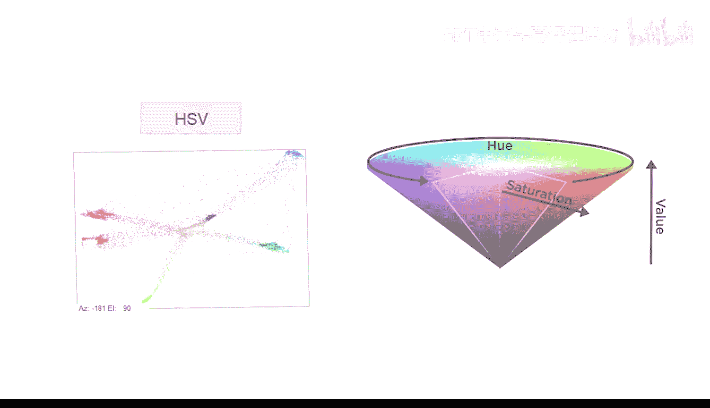

看起来，饱和度阈值约为0.75时，可以很好地分离桌面、笔和彩色芯片。


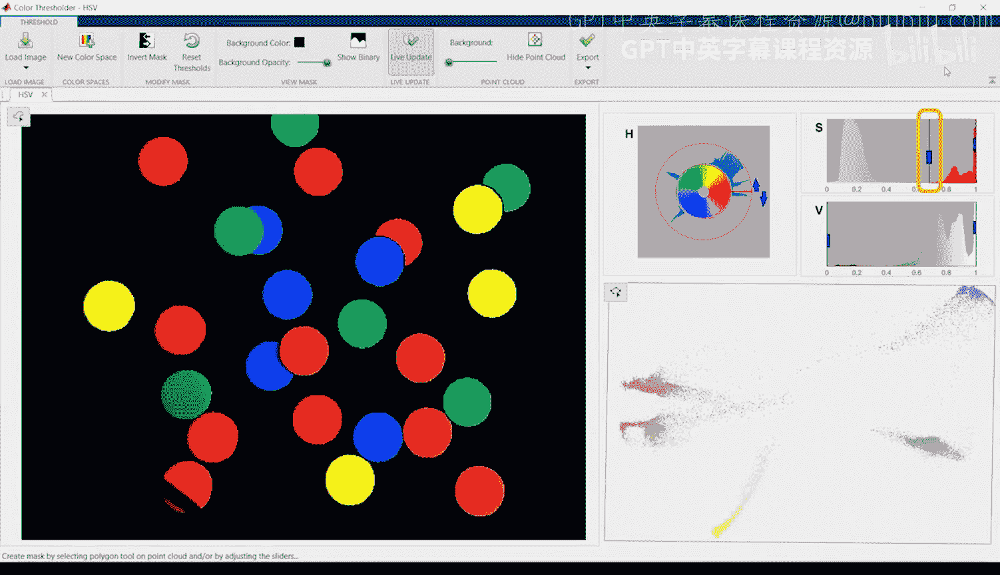

让我们将这一步骤添加到脚本中。饱和度值位于HSV图像的第二个坐标平面中。


以下是创建饱和度掩码并应用的代码：
```matlab
% 假设 hsvImage 是之前转换好的HSV图像
saturationMask = hsvImage(:, :, 2) > 0.75;

% 创建图像副本并应用掩码
filteredHsvImage = hsvImage;
% 将掩码应用到所有三个颜色坐标平面
filteredHsvImage(repmat(~saturationMask, [1, 1, 3])) = 0;


% 为了视觉检查结果，转换为RGB显示
filteredRgbImage = hsv2rgb(filteredHsvImage);
imshow(filteredRgbImage);
```


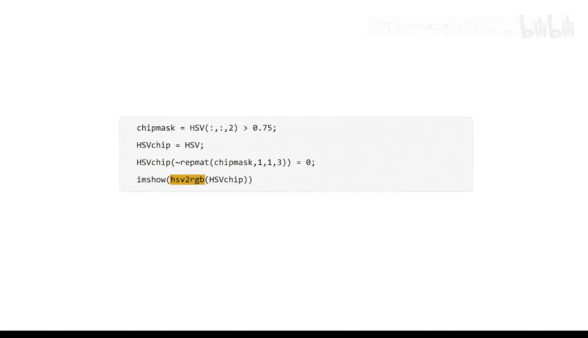

看起来操作正确。


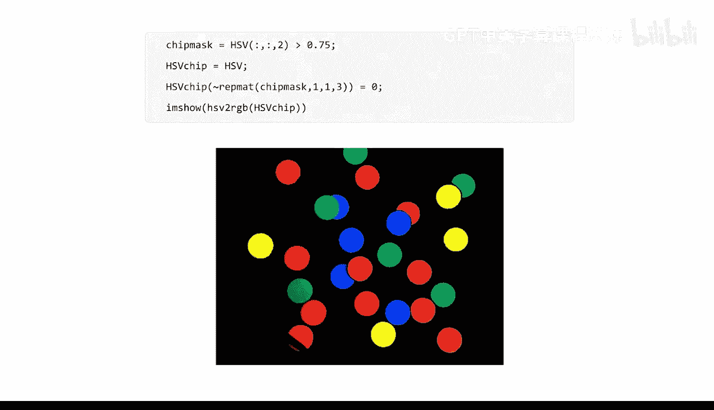

## 对过滤后的图像进行聚类

现在，让我们复制之前的聚类代码。


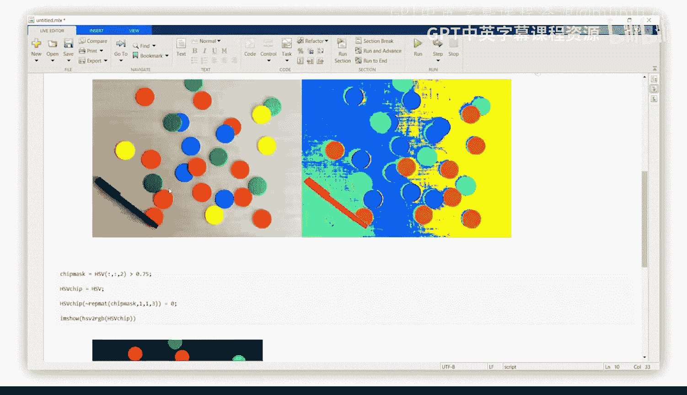


更新代码以使用我们刚刚创建的图像，并将标签数量改为6（对应五种芯片颜色和黑色背景）。

以下是更新后的聚类代码：
```matlab
numLabelsRefined = 6;
[labelMatrixRefined, ~] = imsegkmeans(single(filteredHsvImage), numLabelsRefined);
coloredLabelsRefined = label2rgb(labelMatrixRefined);
imshow(coloredLabelsRefined);
```


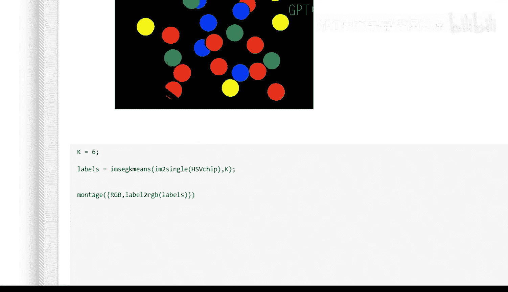

现在，每种芯片颜色似乎都有了唯一的标签。


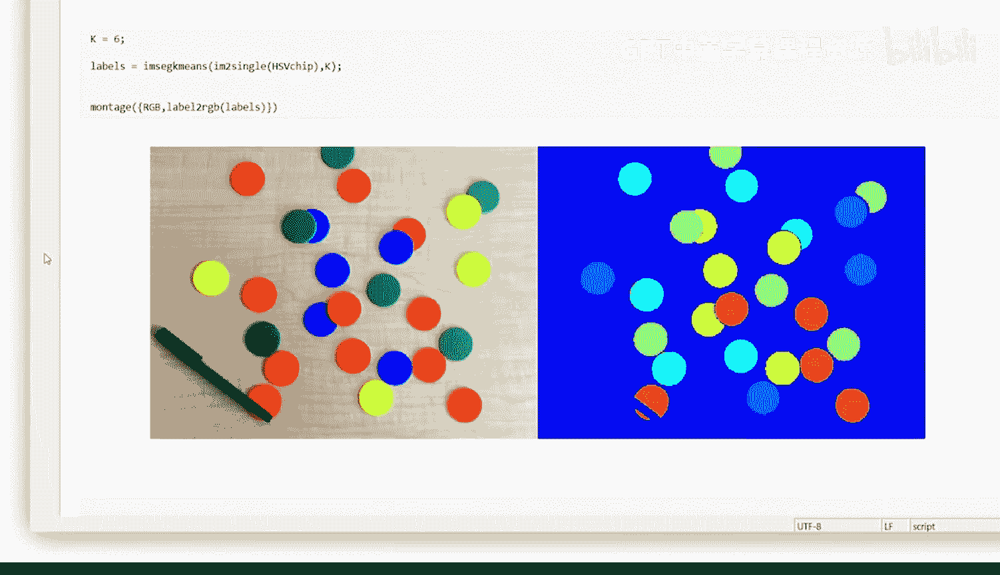


## 总结

本节课中我们一起学习了使用聚类进行图像分割。总的来说，聚类是一种将图像分割成几个不同颜色区域的有效方法。

以下是关键步骤的总结：
1.  **转换颜色空间**：通常先将图像转换到更适合分离目标颜色的空间（如HSV）。
2.  **确定簇数量**：根据图像中不同区域的数量设定K值。
3.  **执行聚类**：使用`imsegkmeans`函数生成标签矩阵。
4.  **可视化和分析**：使用`label2rgb`和`imshow`检查聚类结果。
5.  **结合其他方法**：如本例所示，有时需要将聚类与其他分割方法（如阈值处理）结合使用，以获得最佳结果。


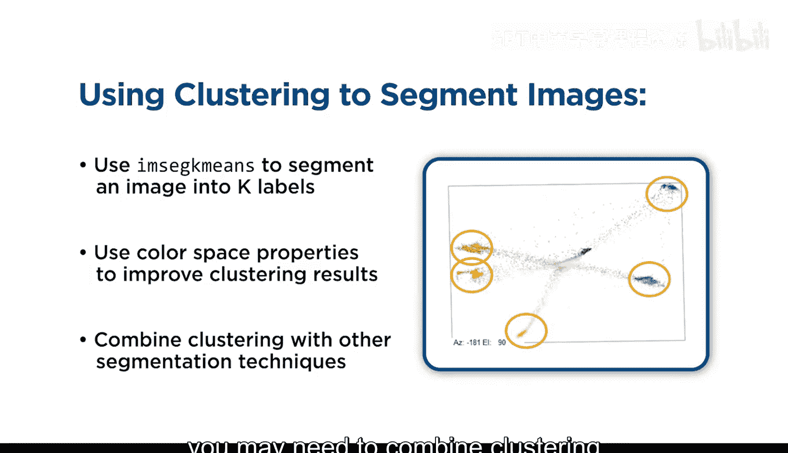


您可能会发现，使用特定的颜色空间有助于聚类算法。并且，如本例所示，您可能需要将聚类与其他分割方法结合使用，以实现精确的多对象分割。