# 18：计算与应用区域属性 🧩

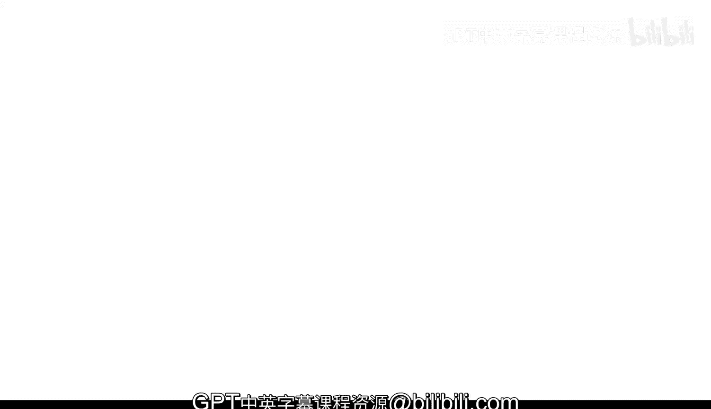

在本节课中，我们将学习如何计算图像分割后各个区域的属性，并利用这些属性来筛选和分析特定区域。这是从分割走向实际应用的关键一步。

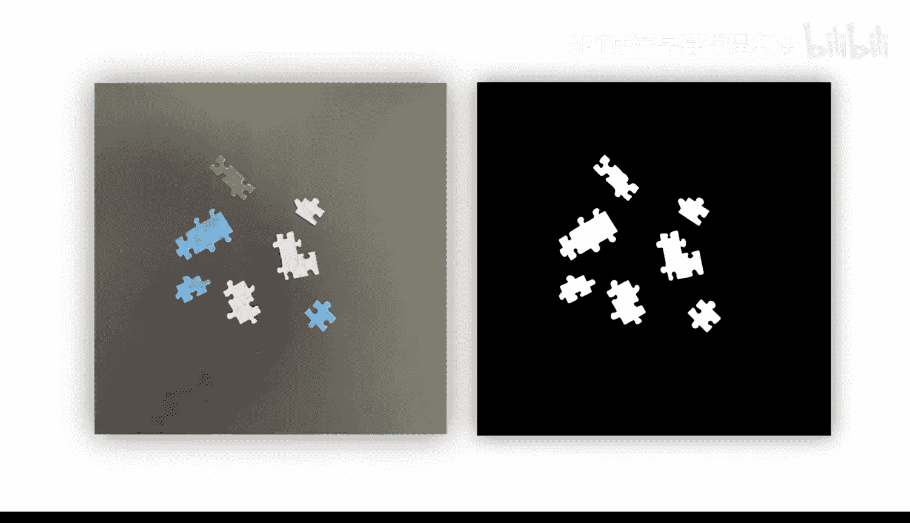

---

在许多应用中，图像分割只是实现更大目标的一个步骤。

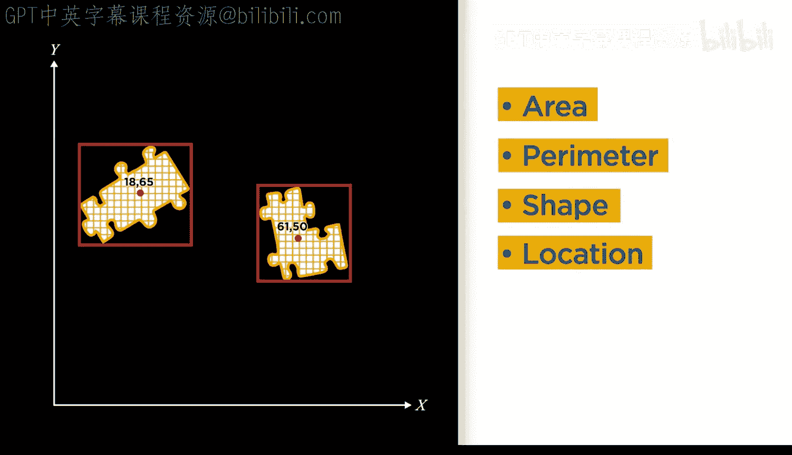

分割完成后，通常需要进一步分析这些区域，通过计算诸如**面积**、**周长**、**形状**和**位置**等属性，或者利用这些属性来分离出特定的区域。

## 使用区域分析器应用程序

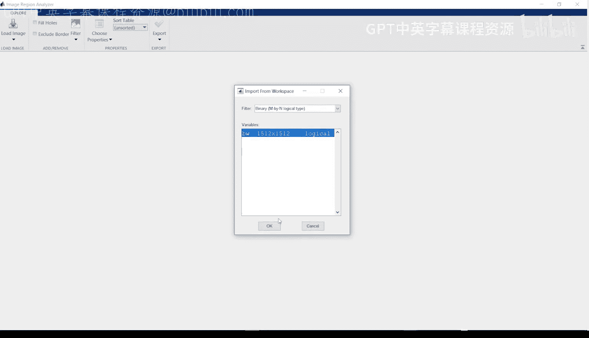

上一节我们介绍了分割的基本概念，本节中我们来看看如何分析分割出的区域。首先，打开 **Region Analyzer** 应用程序。

你可以在MATLAB的“Apps”选项卡中找到它，它与其他图像处理和计算机视觉应用程序归为一组。接下来，将分割得到的**掩膜**图像加载到该应用程序中。

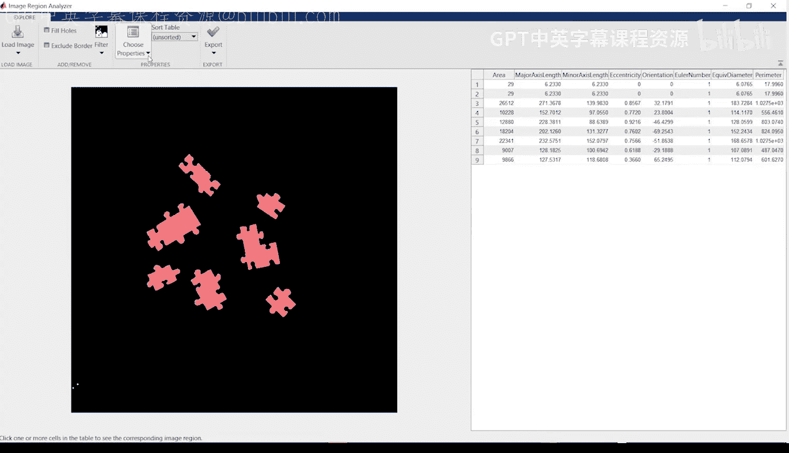

加载后，你会注意到右侧会自动填充每个区域的属性列表。你可以使用菜单来添加或删除需要查看的属性。在这张图像中，存在包含一、二、三个拼图块的区域。

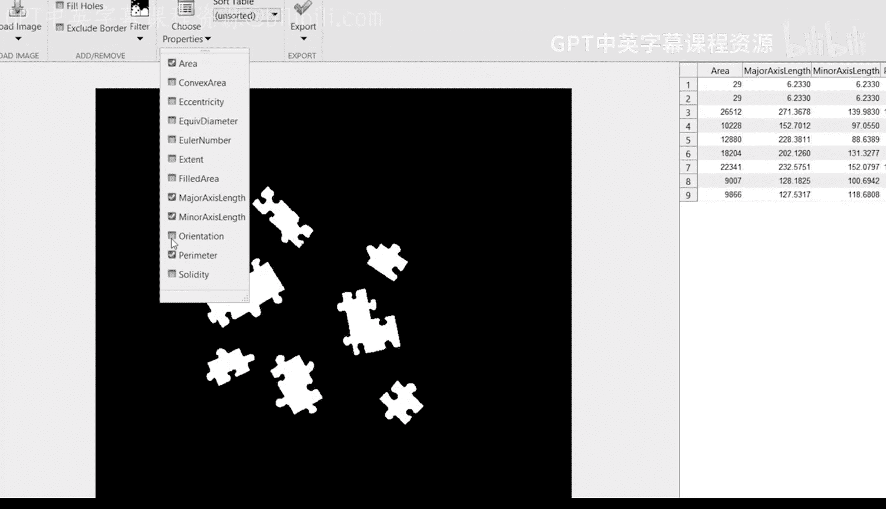

以下是可能帮助我们区分不同区域的一些属性：

*   **面积**：区域内的像素总数。
*   **周长**：区域边界的长度。
*   **质心**：区域中心点的坐标。
*   **边界框**：能完全包围区域的最小矩形。

让我们选择几个可能有助于区分不同区域的属性。包含更多拼图块的区域应该具有更大的面积，我们来验证一下。

请注意，在属性列表中选择特定行时，掩膜图像中对应的区域会高亮显示。此时，按**面积**对属性表进行排序会很有帮助。

通过排序可以清楚地看到：
*   两个包含三个拼图块的区域，其面积均大于 **20000** 像素。
*   包含两个拼图块的区域，其面积大约在 **12000** 到 **18000** 像素之间。
*   面积在 **9000** 到 **10000** 像素之间的区域对应单个拼图块。
*   最后，两个面积很小（约20多像素）的区域是掩膜中的小噪点。

因此，**面积**属性可以用来分离包含不同数量拼图块的区域。

## 筛选特定区域

现在，让我们来分离出包含三个相连拼图块的区域。操作步骤如下：

1.  点击筛选下拉菜单，确保选中“面积”属性。
2.  将范围的下限值增加到 **20000** 像素。

很好，这样就筛选出了所有包含三个拼图块的区域，其他区域都被过滤掉了。通过区域属性进行筛选，可以让你专注于感兴趣的目标，也常用于去除小的噪点，正如我们刚才所做的那样。

## 导出与自动化分析

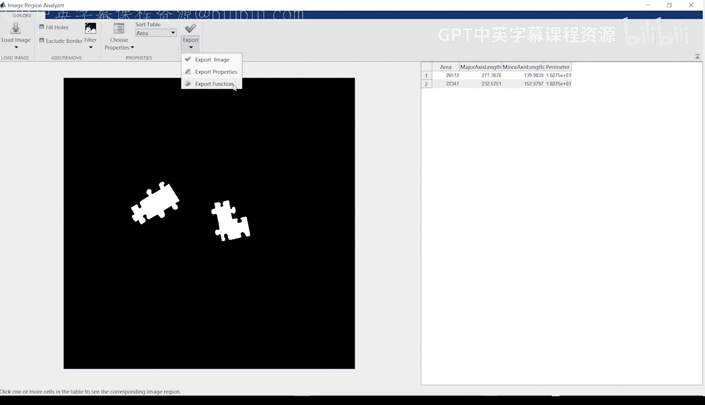

为了将此工作流程重复应用于当前掩膜或类似的掩膜，可以使用“导出函数”选项。

生成的函数使用 `regionprops` 函数来应用在应用程序中选择的筛选条件，并生成新的掩膜。对于每个筛选操作，都指定了属性和范围。例如，为了给面积范围的上限增加一些缓冲，可以将括号中的第二个数字增加到类似 **28000** 的值。

该函数还会返回计算出的属性本身。一个由逗号分隔的属性列表会告知 `regionprops` 函数以默认的**结构体**或**表格**形式返回它们。若想从该函数获得表格输出，取消注释相应的代码行。

给函数起一个有意义且独特的名称是个好习惯。

## 在代码中应用区域属性

区域分析器应用程序是快速了解区域信息和进行筛选的便捷工具。而 `regionprops` 函数能够返回更多信息，请查阅文档以获取所有可用属性的完整列表和描述。

例如，你可能见过像下图这样的图像，其中使用**边界框**来高亮显示感兴趣的区域。让我们看看如何创建它。

首先，在脚本中准备好原始图像和掩膜。

```matlab
% 加载原始图像和掩膜
originalImage = imread('puzzle_image.jpg');
load('segmented_mask.mat'); % 假设掩膜已保存
```

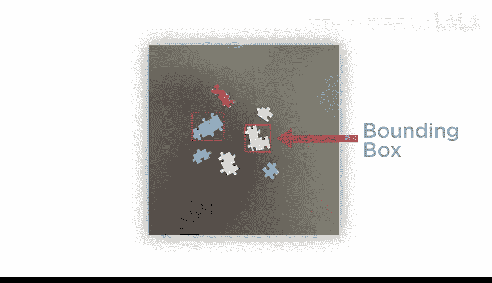

接下来，应用之前生成的函数到掩膜上，以筛选出三个拼图块的区域。

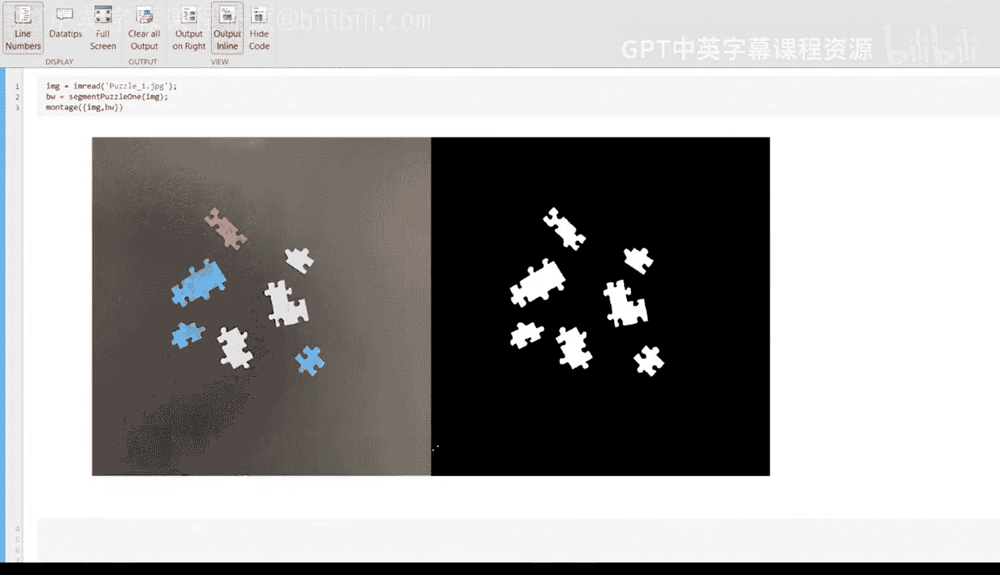

```matlab
% 应用筛选函数
filteredMask = filterRegionsByArea(originalMask, [20000, 28000]);
```

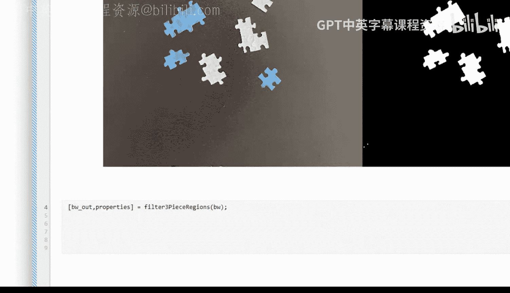

然后，使用 `regionprops` 函数获取每个区域的边界框坐标。

```matlab
% 计算边界框属性
stats = regionprops(filteredMask, 'BoundingBox');
boundingBoxes = vertcat(stats.BoundingBox); % 将结构体数组合并
```

最后，使用 `insertShape` 函数，结合边界框的坐标，在原始图像上绘制矩形。通常指定颜色并调整线宽有助于提高可视性。

```matlab
% 在原始图像上绘制边界框
annotatedImage = insertShape(originalImage, 'Rectangle', boundingBoxes, ...
                             'Color', 'green', 'LineWidth', 3);
imshow(annotatedImage);
```

---

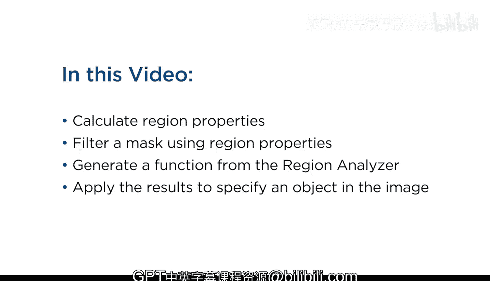

本节课中我们一起学习了如何使用 **Region Analyzer 应用程序** 和 **代码** 来计算区域属性。我们利用区域属性对掩膜进行了筛选，并生成了函数以重复此分析流程。最后，我们还使用区域属性（如边界框）在图像中高亮显示了特定的目标对象。掌握这些技能，能帮助你从分割结果中提取有价值的信息，并推进到后续的分析或决策步骤。