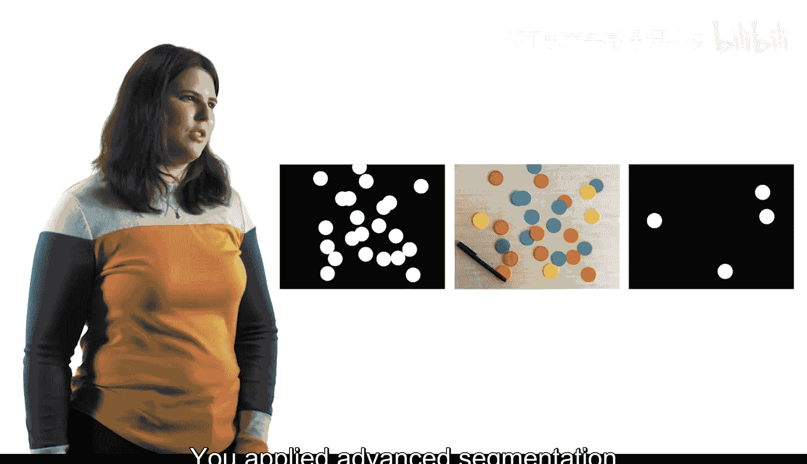
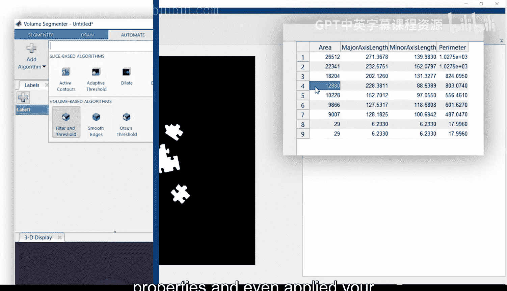
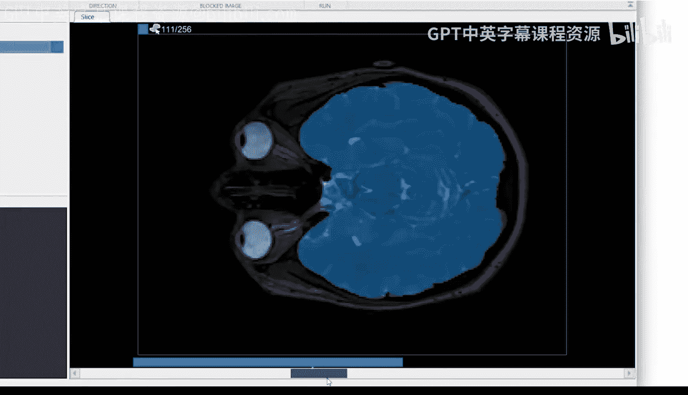
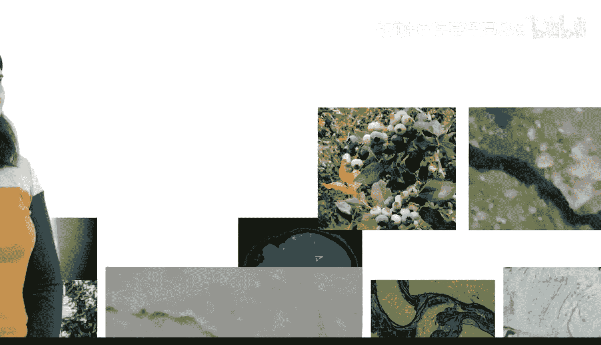
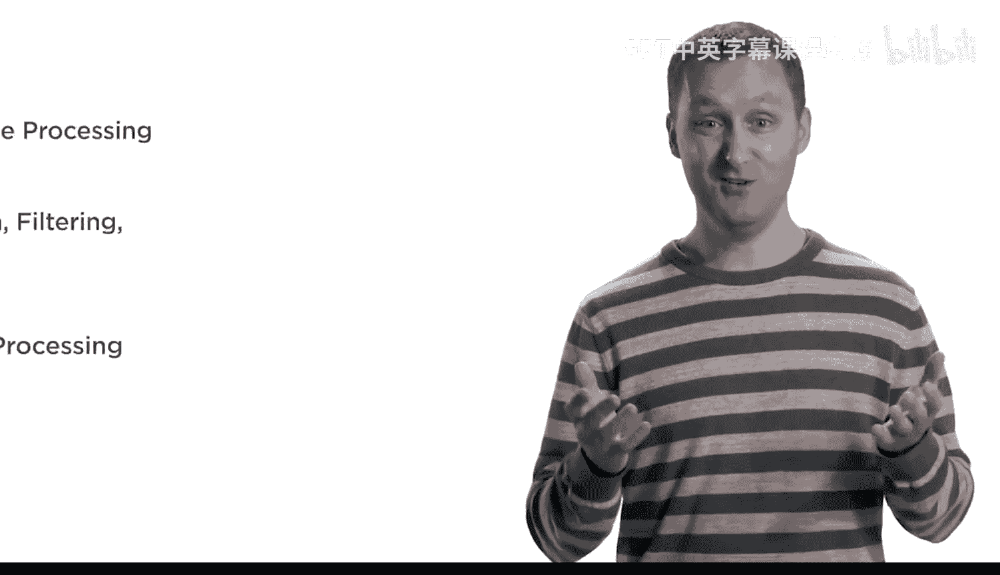

课程二：课程总结与展望

在本节课中，我们将对已完成的课程二进行总结，并展望后续课程的学习方向。

恭喜你完成课程二的学习，掌握了新的技能，并开启了新的分析途径。你学习了应用空间滤波器来降低噪声和寻找边缘。随后，你通过应用形态学操作来闭合间隙和移除小瑕疵，从而优化了已有的图像掩膜。对于难以分割的图像，你应用了高级分割方法，例如组合多个掩膜和使用聚类技术。

为了评估分割结果，你通过计算区域属性来对分割效果进行了量化分析。

你甚至将新掌握的技能应用到了二维和三维图像的处理中。

掌握了这些知识，你已经准备好开始处理图像，并解决自己遇到的实际工程与科学问题了。

到目前为止，你已将上述技术应用于单个或小批量的图像处理中。

但是，如果你需要处理大量图像，该怎么办？想必你不会愿意手动逐张分割成百上千张图像。

那么，我们接下来该学习什么呢？这是一个非常好的问题。

在本专业系列的下一门课程中，你将学习如何将已掌握的技能应用于大规模图像集。你将使用图像批处理器应用程序和数据存储，对数量庞大、无法逐一分析的图像组进行自动化处理。你将在MATLAB中检查处理结果，并评估不同处理方案之间的权衡。你甚至会将图像处理技能应用于视频分析。最后，你将在一个最终项目中，综合运用本系列课程中学到的所有知识。

欢迎加入下一门课程的学习，你将学会自动化图像分析，并在更大规模上应用你的知识。