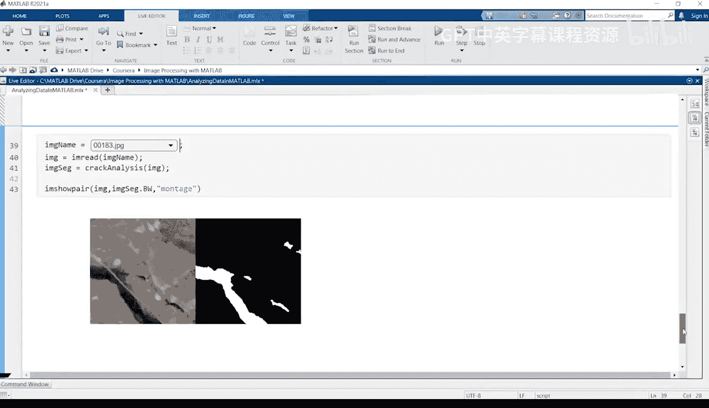
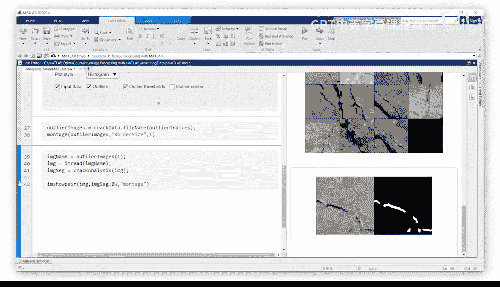
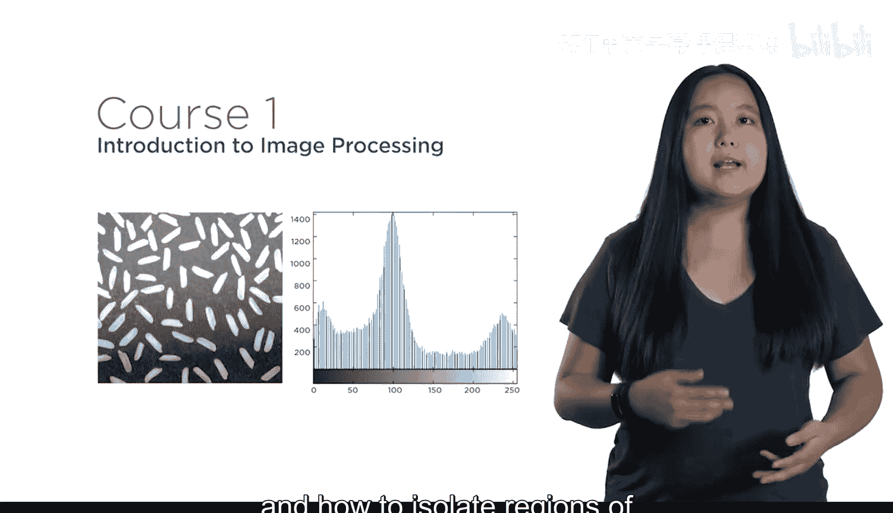
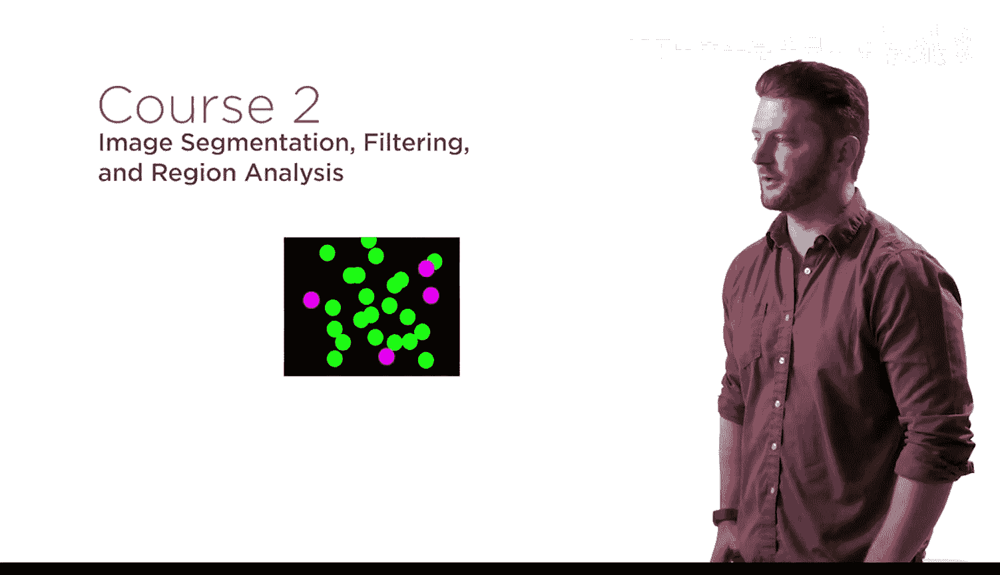
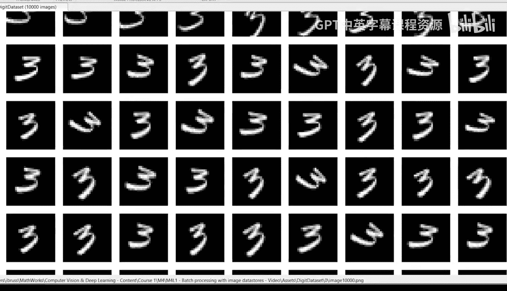
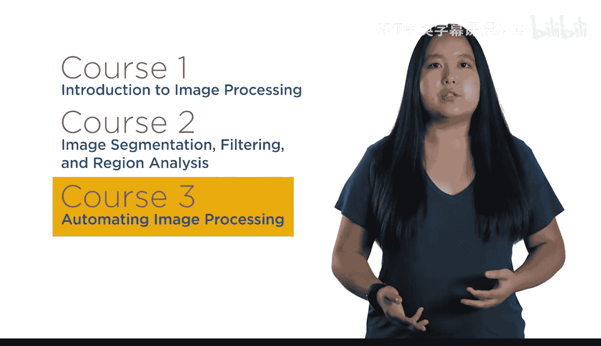
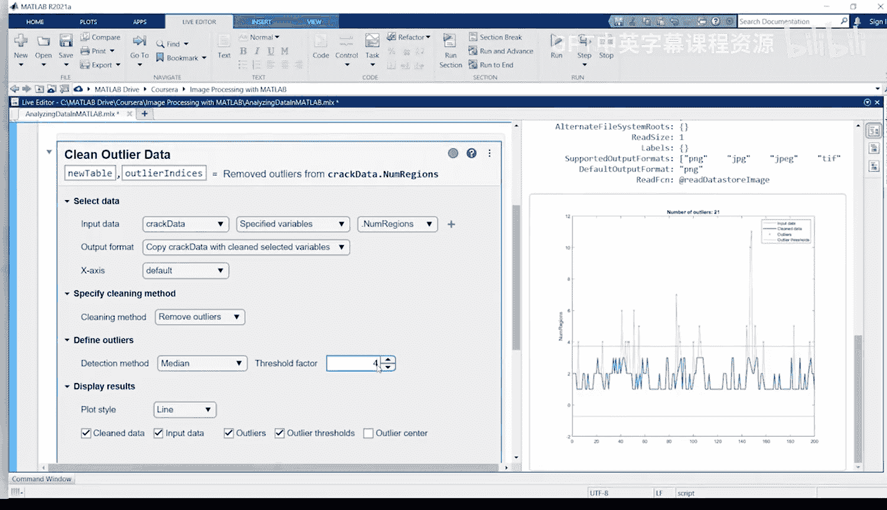

# 21：专业领域概述

在本节课中，我们将学习图像处理在多个专业领域中的核心应用，并了解MathWorks提供的专项课程如何帮助工程师和科学家掌握这项关键技能。

从图像中提取信息对于广泛的应用至关重要。

这些应用包括诊断医疗状况、研究气候变化的影响、设计自主系统以及改进农业。

无论您身处哪个领域，分析图像都是当今许多工作的必备技能。这就是MathWorks创建《工程与科学图像处理》专项课程的原因。

无论您是图像处理的新手，还是正在寻找新工具来提高工作效率，这个专项课程都适合您。这是因为您将使用MATLAB来快速执行图像处理任务。

MATLAB专为工程师和科学家设计，包含许多应用程序，使您能够快速测试不同方法并可视化结果。这些应用程序会自动生成代码，以便您能够复现和扩展您的工作。

该专项课程分为三门课程。

## 课程一：数字图像处理基础

在课程一中，您将扎实地学习如何处理数字图像。您将学习如何创建常见的图像调整，以及如何隔离感兴趣区域以进行进一步分析。

以下是课程一中的两个应用示例：
*   使用颜色信息识别成熟的蓝莓。
*   根据卫星图像计算冰川融化量。

## 课程二：图像分割技术

上一节我们介绍了图像处理的基础操作，本节中我们来看看图像分割。在课程二中，您将解决图像分割中的常见挑战。

以下是课程二将涉及的关键技术：
*   学习减少噪声的技术。
*   学习分离重叠对象的技术。

这些技术确保您只隔离相关信息。重要的是，您将分析找到的区域，计算诸如**面积**和**方向**等属性。

## 课程三：算法自动化

通常，您需要将图像处理步骤应用于许多图像，或者可能需要分析视频。

在课程三中，您将自动化您的算法以处理数千张图像，从而节省时间和精力。

当您拥有大量图像时，目视检查所有图像是不可行的。您将练习分析结果以识别异常值，供进一步调查。

## 最终项目：综合应用

在专项课程结束时，您将运用新技能完成一个最终项目：在嘈杂的视频中检测汽车以分析交通模式。

您甚至能够处理复杂情况，例如当对象被部分遮挡时。最后，您将创建一个视频，其中包含在检测到的车辆驶过时围绕它们的边界框。

图像处理是一项需求量很大的职业技能。无论您是开发自主系统、诊断疾病还是研究宇宙，这个专项课程都将帮助您取得成功。

本节课中我们一起学习了图像处理在工程与科学中的重要性，以及MathWorks专项课程的三部分核心内容：从基础处理、分割技术到算法自动化。现在，让我们开始学习吧。