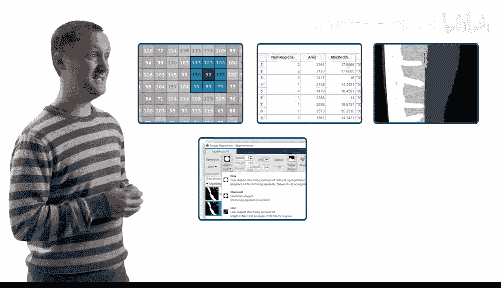
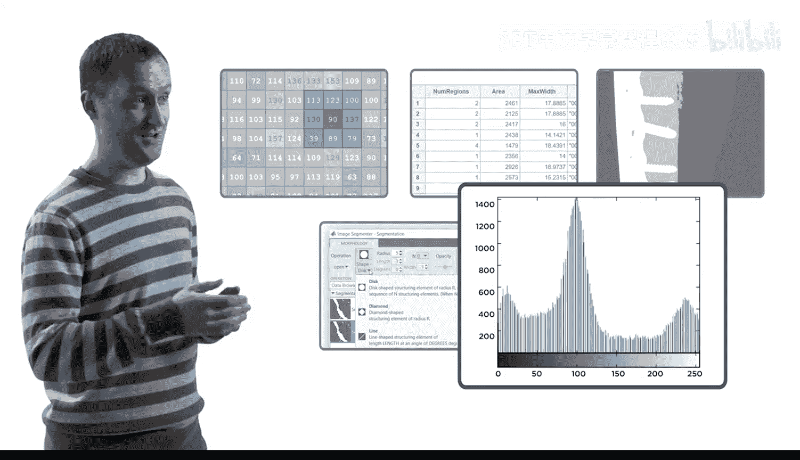
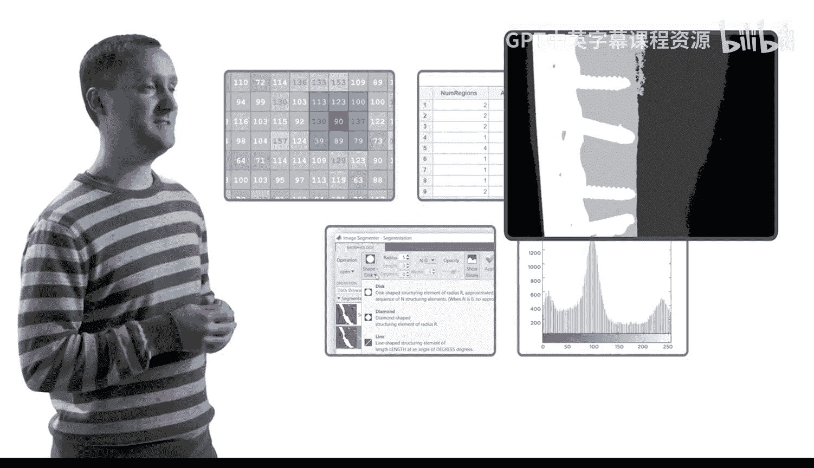
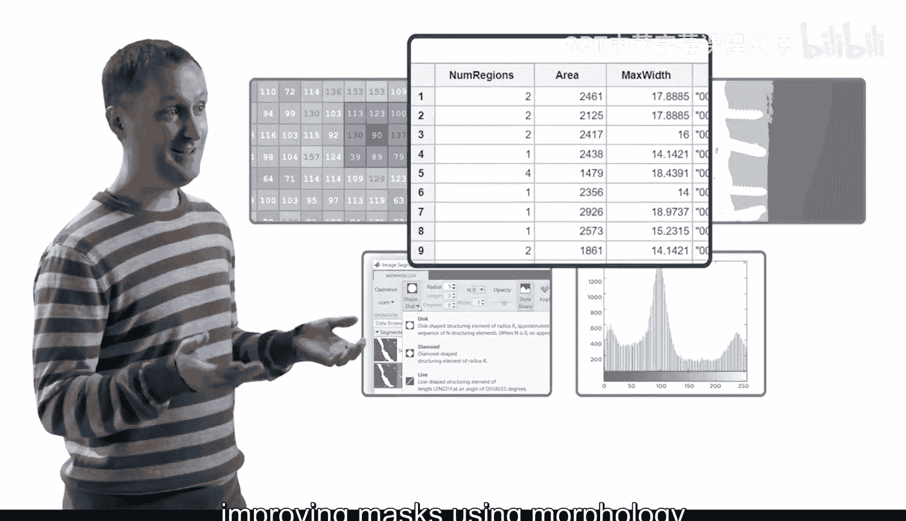
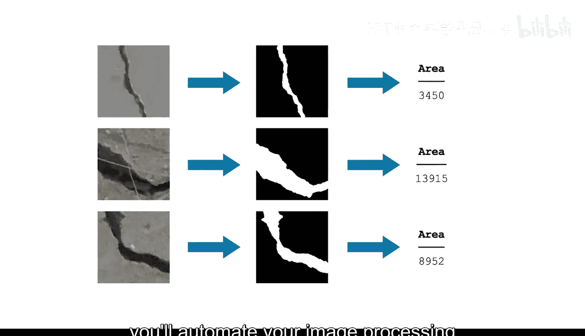
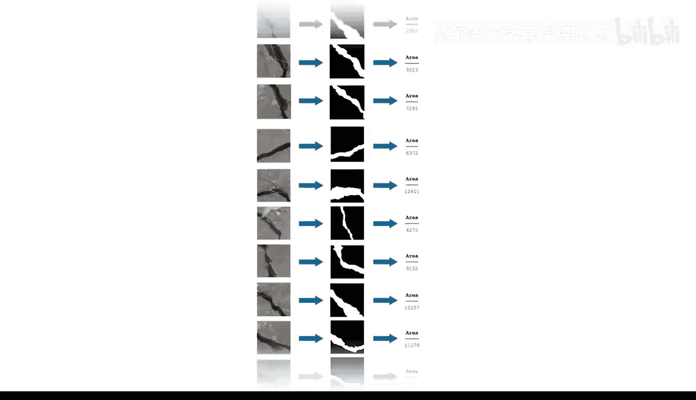
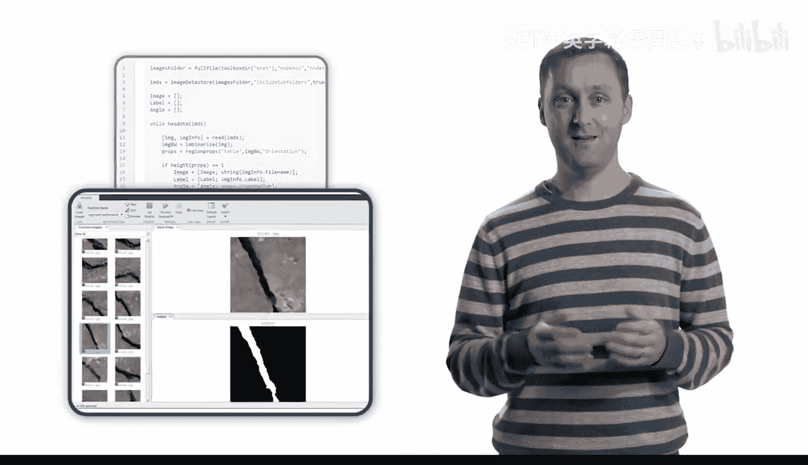
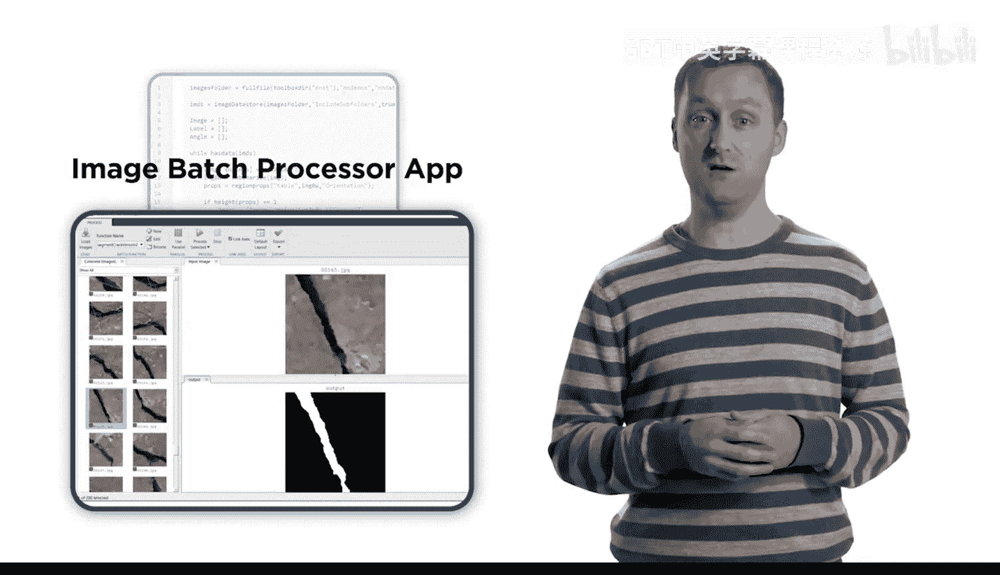
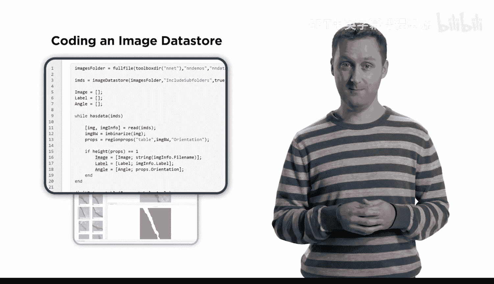
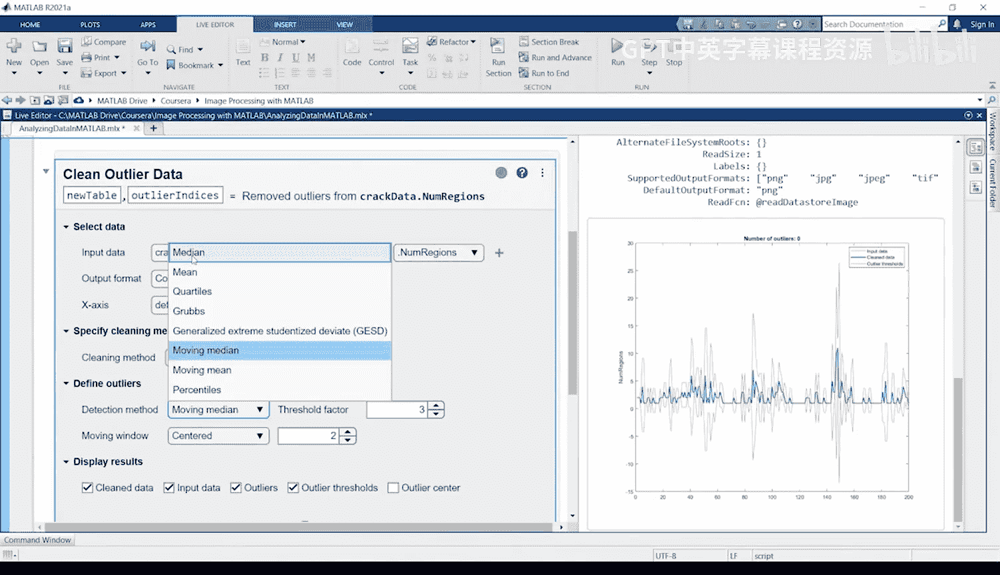

# 22：自动化图像处理 🚀

在本课程中，我们将学习如何将之前掌握的图像处理技能自动化，以处理和分析大量图像或视频序列，而无需手动操作每一张图片。

## 概述 📋

欢迎来到本专项学习的最后一门课程。至此，你已经掌握了一系列处理和分图像析的技能，例如调整图像对比度、应用空间滤波器、从背景中分割目标、使用形态学改善掩膜，以及计算区域属性。你已将这些步骤应用于少量图像。但如果需要分析大量图像呢？例如，混凝土图像数据集包含数百张图片。在本课程中，你将学习自动化图像处理步骤，使其能处理一系列图像，而非一次仅处理一张。

## 自动化方法 🛠️

上一节我们回顾了已掌握的技能，本节中我们来看看实现自动化的两种主要方法。

你将练习使用以下两种核心方法：

以下是两种主要的自动化处理方法：

1.  **图像批处理器应用程序**：此工具使你能够快速查看图像处理步骤的结果。
2.  **图像数据存储**：当需要将分析整合到你的工作中时，此方法提供了更高的灵活性。

## 处理挑战与解决方案 🔍

当处理大量图像集合时，逐一进行视觉检查通常不可行。因此，需要一种方法来识别有问题的图像以供进一步调查。

在本课程中，你将学习分析图像区域，以识别具有异常特征的图像。

## 视频处理应用 🎥

你还会将这些技术应用于视频处理，将其视为一系列图像帧。

## 课程项目与实践 🚗

课程结束时，你将把新技能应用到一个真实世界的项目中。

设想尝试分析一条道路全天的交通模式。你的任务将是处理这段视频并统计每一帧中的汽车数量。

请务必利用论坛提问并分享你发现的任何有趣结果。我们将在学习过程中为你提供帮助。

## 总结 ✨

本节课中，我们一起学习了自动化图像处理的重要性，介绍了两种核心的自动化方法（图像批处理器和图像数据存储），探讨了处理大批量图像时识别异常的策略，并了解了如何将自动化技术应用于视频分析。最后，我们预览了即将进行的真实项目挑战。祝你好运！