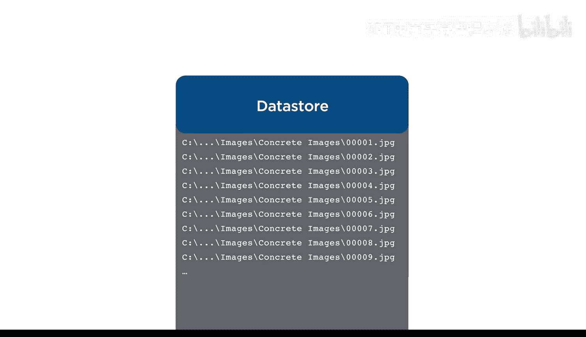
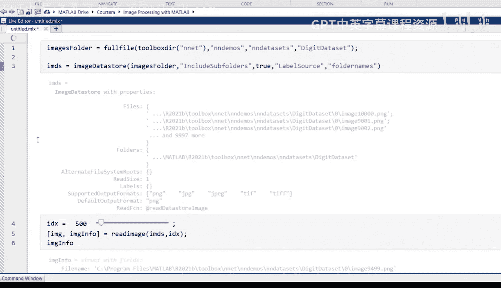
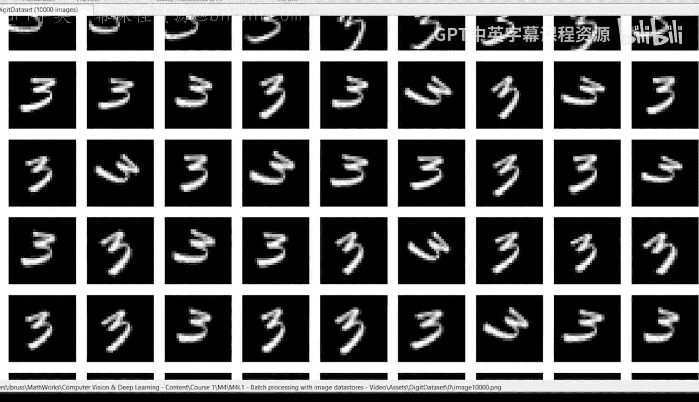
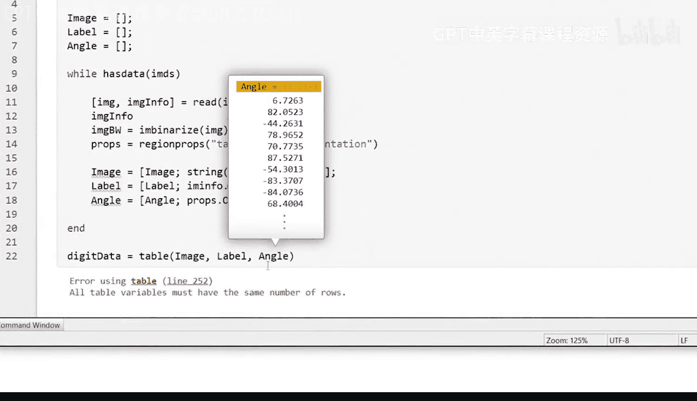
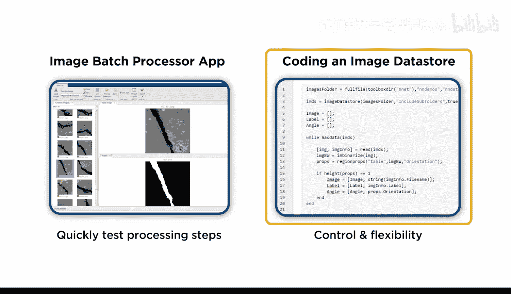

# 24：使用图像数据存储进行批处理

在本节课中，我们将学习如何使用代码，通过图像数据存储（Image Datastore）来批量处理大型图像数据集。我们将以手写数字数据集为例，创建一个包含文件名、标签和旋转角度的数据表。

## 概述



上一节我们介绍了使用批处理处理器应用程序处理数据。本节中，我们来看看如何通过编写代码实现相同的功能。标准方法是使用图像数据存储。数据存储不直接加载全部图像，而是存储图像的位置信息，以便在需要时导入和处理。

## 创建图像数据存储

首先，在MATLAB中打开一个新的实时脚本。通过调用 `imageDatastore` 函数并指定数据集的位置来创建一个数据存储变量。本例中，图像包含在MATLAB的神经网络工具箱根文件夹中。

由于每个数字的图像都存储在独立的子文件夹中，请确保将 `‘IncludeSubfolders’` 选项设置为 `true`。

```matlab
imds = imageDatastore('path_to_neural_network_toolbox_root_folder', 'IncludeSubfolders', true);
```

运行此代码后，新的数据存储变量 `imds` 将保存所有10000张图像的位置信息。

## 处理单张图像

为了生成最终的数据表，我们首先编写代码来收集单张图像的文件名、标签和旋转角度。然后，我们将这段代码封装在循环中，以处理数据存储中的每一张图像。

使用 `readimage` 函数从数据存储中导入单张图像。第一个输入是数据存储变量，第二个输入是要加载的图像的索引。然后使用 `imshow` 函数显示图像。

```matlab
img = readimage(imds, 1);
imshow(img);
```

在处理自己的批量图像时，建议尝试不同的索引值，以观察处理和分析步骤在不同图像上的表现。

`readimage` 函数的功能不止于加载图像本身。如果请求第二个输出，它还会返回图像的元数据，包括其位置，这可以用来保存文件名。

```matlab
[img, info] = readimage(imds, 1);
fileName = info.Filename;
```

接下来，请注意数据存储中的 `Labels` 字段最初是空的。为了将子文件夹名称提取为标签，在初始化数据存储时，可以使用 `‘LabelSource’` 选项并将其设置为使用文件夹名称。



```matlab
imds = imageDatastore('path_to_neural_network_toolbox_root_folder', 'IncludeSubfolders', true, 'LabelSource', 'foldernames');
```



现在，每张图像都有一个标签。根据你的数据集和目标，可以从这里开始进行多种不同的图像处理和分析。

## 计算图像旋转角度

在本例中，我们的目标是计算每张图像的旋转角度。首先，使用 `imbinarize` 函数将图像转换为二值图像。然后，使用 `regionprops` 函数计算数字的方向。

```matlab
bwImg = imbinarize(img);
stats = regionprops(bwImg, 'Orientation');
angle = stats.Orientation;
```

如果你想了解更多关于区域方向的定义，请查阅相关文档。

## 自动化批量处理

现在已经建立了处理单张图像的工作流程，但为所有10000张图像执行此代码将非常耗时。我们可以通过将处理步骤封装在 `while` 循环中来自动化此过程。

首先，将 `readimage` 函数改为 `read` 函数。`read` 函数总是读取数据存储中的下一张图像，无需提供索引。然后，使用 `hasdata` 函数作为循环条件，该函数将在所有图像读取完毕后退出循环。

在运行代码之前，还需要一种方法来存储每张图像的文件名、标签和方向角。初始化将保存这些信息的空数组。在循环结束时，将这些变量组合成一个表格。

在循环内部，使用垂直连接将数据追加到每个数组中。这样，数组在每次迭代中都会增加一行。为了连接图像名称数组，需要将字符向量转换为字符串。

以下是代码框架：

```matlab
% 初始化空数组
fileNames = [];
labels = [];
angles = [];



% 重置数据存储到起始位置
reset(imds);

% 循环处理所有图像
while hasdata(imds)
    [img, info] = read(imds);
    fileName = string(info.Filename);
    label = imds.Labels(imds.UnderlyingDatastores{1}.CurrentFileIndex); % 获取当前图像的标签

    % 处理图像并计算角度
    bwImg = imbinarize(img);
    stats = regionprops(bwImg, 'Orientation');
    
    % 检查是否只检测到一个区域
    if length(stats) == 1
        angle = stats.Orientation;
        % 垂直连接数据
        fileNames = [fileNames; fileName];
        labels = [labels; label];
        angles = [angles; angle];
    end
end

% 创建最终数据表
dataTable = table(fileNames, labels, angles, 'VariableNames', {'FileName', 'Label', 'Angle'});
```


## 处理异常情况

运行上述代码时，可能会遇到错误，提示“所有表变量必须具有相同的行数”。这是因为 `regionprops` 函数分析某些图像时，检测到了两个或更多个不连续的区域，导致角度数组的行数多于图像数量。

由于我们对10000张图像使用相同的分割函数，这种不完美是可以预料的。知道具有多个区域的图像分割不正确，你可以返回去尝试完善分割算法。

然而，鉴于数据集中图像数量庞大，丢弃少数几个是可以接受的。只需将追加数组的代码包装在一个 `if` 语句中，检查图像中是否只检测到一个区域即可，如上例所示。

## 总结

本节课中，我们一起学习了如何使用图像数据存储通过代码批量处理图像。我们创建了一个数据存储，编写了处理单张图像的代码，并将其封装在循环中以处理整个数据集，同时还处理了分割过程中可能出现的异常情况。



你现在知道了如何使用应用程序或代码工作流处理图像。你应该对两者都进行实验，以更好地理解它们的工作原理。如果你寻求更多的控制和灵活性，可以尝试编写自己的图像数据存储代码。但如果你想快速测试一系列分析步骤，那么应用程序可能更适合。