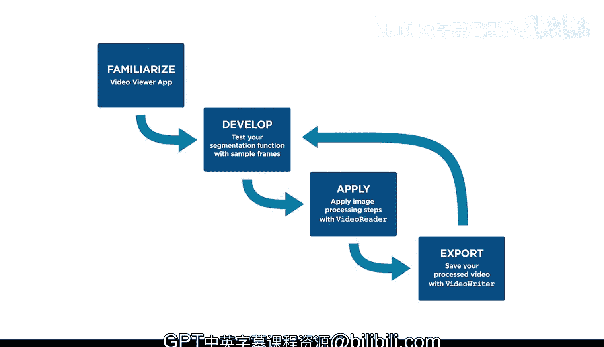

# 25：处理视频文件 🎬


在本节课中，我们将学习如何将图像分割技能应用于视频处理。视频本质上是一系列连续的图像帧，因此我们可以通过逐帧处理来分析视频内容。我们将以分析一个容器内液体填充速率的任务为例，介绍从视频中提取帧、开发分割函数、批量处理所有帧以及验证结果的全过程。

---

## 熟悉视频文件 📹


视频文件广泛应用于各种场景。由于视频由一系列图像组成，你可以运用已学到的分割技能来处理视频。

例如，考虑分析容器被液体填充速率的目标。你可以通过访问视频的单个帧，并对每一帧进行分割来计算真实像素的百分比来实现此目标。

当接触一个新视频时，一个好的第一步是使用视频查看器应用程序来了解它。

---

## 使用视频查看器应用程序

首先导入视频。选择课程文件中包含的液体视频。

打开视频后，应用程序会显示视频分辨率、帧率和总帧数。应用程序包含播放视频或跳转到特定感兴趣帧的控制功能。

为了确定容器中有多少液体，你需要一个分割函数来将液体与背景分离。

---

## 开发分割函数

从视频中选择几个有代表性的帧，用于开发此函数，并将它们导出为图像。这里我们保存了第92、185和224帧。

使用你的代表性帧，运用分割技能创建一个用于隔离液体的掩膜。我们使用颜色阈值应用程序来创建我们的掩膜。你需要创建自己的函数来完成此分析。

一旦你对样本帧上的处理步骤感到满意，就是时候将它们应用到整个视频了。

---

## 批量处理所有视频帧

使用 `VideoReader` 函数在 MATLAB 中创建一个用于读取单个帧的对象。

```matlab
v = VideoReader('liquid_video.mp4');
```

请注意，此对象包含大量关于视频的信息。你可以通过键入变量名，后跟一个点和属性名来访问这些属性。

```matlab
totalFrames = v.NumFrames;
frameRate = v.FrameRate;
```

要处理所有帧，请使用一个 `for` 循环，从1开始，到视频的总帧数结束。

```matlab
for k = 1:totalFrames
    % 处理每一帧
end
```

在循环内部，使用 `readFrame` 函数将下一个可用帧作为图像导入。

```matlab
frame = readFrame(v);
```

现在，你可以应用你的处理和分析步骤。作为练习，你需要在此循环内创建几个变量，以计算视频中每个时间点容器的填充程度。使用 `CurrentTime` 属性获取每一帧的时间信息。

```matlab
currentTime = v.CurrentTime;
```

最好重置 `CurrentTime` 属性，以防你再次运行 `for` 循环。

```matlab
v.CurrentTime = 0; % 重置到视频开头
```

处理结束后，你应该得到一个与此类似的图表。

---

## 验证与调试处理结果

但是，如果你得到一些意外的结果怎么办？如何判断处理步骤中哪里出错了？

一种方法是为视觉检查创建一个处理后的图像视频。

使用 `VideoWriter` 函数创建一个用于将图像写入视频文件的对象。将文件名和视频格式指定为输入参数。

```matlab
outputVideo = VideoWriter('processed_video.avi');
```

与 `VideoReader` 对象一样，你可以查看输出视频将具有的属性。请注意，默认帧率是30，这与我们的原始视频不匹配。让我们更改它，使它们相同。

```matlab
outputVideo.FrameRate = v.FrameRate;
```

要创建新视频，你需要在 `for` 循环之前打开 `VideoWriter` 对象，并在循环之后关闭它。

```matlab
open(outputVideo);
for k = 1:totalFrames
    % ... 处理帧 ...
    writeVideo(outputVideo, processedImage);
end
close(outputVideo);
```

在 `for` 循环内部，将一个图像传递给 `writeVideo` 函数。在这个例子中，我们使用 `imfuse` 函数和 `montage` 方法来创建原始图像和处理后图像并排显示的图像。

运行代码后，你将在当前文件夹中拥有一个新视频。你可以在视频查看器应用程序中查看此视频。使用此视频来验证你的处理步骤，并识别需要进一步调查的帧。

---

## 总结 📝

本节课中我们一起学习了处理视频文件的完整工作流程。

总结一下，处理视频文件时，一个好的做法是：
1.  首先使用视频查看器应用程序熟悉视频并导出一些帧。
2.  使用这些帧开发你的处理和分析流程。
3.  然后，使用 `VideoReader` 对象配合循环来处理所有帧。
4.  使用 `VideoWriter` 对象对图像处理结果进行视觉检查。
5.  如有必要，导出新的测试帧以优化你的方法。



通过遵循这些步骤，你可以系统地将图像处理技术应用于视频分析任务。