# 28：实用图像处理指南 🛠️

在本节课中，我们将学习如何将之前介绍的各种图像处理技术应用于实际项目。我们将探讨如何根据具体目标选择和组合技术，并理解在现实场景中做出权衡的重要性。

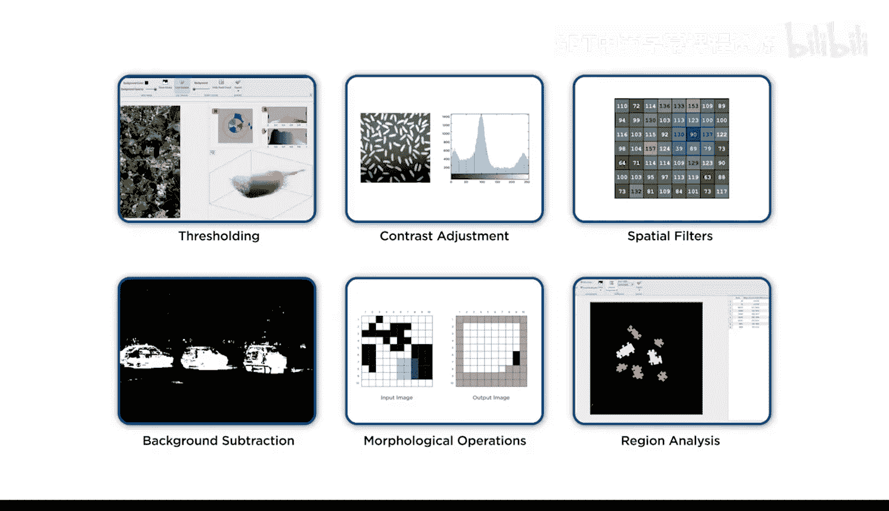

## 从工具箱到实际应用

上一节我们介绍了多种图像处理技术。本节中我们来看看如何在实际项目中应用它们。

你现在已经掌握了一个包含各种图像处理技术的工具箱。但在开始一个项目时，可能很难确定应该使用哪些技术。

例如，在处理混凝土图像时，我们开发并比较了数十种分割算法。

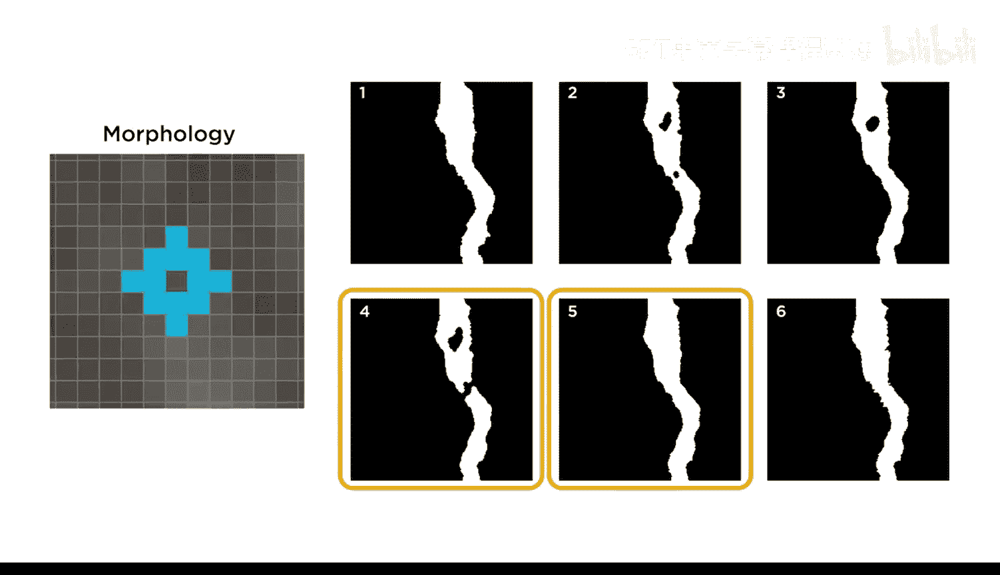

## 尝试过的技术方法

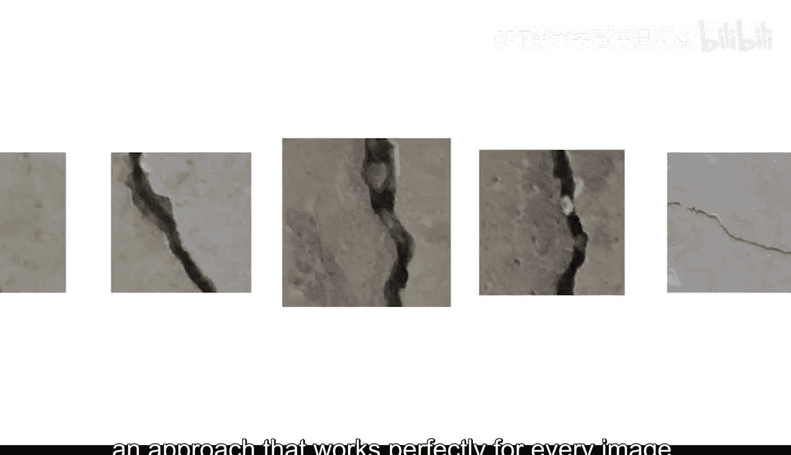

以下是我们在实验中尝试过的一些主要方法：

*   **阈值分割**：使用了基于**灰度**和**颜色**的方法。
*   **模糊处理**：应用了**高斯滤波器**进行平滑。
*   **形态学操作**：使用了不同**形状**和**大小**的结构元素进行各种操作。

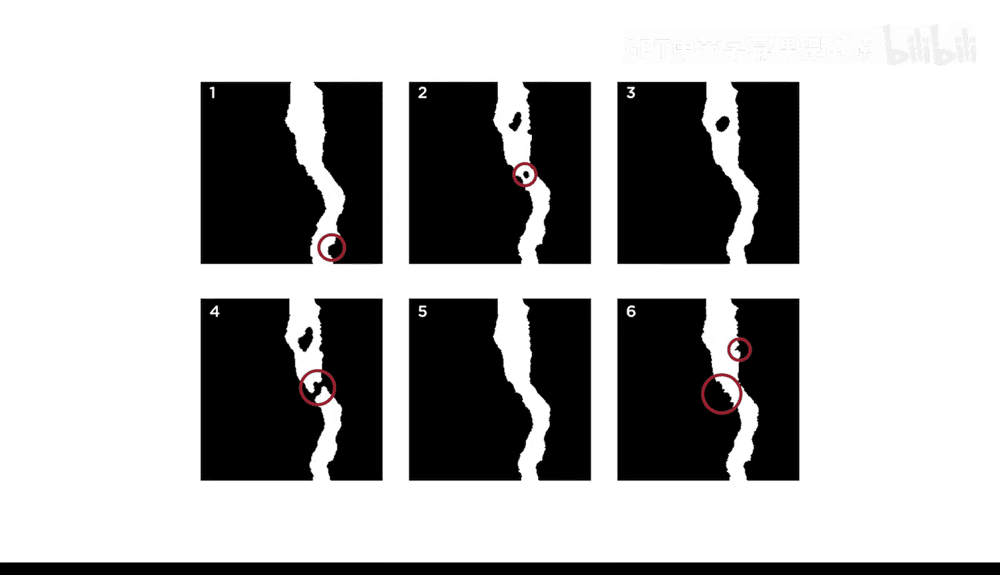

在大多数情况下，你很难找到一种对每张图像都完美适用的方法。

## 明确项目目标

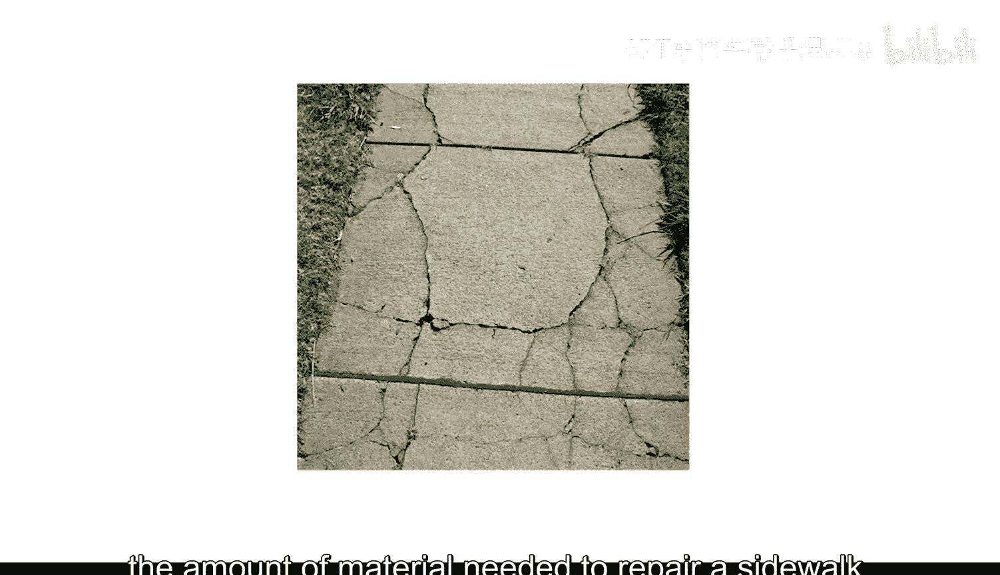

因此，预先明确你的目标至关重要。这样，你才能知道可以容忍哪些误差，以及结果达到何种精度就可以继续进行。

例如，考虑一个用于检测混凝土裂缝的算法，其目的是估算修复人行道所需的材料量。

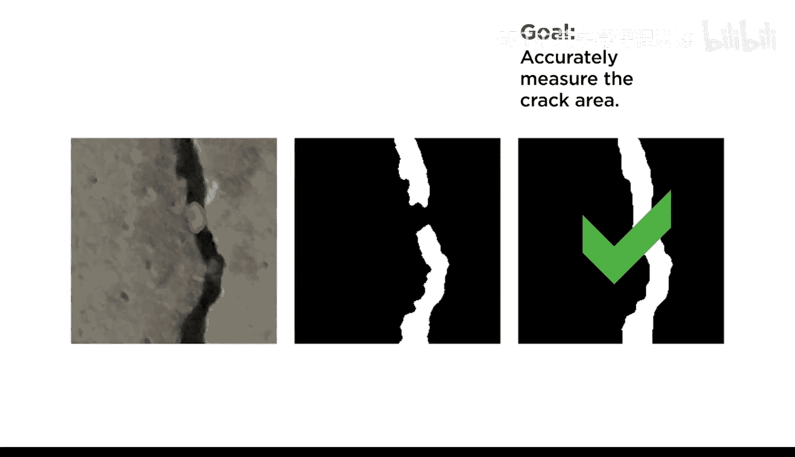

在这种情况下，目标是**准确测量裂缝的面积**。

因此，你需要一个能**精确捕捉裂缝边缘**并**排除其内部任何碎屑**的掩膜。

## 根据目标调整方法

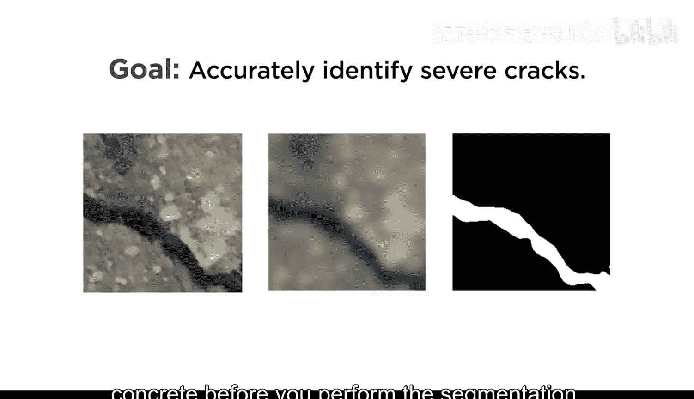

反之，如果该算法用于评估大坝的状况，目标则是**识别需要修复的严重裂缝**。

因此，在执行分割之前，你可能会考虑对原始图像进行模糊处理，以平滑混凝土中的任何粗糙纹理。

这个模糊步骤可能导致分割忽略狭窄的裂缝，但这没关系，因为目标不是创建精确的掩膜，而是识别严重裂缝。很难预先知道哪种方法最好。

## 实践建议与数据考量

在尝试不同方法时，请始终专注于你的最终目标，这样你才知道哪些误差是可以接受的。务必使用**图像批处理器**来查看算法对你所有图像的泛化效果。

你也可以在MATLAB中进行数据分析，以帮助识别需要进一步调查的异常值。

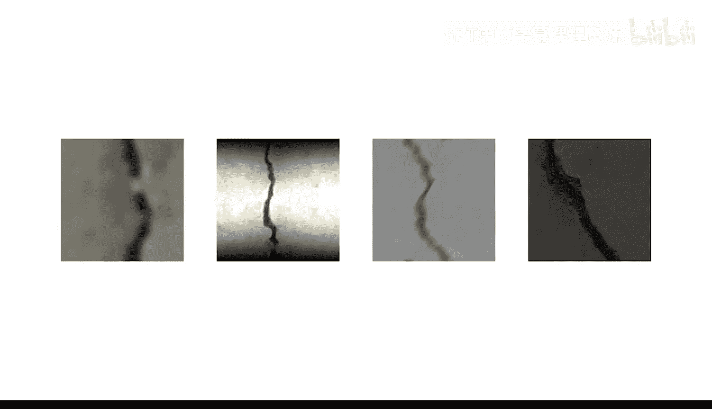

你的图像处理方法取决于你的图像，但**无法将糟糕的数据变成好的结果**。

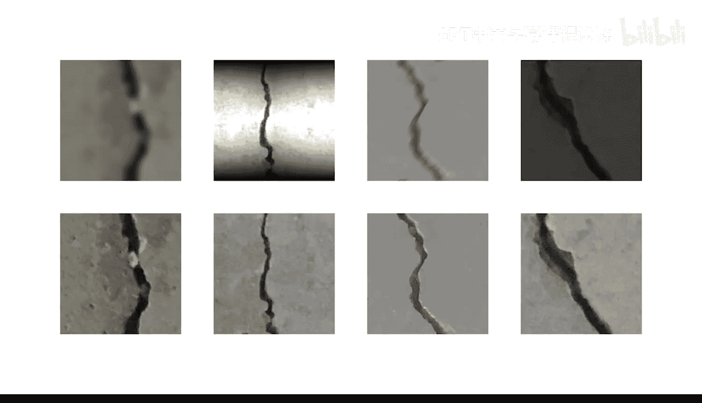

如果条件允许，改进实验设置并重新捕获所有图像可能是值得的。

## 应对现实世界的约束

然而，这并非总是可行，例如对于自动驾驶汽车，它们必须实时安全运行，无论遇到何种光照或天气条件。

在这些情况下，一个常见的解决方案是将视频与来自其他类型传感器（如雷达或激光雷达）的数据相结合。这是需要算法快速处理的实时图像捕获的一个例子。

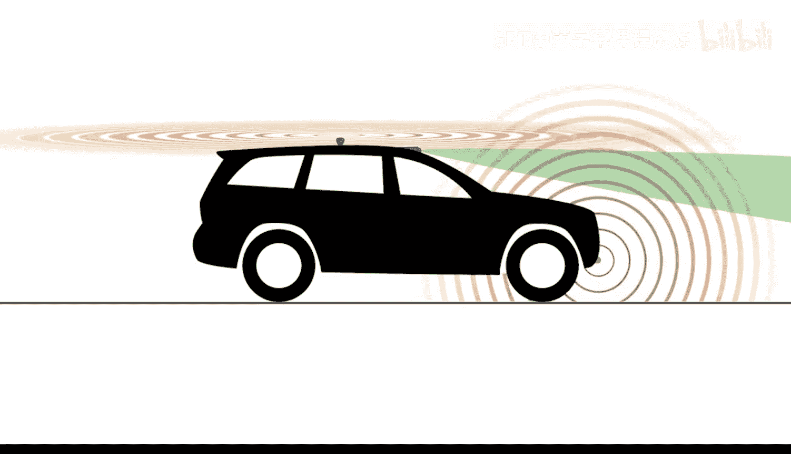

## 不同领域的权衡

另一方面，在医学成像等领域，为了获得最准确的结果，等待一个耗时的处理算法可能是值得的。

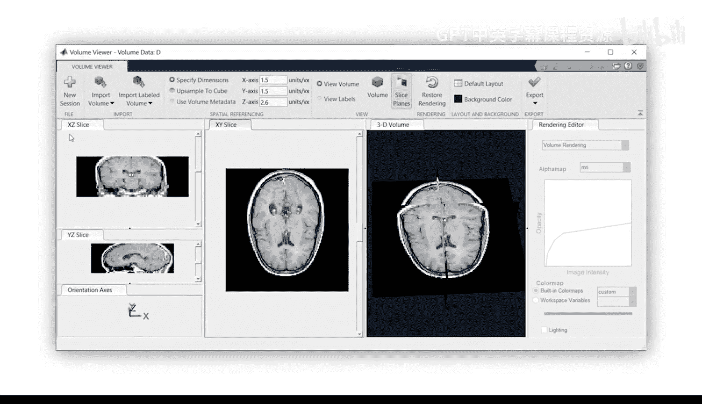

在实践中，图像处理很少能达到完美。因此，务必预先定义你的目标，并用它们来确定处理项目的最佳方法。

## 总结

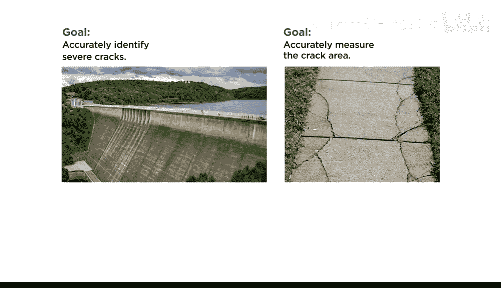

本节课中，我们一起学习了如何将图像处理技术应用于实际项目。关键在于根据具体目标（如精确测量或快速识别）选择技术，明确可接受的误差，并利用工具评估算法性能。记住，良好的数据是基础，在实际约束下需要在速度、精度和资源之间做出明智的权衡。