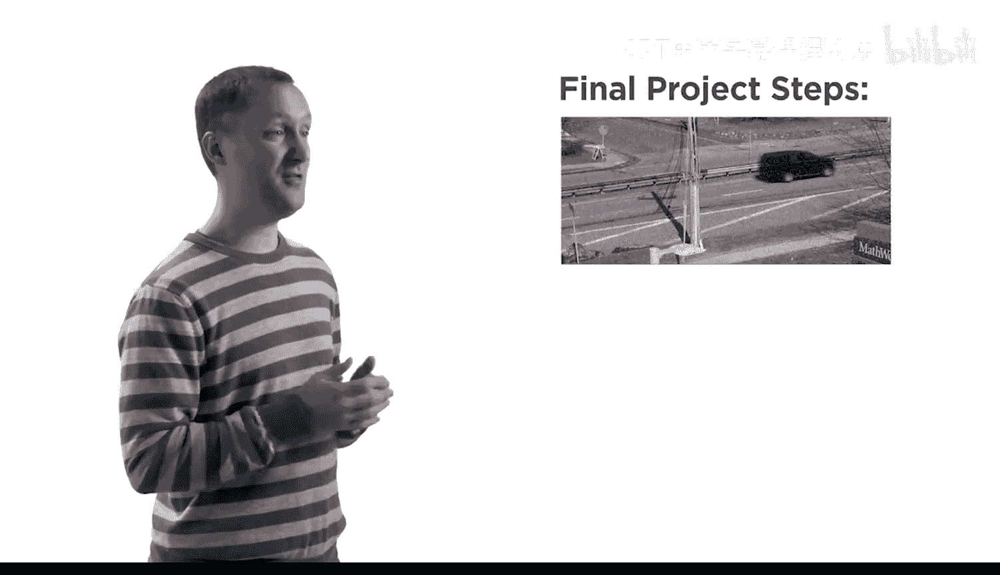
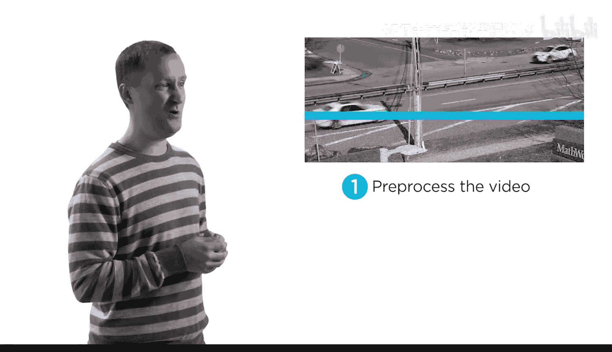
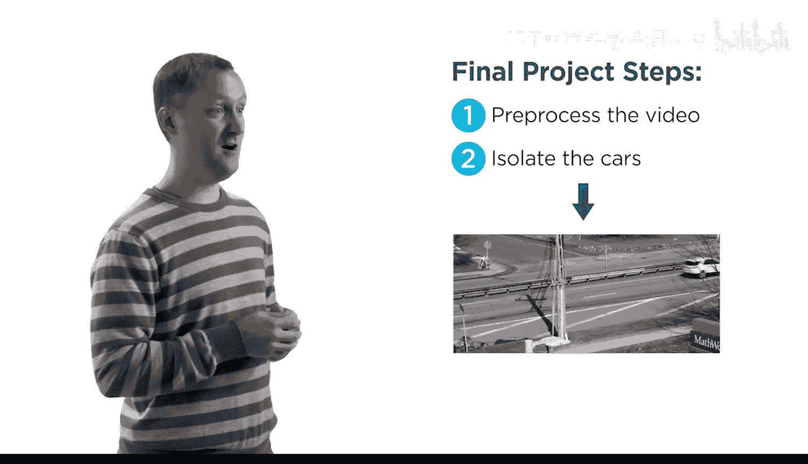
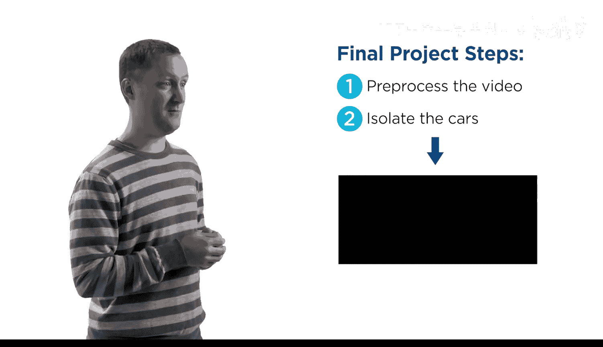
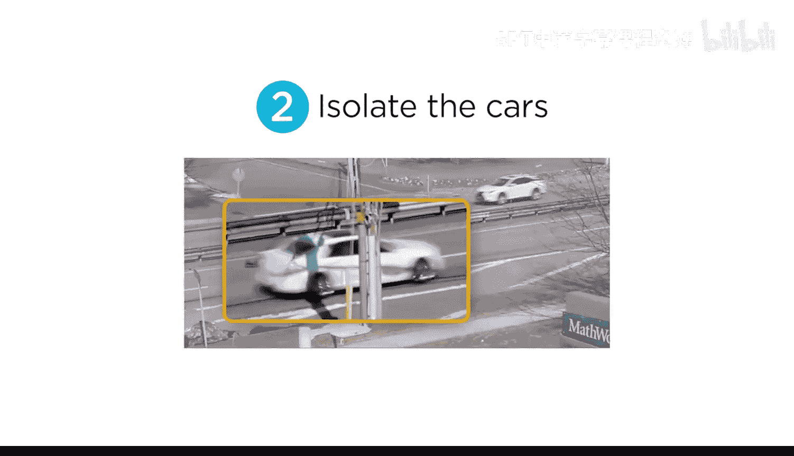
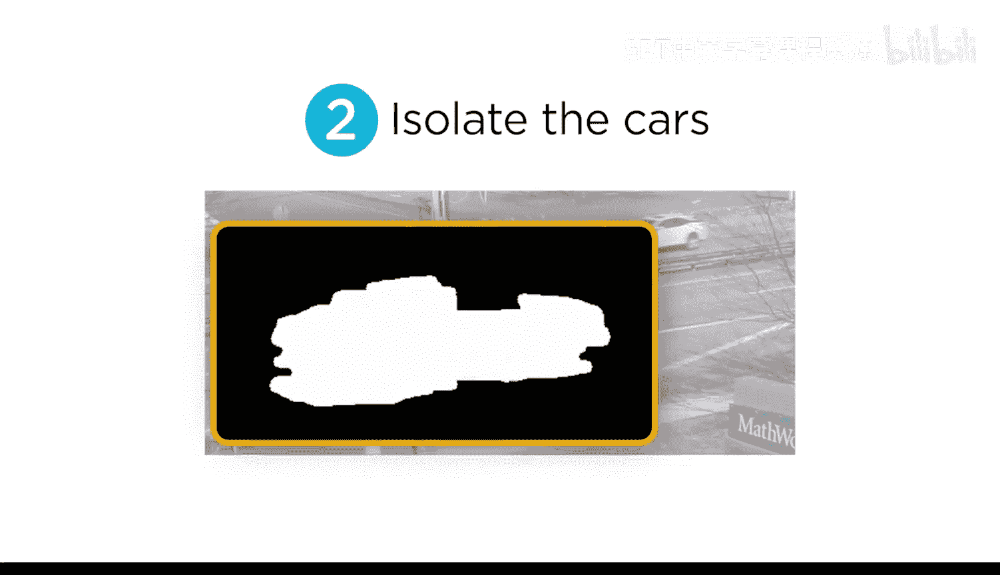
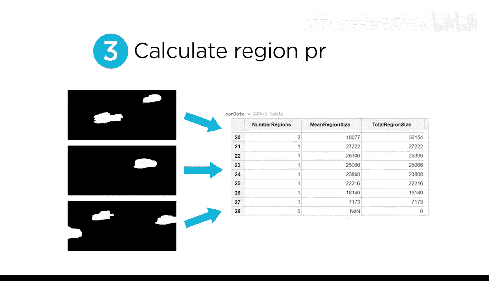
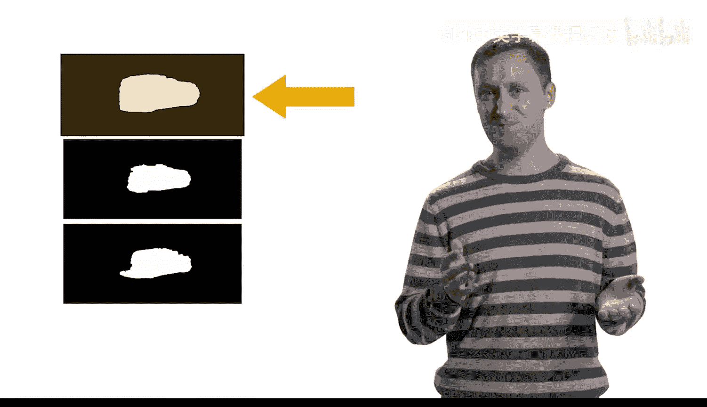
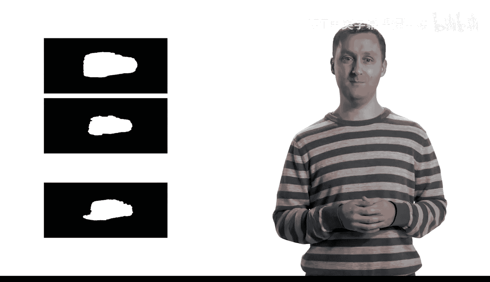

# 29：最终项目介绍 🚗

在本节课中，我们将介绍一个综合性的最终项目。该项目旨在让你实践运用本课程中学到的多种图像处理工具与技术。我们将通过一个具体的场景——分析办公楼外的交通流量——来巩固所学知识。

## 项目概述

一家公司正为其办公楼外的严重交通拥堵问题所困扰。他们雇佣你来测量全天的交通流量。为了帮助你开始，他们提供了一段由楼顶摄像头拍摄的短视频片段。你的目标是统计视频每一帧中驶过的汽车数量。

这个项目被划分为三个主要步骤。

## 项目步骤详解

上一节我们介绍了项目的背景与目标，本节中我们来看看具体的实施步骤。

### 第一步：视频预处理

首先，你需要对视频进行预处理。这包括去除视频中的噪声，并将其转换为灰度图像。预处理是许多图像处理流程的基础，它能帮助我们简化后续的分析步骤。

以下是预处理可能涉及的核心操作：
*   **降噪**：使用滤波器（如中值滤波器）来减少图像中的随机噪声。
*   **灰度转换**：将彩色视频帧转换为灰度图像，公式为：`I_gray = 0.2989 * R + 0.5870 * G + 0.1140 * B`。

### 第二步：分割与提取汽车

接下来，你需要在每一帧中隔离出汽车。这通过创建一个二值掩码来实现，该掩码能将汽车从背景中分割出来。

在此步骤中，你可能会遇到一些有趣的挑战。例如，在某一帧中，电线杆将一辆汽车分割成了两个独立的区域。

因此，你需要找到一种方法将它们重新连接在一起。以下是可能用到的技术列表：
*   **图像形态学操作**：例如使用`imclose`函数进行闭运算，以连接相邻的物体区域。
*   **调整阈值**：优化二值化过程，使属于同一辆车的像素更可能被归类为同一区域。

然后，你将利用每一帧中分割出的区域来计算各种属性（如面积、质心），并为整个视频分析这些结果。

### 第三步：可视化与跟踪

最后，你将修改原始视频，通过叠加边界框来跟踪驶过的汽车。这能直观地展示你的分析结果。

## 项目评估与须知

评估将在每一步之后用于指导你的进度。它们充当检查点，可以重复进行多次。请确保在进入下一步之前，你的评估通过率达到100%。

与大多数图像处理问题一样，本项目没有唯一正确的解决方案，因此每个人的结果可能会略有不同。

在开始项目之前，会有一个小测验来帮助你熟悉所提供的视频素材。

## 总结

本节课中我们一起学习了最终项目的整体框架。我们明确了项目的目标——统计视频中的汽车数量，并了解了实现该目标需要经历的三个核心阶段：**视频预处理**、**汽车分割与提取**以及**结果可视化与跟踪**。准备好迎接挑战，祝你成功！😊