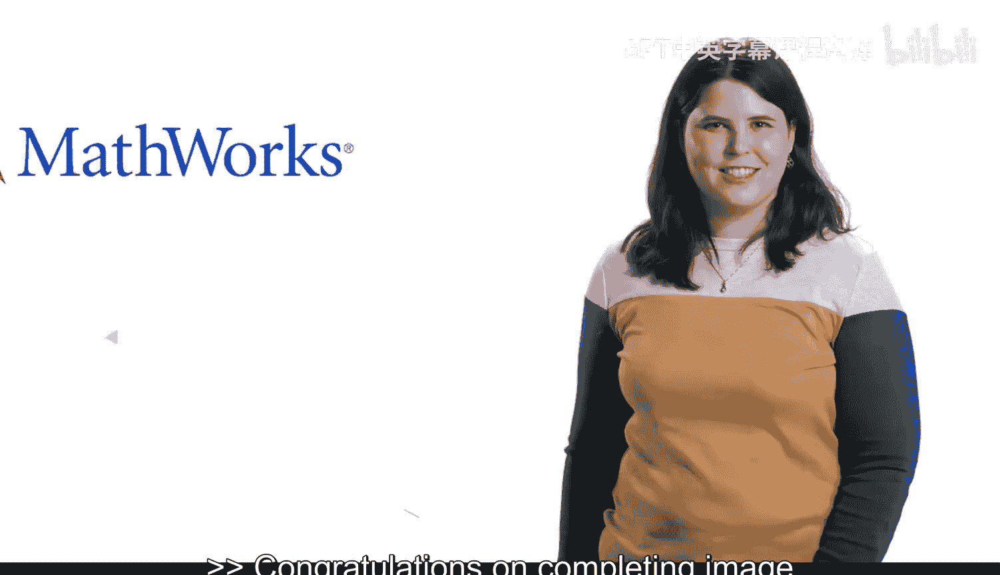
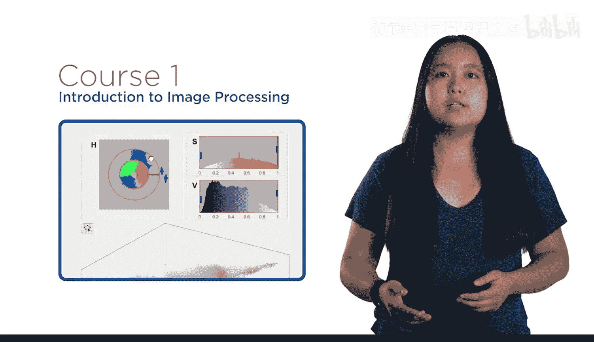
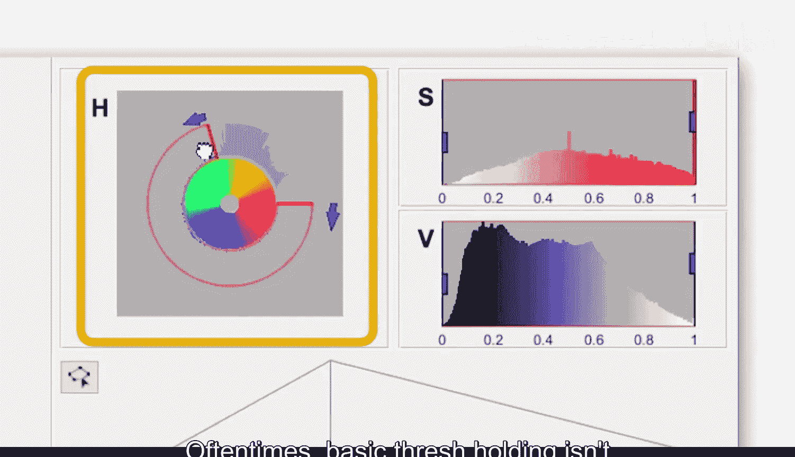
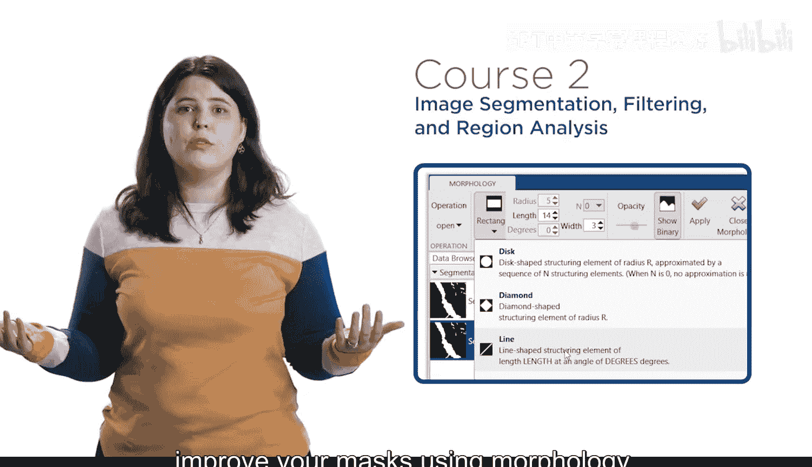
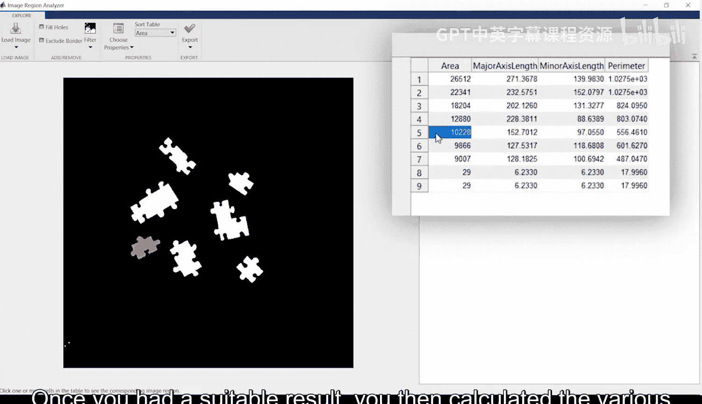
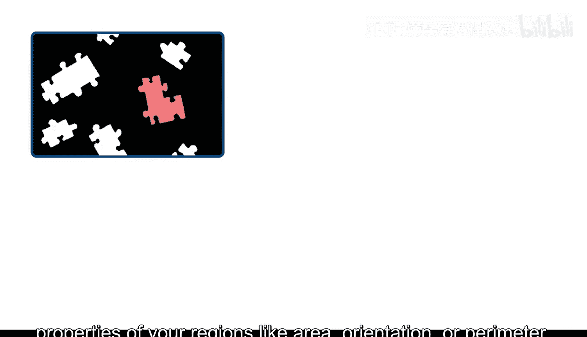
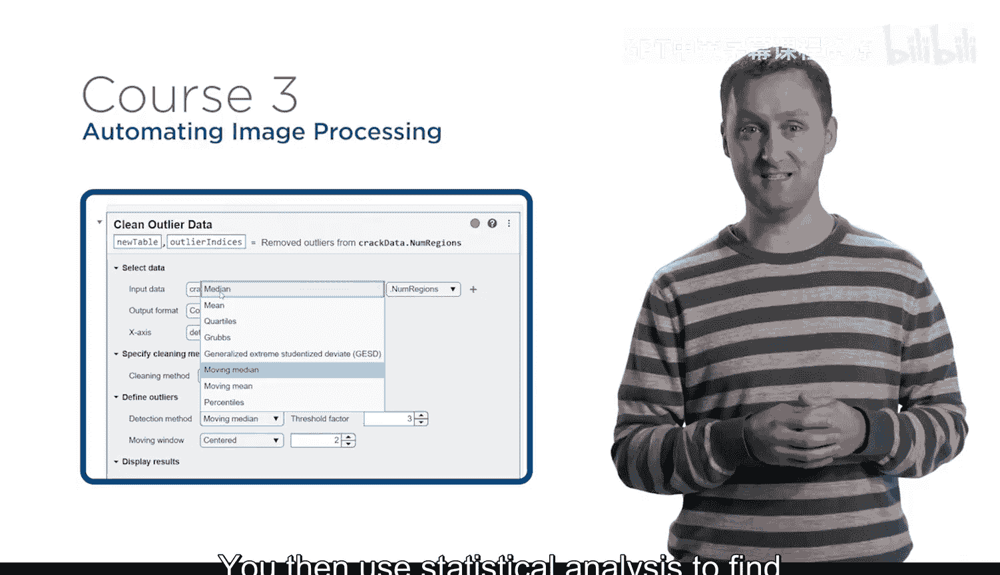
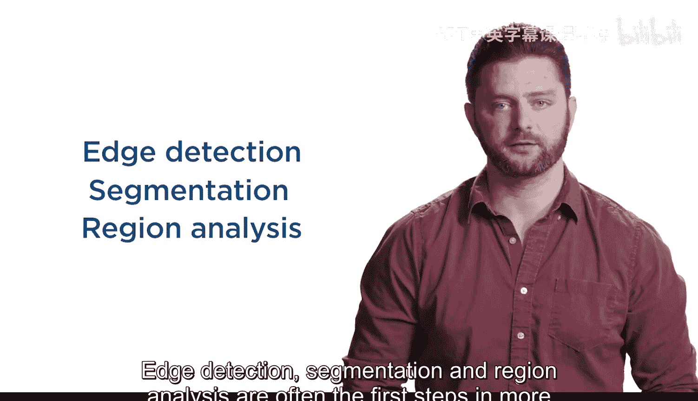
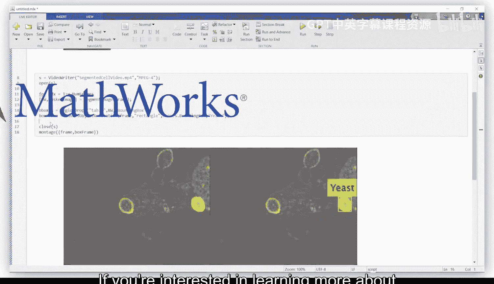
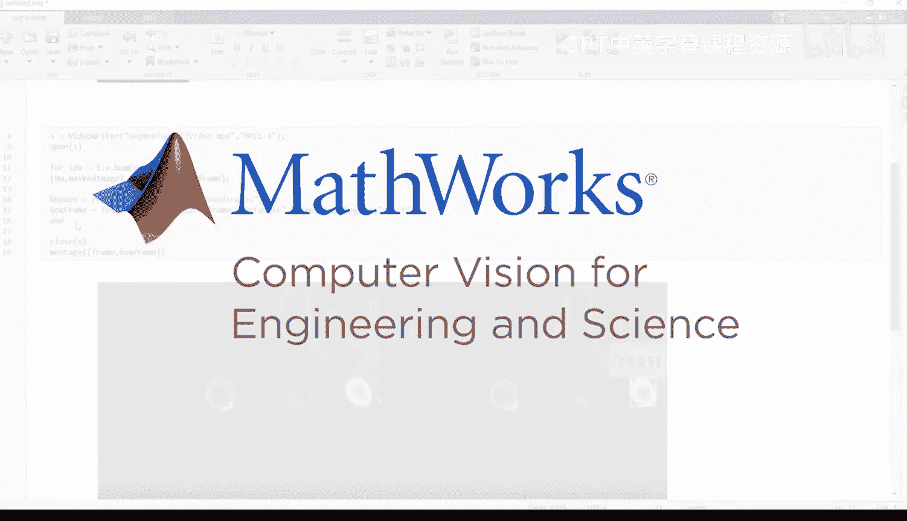

# 30：课程回顾与展望 🎉

在本节课中，我们将回顾整个《工程与科学图像处理》课程的核心内容，总结所学技能，并展望这些技能在更广阔领域的应用前景。

## 概述

恭喜你完成了《工程与科学图像处理》课程。通过本课程的学习，你已经掌握了一系列使用MATLAB处理图像的技术。随着技术的进步，图像处理在日益广泛的应用领域中扮演着关键角色。无论你从事医学研究、微生物学、机器人技术还是气候研究，你现在都具备了将图像处理技能应用于实际工作所需的能力。

## 课程核心内容回顾

要从图像中获取有用信息，首先需要识别出你感兴趣的区域。第一门课程教会了你如何操作图像并进行阈值处理，以便聚焦于重要的对象。

然而，很多时候，基本的阈值处理不足以充分分离对象。

因此，在第二门课程中，你学习了如何使用空间滤波器来减少噪声，并利用形态学操作来改进你的掩膜。

一旦获得了合适的结果，你便可以计算区域的各项属性，例如面积、方向或周长。

在第三门课程中，你整合了各种图像处理方法，并将它们应用于批量的图像和视频文件。随后，你使用统计分析来找出结果中需要额外关注的异常值。

最后，在最终项目中，你通过检测视频中的移动车辆来实践所学知识。

## 技能应用与拓展

在本系列课程中，你处理了多种图像，所学的工具适用于广泛的应用场景。边缘检测、分割和区域分析通常是解决更复杂问题的第一步。

在计算机视觉和深度学习领域，这些技能尤为重要。

如果你有兴趣深入了解这些主题，我们推荐你报名参加我们的《工程与科学计算机视觉》系列课程。

## 总结

本节课中，我们一起回顾了整个《工程与科学图像处理》课程的学习历程。你掌握了从图像预处理、分割到自动化分析的一系列核心技能。我们希望你喜欢这个系列课程，并请花时间回顾课程内容，向我们提供你的反馈。

现在，去将你的新技能应用到自己的工作中吧。

祝你好运。