# Meta《后端开发（Django／APIs／全栈／毕业项目／面试）｜Meta Back-End Developer》中英字幕 - P10：9_模块总结：介绍Django.zh_en - GPT中英字幕课程资源 - BV1SZ421y7Fv

Congratulations， you completed this module on an introduction to Djangle。In this module。

 you are given a course introduction， Then you learned about projects and apps， admin and structures。

 and finally about web frameworks。 It's now time to recap the key points and concepts you learned and the skills you gained。

 you began the module by exploring what Django is。

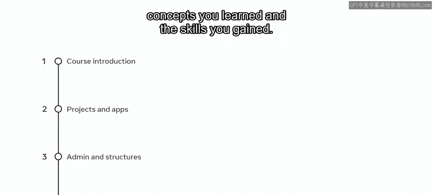

You can now identify the problems that Django solves。

 especially for building projects that require high volumes of text content。

 media files and heavy traffic。 you can also provide examples of where Django is used in the real world。

 For example， developers can create a back end framework with Django that can connect to a frontend framework via an API。

 Next， you are then introduced to the project creation process。

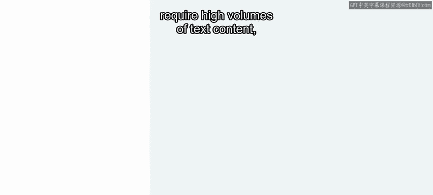

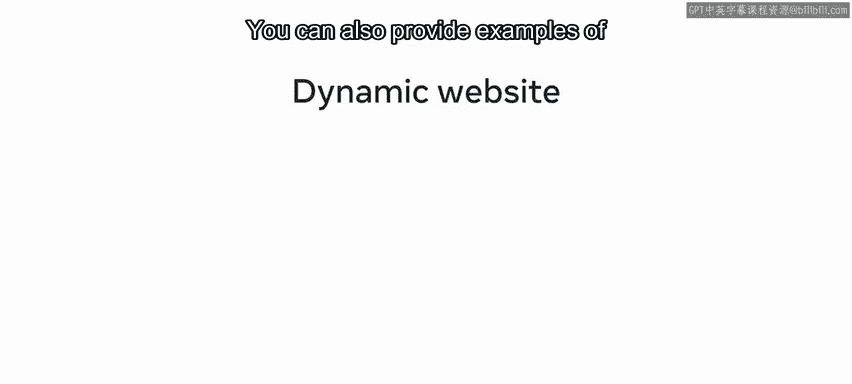

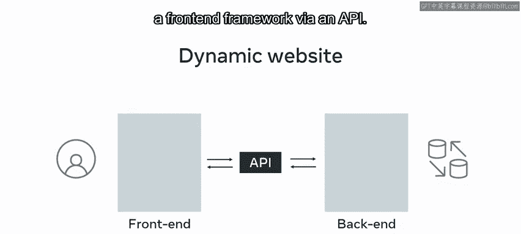

You can now create a project in VS code using Windows or Linux。 Secondly。

 you learned about projects and apps。You should now be able to explain the core concepts of projects and apps。

Emphasize the importance of structuring a project to make your development process easier and get a default web project up and running。

 You also learned about following best practices to develop projects in a structured way。

 This includes the don't repeat yourself dry principles。 right at once but use it many times。

 Thirdly， you explored admin and structures。 In this section。

 you learned to discuss both Django admin and manage dot Py commands as options for command line utility to perform administration tasks。

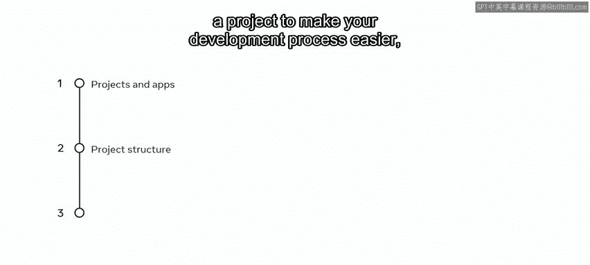

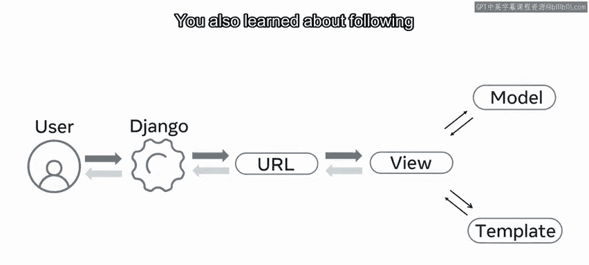

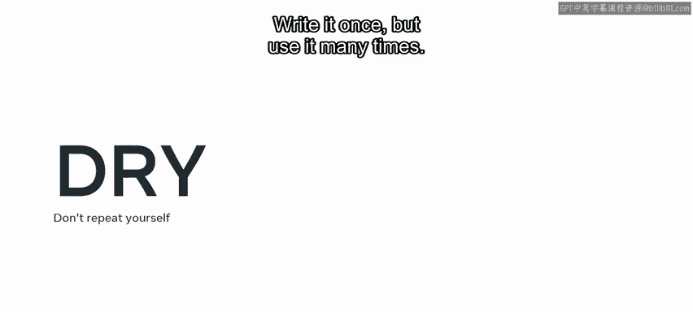

And how they are used in the creation of projects and apps。

 you can unpack the key differences between projects and apps and how they can be used together。

 and you learned how to create an app inside an existing project Lastly。

 you focused on web frameworks。

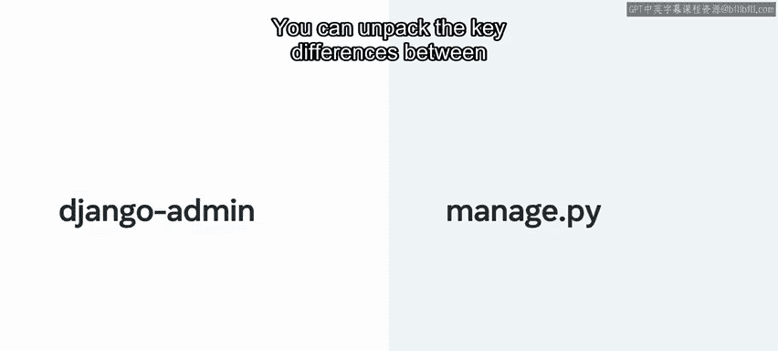

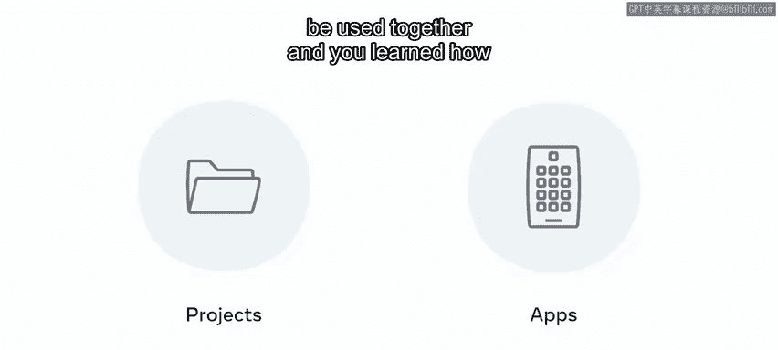

You now know that frameworks are designed to support you in building web applications。

It helps a development team to follow best practices。

 You understand that a framework is a solid foundation upon which you build your applications。

 The purpose of a web framework is to make application development easier and to provide the developer with a clean structure that keeps things in order and allows for changes and modifications frameworkraworks also allow for code reusability facilitated by existing code。

 you've learned about the different pieces and components that exist when building web applications and that modern applications are usually built using the three tier architecture。

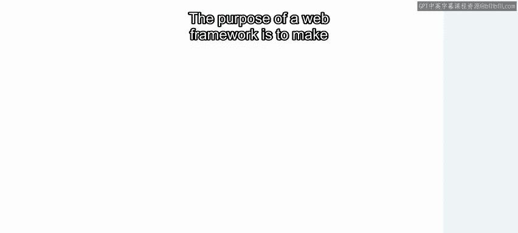

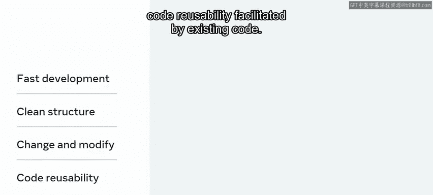

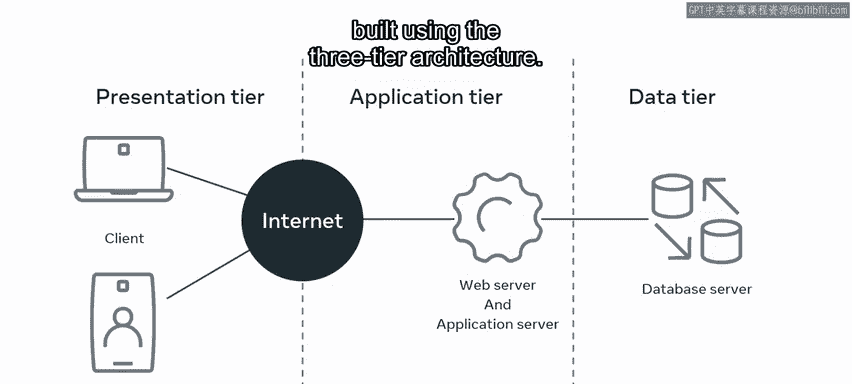

You explored Django structures that take care of many web development tasks。

These structures allow you to focus on writing your app without needing to reinvent the wheel。😊。

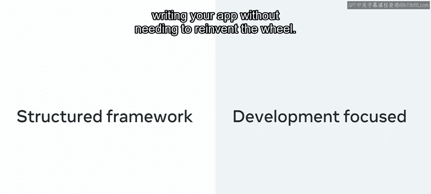

Recall the benefits of using the Django framework， including speed， features。

 security and scalability。

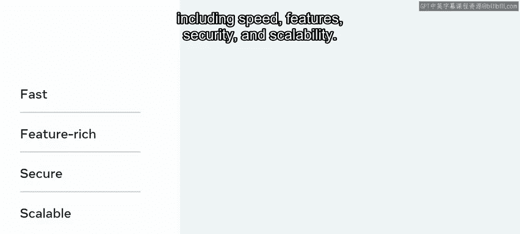

You also learned how Django implements the modeled view and template our MVT architecture。

 and that splitting the data， logic and display into MVNT rapidly creates large scale data driven web applications。

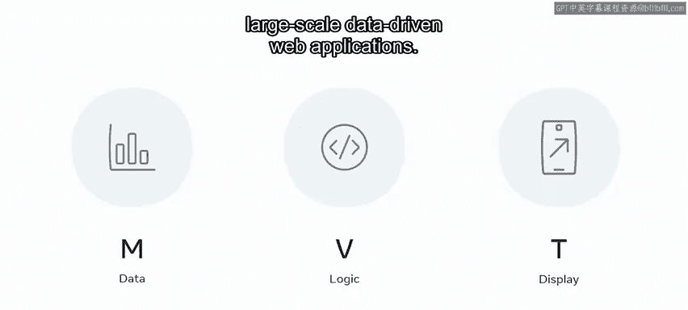

Now you can show the MVT pattern while prioritizing the reusability of Col。

 you learn to create an app inside an existing Jngle project whereby the app contains a view to output text to the homepage of the web application。

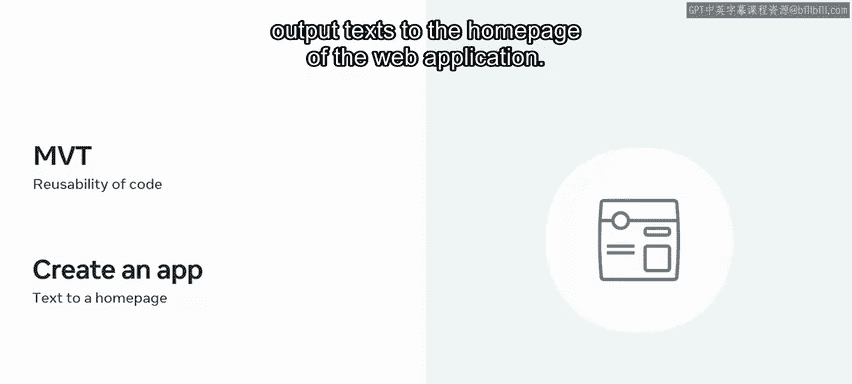

What a great start to your Django development journey You're now familiar with the differences between project structure and apps。

 the Django admin and manageage。 Py commands， the MVT framework and creating an app inside an existing project using the correct structure well done。

