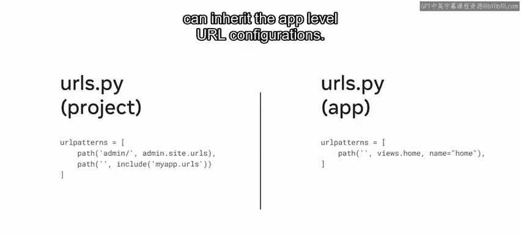
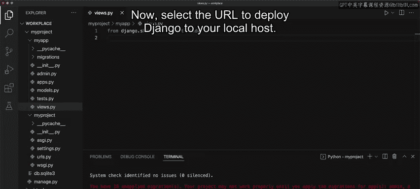
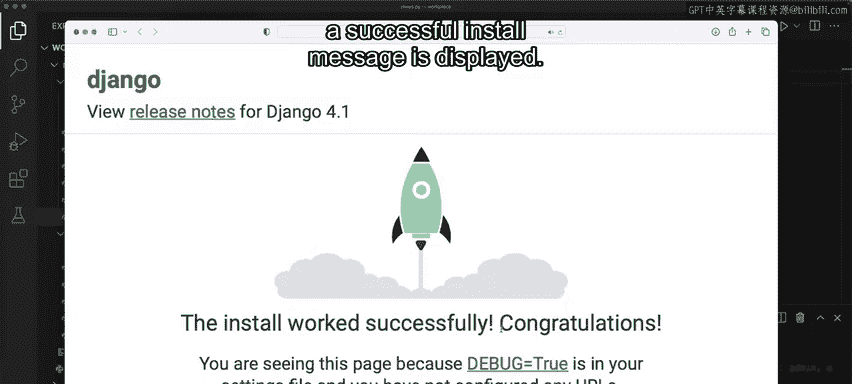
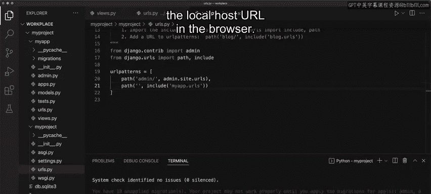
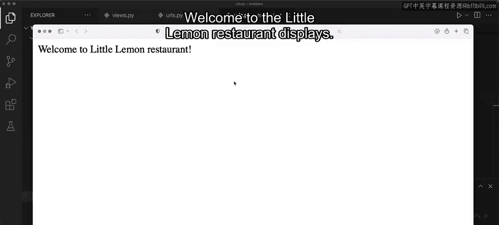

# Meta《后端开发（Django／APIs／全栈／毕业项目／面试）｜Meta Back-End Developer》中英字幕 - P12：11_创建视图并映射到URL.zh_en - GPT中英字幕课程资源 - BV1SZ421y7Fv

Most websites are web applications， provide a homepage when you type in the name of the URL。

 or click on the website link from a search engine。

 the homepage is returned when only a request for a URL with the domain name is sent。Previously。

 you learned that in order to accept a HTTP request and return a HTTP response。

 you need to create a view function inside the viewss。pyy file。

The View function is then mapped to a URL and when the request to that URL is made。

 the View function will be called。In this video， you will learn about URL configuration in Django and how it's used to map URLs to views。

You will explore the URL configuration file URLs。pyy and learn why it exists at both the project and app levels。

 Finally you will learn how to reference the URLs。pyy file at the app level using the includelude function to design URLs for an app you create a Python module informally called a URL conf or URL configuration。

The URL configurations used by the view functions in Django are created and updated in the URL's。

pyy file。Jngo by default creates a URLs。pyy file at the project level， but additionally。

 it's best practice to create a URLs。pyy at the app level。This way。

 the respective URLs for an app are clustered， but the project also needs to know what URLs are used inside each app。

For example。In Django， when a user makes a request for a URL。

 this request is first handled by the URLs。pyy file at the project level。

Jengo looks for the variable URL patterns， however。

 the code that contains the logic for the URL mapping is at the app level。

 so you need a way to tell Django to also check the URLs。

pyy file at the app level and you do this by using the includelude function。In the URLs。

pyy file at the project level， you create a new path inside the URL Pat list。Then。

 inside the path function， you pass a reference to the app level URLs。pyy file as the view argument。

This allows the project level to access the app level URLs。By using the includeclude function。

 the project level URLs。pyy can inherit the app level URL configurations。

 you will explore this concept of inheritance in more detail later when you work with routes containing URLs represented as strings。

Now let's open VS code and create the code for the URL configuration。😊，To begin。

 let's create a project and inside the project create an app called My app。

To ensure that the Dngo app is running， launch the development server by running the terminal command。

 Python 3 manage。tpyY run server。Now， select the URL to deploy Django to your local host。

Notice that the web page with a successful install message is displayed。

 let's close the webp page and stop the server for now。

The first step is to open the viewss。pyy file to create a view， using the import statement。

 type Django。httP import HtTP response。Next， create a function called home and pass the request object inside of it。

Next， returnturn and HTTP response containing istuing。

Let's use the example of the homepage for the Little lemonmon restaurant。

The message in the string says，Welcome to the Little Lemon restaurant。

The goal is to display the message when the user opens the Local hostst URL Let's explore the next steps to display the message。

The first step is to create a file inside my app called URLs。pyy。

Recall that this is the app level URLs。pyy file and that one also exists at the project level。

In the URLs。pyy file， you need to import the path function from the Django。t URLs。

This allows you to use the path function inside the URL Pat list。

And it's inside the path function where you map the URLs to its relevant view function The next step is to create the sequence called URL Pat。

😊，Between the open and close square brackets， you add the path function and inside the parenthesis pass an empty string followed by the location and the name of the view function。

Because the file's URL's dopyy file and Views。pyY file are in the same folder。

 you only need to provide the name of the file without the dotpyY extension where the view function is located。

 and then a dot and the name of the view function。Notice that VS code highlights the word views in the code。

 this means that in order to use the views。pyy file it must be imported。

So type from dot importm View and save the file。It's important to remember to add a comma at the end of this path function to match the parsing that djanangle performs。

Now， save the file once more。Okay， so the code is nearly complete。

 the final step is to set the URL configuration at the project level。

This is because the project file doesn't know where the view function is。To set this configuration。

 open the URLs。pyY of the project。Beside the keyword path， type comma。

 and then include to import the include function。Next， inside the URL Pats list。

 add another path function。Inside of the parenthesis pass an empty string。For the second parameter。

 use the includelude function to pass the location of URL。pyy file of the app。Once again。

 remember to not add the dot PY extension。Save the file and open the Local hostst URL in the browser。

Success。The message welcomel to the Little Limon restaurantrant displays。

In this video， you learned about URL configuration in Djangle and how it's used to map URLs at the project level to views at the app level。

