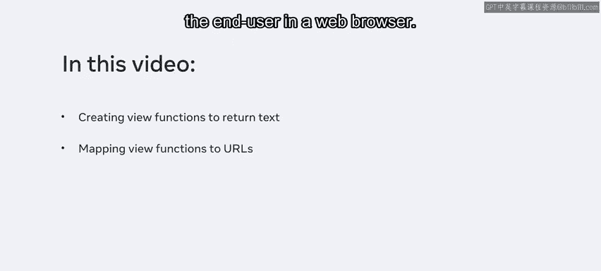
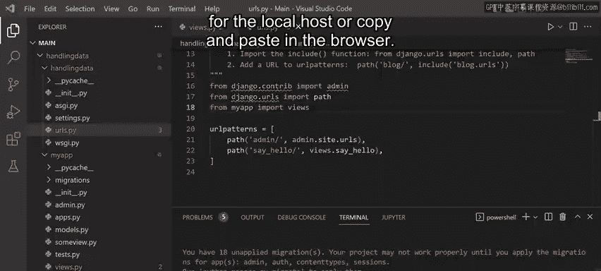
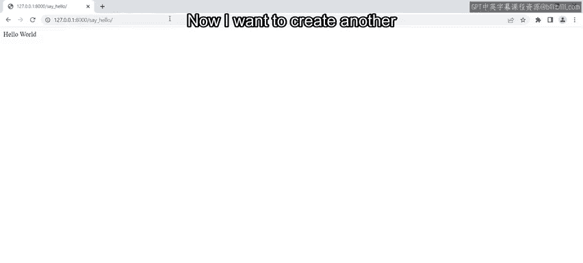
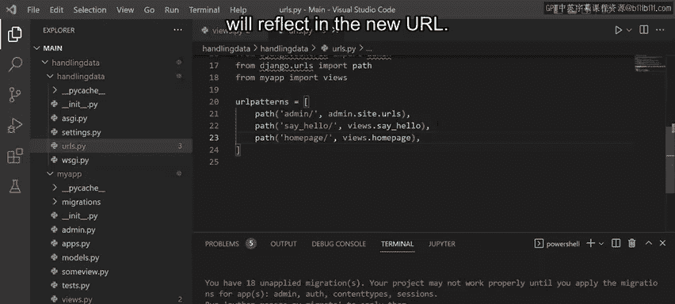
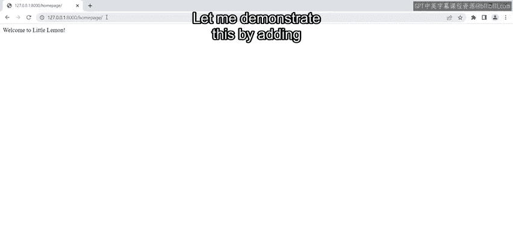
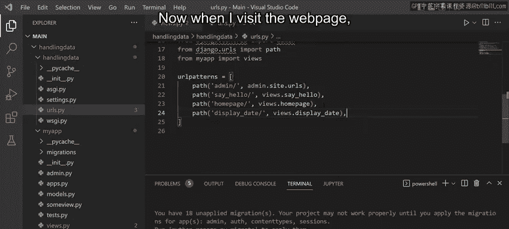
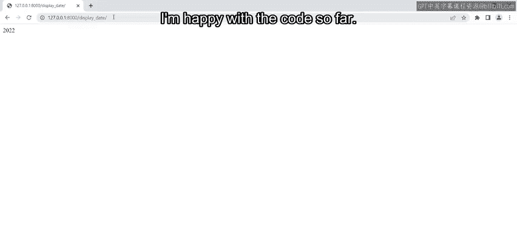
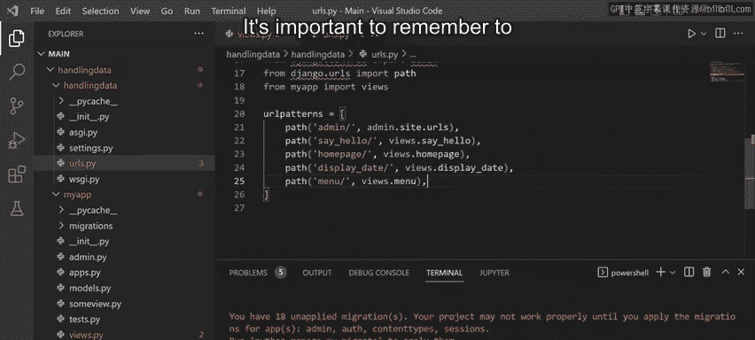
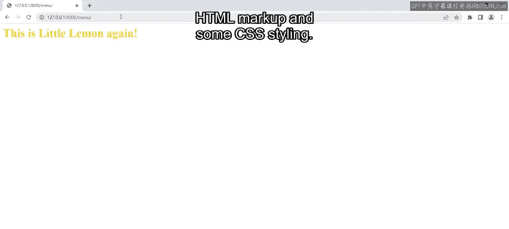
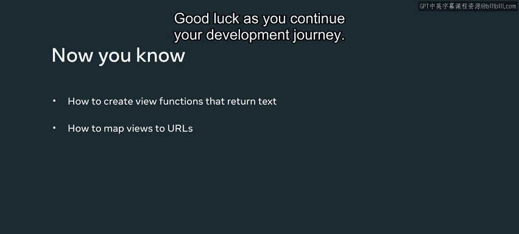

# Meta《后端开发（Django／APIs／全栈／毕业项目／面试）｜Meta Back-End Developer》中英字幕 - P13：12_创建视图和视图逻辑.zh_en - GPT中英字幕课程资源 - BV1SZ421y7Fv

In this video， you'll learn how to create view functions that return text and HTML markup using the HTMLTPU response object。

Then you'll learn how to map these functions to URLs so that they can be displayed to the end user in a web browser。

By now， you should be familiar with the concept of views and how they're used to create view functions with the logic in the View do high file。

I've already created an app inside cite the project。

 and the first thing I want to do is return the textHello world on a web page。First。

 I open the file called View Stop Pi and paste in some code。

Notice the HTTP response that I imported online to， it allows me to communicate with the server。

In this video， when referencing the server， I will often use the words request and response。

Recall that request refers to requesting information from the server via code and response just means that I'm returning an HTTP response to the server。

Then the response is displayed on the web page。It's important to know that when I create a view function that returns an HTTP response。

 it won't do anything on its own。This is because Django doesn't know where to return the content Hello world。

 So to make this work， I need to map the few function to a URL using the URL configuration file called URLs。

 Pi in the project directory。 So let me open this file and add a new path。Once I add the path。

 I need to import the View that Pi file from my app directory。

Now Django can access the View file and the Ho function that I've defined。

Notice that the path contains the URL and the name of the function from thefuse P file that I want to map to。

The first argument that's passed to the path function is the URL location that's added as a suffix to the URL or local host if this doesn't make sense at the moment。

 it will when I preview the web page in the browser。

Now I run the server by typing the command Python， manage dot Pi run server。

I can open the development server by clicking the URL for the local host or copy and paste in the browser。

Notice that 404 page not found error is returned。The reason for this is because I added the path of say hello to the URL so I need to add that now as a suffix。

Now when I press Enter， notice that a web page is displayed with the text Hello world。

Now I want to create another view function inside the app， so back in the views。pi filele。

 I create a new function called homepage。

This returns to text。 Welcome to Little women。Once again， to map this view function to a URL。

 I open the URLs。pi file and add a path that will access the views。 homepage function。

Notice how I've added a new location called homep page to retrieve the content and this will reflect in the new URL Okay。

 so I saved these two files and return to the web browser。

I changed the suffix from say hello to homepage。Press enter and notice that the new output is displayed。

You may be wondering how does all this code integrate with Python。

 Let me demonstrate this by adding a third view function that accesses the date time module in Python。

 Then I need to make sure that I import the datetime module so my code has access。

That looks good to me now my code has access to the year that uses a datetime module。

It's stored in a variable name， date underscore joint。

 Notice that this value is returned to a web page。 and to map it to a URL。

 I once again open the URL pie file to add the associated path。 Once again， I save the files。 Now。

 when I visit the web page， I can access the URL with the suffix display date。

 This display is the year。 I am happy with the code so far。 However。

 there is one last view function left for me to add。😊。

Back in View。 Pi， I add another function called menu。

This code allows me to pass HTML code and cite an object in Python。

And I can return that object as an HTTP response。Notice that I've also added some styling by changing the color of the code。

 I' saved my file and once again create the path。😊。

It's important to remember to always save the files after every update Now let me revisit the webpage again and go to the URL I've created。

Notice that the text displays with HTML Markup and sub CSSS styling。

In this video， you learn how to create view functions that return the text and HTML markup using the HTMLTP response object。

Then you learn how to map these functions to URL so that they can be displayed to the end user in a web browser while at the moment the content returned is basic later in the course you'll learn how to return more complete web pages using templates Good luck as you continue your development journey。

