# Meta《后端开发（Django／APIs／全栈／毕业项目／面试）｜Meta Back-End Developer》中英字幕 - P15：14_创建请求和响应.zh_en - GPT中英字幕课程资源 - BV1SZ421y7Fv

By now， you should know that the Re response cycle works between the client and server in this video you will learn how to use Django's HTTP Re and response objects。

Let's now explore how the Re response cycle happens inside Dngo。

The cycle begins when the user enters a URL in their web browser。

This URL is sent to the web server where Django searches for a match inside the URL's。pi file。

Once it finds the URL， it is mapped to its associated view。Inside the view file。

 the view function receives the HTTP request as a request object。

The view function then defines the appropriate HTTP response and sends it back as a HTTP response object。

This response is processed by Dnangle and the client receives the HTTP response。

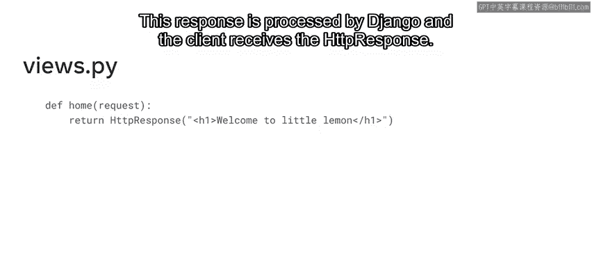

Let's now open VS code and explore how to work with Django's request and response objects。

Open the viewss。pi file and add the necessary imports。Next， createate the view。

Recall that Django uses the Re and response objects to pass through the system。

The APIs for the HTTP request and the HTTP response objects are specified in the Django。 HtTP module。

And you use the Re and response objects from this module inside the logic of the view function。

Now you are ready to create the view function。Create a view function named home and pass the request object to it。

Select the URL。pi file to ensure that the function name matches the view function inside the URL Pat list。

Return to the views。pi file and access the path property inside the request object by typing requestquest。

path。Now， assign this to a variable named path。It's important to note that the format needs to be changed to return the path variable in the HTTP response。

The next step is to create the return statement with the HTTP response object。Inside the parenthesis。

 pass that path argument。Followed by the content type and finally the character set。

Save the file and open the local host to URL in the browser。Enter the exact location of the URL。

 which is main forward slash home。

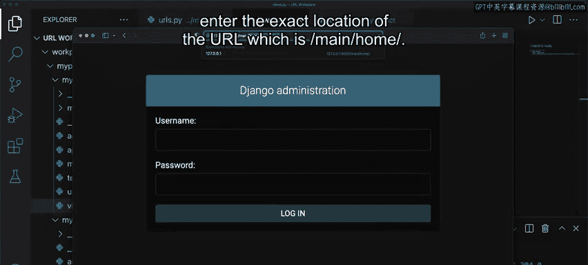

Notice that the path is displayed in the main window of the browser。

And is the same as the order in which you pressed main and then home inside the URL patterns list。

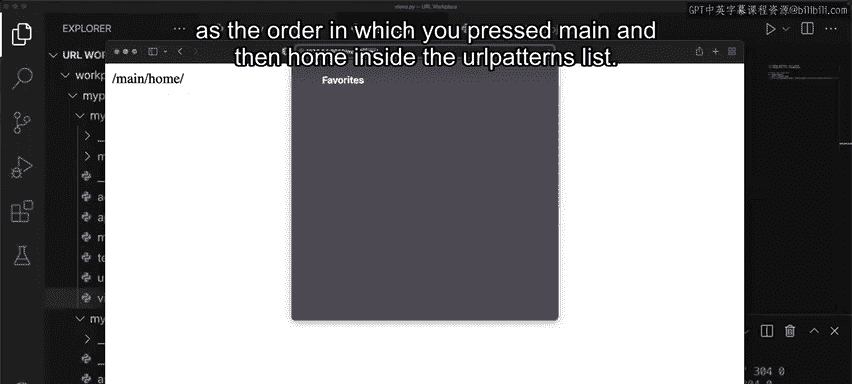

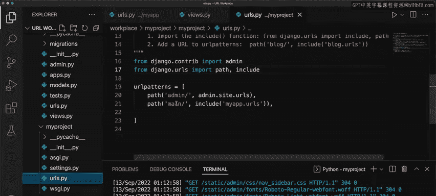

If you remove Main in the URL Pats list and save the file。

 you can configure the URL by removing the path main。

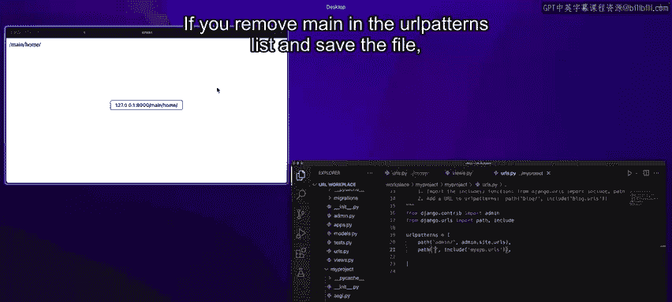

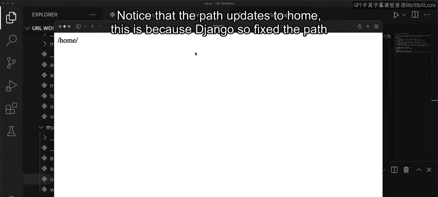

Notice that the path updates to home。This is because Django sixed the path provided from the app level to the current path inside the project level。

This example demonstrates that the HTTP response behaves like an ordinary object。

Let's explore this further by creating another HTTP response object and assigning it to a variable called response。

Passt the string with the message， this works。So instead of returning the HTTP response object。

 you can just return the variable。

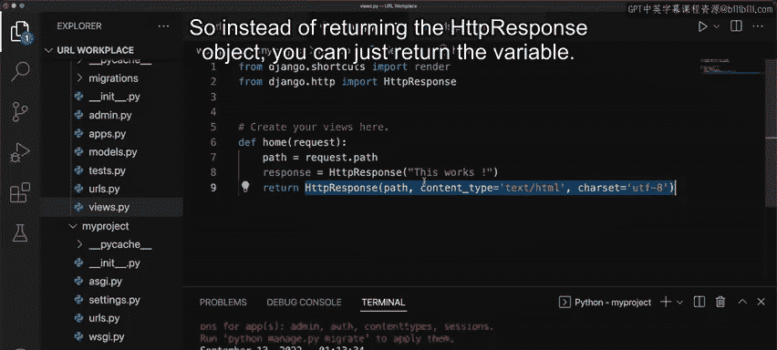

Go back to the browser， refresh the page， and notice the text displayed。

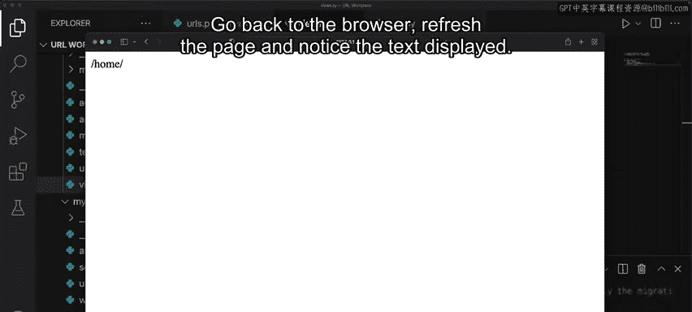

It's important to know that this is just an example of how you can explore the HTTP response object。

In a real world scenario， developers do not usually need to modify the structure of the HTTP response object。

To take this example further， you can also return the attributes of the HTTP request object。

For example， you can create variables to store the scheme， method， address， user agent。

 and path info。You may recall that the metatags provide information about the headers of the request object past。

One way to display the attributes of the HTTP request object in the browser window。

 you need to render the variables inside a formatted string in Python。

Recall that to perform string formatting in Python， you use the formatted string literals。

Begin a string with the character F， either in upper or lower case。

 and place it before the quotation marks。Python expressions are placed between the curly braces。

To do this， add some HTML tags inside the formatted string and pass the variables that you created earlier。

This formatted string is then stored in a variable called message。Finally。

 use the return statement to return the HTTP response object。

Notice that the message variable is passed as the first argument。

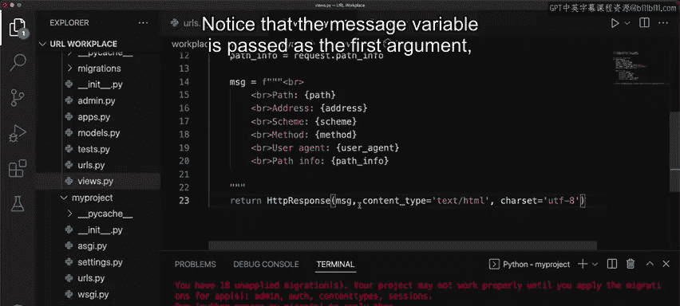

Now， save the file。Refresh your URL in the browser and notice that the request object information is displayed inside the browser。

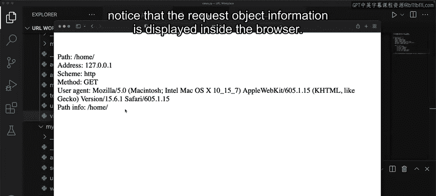

A final thing to know is that you can update the header information for both the HTTP request and response objects。

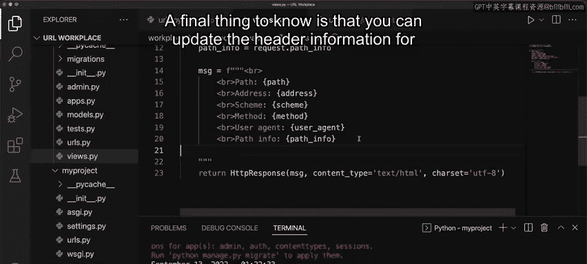

To do this， create a HTTP response object and then assign it to a variable called response。Next。

 type in responsespon。headers and using a dictionary add age set to a value of 20。Next。

 pass this value inside the formatted string。Return to the browser and refresh the page。

Notice that the contents of the response header display with age added as part of the header。

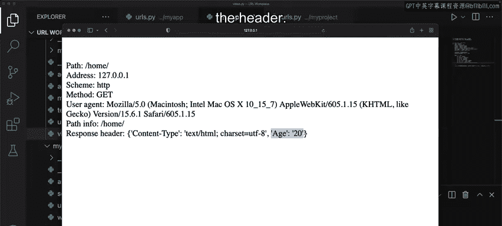

Developers use request and response objects when working with get and post methods。

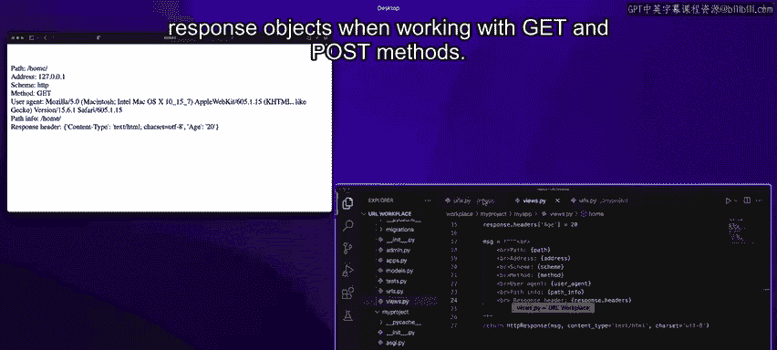

This is useful for creating forms， working with databases。

 and other common data structures in Django。In this video。

 you learned how to use the Re and response objects in Djangle。

