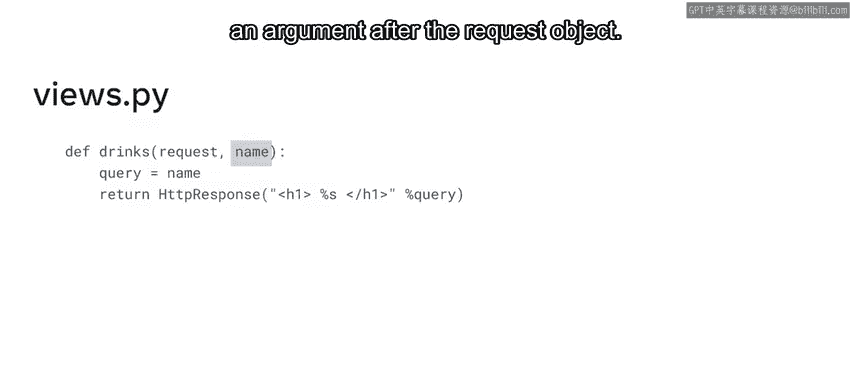
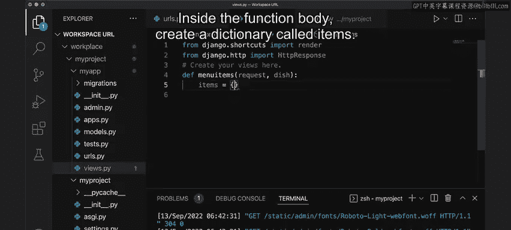
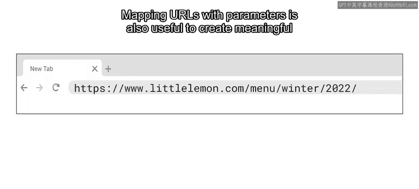

# Meta《后端开发（Django／APIs／全栈／毕业项目／面试）｜Meta Back-End Developer》中英字幕 - P17：16_映射带参数的URL.zh_en - GPT中英字幕课程资源 - BV1SZ421y7Fv

Previously， you learned that to define URLs， you first define the URL structure using the path function。

 and then this URL is mapped to a view function。Sometimes developers need to pass information to the view function for additional processing。

In Django， developers have the option to pass values as URL parameters by using URLs as source of information。

In this video， you will learn how to use URL parameters to retrieve data from a URL and send it to the view function for processing。

You will also explore how to use angled brackets and path converters to capture a parameter value from the URL。

Suppose the owners of Little Lemon want to add a web page to display a name from the drinkrinks menu。

The name is sent in the URL and then displayed as a heading on the page。For example。

 the URL can contain the names of coffees like Americanano， espresso and cappuccino。

 The last part of the URL represents a drink name and this value can be passed to the view function from the URL as a parameter。

In Django， you can capture a value from a URL using angled brackets inside the path function where you define the URL。

Captureed values can optionally include something known as a converter type。

You will learn more about this later。For now， just know that to capture a string。

 you can use the keyword STR followed by name for the value。Then inside the views。pi file。

 you pass this name as an argument after the request object。

Let's open VS code now and create a food item page by configuring a URL and passing a parameter to the view function。

First， open the URLs。pi file and inside the URL Pats list add a path。Inside the path function。

 define the URL as dishes for slash。And then inside angle brackets。

 place the path converter for a string。The example in this video is STR colon。And then dishes。Next。

 add the View functions location， views。 menuu items。

STR represents the path converter type and D is the URL parameter name given to match the value。

For example， if the URL parameter contains the string pasta。

 it would be represented as dish equals pasta。Once this code is complete， open the views。

pi file and create the View function。First， make sure to import the HTTP response object。

This function will match the path defined inside the URL's dotpi file。In the function declaration。

 you need to pass an additional argument after request because an argument was passed inside the URL's dotpi file。

Inside the function body create a dictionary calledites。

Once the dictionary is set up， add some entries to it。In this example。

 notice that three key value pairs were added with the keys of pasta， falafel， and cheesecake。Next。

 create the code to access the dictionary by passing a value and save it to a variable named description。

The logic of this code is that the URL parameter value passed to this function will be matched to a key inside the dictionary。

Then， the associated value is stored in the variable named description。

The final step is to return the HTTP response object containing a HTML heading to display the function argument and the associated description variable as plain text。

Save the code and run the server。Open the browser and add dishes forward/lash pasta at the end of the local hostst URL。

Remember that the wordpaa is one of the dictionary items。The text displays in the browser。

 formatted with the URL parameter as a heading， and the dictionary description as text。Similarly。

 if we modified this to， let's say cheesecake and press enter， notice the text updates accordingly。

Defining URLs with parameters has a wide variety of uses In this example。

 the logic of the view function was to pass a URL parameter that matches a description in a dictionary。

😊，Developers can also use URL parameters to send information to the logic layer for processing or as search and sorting criteria。

Similarly， URL parameters can be used to fetch data that can be used with forms， data models。

 and other data structures。For example， you can use a URL parameter to pass the primary key of a database table using the INT pathth convert type。

Once the primary key is sent to the view function， it can fetch the database row and its data。

And you will learn how to do this later when you explore jnangle models。😊。

Mapping URLs with parameters is also useful to create meaningful grouping of the content。

In this video， you learned how to use URL parameters to retrieve data from a URL and send it to the view function for processing。

You also explored how to use angle brackets and path converters to capture a parameter value from the URL。

