# Meta《后端开发（Django／APIs／全栈／毕业项目／面试）｜Meta Back-End Developer》中英字幕 - P19：18_错误处理.zh_en - GPT中英字幕课程资源 - BV1SZ421y7Fv

An application will contain errorsRS in some form， no matter how much testing or QA is performed。

This is not always directly related to incorrect code or syntax issues。By their very nature。

 networks are not always 100% reliable and things can occasionally go wrong。

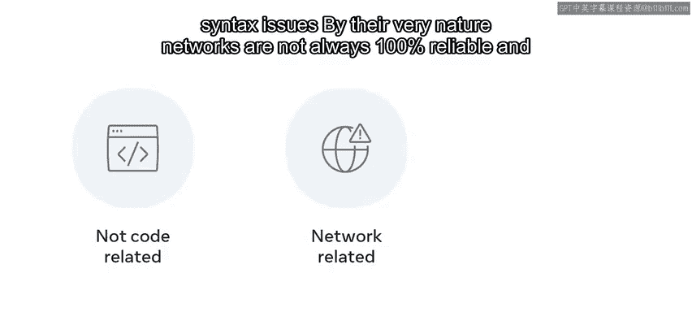

As an aspiring developer， you need ways to handle these potential issues。

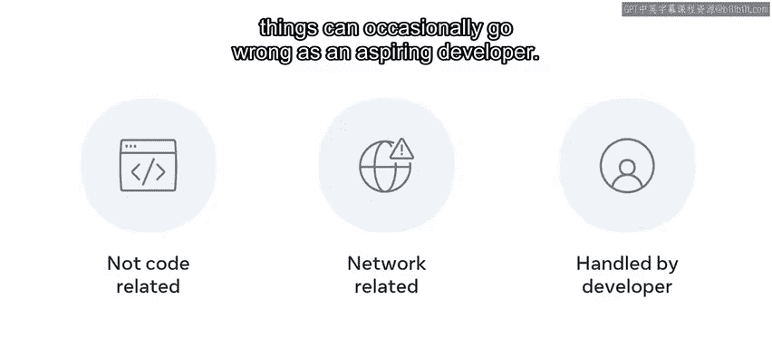

In this video， you will learn about error handling in Django。

 you will explore some of the most common client and server error responses that developers encounter。

😊，And you will also learn how to work with them in Djangle via the Er handling view。

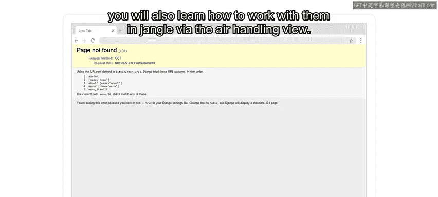

By now， you should know that HTTP responses contain status codes。

Recallled that the 100s are used for informational， 200s referred to success。

 300s for redirects are moved resources， 400s for bad requests or authorization issues。

 and the 500s for server issues。

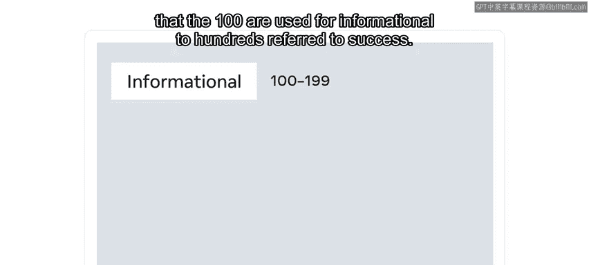

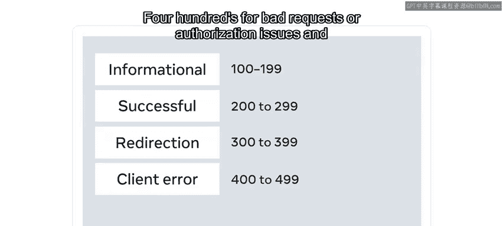

While this may seem like a lot of codes to learn， you generally encounter some of the same codes more frequently when working with web applications。

😊。

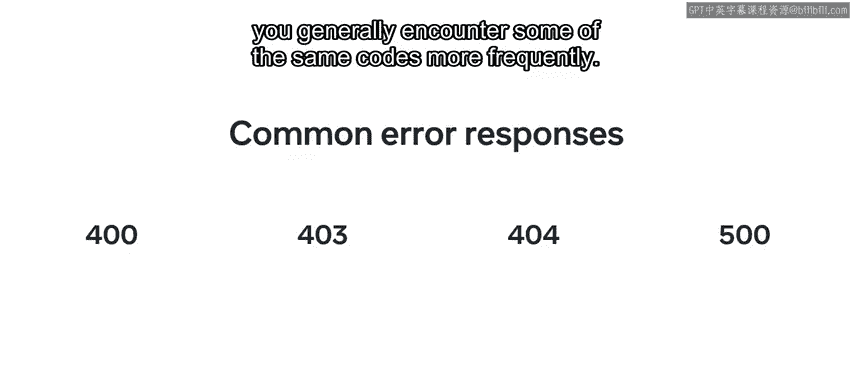

Let's explore some of the more common client and server status codes that developers encounter。

 starting with client error response codes。The first is 400， which represents a bad request。

This occurs when parameters passed in the request are not what the server may expect。Next is 401。

 which indicates that the user must log into an account before processing the request。Next is 403。

 indicating that the request was valid， but that the web server refuses to process it。

This typically means that the user calling the resource does not have the required permissions to view the resource。

Finally， 404 indicates that the requested resource was not found on the web server。

This typically happens when the resource cannot be located at the specified file path。

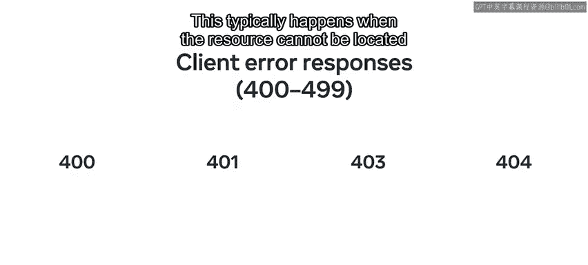

Now that you know some common client error responses， let's explore some server error responses。

Server error responses usually indicate a failure occurred on the web server while trying to process the request。

This can mean many things。 For example， the application has failed or is not running。

 R the time limit on the calling request may have aborted due to the server taking a long time to respond。

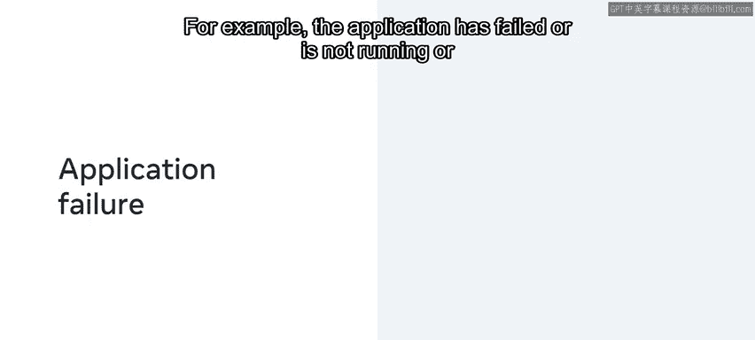

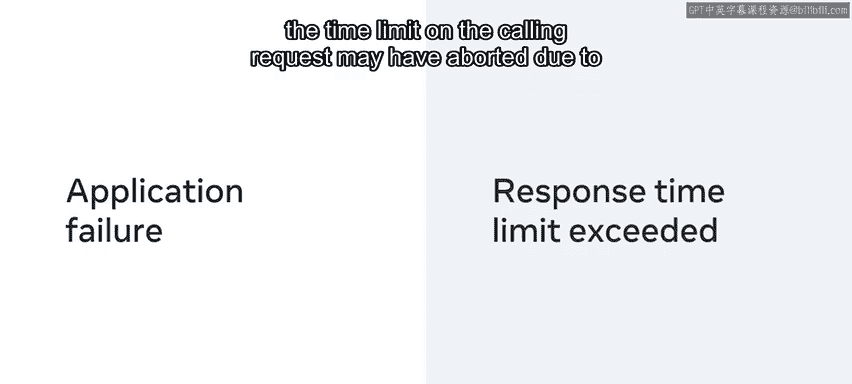

Server error responses usually use status codes ranging from 500 to 599。

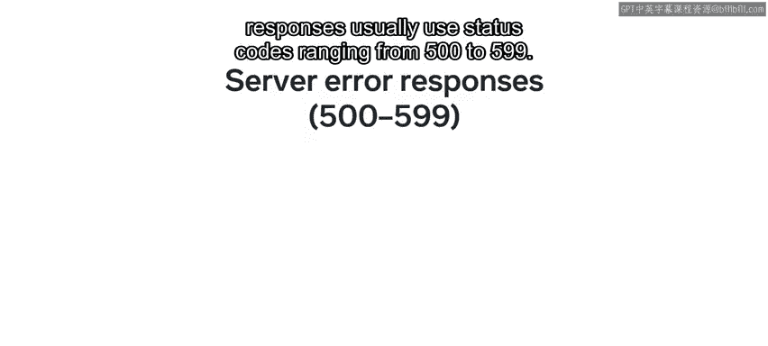

The most common code you will likely encounter is the 500 internal server error。

 which is a generic error status indicating that the server failed to process the request。

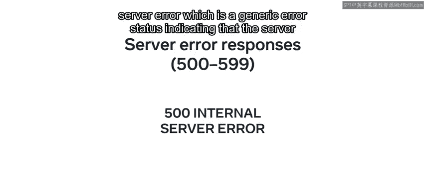

Okay。Now that you have learned about the error response。

 let's now explore how Djangle handles them by raising exceptions。

Jngo handles all error cases by raising an exception。

 which is invoked via an error handling view that you can configure。

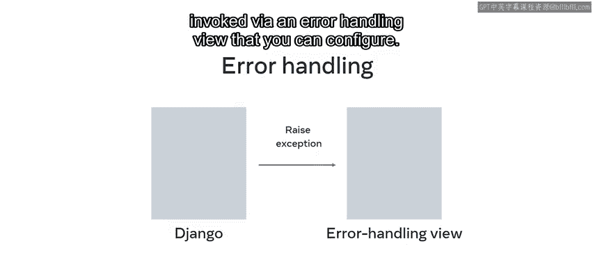

These U handling views are added to a separate views at P file that must be created at the project level to get applied across the project。

The views to use for these cases are specified by four variables。

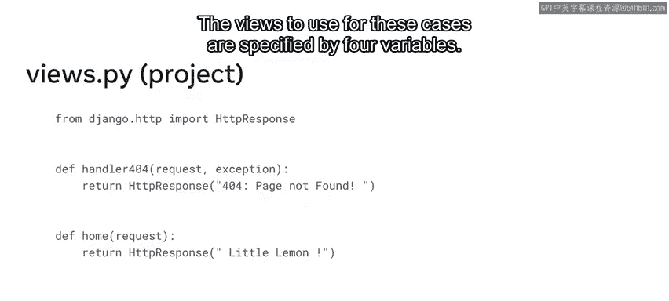

They are Handr 400， Handr 403， Handr 404， and handler 500。

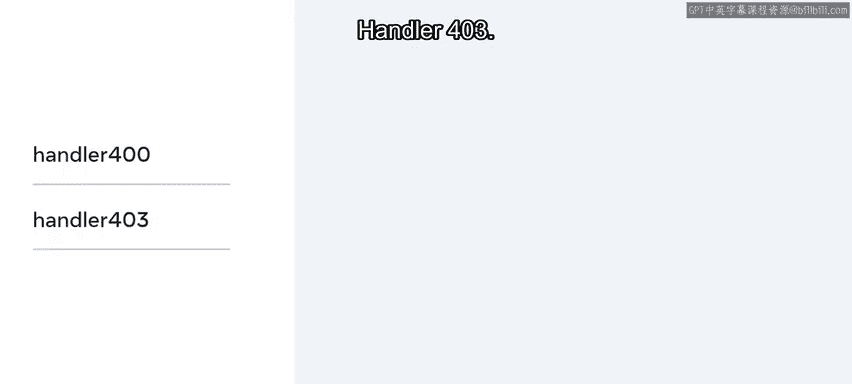

It's important to note that while you can use the default values and views for your projects。

 there may be times when you want to customize the look of these views to align with the style or theme of your site。

Further customization is possible by overriding the default values。

Such values can be set in the Ro URL configuration file of your project。

It's important to know that setting these variables in any other URL configuration file will have no effect。

Let's explore these variables in a little more detail now to override their defaults and implement some custom views。

The first is Handr 400。By default， this is the bad request view。Next is handler 403。By default。

 this is the permission denied view。Next is Handr 404。By default， this is the page nott found view。

Finally， Handr 500 by default， this is the server error view。

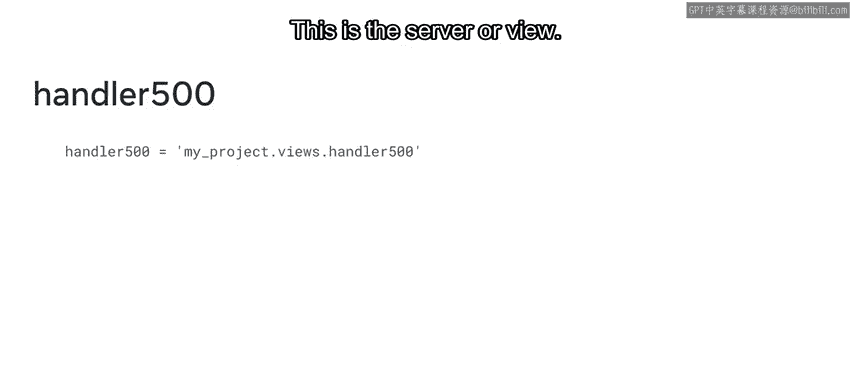

As you have learned， it's also possible to implement custom views and you will learn how to do this soon。

For now， just know that to implement a custom view。

 the view function needs to accept the appropriate request argument and return the appropriate response。

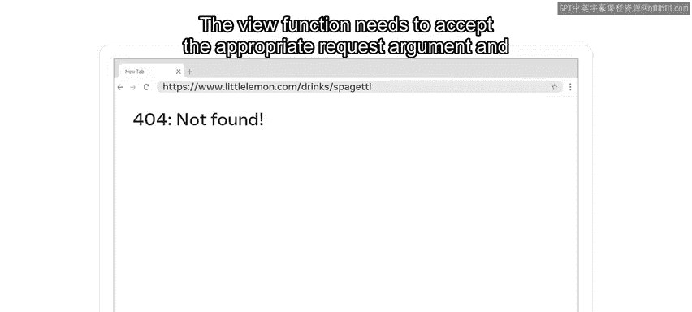

The custom views that you create using these handlers return different HTTP response subclasses that handle different types of HTTP responses。

For example。

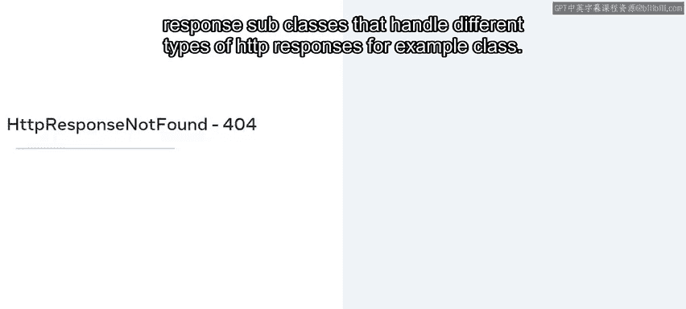

Class HTTP response not found acts just like HTTP response， but uses a 404 status code。

Class HTTP Re bad Re acts just like HTTP response， but uses a 400 status code。

Class HTTP response forbidden acts just like HTTP response， but uses a 403 status code。

Class HTTP responsese Ser error acts just like HTTP response， but uses a 500 status code。

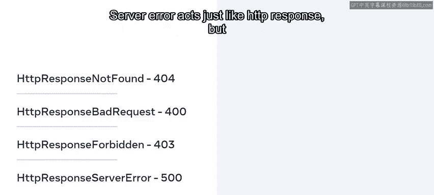

In this video， you learned about Er handling in Django。

