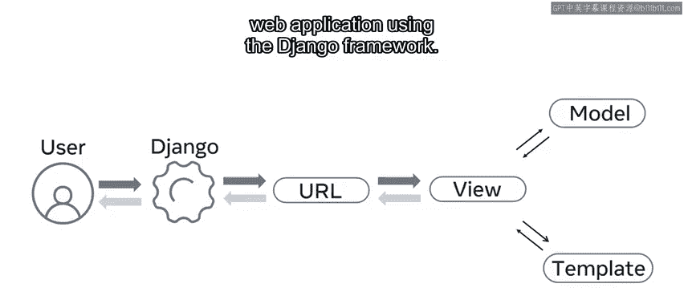
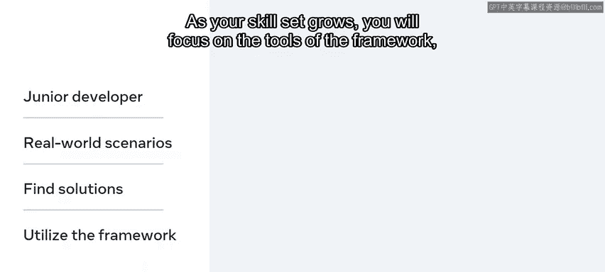
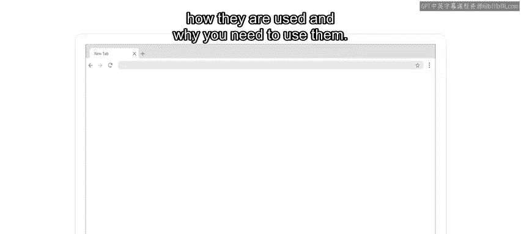
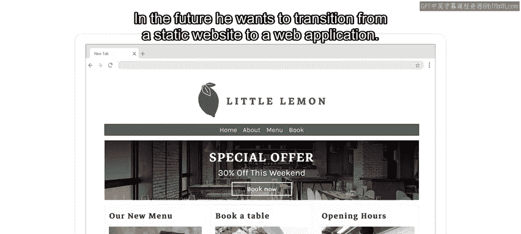
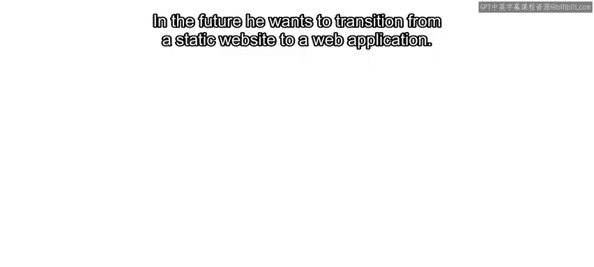
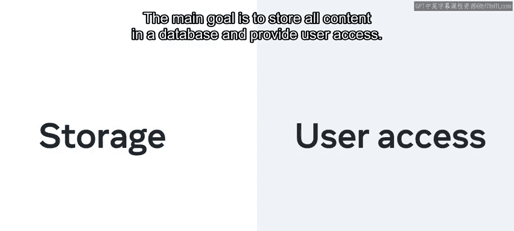
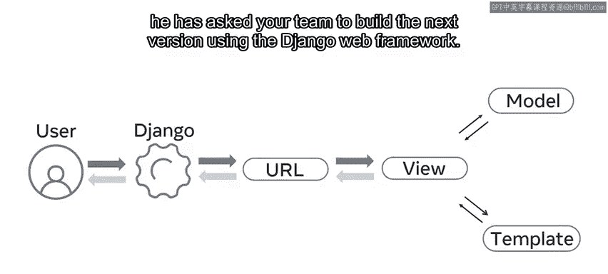
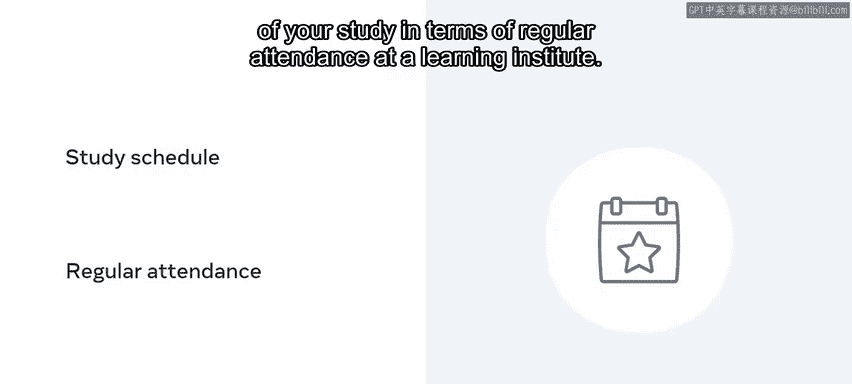

# Django Web框架：P1：课程介绍与概述 🚀

在本节课中，我们将要学习Django Web框架的入门知识，了解课程的整体结构、学习目标以及你将扮演的角色。

## 概述

Django是一个用Python编写的开源Web框架，用于构建大规模的后端Web应用程序。本课程旨在帮助你整合已有的Python、HTML、CSS和数据库知识，通过Django框架来创建动态的Web应用。

## 课程背景与目标

你每天进行的许多活动都可以完全在线完成。你可以使用手机、电脑、平板或其他设备上的应用程序来访问网络。在许多Web应用程序中，数据存储在数据库中，这些数据可以通过Python等编程语言在Web服务器上访问。一旦数据被检索出来，就可以使用HTML将其发送到网页内的最终用户。

作为一名有抱负的开发者，你已经具备这些技术的一些知识和技能。现在是时候通过结合这些技能，使用Django框架创建一个动态的Web应用程序来提升你的水平了。

要使用Django，你需要对数据库、Python、HTML和CSS有良好的工作知识。然而，你还需要学习许多新的工具、概念和工作流程。在这个课程介绍中，你可能会遇到许多新术语，但如果在课程期间不能完全理解所有内容，请不要担心。你将更详细地探索这些概念，以及构成Django开发者职责的许多其他任务。

为了辅助你的学习，你将扮演Little Lemon餐厅开发团队中的一名初级开发者的角色。在这个虚构的角色中，你将遇到许多现实世界的场景。通过应用你新获得的知识，你将克服挑战，实施解决方案来完成这些场景。随着你的技能增长，你将专注于框架的工具、它们的使用方法以及为何需要使用它们。

例如，Little Lemon最近推出了其第一个包含HTML、CSS和JavaScript的网站。联合创始人Adrian知道，随着公司的发展，其网站也必须发展。未来，他希望从静态网站过渡到Web应用程序。

主要目标是将所有内容存储在数据库中并提供用户访问。

因此，他要求你的团队使用Django Web框架构建下一个版本。

你的工作是运用你现有的Python、HTML、CSS和数据库知识来探索Django的特性。然后，你将使用该框架构建新Web应用程序的原型。之后，你将向Adrian和开发团队的其余成员展示这个原型。

## 课程模块介绍

本课程包含五个模块，现在让我简要介绍一下。

1.  **模块一：Django入门**。你将了解Django以及它为何成为后端开发的流行选择。
2.  **模块二：视图（Views）**。你将探索视图的概念，以创建向最终用户呈现数据的逻辑。
3.  **模块三：模型（Models）**。你将深入学习模型。
4.  **模块四：模板（Templates）**。在熟悉模型后，你将学习如何使用模板。
5.  **模块五：毕业项目**。最后，你将通过分级评估将新技能付诸实践，创建一个基本的Web应用程序。

现在你对课程结构有了大致了解，让我们更详细地探讨一下这些模块。

## 模块详解

上一节我们介绍了课程的整体结构，本节中我们来看看每个模块的具体内容。

### 模块一：Django与Web框架

在第一个模块中，你将了解Web框架的概念。你将学习如何创建一个Django Web应用程序，以及它主要由两个组件构成：**项目（projects）** 和 **应用（apps）**。

以下是本模块的关键学习点：
*   你将学习如何使用特定的命令行工具（命令 `django-admin` 和 `manage.py`）来创建和处理项目与应用。
*   你将运用新获得的技能，在现有项目中以正确的结构创建一个应用。
*   你将通过扩展Web框架的知识来结束本模块，展示MVC（模型-视图-控制器）模式（在Django中常称为MTV模式）的可重用性，以及Django的项目结构是如何设置以适应这一点的。

### 模块二：探索视图

在下一个模块中，你将探索视图。你将了解什么是视图以及如何处理基本的HTTP请求。

以下是本模块的关键学习点：
*   你将发现Django开发者如何使用请求（`request`）和响应（`response`）对象进行常见操作。
*   你将学习如何区分参数，以及它们如何与HTTP方法（如 `GET`、`PUT`、`POST` 和 `DELETE`）关联。
*   你将探索使用正则表达式创建不同的URL模式，并将URL映射到视图。
*   你将列出常见的HTTP错误，并在HTTP视图逻辑和视图级别处理这些错误。
*   最后，你将了解更多关于Django中基于类的视图，以及如何在项目中重用它们。

### 模块三：深入模型

在下一个模块中，你将全面探索模型。

以下是本模块的关键学习点：
*   你将学习如何使用Django管理面板来添加和控制用户及组的权限。
*   你将探索如何使用查询集API（`QuerySet API`）与数据库交互。
*   你将创建一个表单，并使用表单API将数据绑定到对象。
*   最后，你将学习如何设置MySQL数据库并应用迁移以保持数据最新。

### 模块四：掌握模板

在下一个模块中，你将全面探索模板。

以下是本模块的关键学习点：
*   你将学习如何创建模板并使用模板语言创建标记。
*   然后，你将探索如何使用模板生成HTML。
*   接下来，你将学习如何将第三方库集成到你的Django应用中。
*   最后，你将探索Django中的调试和测试。

### 模块五：毕业项目与实践

在最后一个模块中，你将在进行课程项目之前有机会回顾课程的关键要素。在项目中，你将Little Lemon餐厅创建一个数据驱动的Web应用程序。

## 学习方法与建议

现在你知道了将要学习的内容，让我们快速了解一下课程将如何交付给你。你的课程中有许多视频，将逐步引导你实现目标。观看、暂停、回放和重看视频，直到你对自己的技能充满信心。

然后，通过查阅课程读物来巩固你的知识，并在课程练习中将你的技能付诸实践。在此过程中，你会遇到几个知识测验，你可以在那里自我检查进度。

你并不是唯一一个考虑成为Django开发者的人，这就是为什么你还会参与课程讨论提示，使你能够与同学联系。这是分享知识、讨论挑战和结交新朋友的好方法。

要在本课程中取得成功，坚持有规律、有纪律的学习方法会很有帮助。你需要认真对待学习，如果可能的话，制定一个学习计划，标明你可以投入参加课程的日期和时间。这是一门在线自定进度的课程，但将你的学习视为定期参加学习机构的活动会很有帮助。

## 总结

本节课中我们一起学习了Django课程的介绍与概述。本课程为你提供了Django的完整入门，并且是引导你走向后端开发职业生涯的一系列课程的一部分。你了解了课程目标、将扮演的角色、五个核心模块的内容以及成功学习的建议。准备好开始你的Django之旅，为Little Lemon餐厅构建下一代Web应用吧。