# Meta《后端开发（Django／APIs／全栈／毕业项目／面试）｜Meta Back-End Developer》中英字幕 - P20：19_演示在视图中处理错误.zh_en - GPT中英字幕课程资源 - BV1SZ421y7Fv

When navigating the web， it's common to occasionally enter a URL or click a link only to find that the page that you are looking for cannot be found。

In this video， you will learn how to handle errors and views using Djangle and explore how to create a custom 404 error page using the HTTP Response Notfound class。

Recall that Django displays a page not found error page when a URL cannot be matched。

This default error page displays with some technical information for the developer。

 including the request method and requestquest URL。However。

 you usually do not want your end users to access this type of information。

 as these types of error messages will mean nothing to them。Instead。

 you can create a custom view for the error page。

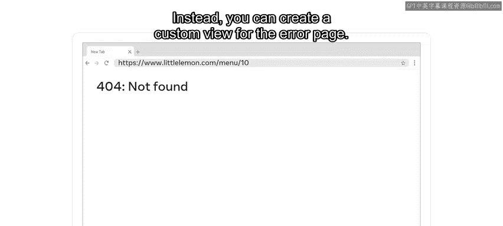

Let's open up the S code and explore how to work with error pages in views and switching the debug setting from true to false。

😊，Let's begin by running a server first by typing Python3 manageage。pi run server。

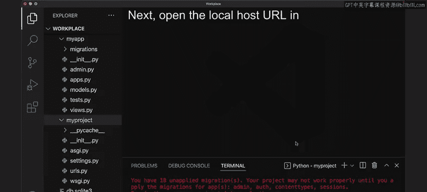

Next， open the Local hostst URL in your browser and notice the default page loads。

If you enter some URL， let's say home， notice that a page not found error page is displayed by default。

The page contains some Er information and a message stating you're seeing thiser because you have debug equals true in the Django settingsttings file。

Change that to false， and Django will display a standard 404 page。

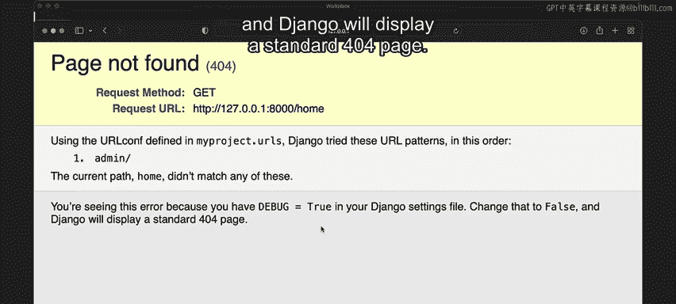

Debugging is the process of handling errors in code in Django， debug mode is set to true by default。

 which displays detailed error pages during development。To apply this change， open the Settings。

 Pi file under the My project and change the debug value to false。

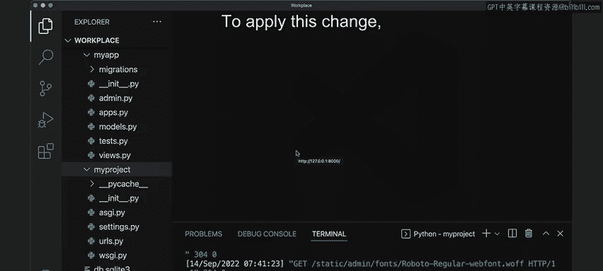

Additionally， you must add some value inside a loud host。In this example。

 add the star symbol to include all possible hosts。

 save the file and refresh the webpage in the browser。

Notice that a different type of web page is displayed stating not found。

 the requested resource was not found on the server。

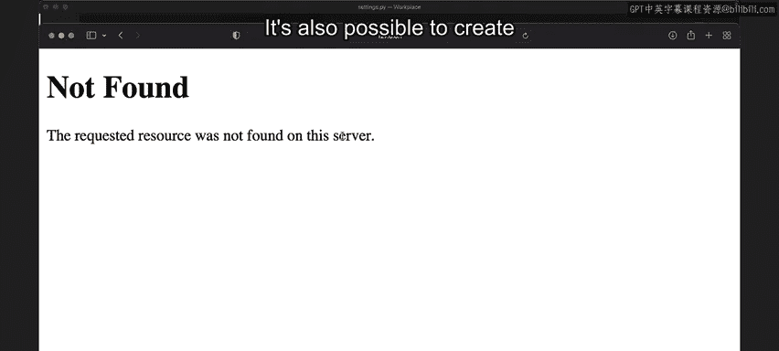

It's also possible to create a custom view for this error page to do this。

 you must create a new file called viewss。pi at the project level。Once created， open the URL's。

pi file and update the code with the necessary imports and URL patterns。Additionally。

 you must add another URL pattern outside the URL pattern sequence。Next， create the View location。

 My projectject。views。handler 404 and assign it to a variable called handler 404。Next。

 go to the viewss。pi file inside the project folder and import HTTP response。

Create a view with the name handleler 404。As referenced previously。Inside the function。

 pass the request object and an exception argument。

Then return the HTTP response object with some text value such as 404 Co on page not found。

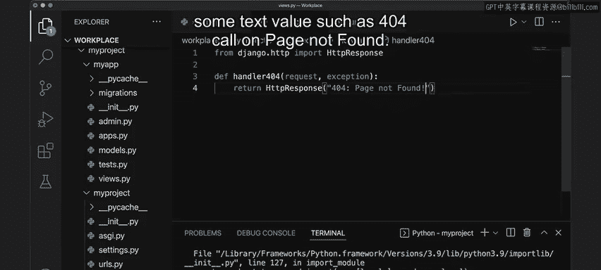

Save the file and return to the browser and refresh the page。

Notice that the message is displayed on the webpage。If you modified the URL with random values。

 the message remains the same。This is because the handler 404 handles all the pages not found by the URL configuration file。

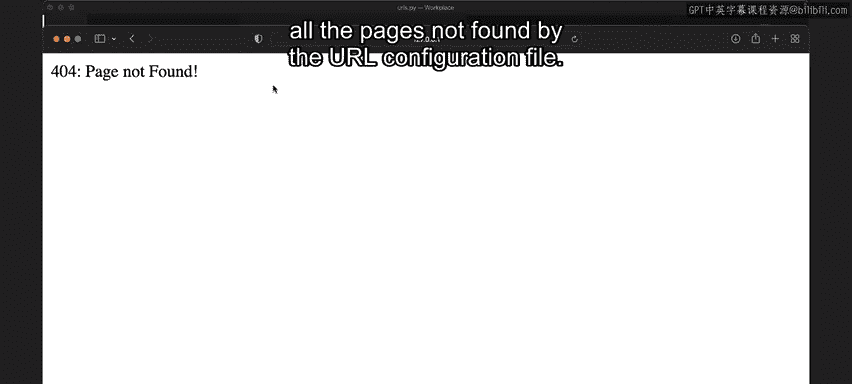

But if you add another view with a name defined in the URL configuration。

 notice that the view renders correctly。

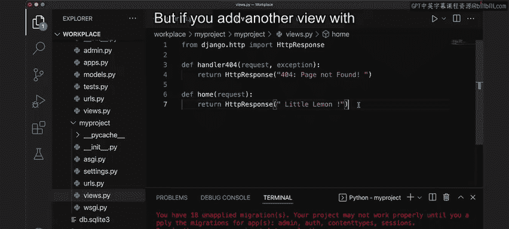

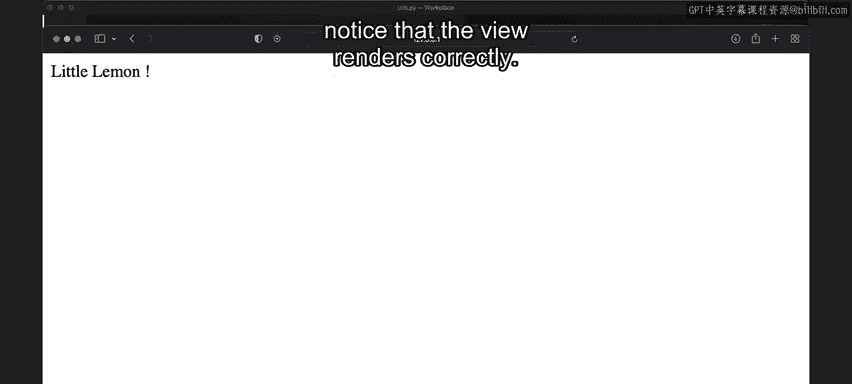

Similarly， just as the code uses the HTTP response object， you can also use HTTP response not found。

Different classes in Django represent different status codes。

 and the HTTP responseponse not found class represents statusus code 404 page not found。

Modify the code in the functionss return statement， save the file， and refresh the browser。

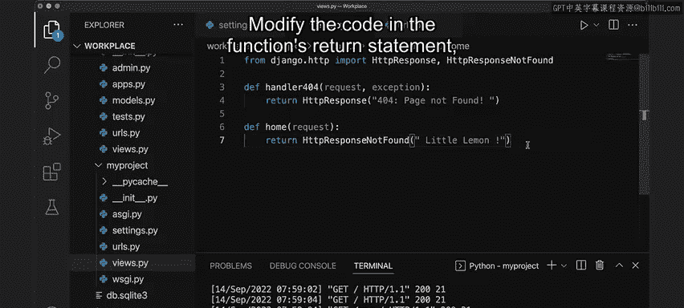

While there is no visible change， the client receives the 404 status message internally。

 and you can verify this from the browser's developer tools。

Inspect the element by right clicking on the mouse， going to the network tab and clicking home。😊。

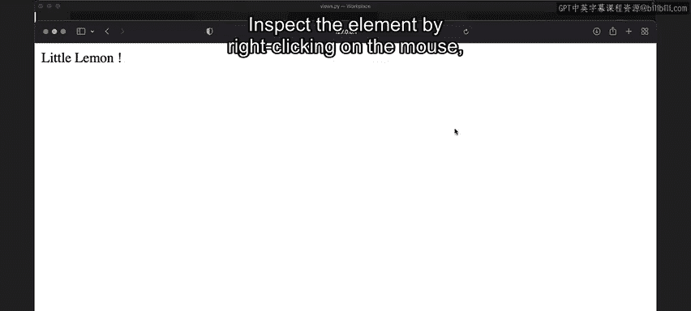

Once you refresh the page and click home again， notice 404 not found。

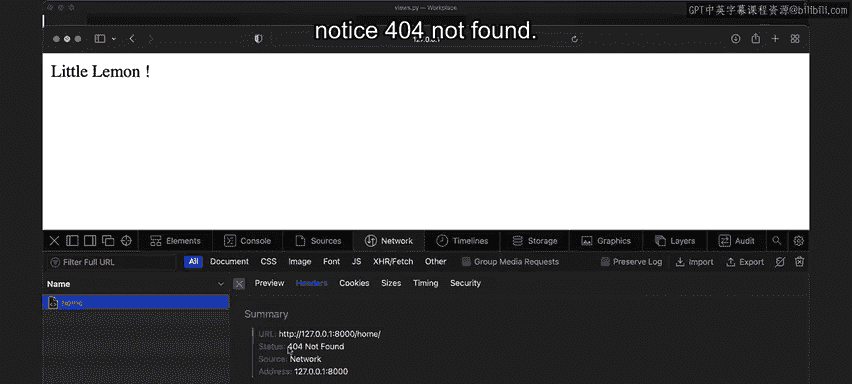

Often developers will modify the string to add some HTML elements such as headings and a button。

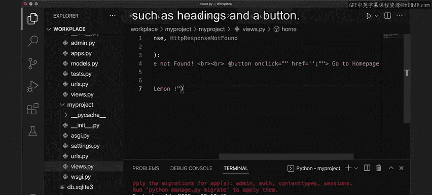

It's generally considered best practice to create a custom error page that's easy to understand。

 consistent with the website's branding and directs users back to the homeage。

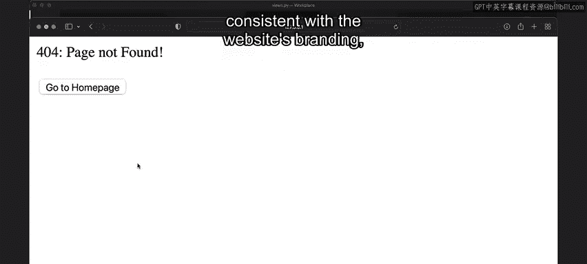

In this video you learned how to handle errors and views using Django。

 you also explored how to create a custom 404 error page using the HTTP responseponse notfo class。

