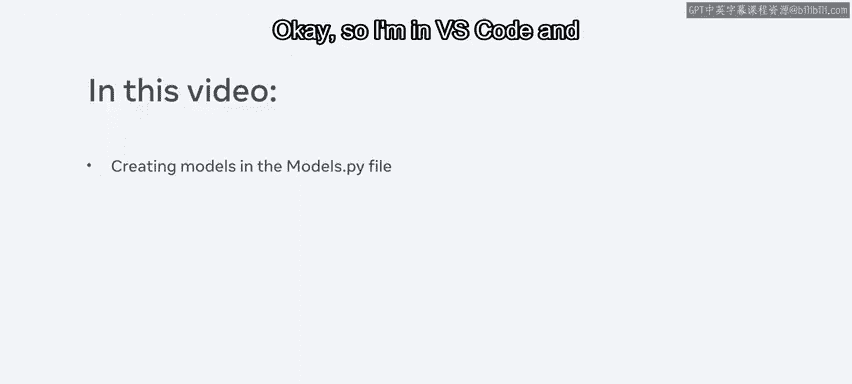
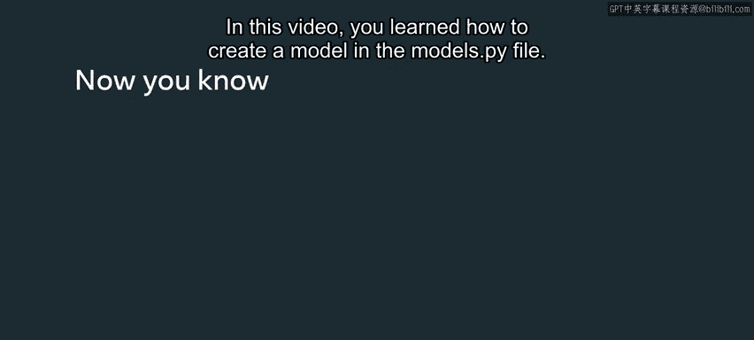

# Meta《后端开发（Django／APIs／全栈／毕业项目／面试）｜Meta Back-End Developer》中英字幕 - P24：23_创建模型.zh_en - GPT中英字幕课程资源 - BV1SZ421y7Fv

By now you should be familiar with the concepts of models and how they're used to represent a table in the database in this video you'll learn how to create a model in the models。

pi file Okay， so I'm NVS code and I've already created a project called Men Project and an app called menu app。

To build a model， I write code in the Model stop P file， so let me open that now。

Notice that there's already a comment that says createreate the models。

 so I will add the coat under it for this example， suppose I'm building a menu for the little lemon restaurant。

First I create a class name menu and pass the model into it。

Inside the class I will create three variables， the first variable is the name of the item。

The second variable is cuisine。And the third variable is price These are the attributes inside the model and each of these attributes needs a field of some data type。

 so I assign a field by typing models。char field， which is used for small to large size strings。

I can also pass a parameter such as max length and assign of value like 100。

I will repeat the same process for the cuisine variable。For the price， I type models integer field。

 which I can use to store an integer value。Notice that I don't have to pass anything to it。Okay。

 that's all the code I need to write for the model。 Now let me try accessing it。In the terminal。

 I type the command Python， manage do Pi shell and press enter。

Notice that I enter the command line tools of Djago it's important to know that I cannot directly access the class menu inside the shell First I have to import it from another Python file called models。

pi inside the menu app folder I do this with the import Python command。

Where menu app is the folder and model S Pi is the file。So from inside that I import the menu。

 I press enter and notice that I get an error。This is because I've not added the model inside the settings stop high file。

 so let me open that file now and add the model to the installed apps list。Okay。

 so once I've added the model to the installed apps list。

 I need to perform something called migrations don't worry too much about this step you'll learn all about migrations later for now just know that this is a command I need to run to work with models in Dgo。

Notice that it creates a model menu and a Python file if you go to the Python file。

 you can see that Jannkco internally has created the columns and the table menu using the built in SQLite database。

To finish this step， I run another migration command by typing Python manage。P migrate。Okay。

 so now I'm ready to go back inside the shell and work with the menu model I created。

 let me first clear the terminal。I run the command Python manage P shell。

 and once inside I import the menu again。This time notice I don't get an error。

 I can now run the command menu。objects。or， which returns all the entries in the database。

Since I don't have any notice that I get an empty query set。

I will now directly add an entry in the database using the command M equals menu。objects。create。

I enter the details that match the attributes so name equals pasta， cuisine equals Italian。

 and price equals 10。Notice that I've assigned this entry to an object M。

And that is so I can manipulate changes on the object such as updating or saving。

 I press enter and now I save this object。Now， if I run the command to return all the entries in the database again。

 notice that one entry is inside the database。Okay。

 let me add one more entry quickly and view the database entries again。

Notice that there are two objects， but this is not very informative as only the names of the menu objects one and two are displayed。

Jengo provides a way to change this using something called custom methods for example I can use one of the built in custom methods and customize the string。

 so let's say that I type self。 name plus SER which represents a Dunder method that prints a string。

I will save the file once I do this， I must exit the shell and enter it again once inside the shell I can write Python code exactly like I would write in a file。

I import the menu class again and run the command to display the items again。

 noticeice that the details are printed in line with the string Dunder method with the custom function I defined。

Similar to this， I can create my own custom functions that can be used。

Now that I've demonstrated how to create a database table and add entries to it。

 let me demonstrate how to update entries。Suppose I want to access an entry and update it to do this I can use the get method and pass a primary key of value2 which refers to the entry of Taco。

Then I can assign this to an object that I created called P。

I can now access the attributes inside this object just as I would in regular Python code。Now。

 I type P dot cuisine。Equals and a new value to update the entry。

I saved this and this time when I display the entries， notice that the value updated。

Another option to view and update the database is using your browser to access the Django admin portal however it's also important to understand how the code works internally as I've demonstrated this video was just to give you an example of how you can use models you'll learn more about migrations。

 the admin profile and other features you can add using Django and Python code within the models。

In this video， you learned how to create a model in the model stop pie file。

