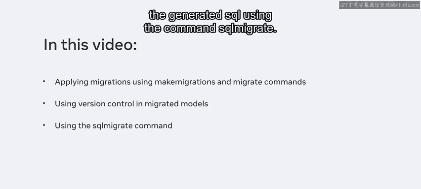
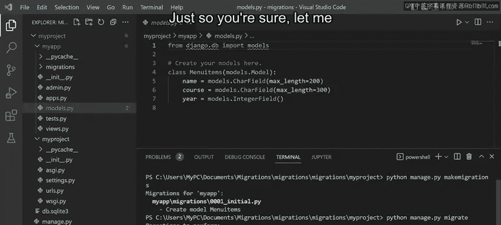
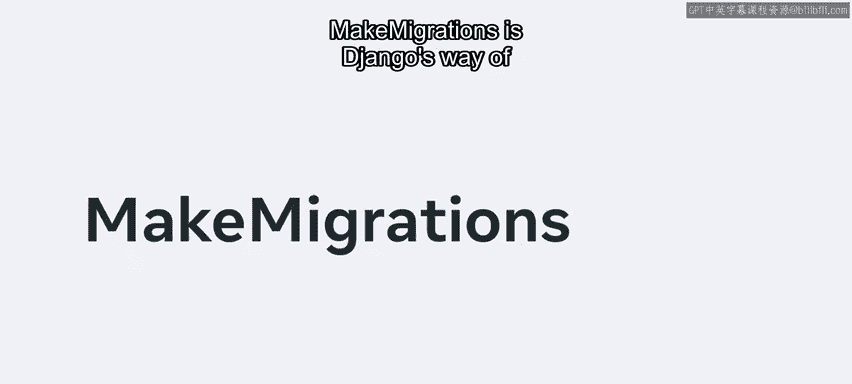
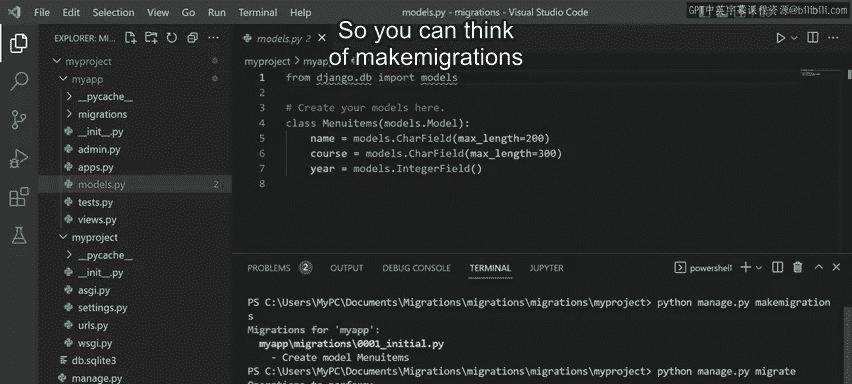
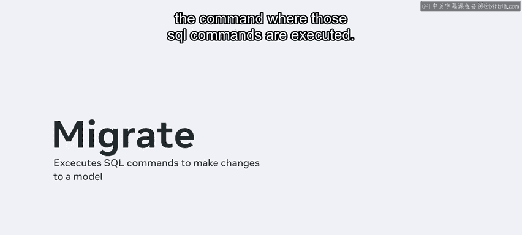
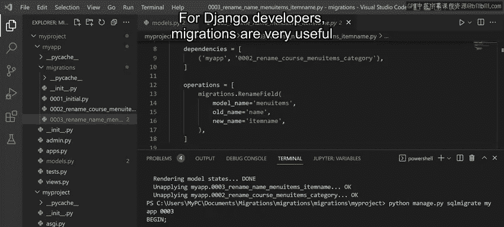
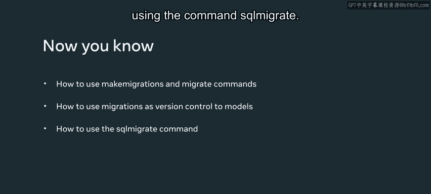

# Meta《后端开发（Django／APIs／全栈／毕业项目／面试）｜Meta Back-End Developer》中英字幕 - P26：25_使用迁移.zh_en - GPT中英字幕课程资源 - BV1SZ421y7Fv

In this video you will learn how to apply migrations in a Djago project using the commands。

 make migrations and migrate you will also learn how migrations allow developers to apply version control to the models and explore the generated SQL using the command SQL migrate。

I've already created a project in VS code containing an app called My app。Inside the Model。P file。

 I've created a class called menu Its。Recall that this class is equivalent to a table and sequL and contains three attributes。

Name course and year with respective fields。Before I began applying migrations。

 I have to ensure that I have updated the model inside the Se S P file inside the project folder。

When I open that file， notice that I've added the app inside the installed appsbs list。

So I'm good to go。Okay， so back in the model dot P file。

 the first thing I need to do is make the migration， so I run the command， Python manage dot P。

 and then make migrations。I press Enter and Djago displays a message saying that it will make migrations for my app and create a model called menu It and cite it。

Also， it would create a file with the name 0001 underscore initial that pie。

Next I need to apply the migration， I run the command， Python， manage that P migrate and press enter。

This time， notice that Django performs migrations with his command。Just so you're sure。

 let me explain the difference between these two commands。

Make migrations as Jane goes's way of preparing the changes to be made in the model。 For example。

 it creates a database such as this one named Db。 SQLL 3。

So you can think of make migrations as the command that generates the SQL commands and migrate as the command where those SQL commands are executed。

In this video， I will not be adding any data to these tables。

I only want to modify the columns inside a table by modifying the attributes in the model。

Once I've run this command， notice that a folder called Mis is created inside the app folder。

 which consists of the file that keeps a record of the migrations。If I open the file。

 notice that the code contains the table columns names and autowa sign primary key called ID。

 So now you know the commands make migrations and migrate are used to perform migrations in Django。

However， what if I want to make some changes to the model， for example。

 suppose I want to change the attribute course to category and save this file。

For this change to take effect， I have to run the Make Mirations Command again。

Notice that Janejago displays a message that asks， was menu item。 course renamed to menu item。

 category to confirm I type yes and press enterter？"。

Now notice that another file is created inside the migrations folder。If I open that file。

 notice that it contains the code changes performed in that migration。Okay。

 so I want to make another change to the model， so I open the Model that Pi file again。This time。

 I will change the attribute name to item name。So I will save the file and rerun the migration。

I confirm the change by typing why and notice that Djainggo displays a good description of the changes I've made in addition to the new file that's created。

Okay， now you know how to change the model using the make migrations command。

 Suppose I want to display all the migrations that I performed to do this， I can run the command。

 Python manage that pi and then show migrations。Let me expand the terminal。

 notice that under the name of the app， my app， the three migrations I performed are displayed。

 the X symbol represents the commits to the migrations。

Since I have not executed the migrate command for my latest changes。

 notice that the last placeholder is empty， so let me run the migrate command again。

When I show migrations， the X appears in front of all three files。

Now suppose that after making the changes， I want to revert back to a migration I performed earlier。

I can do this by typing Python manageage。tpi migrate。

Then I need to specify the name of the app and the file number， for example， 0001。

But before I execute， I can add a flag such as plan。

 Tengo will then display the changes it will revert to。In this example。

 it'll change the attributes of menu items， item name， back to name， and category back to course。

This time I execute this command without the plan flag and notice that even if the changes are not displayed in the Python file。

 the changes have been reflected in the database I created。Okay。

 so the final command I want you to know about is SQL migrate。

And I can run this command against a migrated version。Notice that when I execute it。

 the corresponding SQL commands are displayed for the migrations I have performed。In this example。

 I ran it against the third migration。Notice the SQL Al statement on the table named menu items to rename a column from name to item name。

For Djago developers， migrations are very useful as they allow us to apply version control to the models。

In this video， you learned how to apply migrations in a Django project using the commands。

 make migrations， and migrate。You also learned how developers use migrations to apply version control to the models Finally。

 you explored the generated SQL using the command SQL migrate。

