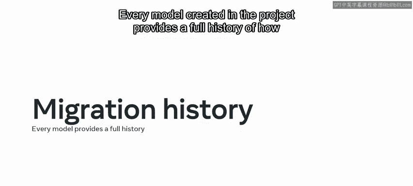
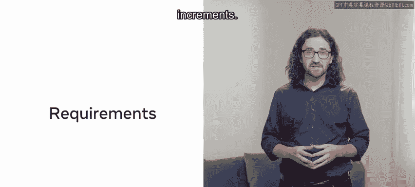
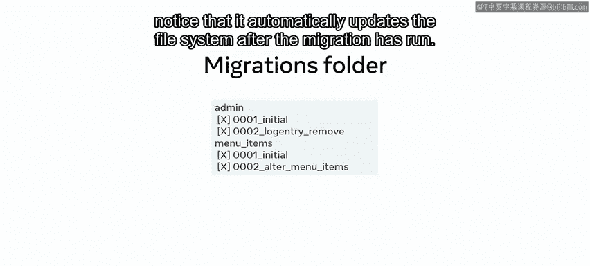
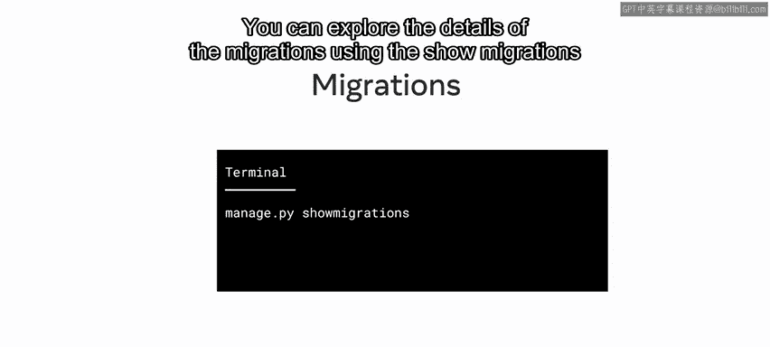
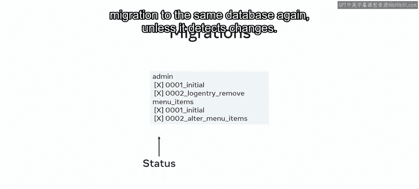
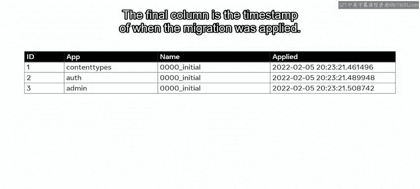
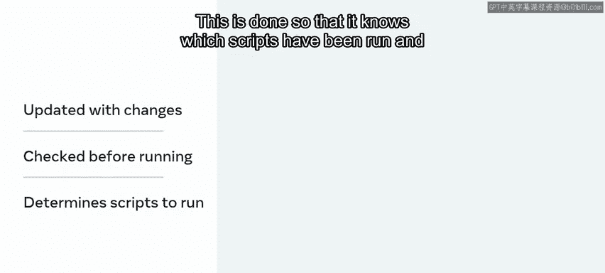
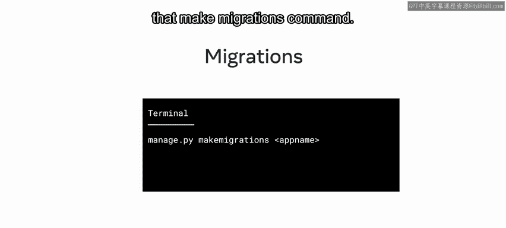
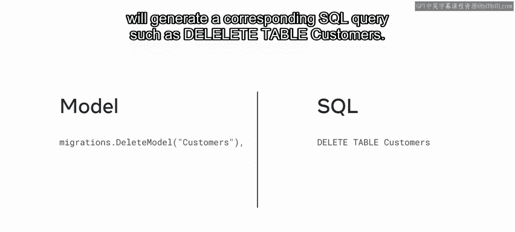

# Django后端开发：P27：变更历史记录 📜

在本节课中，我们将要学习Django迁移（Migrations）如何记录和管理数据模型的变更历史。你将了解迁移文件的结构、Django如何追踪这些变更，以及开发者如何利用这一机制进行模型代码库的版本控制。

## 概述

迁移在帮助构建数据表以及处理Web应用程序与数据库的交互方面扮演着重要角色。到目前为止，你已经知道开发者可以直接使用模型从代码中查询数据，而无需编写SQL命令。这种方法的一个优势是，Django直接为代码库的变更提供了历史记录。本节视频中，你将学习Django迁移的变更历史，以及开发者如何利用它进行模型代码库的版本控制。

## 迁移历史的作用

项目中创建的每个模型都提供了其如何被创建、何时被添加以及发生的任何变更的完整历史。

Web应用程序的开发需求往往会以较小的增量频繁变化。

例如，向模型添加额外属性或更改属性名称。此外，有时多个用户会使用多个数据库，迁移确保模式变更能在每个数据库上应用和更新。

在Django中，开发者必须直接在模型中创建变更，然后通过使用迁移脚本来应用迁移。

使用迁移的另一个重要优势是避免重复劳动。一旦你创建了某个模型，为其编写SQL查询来创建对应的数据库是重复性的工作。从模型生成的迁移有助于防止重复劳动，这符合Django的核心原则之一：**不要重复你自己（Don‘t Repeat Yourself）**。

## Django如何追踪变更

你可能会好奇Django如何保存数据库中所有变更的历史。这一切都始于文件结构。迁移文件存储在 `migrations` 文件夹中。

如果你展开 `migrations` 文件夹，会注意到在迁移运行后，文件系统会自动更新。

你可以使用 `showmigrations` 命令来探索迁移的详细信息。

在这个例子中，迁移列在给定的模型下，并带有自动递增的前缀，例如 `0001`。Django会根据给定迁移中执行的操作或时间戳自动生成文件名。

`X` 符号表示在创建迁移后应用迁移的状态。这是在执行 `makemigrations` 命令之后，但在执行 `migrate` 命令之前。应用迁移后，除非检测到变更，否则Django不会再次对同一数据库应用新的迁移。

在幕后，Django会创建一个名为 `django_migrations` 的新表来引用迁移文件。

## 深入 `django_migrations` 表

现在让我们更详细地探索这个表。每次迁移后，都会插入一个新行来追踪变更、关联的应用以及迁移的时间戳。

以下是该表的结构：

*   **第一列是ID**：根据在表中的位置自动递增。
*   **第二列是应用（app）**：迁移所关联的应用。回想一下，在Django中，一个项目内可以有多个应用程序。
*   **第三列是名称（name）**：指的是迁移的文件名。
*   **第四列是时间戳（applied）**：迁移被应用的时间。

每次运行迁移脚本时，此表都会用最新的变更进行更新。这也意味着在迁移脚本运行之前会先检查此表。这样做是为了让它知道哪些脚本已经运行，哪些需要被应用。

迁移也可以通过将应用名称放在 `makemigrations` 命令后来应用到特定的应用。

## 迁移文件的内容

好了，现在你了解了迁移文件的结构，让我们来探索一下迁移文件的内容。

迁移文件本质上是Python代码。在迁移类内部，通常包含两个重要的序列或列表项：`dependencies` 和 `operations`。

*   **`dependencies`**：指的是在此迁移之前必须应用的先前迁移。
*   **`operations`**：指的是在给定迁移中执行的操作。

以下是一些常用的操作：

*   **`CreateModel`**：创建一个模型并生成对应的数据表。
*   **`DeleteModel`**：删除一个模型并删除对应的数据表。
*   **`AddField`**：添加一个数据库列和字段定义（用于新增字段）。
*   **`AlterField`**：修改一个数据库列和字段定义（用于更改字段）。
*   **`AddIndex`**：创建一个数据库索引。

例如，像 `DeleteModel` 这样的操作会生成相应的SQL查询，例如 `DELETE FROM customers;`。

## 总结

在本节课中，我们一起学习了Django迁移的变更历史以及Django如何将其应用于迁移。你也探索了开发者如何利用迁移历史来进行模型代码库的版本控制。理解迁移历史对于管理项目的数据模型演进和团队协作至关重要。